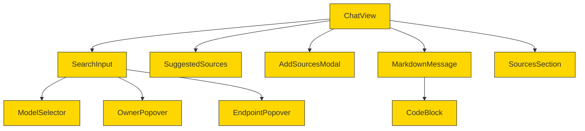
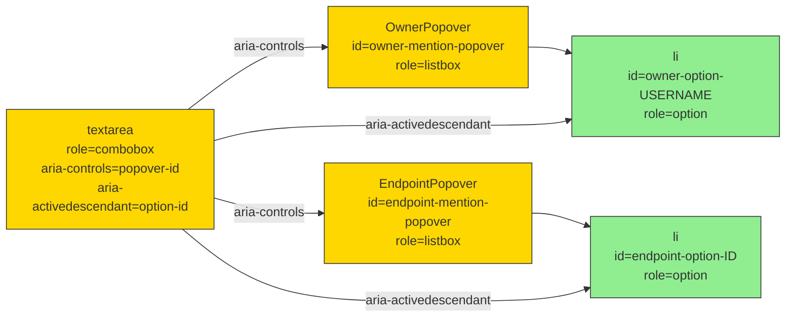
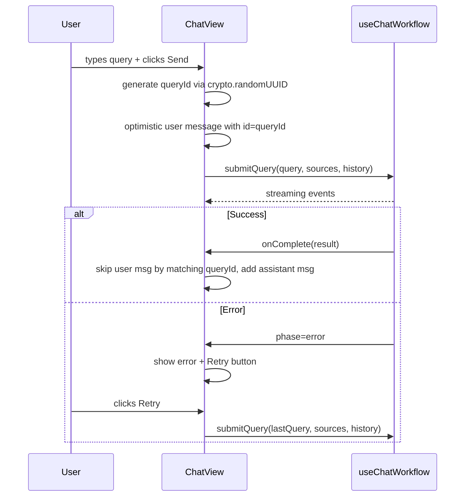

# Implementation Plan: Fix 19 UI Review Issues in Chat Interface

## 1. Executive Summary

This plan addresses 19 UI review issues across 8 files in the LLMChatInterface chat components. The changes span accessibility compliance (WCAG ARIA combobox pattern), UX improvements (auto-scroll, auto-grow textarea, retry on error, loading skeleton), code quality (dead code removal, proper state management, unique IDs), and design consistency (CSS variable theming, touch targets, icon semantics).

**Approach**: Fix issues in dependency order -- CSS variables first, then upstream components (mention-popover), then downstream consumers (search-input, chat-view). Independent components (model-selector, suggested-sources, add-sources-modal) can be done in parallel.

**Risk Level**: Medium overall. The ModelSelector Radix refactor (#7) and auto-scroll change (#9) carry the most regression risk. All other changes are localized and low-risk.

**Estimated Effort**: 4-5 hours of implementation, plus testing.

---

## 2. Architecture Diagrams

### Desired State -- Component Hierarchy



All gold-highlighted components are modified. No new components are created.

### ARIA Relationship -- Combobox Pattern



### Sequence -- Submit with Retry Flow



---

## 3. Execution Plan

Execute files in this order (dependencies first):

| Order | File | Issues | Dependencies |
|-------|------|--------|-------------|
| 1 | `global.css` | #15 (code block CSS vars) | None |
| 2 | `mention-popover.tsx` | #4 (add id attrs) | None |
| 3 | `suggested-sources.tsx` | #16 (icon swap) | None |
| 4 | `add-sources-modal.tsx` | #17 (useEffect fix) | None |
| 5 | `sources-section.tsx` | #10 (Radix HoverCard), #18 (dead code) | None |
| 6 | `model-selector.tsx` | #7 (Radix Popover) | None |
| 7 | `markdown-message.tsx` | #15 (CSS var theming) | Step 1 (global.css) |
| 8 | `search-input.tsx` | #2, #3, #11, #14 | Step 2 (mention-popover IDs) |
| 9 | `chat-view.tsx` | #1, #5, #6, #8, #9, #12, #13, #19 | Steps 7-8 |

Steps 2-6 are independent and can be done in any order or in parallel.

---

## 4. Per-File Details

### File: `components/frontend/src/styles/global.css`

**Purpose**: Global CSS variables and base styles for the application.

**Current Implementation**: Defines design tokens for colors, spacing, shadows in `:root` and `.dark` blocks. No code-block-specific variables exist.

**Changes**:

1. **Add code block CSS variables**
   - **Location**: In `:root` block, after the `--chart-*` variables (around line 36)
   - **Pattern**: Follow the existing `--variable: oklch(...)` pattern
   - **Intent**: Provide theme-aware CSS variables for code block backgrounds, borders, and muted text so `markdown-message.tsx` can use them instead of hardcoded hex colors
   - **Details**: Add 4 variables: `--code-bg`, `--code-border`, `--code-header-bg`, `--code-muted`. In `:root` (light mode), these should use dark values suitable for code (similar to current hardcoded values but converted to oklch). In `.dark`, use slightly adjusted dark values. The current hardcoded colors are: bg `#1e1d2a`, border `#3a3847`, header `#16151f`, muted text `#8b8a91`. Also register them in the `@theme inline` block with `--color-code-*: var(--code-*)` entries.

**Why**: Issue #15 -- hardcoded hex colors in code blocks don't adapt to theme changes and are inconsistent with the rest of the design system.

---

### File: `components/frontend/src/components/query/mention-popover.tsx`

**Purpose**: Popover components for @mention autocomplete -- owner selection and endpoint selection lists.

**Current Implementation**: Both `OwnerPopover` and `EndpointPopover` have `role="listbox"` on containers and `role="option"` on list items, but lack `id` attributes needed for `aria-controls` and `aria-activedescendant`.

**Changes**:

1. **Add id to OwnerPopover container**
   - **Location**: On the outer `<div>` element (line 65) that has `role='listbox'`
   - **Pattern**: Static string ID
   - **Intent**: Allow `aria-controls` on textarea to reference this container
   - **Details**: Add `id="owner-mention-popover"`

2. **Add id to each owner option**
   - **Location**: On each `<li>` element (line 77) inside the owners map
   - **Pattern**: Template literal using the owner's username
   - **Intent**: Allow `aria-activedescendant` on textarea to reference the highlighted option
   - **Details**: Add `` id={`owner-option-${owner.username}`} ``

3. **Add id to EndpointPopover container**
   - **Location**: On the outer `<div>` element (line 151) that has `role='listbox'`
   - **Pattern**: Same as owner popover
   - **Intent**: Allow `aria-controls` on textarea to reference this container
   - **Details**: Add `id="endpoint-mention-popover"`

4. **Add id to each endpoint option**
   - **Location**: On each `<li>` element (line 165) inside the endpoints map
   - **Pattern**: Template literal using the endpoint's id
   - **Intent**: Allow `aria-activedescendant` on textarea to reference the highlighted option
   - **Details**: Add `` id={`endpoint-option-${endpoint.id}`} ``

**Why**: Issue #4 -- the ARIA combobox pattern requires `aria-controls` and `aria-activedescendant` to reference elements by ID. Without IDs on the popover and options, the WCAG combobox pattern is incomplete.

---

### File: `components/frontend/src/components/chat/suggested-sources.tsx`

**Purpose**: Displays semantically-searched data source suggestions as clickable chips.

**Current Implementation**: Uses `Sparkles` icon (line 16-17, line 47) with the "Suggested sources" label, implying AI-generated content.

**Changes**:

1. **Replace Sparkles icon with Search icon**
   - **Location**: Import section (line 16) and usage (line 47)
   - **Pattern**: Same import pattern from lucide-react tree-shakeable path
   - **Intent**: Use semantically accurate icon -- suggestions come from search, not AI generation
   - **Details**: Replace the `Sparkles` import with a `Search` import (`lucide-react/dist/esm/icons/search`). Update the icon in the label from `<Sparkles ...>` to `<Search ...>`. Remove the unused `Sparkles` import. Note: `Search` is not currently imported in this file (it is used in model-selector.tsx), so add a fresh import.

**Why**: Issue #16 -- the Sparkle icon implies AI-generated content, but these suggestions come from a search algorithm. A Search icon is more semantically accurate.

---

### File: `components/frontend/src/components/chat/add-sources-modal.tsx`

**Purpose**: Modal for selecting data sources to add to chat context.

**Current Implementation**: Lines 146-152 set state (`setLocalSelected`, `setSearchQuery`) during the render phase using a manual ref-based "previous open" check:

```tsx
const previousOpenRef = useMemo(() => ({ current: false }), []);
if (isOpen && !previousOpenRef.current) {
  setLocalSelected(new Set(selectedSourceIds));
  setSearchQuery('');
}
previousOpenRef.current = isOpen;
```

**Changes**:

1. **Move state sync to useEffect**
   - **Location**: Replace lines 146-152 (the `previousOpenRef` + conditional state set)
   - **Pattern**: Standard `useEffect` with `useRef<boolean>` for previous-value tracking
   - **Intent**: Sync local state when modal opens without violating React render rules
   - **Details**: Replace the `useMemo` ref + render-time setState with a `useEffect` that watches `isOpen`. Use a `useRef<boolean>` (initialized to `false`) to track the previous `isOpen` value. When `isOpen` is `true` and `prevRef.current` is `false` (modal just opened), call `setLocalSelected(new Set(selectedSourceIds))` and `setSearchQuery('')`. Always update `prevRef.current = isOpen` at the end of the effect. Import `useEffect` and `useRef` (both already imported via memo, useCallback, useMemo, useState -- add `useEffect` and `useRef` to the existing import). Remove `useMemo` from imports if no longer used.

**Why**: Issue #17 -- setting state during render is a React anti-pattern that causes warnings and can lead to infinite render loops in edge cases.

---

### File: `components/frontend/src/components/chat/sources-section.tsx`

**Purpose**: Collapsible section displaying sources from the aggregator response, with hover cards for document previews.

**Current Implementation**:
- Custom `HoverCard` component (lines 48-94) uses manual viewport position calculations with `fixed` positioning.
- `SourceItem` (lines 109-225) manages hover state with timeouts and manual position computation.
- `groupedSources` is computed (lines 261-269) but never used in the JSX.

**Changes**:

1. **Remove dead `groupedSources` code**
   - **Location**: Lines 261-269 inside `SourcesSection` component
   - **Pattern**: Deletion
   - **Intent**: Remove unused code that adds cognitive overhead
   - **Details**: Delete the `groupedSources` variable declaration and its for-loop. The `sourceEntries` and `documentCount` variables above it are still used and must remain.

2. **Replace custom HoverCard with Radix HoverCard**
   - **Location**: The entire custom `HoverCard` sub-component (lines 35-94), the `HOVER_HIDE_DELAY` constant (line 103), and the hover state management in `SourceItem` (lines 110-189)
   - **Pattern**: Follow the pattern already established in `mention-popover.tsx` where `HoverCard`/`HoverCardTrigger`/`HoverCardContent` from `@/components/ui/hover-card` are used
   - **Intent**: Replace manual viewport positioning with Radix's built-in positioning, which handles edge cases (viewport overflow, portal rendering) automatically
   - **Details**:
     - Import `HoverCard`, `HoverCardTrigger`, `HoverCardContent` from `@/components/ui/hover-card`
     - Delete the entire custom `HoverCard` component (the `memo` function and its `HoverCardProps` interface)
     - Delete the `HOVER_HIDE_DELAY` constant
     - In `SourceItem`: remove `isItemHovered`, `isCardHovered`, `hoverPosition` state; remove `hideTimeoutReference`; remove `clearHideTimeout`, `scheduleHide`, `handleItemMouseEnter`, `handleItemMouseLeave`, `handleCardMouseEnter`, `handleCardMouseLeave` handlers; remove the `isVisible` computed value; remove the `useEffect` cleanup for timeout
     - Wrap each source item's main `<motion.div>` content with `<HoverCard openDelay={200} closeDelay={100}>`. Use `<HoverCardTrigger asChild>` on the `<motion.div>`. Place `<HoverCardContent side="right" align="start">` containing the truncated content preview (the `truncatedContent` logic moves here)
     - The `SourceItemProps` no longer needs `index` for hover delay purposes (Radix handles delays), but keep it for the staggered entrance animation
   - **Skill guidance**: [Per shadcn-ui]: Use Radix HoverCard primitive for accessible, properly-positioned hover content

**Why**: Issues #10 and #18 -- the manual HoverCard positioning is error-prone and doesn't handle all viewport edge cases. Radix HoverCard handles this natively with portal rendering. Dead code adds confusion.

---

### File: `components/frontend/src/components/chat/model-selector.tsx`

**Purpose**: Dropdown for selecting the AI model to use for chat queries.

**Current Implementation**: Uses 3 separate `useEffect` hooks (lines 54-101) for click-outside detection, escape key handling, and auto-focusing the search input. Manual `isOpen` state management with a `containerReference` ref.

**Changes**:

1. **Replace manual dropdown with Radix Popover**
   - **Location**: Entire component structure (lines 29-272)
   - **Pattern**: Follow `@/components/ui/popover` -- use `Popover`, `PopoverTrigger`, `PopoverContent`
   - **Intent**: Eliminate 3 manual useEffect hooks by using Radix's built-in click-outside, escape, and focus management
   - **Details**:
     - Import `Popover`, `PopoverTrigger`, `PopoverContent` from `@/components/ui/popover`
     - Replace the outer `<div ref={containerReference}>` with `<Popover open={isOpen} onOpenChange={setIsOpen}>`
     - Replace the trigger `<button>` with `<PopoverTrigger asChild><button>...</button></PopoverTrigger>`
     - Replace the `AnimatePresence`/`motion.div` dropdown panel with `<PopoverContent>` using `side="top"`, `align="start"`, and `sideOffset={8}` to match the current `bottom-full mb-2` positioning
     - **Remove** the 3 `useEffect` hooks for click-outside (lines 54-71), escape key (lines 74-88), and auto-focus (lines 91-101)
     - **Remove** `containerReference` ref (no longer needed)
     - Keep `searchInputReference` -- use PopoverContent's `onOpenAutoFocus` prop to focus the search input when opened: `onOpenAutoFocus={(e) => { e.preventDefault(); searchInputReference.current?.focus(); }}`
     - Keep existing search filtering logic (`filteredModels`), model list rendering, and selection behavior
     - Simplify `handleToggle` -- it may no longer be needed since `onOpenChange` handles open/close. If the trigger uses `PopoverTrigger`, Radix handles toggling automatically.
     - Clear `searchQuery` when popover closes via the `onOpenChange` callback: `onOpenChange={(open) => { setIsOpen(open); if (!open) setSearchQuery(''); }}`
     - Apply existing visual classes to `PopoverContent`: width `w-[340px]`, rounded corners, shadow, border. Remove the `AnimatePresence`/`motion.div` wrapper since `PopoverContent` has its own enter/exit animations built into the shadcn wrapper.
     - The model list items keep their existing `role="option"` and `aria-selected` attributes, and wrap the list in a `role="listbox"` container
   - **Skill guidance**: [Per shadcn-ui]: Use Radix Popover for accessible dropdown with built-in dismiss behavior. [Per react-expert]: Radix handles focus trapping and keyboard navigation.

**Why**: Issue #7 -- three manual useEffect hooks for behavior that Radix provides out of the box. This reduces code, eliminates potential event listener leak bugs, and improves keyboard accessibility.

---

### File: `components/frontend/src/components/chat/markdown-message.tsx`

**Purpose**: Renders markdown content in chat messages with syntax-highlighted code blocks.

**Current Implementation**: `CodeBlock` component (lines 115-166) uses hardcoded hex colors:
```tsx
<div className='... border-[#3a3847] bg-[#1e1d2a]'>
  <div className='... border-[#3a3847] bg-[#16151f] ...'>
    <span className='... text-[#8b8a91]'>
    <button className='... text-[#8b8a91] ... hover:text-white'>
```

**Changes**:

1. **Replace hardcoded hex colors with CSS variables**
   - **Location**: `CodeBlock` component, lines 116, 118, 119, 122
   - **Pattern**: Use `bg-[var(--code-bg)]` Tailwind arbitrary value syntax referencing the CSS variables added in `global.css`
   - **Intent**: Make code blocks respect the application's theme system
   - **Details**:
     - Line 116: Replace `bg-[#1e1d2a]` with `bg-[var(--code-bg)]`
     - Line 116: Replace `border-[#3a3847]` with `border-[var(--code-border)]`
     - Line 118: Replace `border-[#3a3847]` with `border-[var(--code-border)]`
     - Line 118: Replace `bg-[#16151f]` with `bg-[var(--code-header-bg)]`
     - Line 119: Replace `text-[#8b8a91]` with `text-[var(--code-muted)]`
     - Line 122: Replace `text-[#8b8a91]` with `text-[var(--code-muted)]`
     - Line 122: Replace `hover:text-white` with `hover:text-foreground` for theme consistency
     - Line 295: Replace `text-[#8b8a91]` on the `<del>` element with `text-muted-foreground`

**Why**: Issue #15 -- hardcoded dark colors don't adapt to light mode and are inconsistent with the design system's CSS variable approach.

---

### File: `components/frontend/src/components/chat/search-input.tsx`

**Purpose**: Chat input field with context chips, model selector, mention autocomplete, and submit button.

**Current Implementation**:
- Context chips row always renders with fixed `h-4` height (line 239), even when empty
- Textarea has no `role="combobox"` or `aria-activedescendant` (lines 269-284)
- Textarea is fixed at `h-[48px]` (line 279) and never grows
- Context chip remove buttons are well below 44px touch target (lines 241-258)

**Changes**:

1. **Conditionally render chips row (Issue #2)**
   - **Location**: Lines 238-260, the comment + `<div className='mb-2 flex h-4 ...'>` wrapper
   - **Pattern**: Standard conditional rendering
   - **Intent**: Don't reserve vertical space when there are no chips
   - **Details**: Wrap the entire chips `<div>` in `{selectedContexts.length > 0 && (...)}`. Remove the fixed `h-4` from the wrapper div since it should size to its content. Keep `mb-2` for spacing when chips are present. Keep all the inner chip rendering logic unchanged.

2. **Add ARIA combobox attributes to textarea (Issue #3)**
   - **Location**: On the `<Textarea>` element, lines 269-284
   - **Pattern**: WAI-ARIA combobox pattern (APG combobox with listbox popup)
   - **Intent**: Make the mention autocomplete accessible to screen readers
   - **Details**:
     - Add `role="combobox"` when `enableMentions` is true (otherwise omit)
     - Add `aria-autocomplete="list"` when `enableMentions` is true
     - Compute `aria-controls`: when `mention.showOwnerPopover` is true, set to `"owner-mention-popover"`; when `mention.showEndpointPopover` is true, set to `"endpoint-mention-popover"`; otherwise `undefined`
     - Compute `aria-activedescendant`: when `mention.showOwnerPopover` and there are filtered owners, set to `` `owner-option-${mention.filteredOwners[mention.highlightedIndex]?.username}` ``; when `mention.showEndpointPopover` and there are filtered endpoints, set to `` `endpoint-option-${mention.filteredEndpoints[mention.highlightedIndex]?.id}` ``; otherwise `undefined`
     - Keep existing `aria-expanded` and `aria-haspopup` attributes
   - **Skill guidance**: [Per ui-ux-expert]: WCAG 2.1 AA combobox pattern requires aria-controls and aria-activedescendant for screen reader navigation

3. **Auto-grow textarea up to max height (Issue #11)**
   - **Location**: The `useEffect` on lines 117-121 (which currently resets height) and the `handleChange` callback on lines 173-187
   - **Pattern**: Standard textarea auto-grow pattern
   - **Intent**: Let the textarea grow with content instead of being fixed at 48px, capping at ~120px
   - **Details**:
     - Replace the existing `useEffect` (lines 117-121) with one that watches `value` and performs auto-grow: reset `textarea.style.height` to `'auto'`, read `scrollHeight`, set `textarea.style.height` to `Math.min(scrollHeight, 120) + 'px'`
     - On the `<Textarea>` element: remove `h-[48px]`, add `min-h-[48px] max-h-[120px]`
     - Keep `resize-none` and `overflow-y-auto`
     - After submit (in `handleSubmit`), reset the textarea height: `if (textareaReference.current) textareaReference.current.style.height = ''`

4. **Enlarge context chips for touch targets (Issue #14)**
   - **Location**: Lines 241-258, the chip `<span>` and remove `<button>` elements
   - **Pattern**: WCAG 2.5.5 touch target guidelines
   - **Intent**: Ensure the remove button meets 44px minimum touch target
   - **Details**:
     - Increase chip height from `h-4` (16px) to `h-6` (24px)
     - Increase font size from `text-[10px]` to `text-xs` (12px)
     - Increase horizontal padding from `px-1.5` to `px-2`
     - For the remove button: add padding to expand the touch target to 44x44px without changing visual size. Use a relative positioning approach: make the button `relative` with a `before:absolute before:inset-[-12px] before:content-['']` pseudo-element that expands the hit area. Alternatively, use explicit `p-2 -m-1` to add invisible tappable area.
   - **Skill guidance**: [Per ui-ux-expert]: WCAG 2.5.5 requires 44x44px minimum for pointer targets

**Why**: Issues #2, #3, #11, #14 -- these changes make the input field accessible, responsive to content, and usable on touch devices.

---

### File: `components/frontend/src/components/chat/chat-view.tsx`

**Purpose**: Main chat interface orchestrating sub-components, message state, and workflow execution.

**Current Implementation**:
- Fixed input area uses magic `pl-24` for sidebar offset (line 359)
- Message IDs use `Date.now()` (lines 131, 141, 215-216)
- User message dedup matches by content string (lines 122-123)
- Empty state is a single unhelpful line (lines 285-290)
- Auto-scroll fires on every `streamedContent` change (lines 200-202)
- Error display has no retry button (lines 345-351)
- `useMemo` depends on store ref that never changes (lines 82-85)
- No loading skeleton when models are still loading

**Changes**:

1. **Fix sidebar offset on fixed input area (Issue #1)**
   - **Location**: Line 359, the fixed bottom input area `<div>`
   - **Pattern**: Match `main-layout.tsx` which uses `ml-20` for sidebar offset. For fixed elements, use `left-20` instead of `left-0` with padding hack.
   - **Intent**: Eliminate magic `pl-24` and align with the sidebar `w-20` used elsewhere
   - **Details**: Change the className from `'bg-card fixed bottom-0 left-0 z-40 w-full p-4 pl-24'` to `'bg-card fixed bottom-0 left-20 right-0 z-40 p-4'`. The `left-20` (5rem = 80px) matches the sidebar's `w-20`, and `right-0` stretches to the right viewport edge. Uniform `p-4` provides consistent padding on all sides. Remove `w-full` (not needed with left+right positioning) and `pl-24`.

2. **Use crypto.randomUUID() for message IDs (Issue #5)**
   - **Location**: Lines 93, 95 (initial messages), lines 131, 141 (onComplete), line 215 (handleSubmit)
   - **Pattern**: Use `crypto.randomUUID()` -- available in all modern browsers that support React 19
   - **Intent**: Generate guaranteed-unique message IDs that cannot collide
   - **Details**: Replace all `id: '1'`, `id: '2'`, `id: Date.now().toString()`, and `id: (Date.now() + 1).toString()` with `id: crypto.randomUUID()`. Each call generates a fresh UUID.

3. **Replace content-based dedup with query ID tracking (Issue #6)**
   - **Location**: Lines 120-136 (the `onComplete` callback) and lines 212-221 (the `handleSubmit` optimistic message add)
   - **Pattern**: Use a `useRef<string | null>` to track the pending query's message ID
   - **Intent**: Deduplicate user messages by unique ID rather than content, so sending the same query twice produces two separate user messages
   - **Details**:
     - Add `const pendingUserMsgId = useRef<string | null>(null)` near the `messagesEndReference` ref (around line 109)
     - In `handleSubmit` (line 213): generate the ID with `const msgId = crypto.randomUUID()`, set `pendingUserMsgId.current = msgId`, use `msgId` as the optimistic user message's `id`
     - In `onComplete` (lines 120-148): replace the content-matching check `previous.some(m => m.role === 'user' && m.content === result.query)` with `previous.some(m => m.id === pendingUserMsgId.current)`. After the check, set `pendingUserMsgId.current = null`.

4. **Enhance empty state with example queries (Issue #8)**
   - **Location**: Lines 285-290, the empty state conditional branch
   - **Pattern**: Follow common chat interface patterns -- centered heading + description + clickable examples
   - **Intent**: Give users guidance and quick-start options instead of a cryptic one-liner
   - **Details**:
     - Replace the single `<p>` with a more structured empty state containing: a heading or welcome text, a brief description of what the chat can do, and 2-3 clickable example query buttons/chips
     - Clicking an example should call `handleSubmit(exampleText)` to immediately trigger a query
     - Style with muted colors, Inter font, and optional Framer Motion entrance animation, all consistent with the design system
     - Keep the empty state centered vertically in the messages area

5. **Smart auto-scroll only when near bottom (Issue #9)**
   - **Location**: Lines 200-202 (the auto-scroll `useEffect`)
   - **Pattern**: Check scroll position before auto-scrolling -- standard chat app pattern
   - **Intent**: Don't force-scroll the user to bottom when they've scrolled up to read earlier messages
   - **Details**:
     - The current scroll context is the page itself (the outer div has `min-h-screen` and `pb-32`). The check should use `document.documentElement` or `window.innerHeight + window.scrollY` vs `document.documentElement.scrollHeight`.
     - Before calling `messagesEndReference.current?.scrollIntoView()`, check if the user is within ~150px of the bottom: `const { scrollHeight } = document.documentElement; const isNearBottom = window.innerHeight + window.scrollY >= scrollHeight - 150;`
     - Only scroll if `isNearBottom` is true
     - Also auto-scroll immediately when a new user message is added (the user just submitted, they expect to see it), but not when streaming content arrives and they've scrolled up

6. **Add retry button on error (Issue #12)**
   - **Location**: Lines 344-351, the error display block
   - **Pattern**: Standard error-with-retry UX
   - **Intent**: Let users retry a failed query without retyping
   - **Details**:
     - Add a `const lastQueryRef = useRef<string>('')` near the other refs. In `handleSubmit`, set `lastQueryRef.current = query` at the start.
     - In the error display block, add a "Retry" button after the error message text. When clicked, it calls `handleSubmit(lastQueryRef.current)`.
     - Style the button subtly -- e.g., a small text button with a retry icon, using `text-red-700 hover:text-red-900 dark:text-red-300 dark:hover:text-red-100` to match the error theme.
     - Import a suitable icon like `RotateCcw` from lucide-react.

7. **Fix useMemo dependency on store ref (Issue #13)**
   - **Location**: Lines 75, 82-85
   - **Pattern**: Zustand selector pattern -- subscribe to specific state slices
   - **Intent**: Make `selectedSourceIds` recompute when the store's selected sources actually change
   - **Details**: Replace the current broken pattern:
     ```tsx
     const contextStore = useContextSelectionStore();
     // ...
     const selectedSourceIds = useMemo(
       () => new Set(contextStore.getSourcesArray().map((s) => s.id)),
       [contextStore]  // contextStore ref never changes
     );
     ```
     With a proper Zustand selector:
     ```tsx
     const selectedSources = useContextSelectionStore((s) => s.selectedSources);
     const selectedSourceIds = useMemo(
       () => new Set([...selectedSources.keys()]),
       [selectedSources]
     );
     ```
     Keep the `contextStore` reference for the other method calls (`addSource`, `removeSource`, etc.) that are used throughout the component. The `selectedSources` selector subscribes to the Map changes and triggers re-renders when sources are added or removed.

8. **Add loading skeleton when models are loading (Issue #19)**
   - **Location**: Inside the messages area conditional (around line 285), when `isLoadingModels` is true
   - **Pattern**: Loading state pattern
   - **Intent**: Show visual feedback while models are being fetched
   - **Details**:
     - When `isLoadingModels && messages.length === 0 && !initialQuery`, show a centered loading state in the messages area instead of the empty state. This could be a simple spinner with "Loading models..." text, or a skeleton pulse matching the model selector area.
     - Once models finish loading, transition to the normal empty state.
     - Keep this simple -- a few lines of JSX with existing utility classes.

**Why**: Issues #1, #5, #6, #8, #9, #12, #13, #19 -- these changes fix correctness bugs (dedup, IDs, store subscription), improve UX (auto-scroll, retry, empty state, loading), and align the layout with the sidebar pattern.

---

## 5. Testing Requirements

### Accessibility (Issues #3, #4, #14)
- Run an accessibility audit (aXe DevTools) on the chat page with mention popover open
- Verify the textarea has `role="combobox"`, `aria-controls` pointing to the open popover ID, and `aria-activedescendant` pointing to the highlighted option
- Verify keyboard navigation (ArrowDown/Up, Enter/Tab, Escape) works correctly with popovers
- Verify context chip remove buttons have at least 44x44px effective touch target

### Functional (Issues #5, #6, #7, #9, #12)
- **Message IDs**: Send 10+ messages rapidly; verify all IDs are unique UUIDs (not timestamps)
- **Dedup**: Send the exact same message text twice in a row; verify two separate user message bubbles appear
- **ModelSelector**: Open dropdown, type in search, select a model, verify Escape closes, verify click-outside closes, verify keyboard Tab navigates correctly
- **Auto-scroll**: Scroll up to read earlier messages, trigger a new assistant response via another tab; verify the view does NOT jump to bottom. Scroll to bottom, send a new message; verify new content auto-scrolls into view.
- **Retry**: Simulate an error (disconnect network or use invalid model), verify "Retry" button appears next to the error message, click Retry, verify the same query re-submits

### Visual (Issues #1, #2, #8, #10, #15, #16, #19)
- **Sidebar offset**: Verify the fixed input bar starts at the sidebar's right edge, not overlapping or offset
- **Empty chips row**: Verify no blank gap appears above the textarea when no context chips are selected
- **Empty state**: Verify example queries display with clickable styling; click one and verify it submits
- **HoverCard**: Hover over a source in the sources section; verify the Radix-powered preview card appears correctly positioned
- **Code blocks**: Toggle between light and dark mode; verify code blocks have appropriate contrast in both themes
- **Icon**: Verify the "Suggested sources" section shows a Search icon, not a Sparkles icon
- **Loading skeleton**: Navigate to chat before models load; verify a loading indicator appears briefly

### Code Quality (Issues #13, #17, #18)
- **Store subscription**: Add a source via the modal, verify `selectedSourceIds` in SuggestedSources hook updates reactively
- **No render warnings**: Open the AddSourcesModal; check browser console for React state-during-render warnings (should be none)
- **Dead code**: Verify `groupedSources` variable is completely removed from sources-section.tsx; `npm run lint` passes

---

## 6. Validation Checkpoints

1. **After global.css + markdown-message.tsx** (Issue #15): Run `npm run build` in the frontend directory. Visually verify code blocks render correctly in both light and dark mode. Run `npm run typecheck`.

2. **After mention-popover.tsx + search-input.tsx** (Issues #2, #3, #4, #11, #14): Open chat, type `@` to trigger the mention popover. Use browser DevTools to verify ARIA attributes (`role`, `aria-controls`, `aria-activedescendant`) on the textarea. Type multiline content and verify the textarea auto-grows. Verify context chips render only when sources are selected. Run `npm run typecheck`.

3. **After model-selector.tsx** (Issue #7): Open the model selector dropdown. Verify it opens/closes correctly, search filtering works, keyboard navigation works (Tab to select, Escape to close, click-outside to close). Verify the transition animation still looks smooth. Run `npm run typecheck`.

4. **After sources-section.tsx** (Issues #10, #18): Trigger a chat response that returns sources. Expand the sources section, hover over items, verify the Radix HoverCard renders correctly positioned to the right of the source item. Verify the `groupedSources` dead code is removed. Run `npm run typecheck`.

5. **After chat-view.tsx** (Issues #1, #5, #6, #8, #9, #12, #13, #19): Full integration test: verify sidebar alignment, send multiple messages (verify unique IDs in React DevTools), send same message twice (verify both appear), scroll up and verify no forced scroll on streaming, trigger an error and click Retry, verify empty state with examples, verify loading skeleton. Run `npm run typecheck && npm run lint`.

---

## 7. Error Scenarios

| Scenario | Impact | Mitigation |
|----------|--------|------------|
| Radix Popover positioning fails in ModelSelector | Dropdown appears in wrong position or off-screen | Test with different viewport sizes. Use `sideOffset` and `align` props. Radix has built-in collision detection that adjusts positioning. |
| Auto-scroll threshold too sensitive or insensitive | Users either lose their scroll position or don't see new messages arrive | Start with 150px threshold. If feedback requires adjustment, the value is a single constant. Consider also always scrolling on user-initiated messages (only skip for streaming). |
| `crypto.randomUUID()` not available | Crash when generating message IDs | `crypto.randomUUID()` is available in all browsers that support React 19 (Chrome 92+, Firefox 95+, Safari 15.4+). No polyfill needed. |
| Radix HoverCard portal conflicts with AnimatePresence collapse in SourcesSection | HoverCard content might show when section is collapsed | Radix portals render at document root, so if the section is collapsed, hover events cannot reach the triggers. No conflict. |
| Retry submits with stale context sources | Retried query uses different source selection than the original | The retry calls `handleSubmit` which reads current `contextStore` state. If the user changed sources between the error and retry, the retry uses the updated sources. This is acceptable UX behavior. |
| ModelSelector PopoverContent loses search input focus | User cannot type in the search field after opening the popover | Use PopoverContent's `onOpenAutoFocus` prop to explicitly focus the search input. Prevent Radix's default focus behavior with `e.preventDefault()` and then manually focus. |
| Auto-grow textarea causes layout shift | Fixed bottom bar jumps as textarea grows | The textarea is capped at `max-h-[120px]`. The fixed bottom bar will grow by at most ~72px (120-48). This is expected and acceptable behavior for a chat input. |

---

## 8. Skills-Informed Recommendations

- [Per react-expert]: The Issue #13 fix should use a proper Zustand selector `useContextSelectionStore((s) => s.selectedSources)` to subscribe to actual state changes. The current pattern subscribes to the store object reference, which is stable and never triggers re-renders. Additionally, for Issue #17, React's rules of hooks prohibit setting state during render -- the `useEffect` approach is the correct pattern for syncing derived state.

- [Per ui-ux-expert]: The ARIA combobox pattern (Issues #3/#4) must include `role="combobox"`, `aria-autocomplete="list"`, `aria-controls`, `aria-activedescendant`, and `aria-expanded`. The existing `aria-expanded` and `aria-haspopup` are already correct. For touch targets (Issue #14), WCAG 2.5.5 requires 44x44px minimum -- use padding or pseudo-element techniques to expand the touch area without inflating the visible chip size.

- [Per shadcn-ui]: The project already has `@/components/ui/popover` and `@/components/ui/hover-card` wrappers around Radix primitives. Use these directly rather than importing from `radix-ui` to maintain consistency. The Popover component uses `PopoverPrimitive.Portal` which renders content at the document root, ideal for both ModelSelector dropdown and SourcesSection HoverCard.

- [Per typescript-expert]: All new code should maintain strict typing. The `pendingUserMsgId` ref should be typed as `useRef<string | null>(null)`. The `lastQueryRef` should be typed as `useRef<string>('')`. No `any` types should be introduced. The ARIA attribute computations should use ternary expressions that return `string | undefined`, not empty strings (ARIA attributes should be absent rather than empty when not applicable).
