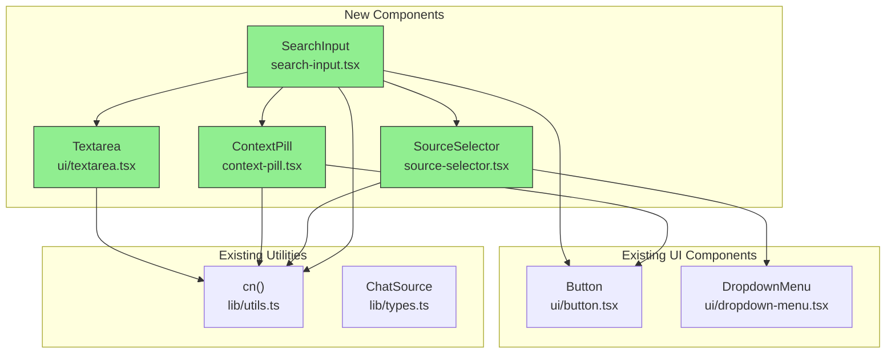
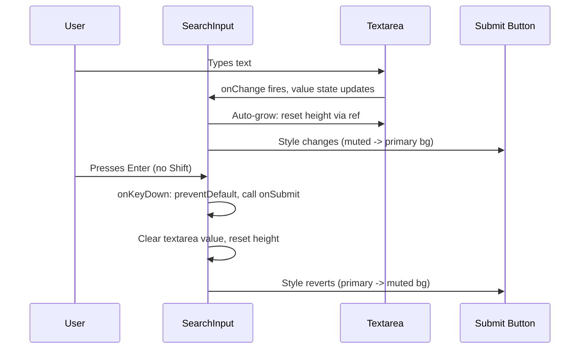
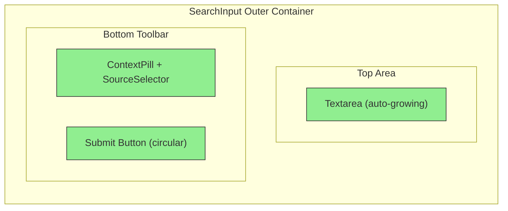

# Implementation Plan: Chat Search Input Component

## 1. Executive Summary

**What**: Create a new composed search input component for the chat interface, consisting of 4 new files: a shadcn-style `Textarea` UI primitive, a `ContextPill` sub-component, a `SourceSelector` dropdown sub-component, and a main `SearchInput` component that composes them all inside a shared focus area.

**Why**: The current `QueryInput` uses a single-line `<input>` element, which is inadequate for longer chat queries. The new `SearchInput` provides a multi-line auto-growing textarea with inline action buttons (context, source selection, submit) inside a unified focus container, matching modern chat UI patterns.

**Approach**: Build bottom-up -- UI primitive first (`Textarea`), then standalone sub-components (`ContextPill`, `SourceSelector`), then the composed `SearchInput`. Follow existing shadcn/ui v4 + React 19 patterns exactly (no `forwardRef`, `data-slot` attributes, named exports, `Readonly<Props>`, CVA where appropriate).

**Risk Level**: Low. All new files, no modifications to existing code. The integration with `chat-view.tsx` is deferred to a follow-up PR.

**Estimated Effort**: Small-medium. 4 files, well-scoped, clear patterns to follow.

---

## 2. Architecture Diagrams

### 2.1 Desired State: Component Hierarchy

### 2.2 Component Interactions: User Submit Flow

### 2.3 Visual Layout (Desired State)

---

## 3. Execution Plan

| Step | File | Action | Depends On |
|------|------|--------|------------|
| 1 | `src/components/ui/textarea.tsx` | Create | None |
| 2 | `src/components/chat/context-pill.tsx` | Create | Existing `Button` |
| 3 | `src/components/chat/source-selector.tsx` | Create | Existing `DropdownMenu` |
| -- | **Checkpoint A** | Verify primitives render | Steps 1-3 |
| 4 | `src/components/chat/search-input.tsx` | Create | Steps 1-3 |
| -- | **Checkpoint B** | Full integration test | Step 4 |

---

## 4. Per-File Details

### File 1: `src/components/ui/textarea.tsx`

**Purpose**: Minimal shadcn-style Textarea primitive. Serves as the base `<textarea>` element wrapper with consistent styling, following the same patterns as `Button` and `Badge` in this codebase.

**Current Implementation**: Does not exist. Needs to be created from scratch.

**Changes**:

1. **[Create Textarea component]**
   - **Location**: New file
   - **Pattern**: Follow the `Button` component pattern at `src/components/ui/button.tsx` (React 19 style, no `forwardRef`, `data-slot` attribute, named function export)
   - **Intent**: Provide a styled `<textarea>` primitive that can be composed into higher-level components
   - **Details**:
     - Function signature: `function Textarea({ className, ...props }: React.ComponentProps<'textarea'>)`
     - Add `data-slot="textarea"` on the underlying `<textarea>` element
     - Base classes should include: border, rounded-lg, text-sm, placeholder styling, focus-visible ring, disabled styling, and `field-sizing: content` via the Tailwind class `field-sizing-content` (Tailwind v4 supports this) for native auto-growing behavior
     - Use `cn()` to merge base classes with the `className` prop
     - Named exports: `export { Textarea }`
   - **Skill guidance**:
     - [Per react-expert]: Use `React.ComponentProps<'textarea'>` instead of `forwardRef` -- React 19 passes ref through props automatically
     - [Per shadcn-ui]: Include `data-slot` attribute for consistent styling hooks
     - [Per typescript-expert]: The `...props` spread naturally includes `ref` in React 19

**Why**: The `SearchInput` needs a styled textarea base. Having it as a separate UI primitive keeps it reusable and follows the project's component library pattern where each HTML element wrapper lives in `ui/`.

---

### File 2: `src/components/chat/context-pill.tsx`

**Purpose**: Small pill-shaped button displaying "@ Add context" that will open a context/mention picker. Acts as a visual affordance inside the `SearchInput` toolbar.

**Current Implementation**: Does not exist. The current chat view uses a separate `+` button for adding sources (in `chat-view.tsx` lines 356-372), but this is a different UX pattern.

**Changes**:

1. **[Create ContextPill component]**
   - **Location**: New file
   - **Pattern**: Follow the component structure of `SelectedSourcesChips` at `src/components/chat/selected-sources-chips.tsx` (JSDoc comment, named export, `Readonly<Props>`, section comments)
   - **Intent**: Render a small, pill-shaped interactive button with an @ symbol and label text
   - **Details**:
     - JSDoc block describing the component's purpose
     - Props interface: `onClick: () => void`, optional `className`, optional `disabled`
     - Use the `Button` component from `@/components/ui/button` with `variant="ghost"` and `size="sm"`
     - Import `AtSign` icon from `lucide-react/dist/esm/icons/at-sign`
     - The button should have a rounded-full shape (pill), compact sizing, and muted text color
     - Render the icon followed by the text "Add context"
     - Apply `cn()` for class merging with any external `className`
     - Named export: `export function ContextPill(...)`
   - **Skill guidance**:
     - [Per ui-ux-expert]: Ensure touch target is at least 44px in the smallest dimension. If the pill is smaller, add invisible padding via `min-h-[44px]` or a hit-area wrapper
     - [Per react-expert]: No need for `useCallback` on click handler since this is a leaf component that just passes through the prop

**Why**: Separating this into its own component keeps `SearchInput` clean and allows reuse or independent iteration on the context-add UX.

---

### File 3: `src/components/chat/source-selector.tsx`

**Purpose**: Two side-by-side dropdown trigger buttons for selecting the model mode ("Auto") and source filter ("All Sources"). Uses the existing `DropdownMenu` Radix implementation.

**Current Implementation**: Does not exist. The current chat view uses a separate `ModelSelector` component (`src/components/chat/model-selector.tsx`) with a fully custom dropdown. This new component is a lighter-weight inline selector for the search input toolbar.

**Changes**:

1. **[Create SourceSelector component]**
   - **Location**: New file
   - **Pattern**: Follow `DropdownMenu` usage from `src/components/ui/dropdown-menu.tsx` for trigger/content/item composition. Follow component structure from `cost-badges.tsx` for the props/JSDoc/export pattern.
   - **Intent**: Provide two dropdown trigger buttons that let users pick a model mode and source filter without leaving the search input
   - **Details**:
     - JSDoc block describing both dropdowns
     - Props interface with:
       - `mode: string` -- current model mode (e.g., "auto")
       - `onModeChange: (mode: string) => void` -- callback when mode changes
       - `sourceFilter: string` -- current source filter (e.g., "all")
       - `onSourceFilterChange: (filter: string) => void` -- callback when filter changes
       - optional `className`
     - Render a flex container with two `DropdownMenu` instances
     - Each trigger button: small text label + `ChevronDown` icon from `lucide-react/dist/esm/icons/chevron-down`
     - Trigger button styling: ghost-like appearance, rounded-lg, small text, muted colors, hover states
     - First dropdown (mode): items for "Auto", "Manual" (or equivalent labels)
     - Second dropdown (source filter): items for "All Sources", "Selected Only" (or equivalent labels)
     - Use `DropdownMenuContent` with `align="start"` and `side="top"` since the search input sits at the bottom of the viewport
     - Named export: `export function SourceSelector(...)`
   - **Skill guidance**:
     - [Per ui-ux-expert]: Dropdown triggers must be keyboard accessible -- `DropdownMenuTrigger` from Radix handles this automatically
     - [Per shadcn-ui]: Use the existing `DropdownMenu*` components as-is; do not reimplement
     - [Per react-expert]: The `onModeChange` / `onSourceFilterChange` callbacks should be called directly from `DropdownMenuItem`'s `onSelect` handler

**Why**: Encapsulating the dropdowns in a separate component keeps `SearchInput` focused on composition and text handling rather than dropdown menu logic.

---

### File 4: `src/components/chat/search-input.tsx`

**Purpose**: Main composed search input component. Wraps a `Textarea`, `ContextPill`, `SourceSelector`, and a submit `Button` inside a shared focus container with `focus-within` ring styling.

**Current Implementation**: Does not exist. The closest analog is `QueryInput` at `src/components/query/query-input.tsx`, which uses a single-line `<input>` with a submit button. The new component replaces the chat variant with a richer multi-line experience.

**Changes**:

1. **[Create SearchInput component with auto-growing textarea]**
   - **Location**: New file
   - **Pattern**: Follow the `QueryInput` component structure (JSDoc with `@example`, section comments with `=== ===`, `Readonly<Props>`, `useCallback` for handlers)
   - **Intent**: Provide a composed, accessible chat input with auto-growing textarea and inline action buttons
   - **Details**:
     - JSDoc block with description and `@example` usage snippet
     - Section comments: `=== Types ===`, `=== Constants ===` (if needed), `=== Component ===`
     - Props interface `SearchInputProps`:
       - `onSubmit: (query: string) => void` -- callback when user submits
       - `disabled?: boolean` -- disables all interaction
       - `isProcessing?: boolean` -- shows loading state on submit button
       - `placeholder?: string` -- textarea placeholder text
       - `className?: string` -- additional classes for outer wrapper
     - Use `Readonly<SearchInputProps>` in the function signature
     - State: `value` string via `useState`
     - Ref: `useRef<HTMLTextAreaElement>` for auto-grow calculations
     - **Auto-grow mechanism**: A `useEffect` that triggers on `value` changes, reads the ref's `scrollHeight`, and sets `style.height`. Reset height to `'auto'` first, then set to `scrollHeight + 'px'`. Add a sensible `max-height` (e.g., 200px) with `overflow-y: auto` beyond that.
     - **Outer wrapper**: `
` with classes for border, `rounded-3xl`, `p-4`, `focus-within:ring-1 focus-within:ring-ring`, `transition-shadow`
     - **Textarea**: Import `Textarea` from `@/components/ui/textarea`. Apply: no visible border (`border-0`), no focus ring (`focus-visible:ring-0`), no shadow, `resize-none`, `p-0`. The outer wrapper provides the visual border/ring.
     - **Bottom toolbar**: `
` with flex, items-center, justify-between, placed below the textarea with a small gap
       - Left side: `
` with flex and gap containing `<ContextPill>` and `<SourceSelector>`
       - Right side: Submit `<Button>` from `@/components/ui/button`
     - **Submit button**:
       - Circular shape: `rounded-full`, `size="icon"` variant
       - Icon: `ArrowUp` from `lucide-react/dist/esm/icons/arrow-up`
       - Conditional styling: when `value.trim()` is empty, use muted/secondary appearance; when has content, use `variant="default"` (primary bg)
       - Disabled when `!value.trim() || disabled`
       - Shows `Loader2` with `animate-spin` when `isProcessing` is true
     - **Keyboard handling**: `onKeyDown` handler on the Textarea:
       - `Enter` without `Shift`: call `event.preventDefault()`, trim value, if non-empty call `onSubmit(trimmedValue)`, then clear value and reset textarea height
       - `Shift+Enter`: do nothing (default textarea behavior inserts newline)
     - **Submission handler**: Also wire to a submit button `onClick` as fallback
     - After successful submit: `setValue('')` and reset textarea height via ref
     - Include an `aria-label` on the outer wrapper or a visually hidden `<label>` for the textarea
   - **Skill guidance**:
     - [Per react-expert]: Use `useCallback` for the `onKeyDown` and submit handlers to avoid unnecessary re-renders of child components
     - [Per ui-ux-expert]: The outer `focus-within` ring must have sufficient contrast (the existing `ring-ring` token handles this). Ensure the submit button has an `aria-label` describing its action.
     - [Per typescript-expert]: Use `Readonly<SearchInputProps>` consistently
     - [Per shadcn-ui]: The Textarea inside SearchInput should strip its own border/ring styles since the parent container provides the visual boundary

2. **[Wire ContextPill and SourceSelector]**
   - **Location**: Inside the SearchInput component's bottom toolbar
   - **Pattern**: Follow how `chat-view.tsx` composes `ModelSelector` and the add-sources button alongside `QueryInput`
   - **Intent**: Embed interactive controls inside the shared focus area
   - **Details**:
     - `ContextPill`: pass an `onClick` handler (can be a no-op for now since full context integration is deferred)
     - `SourceSelector`: pass default mode/filter values and change handlers (can use local state for now since full integration is deferred)
     - Both components should be inside the `focus-within` wrapper so they contribute to the shared focus ring

**Why**: This is the core deliverable -- a modern, composed chat input that unifies multiple interactive controls inside a single visual container.

---

## 5. Testing Requirements

### Manual Verification

| Test Case | Expected Behavior | File(s) |
|-----------|-------------------|---------|
| Type text in textarea | Text appears, textarea auto-grows vertically | `search-input.tsx`, `textarea.tsx` |
| Delete all text | Textarea shrinks back to single-line height | `search-input.tsx` |
| Press Enter with content | `onSubmit` fires with trimmed value, textarea clears | `search-input.tsx` |
| Press Enter with empty/whitespace | Nothing happens (no submission) | `search-input.tsx` |
| Press Shift+Enter | Newline inserted, no submission | `search-input.tsx` |
| Submit button appearance | Muted when empty, primary-colored when content present | `search-input.tsx` |
| Click submit button | Same behavior as Enter key | `search-input.tsx` |
| Tab through all controls | Focus moves: Textarea -> ContextPill -> SourceSelector triggers -> Submit button | `search-input.tsx` |
| Click outside, then inside | Focus-within ring appears/disappears on the outer container | `search-input.tsx` |
| Click "@ Add context" pill | `onClick` handler fires | `context-pill.tsx` |
| Open source selector dropdown | Dropdown appears above the input (side="top") | `source-selector.tsx` |
| Select dropdown item | Dropdown closes, callback fires with new value | `source-selector.tsx` |
| Set `disabled={true}` | Textarea and submit button are non-interactive | `search-input.tsx` |
| Set `isProcessing={true}` | Submit button shows spinner icon | `search-input.tsx` |
| Paste long text | Textarea grows up to max-height, then shows scrollbar | `search-input.tsx` |

### Accessibility Checks

| Check | Criteria | File(s) |
|-------|----------|---------|
| Screen reader label | Textarea has an associated `<label>` (visually hidden) | `search-input.tsx` |
| Submit button label | Has `aria-label` describing the action | `search-input.tsx` |
| ContextPill label | Button text "Add context" is sufficient; icon has `aria-hidden` | `context-pill.tsx` |
| Dropdown accessibility | Radix handles `aria-expanded`, `role="menu"`, keyboard nav | `source-selector.tsx` |
| Touch targets | All interactive elements >= 44px in smallest dimension | All |
| Focus visibility | All focusable elements have visible focus indicators | All |

---

## 6. Validation Checkpoints

### Checkpoint A: After Steps 1-3 (Primitives)

- [ ] `textarea.tsx` exports a `Textarea` component that renders a styled `<textarea>` element with `data-slot="textarea"`
- [ ] `context-pill.tsx` exports a `ContextPill` component that renders a pill button with @ icon
- [ ] `source-selector.tsx` exports a `SourceSelector` component with two dropdown triggers
- [ ] All three files use `cn()` from `@/lib/utils`
- [ ] All three files follow the named export pattern (no default exports)
- [ ] TypeScript compiles without errors

### Checkpoint B: After Step 4 (Composition)

- [ ] `search-input.tsx` imports and renders all three sub-components plus the `Button`
- [ ] Auto-grow textarea works: grows on input, shrinks on delete
- [ ] Enter submits, Shift+Enter inserts newline
- [ ] Submit button changes appearance based on textarea content
- [ ] `focus-within` ring appears on the outer container when any child is focused
- [ ] The component matches the `onSubmit` callback pattern of the existing `QueryInput`
- [ ] No TypeScript errors across all 4 new files

---

## 7. Error Scenarios

| Scenario | Impact | Mitigation |
|----------|--------|------------|
| `field-sizing: content` not supported in target browser | Textarea does not auto-grow natively | Implement a fallback `useEffect` that manually calculates `scrollHeight`. Check browser support; if the project targets browsers without this, the `useEffect` approach is the primary mechanism and `field-sizing` is progressive enhancement only. |
| Textarea `scrollHeight` returns 0 on first render | Auto-grow calculation fails | Guard the `useEffect` with a null check on the ref and a `scrollHeight > 0` check. The textarea will simply stay at its CSS min-height. |
| DropdownMenu opens downward and clips behind viewport edge | Dropdown content invisible | Use `side="top"` on `DropdownMenuContent` since the SearchInput sits at the bottom of the viewport. Radix handles collision detection. |
| Very rapid typing causes excessive re-renders | Performance degradation | The `useEffect` for auto-grow is cheap (DOM read + write). No debouncing needed for normal usage. |
| `onSubmit` callback throws | Textarea already cleared, user loses input | Consider only clearing after `onSubmit` returns (if synchronous) or document that the parent should handle errors. For this PR, clearing immediately matches the existing `QueryInput` behavior. |

---

## 8. Skills-Informed Recommendations

### react-expert
- Use React 19 patterns throughout: `React.ComponentProps<'textarea'>` instead of `forwardRef`, ref passed as a regular prop
- Use `useCallback` for event handlers in `SearchInput` to prevent unnecessary re-renders of memoized children
- The `useEffect` for auto-grow should depend on `value` to recalculate on every change

### shadcn-ui
- `Textarea` must include `data-slot="textarea"` to match the project's component conventions
- Use `cn()` for all class merging -- never concatenate strings directly
- The sub-components inside `SearchInput` strip their own visual boundaries (border, ring) since the parent provides the container styling

### typescript-expert
- All props interfaces use `Readonly<Props>` wrapper in function signatures
- Props that accept callbacks should use explicit function types, not `Function`
- The `mode` and `sourceFilter` props on `SourceSelector` could use string literal union types for type safety

### ui-ux-expert
- All interactive elements need visible focus indicators (handled by Tailwind's `focus-visible:` utilities)
- Touch targets must be >= 44px. The submit button at `size="icon"` (40px) needs a bump to 44px
- The `focus-within` ring on the outer container must meet WCAG AA contrast requirements -- the existing `ring-ring` CSS variable is designed for this
- Keyboard navigation order within the SearchInput should be logical: textarea first, then toolbar buttons left-to-right, submit button last
