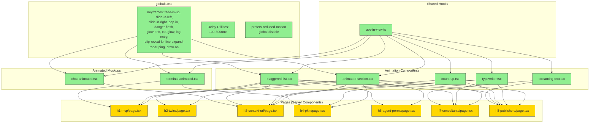
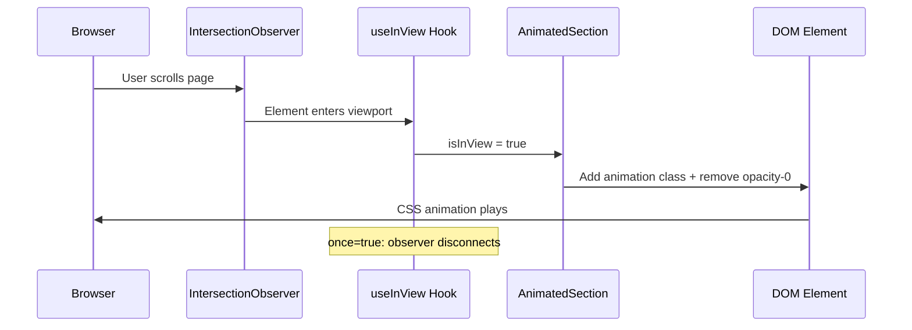

# Implementation Plan: Landing Page Scroll & Load Animations

## 1. Executive Summary

Add scroll-triggered and page-load animations to 7 landing pages (`h1-mcp` through `h8-publishers`) in a Next.js 15 app. The approach builds a shared animation toolkit (6 reusable client components + 2 animated mockup components) that pages consume without breaking their Server Component status.

**Chosen approach**: CSS keyframe animations triggered by a lightweight `IntersectionObserver` hook. No animation library (framer-motion, GSAP, etc.) — the existing `tw-animate-css` package and custom keyframes in `globals.css` provide everything needed. This keeps the bundle size near-zero for animation logic.

**Alternative rejected**: framer-motion would simplify spring physics but adds ~30kB to the client bundle and forces more components to become Client Components. Not justified for primarily one-shot reveal animations.

**Risk level**: Low. All changes are additive — new files and JSX wrappers around existing markup. No existing component internals (`Terminal`, `BrowserFrame`, `ChatMessage`, `DashboardMock`) are modified. The main risk is SSR hydration mismatch if initial CSS state disagrees between server and client; mitigated by using CSS-only initial states (`opacity-0`) rather than JS-controlled visibility.

**Estimated effort**: Large (16 files, ~2500 lines of new/modified code).

**Hard constraints**:
- Pages remain Server Components (no `"use client"` on page files).
- Only `opacity` + `transform` for animations (GPU-composited, no layout thrash).
- Respect `prefers-reduced-motion` globally.
- Existing mockup components are not modified — animated versions wrap or replace them.

## 2. Architecture Diagrams

### Desired State — Component Dependency Graph



### Component Interactions — Scroll-Triggered Animation Sequence



## 3. Execution Plan

### Wave 1 -- Shared Infrastructure (no page dependencies)
1. `src/app/globals.css` -- Add keyframes, delay utilities, reduced-motion rule
2. `src/components/animations/use-in-view.ts` -- IntersectionObserver hook
3. `src/components/animations/animated-section.tsx` -- Scroll reveal wrapper
4. `src/components/animations/typewriter.tsx` -- Typing effect
5. `src/components/animations/count-up.tsx` -- Number counter
6. `src/components/animations/staggered-list.tsx` -- Staggered children reveal
7. `src/components/animations/streaming-text.tsx` -- Word-by-word streaming

**Checkpoint**: All 7 files compile. Run `npm run build` -- zero errors. Manually test AnimatedSection by temporarily importing it into any page.

### Wave 2 -- Enhanced Mockup Components (depend on Wave 1)
8. `src/components/mockups/terminal-animated.tsx` -- Animated terminal
9. `src/components/mockups/chat-animated.tsx` -- Animated Slack chat

**Checkpoint**: Both components render in isolation. Terminal types and reveals output. Chat shows sequential messages with typing indicator.

### Wave 3 -- Page Implementations (depend on Waves 1+2, parallelizable)
10. `src/app/h1-mcp/page.tsx`
11. `src/app/h2-twins/page.tsx`
12. `src/app/h3-context-url/page.tsx`
13. `src/app/h4-pkm/page.tsx`
14. `src/app/h5-agent-perms/page.tsx`
15. `src/app/h7-consultants/page.tsx`
16. `src/app/h8-publishers/page.tsx`

**Checkpoint**: `npm run build` succeeds. All 7 pages render without hydration warnings. Scroll through each page confirming animations fire once and respect reduced-motion.

## 4. Per-File Details

---

### File: `src/app/globals.css`

**Purpose**: Global stylesheet containing all CSS keyframes, animation utility classes, and delay helpers. Foundation for the entire animation system.

**Blast Radius**: Every page and animation component consumes these classes -- broad, but purely additive (no existing rules modified).

**Current Implementation**: Contains 3 keyframes (`fade-in-up`, `cursor-blink`, `pulse-soft`), 3 utility classes, and 3 delay utilities (100/200/300ms). See lines 84-114.

**Changes**:

1. **[Add new keyframes]**
   - **Location**: After the existing `pulse-soft` keyframe block (after line 98)
   - **Pattern**: Follow the existing keyframe format (property shorthand, `from`/`to` or percentage stops)
   - **Intent**: Provide all animation primitives needed across 7 pages
   - **Details**: Add these keyframes in this order:
     - `draw-on` -- SVG stroke-dashoffset animation from `var(--path-length, 100)` to 0
     - `slide-in-left` -- opacity 0 + translateX(-16px) to opacity 1 + translateX(0)
     - `slide-in-right` -- opacity 0 + translateX(16px) to opacity 1 + translateX(0)
     - `pop-in` -- 3-stop: scale(0.5)/opacity:0 at 0%, scale(1.15)/opacity:1 at 70%, scale(1) at 100%
     - `danger-flash` -- 3-stop: transparent at 0%, red bg + box-shadow at 30%, transparent at 100%
     - `glow-drift` -- translate(0,0) at 0%/100%, translate(20px,-15px) at 50%
     - `cta-glow` -- box-shadow pulse using `var(--glow-color, 99 102 241)`
     - `log-entry` -- opacity 0 + translateY(-6px) to opacity 1 + translateY(0)
     - `clip-reveal-ltr` -- clip-path from `inset(0 100% 0 0)` to `inset(0 0% 0 0)`
     - `line-expand` -- scaleX(0) to scaleX(1)
     - `radar-ping` -- scale(1)/opacity:0.5 to scale(2.5)/opacity:0

2. **[Add utility classes for new keyframes]**
   - **Location**: After the existing `.animate-pulse-soft` class (after line 110)
   - **Pattern**: Follow `.animate-fade-in-up { animation: fade-in-up 0.5s ease-out forwards; }` format
   - **Intent**: One utility class per animation, with sensible default duration and easing
   - **Details**: Each class named `.animate-<keyframe-name>`. Durations:
     - `slide-in-left`, `slide-in-right`: 0.5s ease-out forwards
     - `pop-in`: 0.4s cubic-bezier(0.34,1.56,0.64,1) forwards
     - `danger-flash`: 0.8s ease-out (no forwards -- returns to transparent)
     - `glow-drift`: 12s ease-in-out infinite
     - `cta-glow`: 3s ease-in-out infinite
     - `log-entry`: 0.3s ease-out forwards
     - `clip-reveal-ltr`: 0.6s ease-out forwards
     - `line-expand`: 0.5s ease-out forwards
     - `radar-ping`: 1.5s ease-out infinite
     - `draw-on`: 1s ease-out forwards

3. **[Add extended delay utilities]**
   - **Location**: After the existing delay utilities (after line 114)
   - **Pattern**: Follow `.animation-delay-100 { animation-delay: 100ms; }` format
   - **Intent**: Support stagger delays up to 3000ms for long sequences
   - **Details**: Add utilities for 400, 500, 600, 700, 800, 1000, 1200, 1500, 2000, 2500, 3000ms

4. **[Add prefers-reduced-motion rule]**
   - **Location**: At the end of the file, after all animation classes
   - **Pattern**: Standard media query override
   - **Intent**: Disable all non-essential animations for users with motion sensitivity
   - **Details**:
     ```css
     @media (prefers-reduced-motion: reduce) {
       *, *::before, *::after {
         animation-duration: 0.01ms !important;
         animation-iteration-count: 1 !important;
         transition-duration: 0.01ms !important;
       }
     }
     ```
     Using `0.01ms` instead of `0s` so `forwards` fill-mode still applies (elements reach their final state immediately rather than staying invisible).

**Why**: All animation components depend on these keyframes and utilities existing in CSS. This file has zero JS dependencies and must be complete before any component work begins.

---

### File: `src/components/animations/use-in-view.ts`

**Purpose**: Custom React hook wrapping IntersectionObserver. Returns a ref and a boolean. Foundation for all scroll-triggered animations.

**Blast Radius**: New file -- 0 existing callers. Will be imported by all 5 animation components + 2 animated mockups.

**Current Implementation**: File does not exist.

**Changes**:

1. **[Create useInView hook]**
   - **Location**: New file
   - **Pattern**: Standard React hook pattern with `"use client"` directive
   - **Intent**: Observe a DOM element and report when it enters the viewport, with configurable threshold and margin
   - **Details**:
     - Directive: `"use client"` at top
     - Signature: `export function useInView(options?: { threshold?: number; rootMargin?: string; once?: boolean }): [React.RefCallback<HTMLElement>, boolean]`
     - Use `useRef` for the observer instance and a `useCallback`-based ref callback (not `RefObject`) so it handles dynamic elements correctly
     - Defaults: `threshold = 0.15`, `rootMargin = "0px 0px -60px 0px"`, `once = true`
     - When `once` is true, disconnect the observer after the first intersection
     - Clean up observer on unmount via `useEffect` cleanup
     - Return `[refCallback, isInView]`

**Why**: Centralizes IntersectionObserver logic. Every scroll-triggered animation component needs this hook, so it must exist before any of them.

---

### File: `src/components/animations/animated-section.tsx`

**Purpose**: Generic scroll-reveal wrapper. Renders children invisible until scrolled into view, then plays a CSS animation.

**Blast Radius**: New file -- 0 existing callers. Will be imported by all 7 page files.

**Current Implementation**: File does not exist.

**Changes**:

1. **[Create AnimatedSection component]**
   - **Location**: New file
   - **Pattern**: `"use client"` wrapper component
   - **Intent**: Wrap any static JSX to make it animate on scroll entry
   - **Details**:
     - Props interface:
       ```ts
       interface AnimatedSectionProps {
         children: React.ReactNode;
         animation?: string;   // default "animate-fade-in-up"
         delay?: number;       // ms, applied as inline animationDelay
         className?: string;   // additional classes on wrapper div
         as?: React.ElementType; // default "div"
         threshold?: number;
         rootMargin?: string;
       }
       ```
     - Uses `useInView` internally
     - Before `isInView`: render with `opacity-0` class
     - After `isInView`: replace `opacity-0` with the animation class
     - Apply `delay` as inline `style={{ animationDelay: \`${delay}ms\` }}`
     - Use `cn()` from `@/lib/utils` for class merging
     - The wrapper element type is controlled by `as` prop (allows `section`, `li`, etc.)

**Why**: This is the workhorse component. Most page sections just need "fade in when scrolled to" and this handles it without any page needing `"use client"`.

---

### File: `src/components/animations/typewriter.tsx`

**Purpose**: Typing effect component. Reveals text character-by-character with optional blinking cursor.

**Blast Radius**: New file. Used by H3, H4, H7, H8 pages and internally by `terminal-animated.tsx`.

**Current Implementation**: File does not exist.

**Changes**:

1. **[Create Typewriter component]**
   - **Location**: New file
   - **Pattern**: `"use client"` component with `useState` + `useEffect` timer chain
   - **Intent**: Simulate a human typing text into a field or terminal
   - **Details**:
     - Props: `text: string`, `speed?: number` (default 40ms), `delay?: number` (default 0ms), `onComplete?: () => void`, `showCursor?: boolean` (default true), `className?: string`, `triggerOnView?: boolean` (default true)
     - When `triggerOnView` is true, use `useInView` to start typing only when visible
     - State: `displayedCount: number` starting at 0
     - Effect: after `delay` ms, increment `displayedCount` by 1 every `speed` ms using `setTimeout` chain (not `setInterval` -- allows cleanup between characters)
     - Call `onComplete` when `displayedCount === text.length`
     - Render: `<span className={className}>{text.slice(0, displayedCount)}{showCursor && <span className="animate-cursor-blink">|</span>}</span>`
     - Cursor should fade out after completion if `showCursor` is true (add a `cursorVisible` state that goes false 1.4s after completion)

**Why**: Used in terminal typing, search demo typing, URL typing, and attribution query typing across 4 pages.

---

### File: `src/components/animations/count-up.tsx`

**Purpose**: Animated number counter. Counts from 0 to a target number with ease-out cubic easing.

**Blast Radius**: New file. Used by H3 (social proof stats) and H8 (usage counter 16,940).

**Current Implementation**: File does not exist.

**Changes**:

1. **[Create CountUp component]**
   - **Location**: New file
   - **Pattern**: `"use client"` component with `requestAnimationFrame` loop
   - **Intent**: Smoothly count from 0 to a target number when scrolled into view
   - **Details**:
     - Props: `target: number`, `duration?: number` (default 1200ms), `formatter?: (n: number) => string` (default: `Math.round(n).toLocaleString()`), `className?: string`
     - Uses `useInView` to trigger
     - On trigger, start a `requestAnimationFrame` loop:
       - Track elapsed time from start
       - Progress = `Math.min(elapsed / duration, 1)`
       - Eased progress = `1 - Math.pow(1 - progress, 3)` (ease-out cubic)
       - Current value = `eased * target`
       - Display `formatter(currentValue)`
     - Cancel animation frame on unmount
     - Before trigger, display `formatter(0)`

**Why**: Provides the "counting up" effect for stat numbers (H3) and the 16,940 usage counter (H8).

---

### File: `src/components/animations/staggered-list.tsx`

**Purpose**: Wraps a list of children and reveals them one-by-one with staggered delays when scrolled into view.

**Blast Radius**: New file. Used by H1, H2, H3, H5, H7, H8 for list items, table rows, card sequences.

**Current Implementation**: File does not exist.

**Changes**:

1. **[Create StaggeredList component]**
   - **Location**: New file
   - **Pattern**: `"use client"` component that maps over `React.Children`
   - **Intent**: Automatically stagger the reveal of list items without manual delay props on each child
   - **Details**:
     - Props: `children: React.ReactNode`, `staggerMs?: number` (default 100), `animation?: string` (default "animate-fade-in-up"), `className?: string`, `as?: React.ElementType` (default "div")
     - Uses `useInView` to trigger
     - Before `isInView`: each child wrapped in a div with `opacity-0`
     - After `isInView`: each child's wrapper gets the animation class + inline `animationDelay: index * staggerMs + "ms"`
     - Use `React.Children.map` to wrap each child

**Why**: Many page sections have lists, table rows, or card grids that need sequential reveal. This avoids copy-pasting delay logic across 6 pages.

---

### File: `src/components/animations/streaming-text.tsx`

**Purpose**: Reveals text in word groups (2-3 words at a time), simulating an AI streaming response.

**Blast Radius**: New file. Used by H7 (client mockup AI response) and H8 (attribution response).

**Current Implementation**: File does not exist.

**Changes**:

1. **[Create StreamingText component]**
   - **Location**: New file
   - **Pattern**: `"use client"` component with `useState` + `useEffect` timer
   - **Intent**: Simulate AI-style word-by-word text streaming
   - **Details**:
     - Props: `text: string`, `groupSize?: number` (default 2), `intervalMs?: number` (default 80), `delay?: number` (default 0), `className?: string`, `onComplete?: () => void`
     - Uses `useInView` to trigger
     - Split text into words. Reveal `groupSize` words at a time every `intervalMs`
     - State: `visibleWordCount: number`
     - Render: words up to `visibleWordCount` visible, rest hidden
     - Call `onComplete` when all words are visible

**Why**: Distinct from Typewriter -- this reveals at word boundaries for a more natural "AI streaming" feel, matching how LLM responses actually appear.

---

### File: `src/components/mockups/terminal-animated.tsx`

**Purpose**: Animated version of the Terminal component. Commands type character-by-character, output lines appear sequentially with checkmarks.

**Blast Radius**: New file. Used by H1 (hero terminal, setup terminal) and H4 (install terminal).

**Current Implementation**: File does not exist. The static `Terminal` component at `src/components/mockups/terminal.tsx` renders all lines at once via `dangerouslySetInnerHTML`.

**Changes**:

1. **[Create TerminalAnimated component]**
   - **Location**: New file
   - **Pattern**: `"use client"` component with internal state machine
   - **Intent**: Replicate Terminal's visual appearance but animate content sequentially
   - **Details**:
     - Props: same as `Terminal` plus `typingSpeed?: number` (default 30ms), `lineDelay?: number` (default 300ms between output lines), `startDelay?: number` (default 0ms)
     - Uses `useInView` to trigger the sequence
     - Internal state machine phases: `idle | typing-command-N | showing-output-N | done`
     - For each line in `lines`:
       - If `prompt: true`: type the text character-by-character (like Typewriter)
       - If `prompt: false`: fade in the entire line after a `lineDelay` pause
     - Reuse Terminal's visual shell (title bar with dots, dark bg, monospace font) -- duplicate the markup rather than importing Terminal, since the rendering logic is fundamentally different
     - Blinking cursor appears at the active line, disappears from previous lines
     - After all lines are shown, cursor blinks at the end indefinitely
     - Support HTML in output lines (checkmarks) via `dangerouslySetInnerHTML` for non-typed lines

**Why**: The static Terminal shows everything at once. The animated version makes hero sections come alive by simulating real terminal interaction. Creating a new component rather than modifying Terminal preserves backward compatibility.

---

### File: `src/components/mockups/chat-animated.tsx`

**Purpose**: Animated Slack-style chat with sequential message reveals and typing indicator. Used for the H3 hero Slack mockup.

**Blast Radius**: New file. Used by H3 (`h3-context-url/page.tsx`).

**Current Implementation**: File does not exist. The current H3 hero has inline chat markup inside a `BrowserFrame`.

**Changes**:

1. **[Create ChatAnimated component]**
   - **Location**: New file
   - **Pattern**: `"use client"` component with timed message reveals
   - **Intent**: Show chat messages appearing one by one with realistic timing and a typing indicator between messages
   - **Details**:
     - Props:
       ```ts
       interface ChatMessage {
         avatar: string;        // initials
         avatarColor: string;   // tailwind bg/text classes
         name: string;
         time: string;
         content: React.ReactNode;
         delay: number;         // ms from sequence start to show this message
         isBot?: boolean;
         botBadge?: string;     // e.g., "BOT"
         bgClass?: string;      // optional bg class for AI messages
       }
       interface ChatAnimatedProps {
         messages: ChatMessage[];
         typingIndicatorDelay?: number; // ms to show dots before bot message
         className?: string;
       }
       ```
     - Uses `useInView` to trigger
     - State: `visibleCount: number` (how many messages are shown), `showTyping: boolean`
     - Sequence: show message at its `delay`, if next message is bot, show typing indicator for `typingIndicatorDelay` ms first
     - Typing indicator: three dots with staggered `animate-pulse-soft`
     - Each message fades in using `animate-fade-in-up`
     - Messages render with divide-y styling matching the current H3 inline markup

**Why**: The H3 hero Slack mockup is the most complex interactive demo -- it needs sequential messages, a typing indicator, and bot-styled responses. A dedicated component encapsulates all this state.

---

### File: `src/app/h1-mcp/page.tsx`

**Purpose**: MCP landing page. Currently all static. Needs hero stagger, terminal animation, code block line reveals, section scroll animations.

**Blast Radius**: Standalone page. No other pages import from it.

**Current Implementation**: Server Component with `Navbar`, `Hero`, `FeatureSections` (containing `JsonBlock` + `YamlBlock`), `SetupSection`, `Footer`. 267 lines. Uses the static `Terminal` component.

**Changes**:

1. **[Hero copy stagger -- pure CSS, no client boundary]**
   - **Location**: Inside `Hero()`, the left column div (line 38)
   - **Pattern**: Add `opacity-0 animate-fade-in-up` + staggered delay classes to each child element
   - **Intent**: Badge, h1, paragraph, and CTA link cascade in on page load
   - **Details**:
     - Badge `<span>` (line 39): add `opacity-0 animate-fade-in-up`
     - `<h1>` (line 43): add `opacity-0 animate-fade-in-up animation-delay-100`
     - `<p>` (line 48): add `opacity-0 animate-fade-in-up animation-delay-200`
     - CTA `<a>` (line 52): add `opacity-0 animate-fade-in-up animation-delay-300`
   - No new imports needed -- these are pure CSS classes

2. **[Hero badge pulse dot]**
   - **Location**: The small dot span inside the badge (line 40)
   - **Intent**: Subtle pulse on the green dot to signal "live"
   - **Details**: Add `animate-pulse-soft` class to `<span className="h-1.5 w-1.5 rounded-full bg-indigo-500">`

3. **[Hero background glow drift]**
   - **Location**: The radial glow div (line 34)
   - **Intent**: Slow ambient movement to add depth
   - **Details**: Add `animate-glow-drift` class

4. **[Hero terminal -- replace with TerminalAnimated]**
   - **Location**: Inside `Hero()`, the right column (lines 65-78)
   - **Intent**: Terminal types commands and reveals output sequentially instead of showing everything at once
   - **Details**:
     - Add import: `import { TerminalAnimated } from "@/components/mockups/terminal-animated"`
     - Replace `<Terminal ... />` with `<TerminalAnimated ... />` using the same `title` and `lines` props
     - Add `startDelay={400}` so it starts after hero text has cascaded in

5. **[JsonBlock line-by-line reveal]**
   - **Location**: `JsonBlock()` function, the code content area (lines 104-113)
   - **Intent**: Code lines reveal sequentially when scrolled into view
   - **Details**:
     - Wrap the `JsonBlock` content area in `<StaggeredList staggerMs={80} animation="animate-fade-in-up">`
     - Add import for `StaggeredList`
     - Each `<div>` line inside the code block becomes a child of StaggeredList

6. **[YamlBlock line-by-line reveal]**
   - **Location**: `YamlBlock()` function (lines 134-144)
   - **Intent**: Same treatment as JsonBlock
   - **Details**: Same pattern as change 5

7. **[Feature section text scroll reveal]**
   - **Location**: `FeatureSections()` -- both Section A and Section B text blocks
   - **Intent**: h2, paragraph, and checklist items fade in on scroll
   - **Details**:
     - Wrap each section's text `<div>` in `<AnimatedSection>`
     - Wrap each `<ul>` checklist in `<StaggeredList staggerMs={100}>`
     - Add imports for `AnimatedSection` and `StaggeredList`

8. **[Setup section terminal -- replace with TerminalAnimated]**
   - **Location**: `SetupSection()` (lines 230-246)
   - **Intent**: Setup terminal also types commands sequentially
   - **Details**: Replace `<Terminal ... />` with `<TerminalAnimated ... />`, same props

9. **[CTA arrow hover -- pure CSS]**
   - **Location**: Hero CTA `<a>` tag, the arrow span (line 57)
   - **Intent**: Arrow translates right on hover
   - **Details**: Add `transition-transform group-hover:translate-x-1` to the arrow span. Add `group` to the parent `<a>`.

**Why**: H1 is the primary product page. The terminal typing effect is the signature demo moment. Line-by-line code reveals reinforce the "developer tool" positioning.

---

### File: `src/app/h2-twins/page.tsx`

**Purpose**: Digital Twins / Expert Panel page. Needs expert card stagger, timeline draw animation, CTA placeholder cycling.

**Blast Radius**: Standalone page.

**Current Implementation**: Server Component, 252 lines. Inline data arrays for experts, agreements, divergences, steps. No external mockup components.

**Changes**:

1. **[Hero stagger -- pure CSS]**
   - **Location**: Hero section (lines 90-109)
   - **Intent**: Eyebrow, h1, subtitle, and CTA link cascade in on page load
   - **Details**:
     - Eyebrow `<p>` (line 92): add `opacity-0 animate-fade-in-up`
     - `<h1>` (line 95): add `opacity-0 animate-fade-in-up animation-delay-100`
     - Subtitle `<p>` (line 98): add `opacity-0 animate-fade-in-up animation-delay-200`
     - CTA `<a>` (line 102): add `opacity-0 animate-fade-in-up animation-delay-300`

2. **[Expert panel animated reveal]**
   - **Location**: Panel Mockup section (lines 112-146)
   - **Intent**: Expert cards appear one at a time with 500ms stagger. Avatar circles scale in.
   - **Details**:
     - Wrap the panel's `<div className="space-y-8">` in `<StaggeredList staggerMs={500} animation="animate-fade-in-up">`
     - For each expert's avatar `<div>` (line 123-126): add `animate-pop-in` class triggered by parent's visibility (the pop-in will fire with the stagger delay inherited from StaggeredList)
     - Add imports for `StaggeredList`

3. **[Agreement/divergence list stagger]**
   - **Location**: "Where they agree / diverge" section (lines 149-182)
   - **Intent**: List items stagger in on scroll
   - **Details**:
     - Wrap each `<ul>` in `<StaggeredList staggerMs={120}>`
     - Section headers (`<h2>`) each get wrapped in `<AnimatedSection>`

4. **[Timeline vertical line draw + step stagger]**
   - **Location**: "How it works" section (lines 185-213)
   - **Intent**: Vertical line draws downward, then step nodes appear sequentially
   - **Details**:
     - This requires a small client component wrapper. Create an inline client component `TimelineAnimated` (or add it to the page's client-side section).
     - Alternative (simpler): Use pure CSS. Change the vertical line div (line 192) from static `bg-stone-200` to have `transform-origin: top` + `animate-line-expand` class, triggered by wrapping the timeline `<div className="relative">` in `<AnimatedSection animation="">` (empty animation, just for the trigger).
     - Actually, the simplest approach: wrap the entire timeline in `<AnimatedSection>`. The vertical line gets `origin-top scale-y-0` + when AnimatedSection triggers, add `animate-line-expand` via a `[data-in-view] .timeline-line` CSS selector. But that adds coupling.
     - **Recommended approach**: Wrap timeline in `<StaggeredList staggerMs={300}>` so each step fades in sequentially. The vertical line stays static (it's a visual guide, not the main animation). This is simpler and still looks great.

5. **[CTA placeholder cycling]**
   - **Location**: CTA section input (lines 228-245)
   - **Intent**: Placeholder text cycles through example questions
   - **Details**:
     - Extract the CTA section's input mockup into a small `"use client"` component `CyclicPlaceholder` (can be defined in the same directory or inline)
     - Create `src/app/h2-twins/cyclic-placeholder.tsx` with `"use client"` directive
     - Component cycles through ["How will AI affect enterprise adoption?", "What do experts say about open-source AI?", "Compare views on AI regulation..."] using `useState` + `useEffect` with 3s interval
     - Each new placeholder fades in using CSS transition on opacity

**Why**: The expert panel is the hero demo for this page. Staggered reveal creates anticipation and lets users read each expert's response naturally.

---

### File: `src/app/h3-context-url/page.tsx`

**Purpose**: Context URL page. The most animation-dense page with Slack mockup sequence, before/after cards, integrations flow, and product demo interactions.

**Blast Radius**: Standalone page.

**Current Implementation**: Server Component, 539 lines. Uses `BrowserFrame`. Complex inline Slack mockup in Hero. Multiple feature sections.

**Changes**:

1. **[Hero left stagger -- pure CSS]**
   - **Location**: Hero left column (lines 39-78)
   - **Intent**: Badge, h1, paragraph, Context URL pill, CTA cascade in on page load
   - **Details**:
     - Badge: `opacity-0 animate-fade-in-up`
     - h1: `opacity-0 animate-fade-in-up animation-delay-100`
     - Paragraph: `opacity-0 animate-fade-in-up animation-delay-200`
     - Context URL div: `opacity-0 animate-fade-in-up animation-delay-300`
     - CTA div: `opacity-0 animate-fade-in-up animation-delay-400`

2. **[Context URL pill breathing pulse]**
   - **Location**: The Context URL div (line 56)
   - **Intent**: Subtle box-shadow breathing to draw attention
   - **Details**: Add `animate-cta-glow` class with `--glow-color: 59 130 246` (blue) as inline style

3. **[Hero Slack mockup -- replace with ChatAnimated]**
   - **Location**: Hero right column (lines 82-152)
   - **Intent**: Messages appear sequentially with typing indicator before Claude's response
   - **Details**:
     - Add import for `ChatAnimated` and `BrowserFrame`
     - Replace the inline chat HTML with:
       ```tsx
       <BrowserFrame url="slack.com -- #engineering" className="shadow-2xl">
         <ChatAnimated
           messages={[
             { avatar: "DP", avatarColor: "bg-orange-100 text-orange-600", name: "Dev Patel", time: "10:32 AM", content: <p>...</p>, delay: 400 },
             { avatar: "SJ", avatarColor: "bg-emerald-100 text-emerald-600", name: "Sarah Johnson", time: "10:33 AM", content: <p>...</p>, delay: 900 },
             { avatar: "AI", avatarColor: "bg-indigo-600 text-white", name: "Claude", time: "10:33 AM", isBot: true, botBadge: "BOT", bgClass: "bg-blue-50/30", content: <div>...</div>, delay: 1800 },
           ]}
           typingIndicatorDelay={600}
         />
       </BrowserFrame>
       ```
     - The `content` for each message preserves the existing JSX structure

4. **[Social proof count-up]**
   - **Location**: `SocialProof()` (lines 160-187)
   - **Intent**: Stat numbers count up from 0
   - **Details**:
     - The stats "4 hrs", "5 min", "0" are text, not pure numbers. Only "0" is a countable number.
     - Better approach: Wrap the entire social proof bar in `<AnimatedSection>` for a simple fade-in. The stats are text strings, not suitable for CountUp.
     - Alternatively, make just the number parts animate. But "4 hrs" and "5 min" are mixed text.
     - **Decision**: Wrap in `<AnimatedSection>` for a clean scroll reveal. Skip CountUp here -- the values are too small to benefit from counting.

5. **[Before/After cards slide in from opposite sides]**
   - **Location**: `BeforeAfter()` (lines 190-259)
   - **Intent**: Before card enters from left, After card from right
   - **Details**:
     - Wrap the Before card div in `<AnimatedSection animation="animate-slide-in-left">`
     - Wrap the After card div in `<AnimatedSection animation="animate-slide-in-right" delay={200}>`
     - Wrap each Before card's question rows in `<StaggeredList staggerMs={150}>`
     - For After card rows, use `<StaggeredList staggerMs={200}>` -- each row fades in

6. **[Product demo Step 2 -- Context URL types itself]**
   - **Location**: `ProductDemo()`, Step 2 section (lines 323-363)
   - **Intent**: The Context URL in the mockup types character-by-character
   - **Details**:
     - Replace the static `<code>ctx.syft.hub/acme-docs</code>` (line 334) with `<Typewriter text="ctx.syft.hub/acme-docs" speed={50} className="..." />`
     - Add Typewriter import
     - Wrap the Step 2 mockup card in `<AnimatedSection>` so it triggers on scroll

7. **[Product demo Step 3 -- sequential reveal]**
   - **Location**: Step 3 section (lines 366-399)
   - **Intent**: Question appears, then AI response fades in, then citation
   - **Details**:
     - Wrap the Step 3 card in `<AnimatedSection>`
     - Wrap the question div, response div, and citation paragraph in `<StaggeredList staggerMs={400}>`

8. **[Integrations flow animation]**
   - **Location**: `Integrations()` (lines 407-463)
   - **Intent**: Source pills stagger from left, lines draw, hub pops, AI tool pills stagger from right
   - **Details**:
     - Wrap source pills `<div className="flex flex-wrap gap-2">` in `<StaggeredList staggerMs={100} animation="animate-slide-in-left">`
     - Wrap the hub connector div in `<AnimatedSection animation="animate-pop-in" delay={500}>`
     - Wrap AI tool pills in `<StaggeredList staggerMs={100} animation="animate-slide-in-right" delay={700}>`
     - The horizontal lines (line 426, 430) get `animate-line-expand` triggered by the parent AnimatedSection

9. **[CTA input typing animation]**
   - **Location**: `CtaSection()` (lines 497-521)
   - **Intent**: The placeholder text simulates a URL being "pasted"
   - **Details**:
     - Replace the static placeholder div with a Typewriter: `<Typewriter text="https://notion.so/acme/engineering-wiki" speed={25} delay={500} showCursor={false} />`
     - Wrap the CTA card in `<AnimatedSection>`

**Why**: H3 is the most conversion-critical page. The Slack mockup is the main proof point -- animating it draws attention and demonstrates the product story sequentially.

---

### File: `src/app/h4-pkm/page.tsx`

**Purpose**: PKM / Private vault page. Dark theme. Needs knowledge graph animation, search demo typing, terminal animation, compatibility badge pop-in.

**Blast Radius**: Standalone page.

**Current Implementation**: Server Component, 375 lines. Dark theme (bg-gray-950). Uses static `Terminal`, inline `GraphBackground` SVG, inline `SearchDemo`.

**Changes**:

1. **[Knowledge graph SVG line draw + node pulse]**
   - **Location**: `GraphBackground()` (lines 81-108)
   - **Intent**: SVG lines draw themselves, nodes pulse at different phases, 2-3 outer nodes drift subtly
   - **Details**:
     - `GraphBackground` is a Server Component with static SVG. To animate it, create a `"use client"` wrapper: `src/app/h4-pkm/graph-animated.tsx`
     - The animated graph component renders the same SVG but:
       - Each `<line>` gets `stroke-dasharray` and `stroke-dashoffset` set to their length, then `animate-draw-on` with staggered delays
       - Each node div gets `animate-pulse-soft` with different `animation-delay` values for phase offset
       - 2-3 outer nodes (indices 0, 4, 9) get `animate-glow-drift` with 15s duration for subtle drift
     - Uses `useInView` to trigger (only animate when hero scrolls into view -- which is immediately on page load, so it effectively plays on load)

2. **[Hero stagger]**
   - **Location**: Hero section text (lines 133-152)
   - **Intent**: ShieldIcon, h1, paragraph, CTA, and subtitle cascade in
   - **Details**:
     - ShieldIcon: `opacity-0 animate-fade-in-up`
     - h1: `opacity-0 animate-fade-in-up animation-delay-100`
     - p: `opacity-0 animate-fade-in-up animation-delay-200`
     - CTA: `opacity-0 animate-fade-in-up animation-delay-300`
     - Subtitle p: `opacity-0 animate-fade-in-up animation-delay-400`

3. **[Shield icon radar ping]**
   - **Location**: `<ShieldIcon>` in Hero (line 134)
   - **Intent**: Radar ping emanating from shield
   - **Details**: Wrap the ShieldIcon in a relative div. Add a sibling `<div className="absolute inset-0 animate-radar-ping rounded-full border border-purple-500/30" />` behind it

4. **[Search demo typing + sequential reveal]**
   - **Location**: `SearchDemo()` (lines 158-223)
   - **Intent**: Query types character-by-character, thinking pause, response fades in, citations appear one by one
   - **Details**:
     - Extract SearchDemo into a client component: `src/app/h4-pkm/search-demo-animated.tsx`
     - The query text uses `<Typewriter text="What were my key insights about distributed systems from Q4?" speed={35} />`
     - After typing completes (via `onComplete`), show a brief "thinking" indicator (0.5s), then fade in the response card with `animate-fade-in-up`
     - Citations appear via `<StaggeredList staggerMs={200}>` after response is visible

5. **[Privacy cards stagger with icon glow]**
   - **Location**: `PrivacySection()` (lines 226-273)
   - **Intent**: Cards stagger in on scroll, icons pulse
   - **Details**:
     - Wrap the grid in `<StaggeredList staggerMs={200}>`
     - Each icon gets `animate-pulse-soft` with phase-offset delays

6. **[Compatibility badges pop-in]**
   - **Location**: `CompatibilitySection()` (lines 276-298)
   - **Intent**: Badges pop in sequentially with spring overshoot
   - **Details**:
     - Wrap the flex container in `<StaggeredList staggerMs={150} animation="animate-pop-in">`

7. **[Install terminal animated]**
   - **Location**: `InstallSection()` (lines 300-336)
   - **Intent**: Terminal types commands sequentially
   - **Details**: Replace `<Terminal>` with `<TerminalAnimated>`, same props

8. **[CTA button purple glow pulse]**
   - **Location**: `CtaSection()` CTA link (line 348)
   - **Intent**: Ambient purple glow on CTA button
   - **Details**: Add `animate-cta-glow` class with inline `--glow-color: 147 51 234` (purple-600)

**Why**: H4's dark theme and knowledge graph are visually distinctive. Animating the graph lines and search demo creates an immersive "your vault comes alive" experience.

---

### File: `src/app/h5-agent-perms/page.tsx`

**Purpose**: Agent Permissions page. Dark theme. Needs dashboard row stagger, scary Slack message flash, activity log animation, revoke sequence, comparison table reveal.

**Blast Radius**: Standalone page.

**Current Implementation**: Server Component, 467 lines. Uses `DashboardMock` component. Dark theme.

**Changes**:

1. **[Hero copy stagger]**
   - **Location**: Hero left copy (lines 66-83)
   - **Intent**: Eyebrow, h1, paragraph, CTA cascade in
   - **Details**: Add `opacity-0 animate-fade-in-up` + delay classes to eyebrow span, h1, p, and CTA link

2. **[Dashboard table row stagger]**
   - **Location**: `DashboardMock` is an external component; we cannot modify it. Instead, wrap `<DashboardMock>` in `<AnimatedSection>`.
   - **Intent**: Dashboard fades in on page load (right side of hero)
   - **Details**:
     - Wrap `<DashboardMock tokens={tokens} />` in `<AnimatedSection delay={300}>`
     - For per-row stagger: since DashboardMock is not modifiable, a simple fade-in of the whole component is sufficient. If per-row stagger is essential, create a `DashboardMockAnimated` wrapper that accepts the same props and renders rows with stagger internally. **Recommended**: whole-component fade-in is sufficient for the hero; saves complexity.

3. **[Scary Slack message -- slide up + danger flash]**
   - **Location**: `ProblemSection()` (lines 95-138)
   - **Intent**: Card slides up on scroll, then API key code flashes red with glow
   - **Details**:
     - Wrap the outer card div in `<AnimatedSection>`
     - The `<code>` element with the API key (line 119) needs `animate-danger-flash animation-delay-800` class so it flashes after the card has appeared. Add `animation-iteration-count: 2` inline style to play twice.
     - Warning callout (line 129): wrap in `<AnimatedSection delay={1200}>` so it fades in after the flash

4. **[Feature scoped links -- sequential form reveal]**
   - **Location**: `FeatureScopedLinks()` (lines 161-218)
   - **Intent**: Form fields reveal sequentially, generated link appears with emerald glow
   - **Details**:
     - Wrap the form mockup div in `<AnimatedSection>`
     - Wrap the `<div className="space-y-3">` containing form fields in `<StaggeredList staggerMs={150}>`
     - The generated link div (line 209) gets `<AnimatedSection delay={600} animation="animate-fade-in-up">` -- add a subtle emerald box-shadow glow via inline style

5. **[Activity log -- row entry animation]**
   - **Location**: `FeatureMonitor()` (lines 222-302)
   - **Intent**: Log rows enter from top with stagger, live dot pulses
   - **Details**:
     - Wrap the log rows container in `<StaggeredList staggerMs={120} animation="animate-log-entry">`
     - The live dot (line 263) already needs `animate-pulse-soft` -- add it if not present

6. **[Revoke section -- sequence]**
   - **Location**: `FeatureRevoke()` (lines 306-378)
   - **Intent**: Active card enters, then revoked card slides in from left, X icon draws itself
   - **Details**:
     - Wrap active token row in `<AnimatedSection>`
     - Wrap revoked state row in `<AnimatedSection animation="animate-slide-in-left" delay={400}>`
     - The X icon SVG (lines 352-358): add `animate-draw-on` class with stroke-dasharray/offset styling

7. **[Comparison table row reveal]**
   - **Location**: `ComparisonSection()` (lines 382-427)
   - **Intent**: Rows reveal sequentially, "before" cells get brief red bg sweep, "after" checkmarks pop in
   - **Details**:
     - Wrap the table rows in `<StaggeredList staggerMs={200}>`
     - Each "before" cell span: add `animate-danger-flash` with stagger-matched delay
     - Each "after" checkmark: add `animate-pop-in` with stagger-matched delay + 200ms offset

8. **[CTA button emerald glow]**
   - **Location**: `CtaSection()` CTA link (line 441)
   - **Intent**: Ambient emerald glow pulse
   - **Details**: Add `animate-cta-glow` with inline `--glow-color: 16 185 129` (emerald)

**Why**: H5's narrative arc is "scary current state -> safe new state." Animation timing reinforces this -- the danger flash creates tension, then structured reveals of the solution features create resolution.

---

### File: `src/app/h7-consultants/page.tsx`

**Purpose**: Consultants page. Light theme. Needs scenario reveal, process flow SVG animation, client mockup demo sequence, compliance icon draw.

**Blast Radius**: Standalone page.

**Current Implementation**: Server Component, 514 lines. Uses `BrowserFrame`. Multiple inline SVG icon components. Light theme.

**Changes**:

1. **[Hero stagger]**
   - **Location**: `Hero()` (lines 28-55)
   - **Intent**: Two-line h1 staggers, then subtitle, CTA, trust line
   - **Details**:
     - h1: `opacity-0 animate-fade-in-up` (both lines are in one h1, so it animates as a unit)
     - Subtitle p: `opacity-0 animate-fade-in-up animation-delay-100`
     - CTA div: `opacity-0 animate-fade-in-up animation-delay-200`
     - Trust p: `opacity-0 animate-fade-in-up animation-delay-300`

2. **[Scenario paragraphs sequential reveal]**
   - **Location**: `Scenario()` (lines 57-81)
   - **Intent**: Paragraphs fade in sequentially on scroll, pivot question gets subtle scale emphasis
   - **Details**:
     - Wrap the `<div className="space-y-4">` (line 64) in `<StaggeredList staggerMs={300}>`
     - The pivot question paragraph (line 74) gets additional `animate-pop-in` class so it has a slight scale emphasis when it appears

3. **[Process flow -- icon draw + arrow draw + text stagger]**
   - **Location**: `ProcessFlow()` (lines 207-265)
   - **Intent**: SVG icons draw via stroke animation, arrows draw between them, step text follows each icon
   - **Details**:
     - This section requires a client component to coordinate the sequence. Create `src/app/h7-consultants/process-flow-animated.tsx` with `"use client"`
     - The component uses `useInView` to trigger, then:
       1. First icon SVG gets `animate-draw-on` (all strokes)
       2. After 400ms, first text fades in
       3. Arrow draws (600ms)
       4. Second icon draws (800ms)
       5. Second text fades in (1000ms)
       6. Continue pattern for third step
     - Add `stroke-dasharray` and `stroke-dashoffset` to each SVG path matching its path length
     - Reuse the existing `DatabaseIcon`, `KeyIcon`, `ShareIcon`, `ArrowRight` SVG components -- pass them as children or recreate the markup inside the animated component with added animation attributes

4. **[Client mockup -- full demo sequence]**
   - **Location**: `ClientMockup()` (lines 289-336)
   - **Intent**: Frame enters -> input focus pulse -> question types -> answer streams paragraph by paragraph -> green security checkmark draws itself
   - **Details**:
     - Extract into a client component: `src/app/h7-consultants/client-mockup-animated.tsx`
     - Uses `useInView` + internal state machine
     - Sequence (triggered on scroll):
       1. `BrowserFrame` fades in (0ms)
       2. Input field gets a subtle blue ring pulse (400ms)
       3. Question types via `<Typewriter>` (600ms, speed 30)
       4. After typing completes: response paragraphs stream in via `<StreamingText>` for the first paragraph, then remaining paragraphs fade in
       5. Green checkmark line draws via `animate-draw-on` (after streaming)
     - Pass `BrowserFrame` as the outer shell

5. **[Compliance icons -- SVG draw-on + text fade]**
   - **Location**: `Compliance()` (lines 424-475)
   - **Intent**: Shield, clipboard, clock icons draw themselves, then text fades in
   - **Details**:
     - Wrap the grid in `<StaggeredList staggerMs={250}>`
     - Each icon component (`ShieldIcon`, `ClipboardIcon`, `ClockIcon`) currently has no animation. Add `animate-draw-on` by setting `stroke-dasharray` and `stroke-dashoffset` on each SVG element's paths via a CSS class. Since these are Server Components, the animation must be CSS-only.
     - Add a `.draw-on-icon path, .draw-on-icon rect, .draw-on-icon circle { stroke-dasharray: 100; stroke-dashoffset: 100; animation: draw-on 1s ease-out forwards; }` rule to globals.css. Each icon component gets `className="draw-on-icon"` added.
     - Stagger triggers the draw -- the icon draws as the StaggeredList reveals it.

6. **[Final CTA fade-in with scale]**
   - **Location**: `FinalCTA()` (lines 477-498)
   - **Intent**: CTA card fades up with subtle scale
   - **Details**: Wrap in `<AnimatedSection animation="animate-pop-in">`

**Why**: H7 targets consultants who need to see the data-stays-in-place story unfold. The client mockup demo sequence is the key conversion moment -- it shows exactly what the client experiences.

---

### File: `src/app/h8-publishers/page.tsx`

**Purpose**: Publishers / Writers page. Serif typography, amber theme. Needs headline clip-mask reveal, section break ornaments, file upload reveal, count-up, attribution demo sequence, manifesto reveal.

**Blast Radius**: Standalone page.

**Current Implementation**: Server Component, 376 lines. Uses `BrowserFrame`. Serif typography. Amber color scheme. `SectionBreak` ornament component.

**Changes**:

1. **[Hero headline clip-mask reveal]**
   - **Location**: `Hero()` h1 (lines 55-59)
   - **Intent**: Text rises from below baseline, line by line
   - **Details**:
     - Wrap each line of the h1 in a span with `overflow-hidden` parent:
       ```tsx
       <h1 className="...">
         <span className="block overflow-hidden">
           <span className="block opacity-0 animate-fade-in-up">Your writing has value.</span>
         </span>
         <br />
         <span className="block overflow-hidden">
           <span className="block opacity-0 animate-fade-in-up animation-delay-200">Keep it attributed.</span>
         </span>
       </h1>
       ```
     - The `overflow-hidden` on the outer span clips the text as it translates up, creating the "rising from below baseline" effect

2. **[Hero cascade]**
   - **Location**: Hero section (lines 50-76)
   - **Intent**: Eyebrow fades, then headline (handled above), then subheadline, then CTA
   - **Details**:
     - Eyebrow p: `opacity-0 animate-fade-in-up`
     - Subheadline p (line 61): `opacity-0 animate-fade-in-up animation-delay-400`
     - CTA div (line 66): `opacity-0 animate-fade-in-up animation-delay-500`

3. **[Section break ornaments]**
   - **Location**: `SectionBreak()` component (lines 15-24)
   - **Intent**: Lines expand from center, section mark fades in
   - **Details**:
     - Cannot modify `SectionBreak` directly if it's used as-is. But it IS defined in this page file (not imported), so it can be modified.
     - The border-t div: add `origin-center scale-x-0` initially, then when visible add `animate-line-expand`
     - The section mark span: add `opacity-0 animate-fade-in-up animation-delay-300`
     - Since SectionBreak is used in two places (Hero bottom, between Manifesto and FinalCTA), wrap it in `<AnimatedSection>` each time it's used, or make SectionBreak itself a client component.
     - **Recommended**: Add the CSS animation classes directly since they fire on page load (first instance) and on scroll (second instance). Use `<AnimatedSection>` wrapper at each call site.

4. **[Step 1 file upload rows slide in]**
   - **Location**: HowItWorks, Move 1 file upload card (lines 104-123)
   - **Intent**: File rows slide in from right, checkmarks pop in after each
   - **Details**:
     - Wrap the file list `<div className="space-y-2.5">` in `<StaggeredList staggerMs={200} animation="animate-slide-in-right">`
     - Each checkmark span gets `animate-pop-in animation-delay-300` (relative to its row's appearance)

5. **[Step 2 access control values sequential fade]**
   - **Location**: HowItWorks, Move 2 access controls card (lines 128-148)
   - **Intent**: Value labels fade in sequentially
   - **Details**:
     - Wrap the `<div className="space-y-3">` in `<StaggeredList staggerMs={200}>`

6. **[Step 3 usage counter count-up]**
   - **Location**: HowItWorks, Move 3 usage card (lines 173-195)
   - **Intent**: The "16,940" counts up from 0
   - **Details**:
     - Replace the static `<p className="font-serif text-3xl font-bold text-gray-900">16,940</p>` with `<CountUp target={16940} duration={1500} className="font-serif text-3xl font-bold text-gray-900" />`
     - Add import for `CountUp`

7. **[Attribution mockup -- 4-act sequence]**
   - **Location**: `AttributionExample()` (lines 204-267)
   - **Intent**: Query types fast, response streams word-by-word, citations appear with amber highlight, @yourname in URL glows briefly
   - **Details**:
     - Extract into a client component: `src/app/h8-publishers/attribution-animated.tsx`
     - Sequence:
       1. BrowserFrame fades in (scroll trigger)
       2. Query text types via `<Typewriter text="What are the main failure modes..." speed={25} />`
       3. After typing: response streams via `<StreamingText text="Distributed consensus protocols..." groupSize={3} intervalMs={60} />`
       4. After streaming: citations appear via `<StaggeredList staggerMs={250}>`, each citation has amber highlight animation (brief amber bg flash)
       5. After citations: the "@elena-researcher" source line fades in with `animate-fade-in-up`
     - The BrowserFrame URL "syfthub.com/query/@yourname" -- the "@yourname" part gets a brief amber glow after the full sequence completes (pure CSS: `animate-cta-glow` with amber color, once)

8. **[Testimonial entrance]**
   - **Location**: `Testimonial()` (lines 272-287)
   - **Intent**: Opening quotation mark scales from larger, quote fades in, attribution drifts from left
   - **Details**:
     - Wrap blockquote in `<AnimatedSection>`
     - Attribution p: `<AnimatedSection animation="animate-slide-in-left" delay={300}>`

9. **[Manifesto bold statements clip-reveal]**
   - **Location**: `Manifesto()` (lines 292-326)
   - **Intent**: Bold statements reveal via clip-path left-to-right, explanations fade after
   - **Details**:
     - Wrap each bold `<p>` in `<AnimatedSection animation="animate-clip-reveal-ltr">`
     - Each explanation `<p>` gets `<AnimatedSection delay={300}>`
     - The three manifesto blocks stagger: first at 0ms, second at 400ms, third at 800ms. Use a wrapping `<StaggeredList staggerMs={400}>` around the three blocks.

10. **[Final CTA card fade-up + button amber glow]**
    - **Location**: `FinalCTA()` (lines 331-356)
    - **Intent**: Card fades up, button has amber hover glow
    - **Details**:
      - Wrap the CTA card in `<AnimatedSection>`
      - CTA button: add `animate-cta-glow` with inline `--glow-color: 217 119 6` (amber)

**Why**: H8 targets writers and researchers -- a literary audience. The serif typography, clip-mask reveals, and deliberate pacing match the editorial aesthetic. The attribution demo is the key proof point.

---

### File: `src/app/h4-pkm/graph-animated.tsx` (new)

**Purpose**: Client component wrapper for the knowledge graph SVG with line-draw and node-pulse animations.

**Blast Radius**: New file. Used only by H4.

**Changes**:

1. **[Create animated graph component]**
   - **Location**: New file
   - **Intent**: Animate the SVG lines drawing and nodes pulsing
   - **Details**:
     - `"use client"` directive
     - Uses `useInView` to trigger
     - Renders the same SVG lines and node divs as the current `GraphBackground`
     - Each `<line>` gets `strokeDasharray` and `strokeDashoffset` set dynamically, then transitions to 0 on trigger
     - Nodes get `animate-pulse-soft` with varying `animationDelay`
     - Outer nodes (indices 0, 4, 9) get `animate-glow-drift`

---

### File: `src/app/h4-pkm/search-demo-animated.tsx` (new)

**Purpose**: Client component for the animated search demo with typing query, thinking indicator, and streamed response.

**Blast Radius**: New file. Used only by H4.

**Changes**:

1. **[Create animated search demo]**
   - **Location**: New file
   - **Intent**: Orchestrate the search → think → respond → cite sequence
   - **Details**:
     - Uses `Typewriter` for query, `useInView` for trigger
     - Internal state: `phase: "idle" | "typing" | "thinking" | "response" | "citations"`
     - Thinking indicator: three-dot pulse, shown for 500ms
     - Response fades in with `animate-fade-in-up`
     - Citations stagger via `StaggeredList`

---

### File: `src/app/h2-twins/cyclic-placeholder.tsx` (new)

**Purpose**: Client component that cycles through example questions in the CTA input.

**Blast Radius**: New file. Used only by H2.

**Changes**:

1. **[Create cycling placeholder component]**
   - **Location**: New file
   - **Intent**: Rotate through 3-4 example questions with fade transition
   - **Details**:
     - `"use client"` directive
     - `useState` for current index, `useEffect` with 3s `setInterval`
     - CSS transition on opacity for smooth text swap
     - Questions: ["How will AI affect enterprise adoption?", "Compare expert views on AI regulation", "What do researchers say about AGI timelines?"]

---

### File: `src/app/h7-consultants/process-flow-animated.tsx` (new)

**Purpose**: Client component orchestrating the three-step process flow with SVG icon draw and text reveals.

**Blast Radius**: New file. Used only by H7.

**Changes**:

1. **[Create animated process flow]**
   - **Location**: New file
   - **Intent**: Icons draw, arrows draw between them, text follows each icon in sequence
   - **Details**:
     - Uses `useInView` to trigger
     - Internal timer sequence with increasing delays
     - SVG icons rendered with `stroke-dasharray`/`stroke-dashoffset` that animate to 0
     - Text and arrows use `animate-fade-in-up` and `animate-draw-on` respectively

---

### File: `src/app/h7-consultants/client-mockup-animated.tsx` (new)

**Purpose**: Client component for the full client demo sequence with typing, streaming, and checkmark draw.

**Blast Radius**: New file. Used only by H7.

**Changes**:

1. **[Create animated client mockup]**
   - **Location**: New file
   - **Intent**: Orchestrate the full demo: frame → input pulse → query types → answer streams → checkmark draws
   - **Details**:
     - Uses `BrowserFrame` as outer shell
     - Internal state machine with phases
     - `Typewriter` for query, `StreamingText` for AI answer
     - Green checkmark SVG path draws via `animate-draw-on`

---

### File: `src/app/h8-publishers/attribution-animated.tsx` (new)

**Purpose**: Client component for the 4-act attribution demo sequence.

**Blast Radius**: New file. Used only by H8.

**Changes**:

1. **[Create animated attribution example]**
   - **Location**: New file
   - **Intent**: Orchestrate query → response → citations → source attribution sequence
   - **Details**:
     - Uses `BrowserFrame` as outer shell
     - `Typewriter` for query, `StreamingText` for response
     - `StaggeredList` for citations with amber highlight flash
     - Final source line fades in

---

## 5. Testing Requirements

| Behavioral Change | What to Test | How | Expected Outcome |
|---|---|---|---|
| `useInView` triggers once | Scroll an element into view, then out, then back in | Manual scroll test in browser | Animation plays once, does not replay |
| `prefers-reduced-motion` respected | Enable reduced motion in OS/browser settings | Toggle system preference | All animations complete instantly (reach final state), no motion |
| Hero load animations play immediately | Load each page | Refresh page | Hero elements cascade in within 500ms of page load |
| TerminalAnimated types and reveals | Load H1, observe terminal | Watch hero terminal | Commands type character-by-character, output lines appear after each command |
| ChatAnimated shows sequence | Load H3, observe Slack mockup | Watch hero chat | Messages appear at configured delays, typing dots show before Claude response |
| CountUp reaches target | Scroll to H8 usage stats | Observe number | Counts from 0 to 16,940 over ~1.5s |
| StaggeredList delays children | Scroll to any staggered section | Observe list items | Items appear one by one with visible delay between each |
| SSR hydration clean | Load any page with JS disabled, then enable | View source + enable JS | No hydration mismatch warnings in console |
| Build succeeds | Run `npm run build` | CLI | Zero errors, all pages statically rendered |
| No layout shift | Load each page | Lighthouse or visual inspection | Elements start at `opacity: 0` but occupy their final layout position -- no CLS |

## 6. Validation Checkpoints

1. **After Wave 1 (globals.css + 6 components)**: `npm run build` succeeds. Import `AnimatedSection` into any page temporarily to confirm it renders a child that fades in on scroll.

2. **After Wave 2 (animated mockups)**: Both `TerminalAnimated` and `ChatAnimated` render in isolation. Type `npm run dev` and navigate to a test page importing them. Verify typing effect and sequential reveal.

3. **After each page in Wave 3**: After modifying each page file, run `npm run dev` and:
   - Confirm no console hydration warnings
   - Confirm hero loads with stagger animation
   - Scroll through all sections confirming each animation fires once
   - Check `prefers-reduced-motion` by toggling system preference
   - Verify the page still works with JS disabled (content visible, just no animation)

4. **Final validation**: `npm run build` succeeds. Lighthouse performance score on each page remains above 90. No accessibility regressions (animations don't trap focus, content is readable at all animation states).

## 7. Error Scenarios

| Failure Mode | Symptom | Mitigation |
|---|---|---|
| IntersectionObserver not supported | `useInView` throws on old browsers | Add feature detection: if `IntersectionObserver` is undefined, return `[ref, true]` (always visible, no animation) |
| Hydration mismatch | React console warning about server/client HTML difference | Ensure all animation components render identical HTML on server and client. Use CSS classes for initial state (`opacity-0`) not JS-controlled state. |
| Animation-delay utilities not recognized by Tailwind | Classes like `animation-delay-400` don't apply | These are custom classes defined in globals.css, not Tailwind utilities. They work via plain CSS, no Tailwind config needed. Verify they're defined correctly. |
| Too many simultaneous animations cause jank | Frame drops on scroll | All animations use only `opacity` + `transform` (GPU-composited). If still janky, reduce the number of simultaneous StaggeredList items by increasing `threshold` so fewer sections animate at once. |
| Client component imported into Server Component causes error | Next.js build error about hooks in Server Component | Ensure all animation components have `"use client"` directive. Server Component pages import them as children -- this is valid in Next.js App Router. |

## 8. Skills-Informed Recommendations

No external skills loaded for this plan. Recommendations are derived from codebase patterns:

- **Tailwind v4 `@theme inline` syntax**: New CSS custom properties (e.g., `--glow-color`) should be defined at the usage site (inline style), not in `@theme inline`, since they're animation-specific and not design tokens.
- **tw-animate-css**: Already installed and imported. Its animations (from shadcn) use the `animate-in`/`animate-out` pattern. Our custom animations use a different naming pattern (`animate-fade-in-up`) to avoid collision.
- **Next.js 15 App Router**: Server/Client boundary is the primary architectural constraint. The plan preserves Server Component status for all 7 page files by extracting animation logic into imported Client Components.
- **React 19**: No specific considerations. The `useRef` + `useCallback` pattern for IntersectionObserver ref is the standard approach.
