# Agent Endpoint Workflow — Architecture Design

> Design for a new `agent` endpoint type that enables bidirectional, session-based communication between users and remote agents running on desktop/CLI nodes — similar to Claude Code's interactive workflow, but in SyftHub's distributed format.

---

## Table of Contents

1. [Motivation & Problem Statement](#1-motivation--problem-statement)
2. [Design Principles](#2-design-principles)
3. [Architecture Overview](#3-architecture-overview)
4. [Session Lifecycle](#4-session-lifecycle)
5. [Complete Sequence Diagram](#5-complete-sequence-diagram)
6. [WebSocket Protocol (Frontend ↔ Aggregator)](#6-websocket-protocol-frontend--aggregator)
7. [NATS Session Protocol (Aggregator ↔ Space)](#7-nats-session-protocol-aggregator--space)
8. [HTTP Direct Transport (Non-Tunnel Spaces)](#8-http-direct-transport-non-tunnel-spaces)
9. [Aggregator Session Manager](#9-aggregator-session-manager)
10. [Go SDK Server — Agent Handler Framework](#10-go-sdk-server--agent-handler-framework)
11. [Go SDK Client — Agent Resource](#11-go-sdk-client--agent-resource)
12. [TypeScript SDK — Agent Client](#12-typescript-sdk--agent-client)
13. [Frontend — Agent UI](#13-frontend--agent-ui)
14. [Authentication & Token Strategy](#14-authentication--token-strategy)
15. [Comparison: Chat vs Agent Workflow](#15-comparison-chat-vs-agent-workflow)
16. [Error Handling & Edge Cases](#16-error-handling--edge-cases)
17. [Backward Compatibility Checklist](#17-backward-compatibility-checklist)
18. [Implementation Phases](#18-implementation-phases)

---

## 1. Motivation & Problem Statement

### Current Limitation

The existing SyftHub workflow supports only **request → response** interactions:

```
User sends query → Aggregator orchestrates RAG → Model generates response → User receives answer
```

This works for stateless Q&A but cannot support:

- **Multi-step reasoning** where an agent iterates through tool calls
- **Interactive workflows** where the agent pauses for user confirmation
- **Dynamic input** where the user provides additional context mid-execution
- **Long-running tasks** where the agent reports progress over minutes

### The Agent Paradigm

An agent endpoint operates as a **session-based, bidirectional conversation** where both sides can push messages at any time:

```
User sends prompt → Agent starts working
                  ← Agent: "Reading file auth.py..."
                  ← Agent: tool_call(read_file, {path: "auth.py"})
                  ← Agent: tool_result(success, contents)
                  ← Agent: "I found a bug. I want to fix it."
                  ← Agent: tool_call(write_file, {path: "auth.py"}, requires_confirmation=true)
User: confirm     →
                  ← Agent: tool_result(success)
User: "Also check tests" →
                  ← Agent: "Checking test files..."
                  ← Agent: tool_call(read_file, {path: "test_auth.py"})
                  ...
                  ← Agent: session.completed("Fixed 3 bugs across 2 files")
```

This is the Claude Code interaction model, generalized for SyftHub's distributed architecture.

---

## 2. Design Principles

1. **Fully additive** — Zero modifications to existing chat/RAG workflow
2. **Transport-agnostic agent handlers** — Same `AgentSession` API whether transport is NATS or HTTP
3. **Leverage existing infrastructure** — Reuse NATS tunneling, satellite tokens, X25519 encryption
4. **Session as the primitive** — All communication scoped to a session with clear lifecycle
5. **Agent-defined interaction** — The agent (not the platform) decides when to ask for input, which tools need confirmation, and how to stream output

---

## 3. Architecture Overview

### Existing vs Agent Data Path

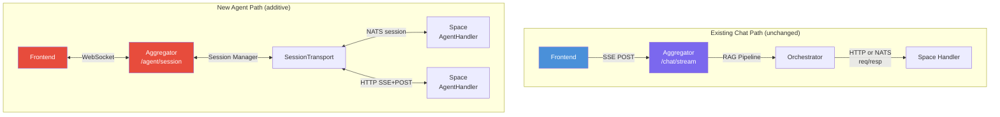

### Full System View

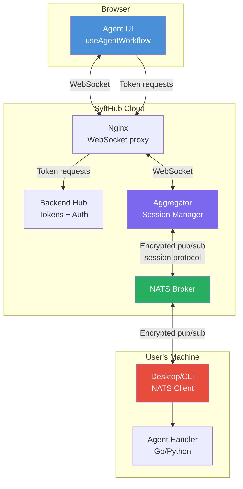

### Why WebSocket (not SSE)?

| Criterion | SSE (current chat) | WebSocket (agent) |
|-----------|--------------------|--------------------|
| Direction | Server → Client only | Bidirectional |
| User input mid-stream | Requires separate POST endpoint | Native — same connection |
| Session identity | Implicit (one SSE per request) | Explicit session_id |
| Reconnection | Reconnect = new request | Reconnect = resume session (v2) |
| Fit for agents | Poor — user can't inject input | Natural |

---

## 4. Session Lifecycle

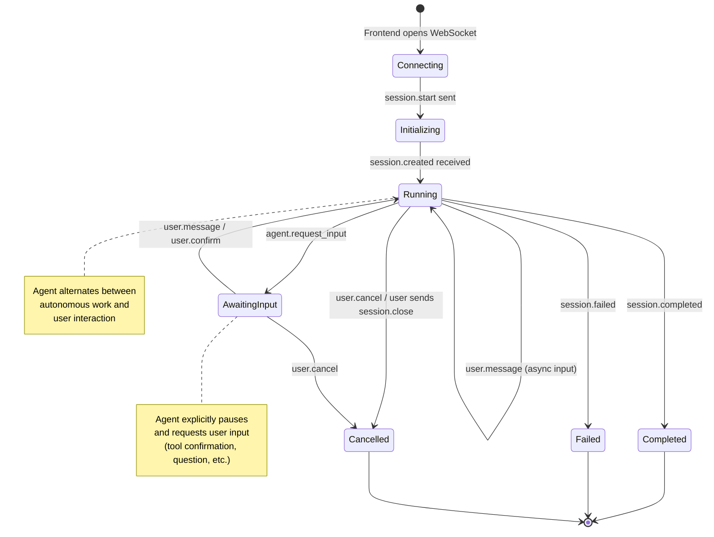

### Session State Transitions

| Current State | Event | Next State | Actor |
|---------------|-------|------------|-------|
| — | WebSocket opened | `connecting` | Frontend |
| `connecting` | `session.start` sent | `initializing` | Frontend |
| `initializing` | `session.created` received | `running` | Aggregator |
| `running` | `agent.request_input` | `awaiting_input` | Agent |
| `awaiting_input` | `user.message` / `user.confirm` | `running` | User |
| `running` | `session.completed` | `completed` | Agent |
| `running` | `session.failed` | `failed` | Agent |
| `running` / `awaiting_input` | `user.cancel` | `cancelled` | User |
| `running` / `awaiting_input` | `session.close` | `closed` | User |
| any | WebSocket disconnect | `disconnected` | Network |
| any | Inactivity timeout | `timed_out` | Aggregator |

---

## 5. Complete Sequence Diagram

### Happy Path: Agent with Tool Confirmation

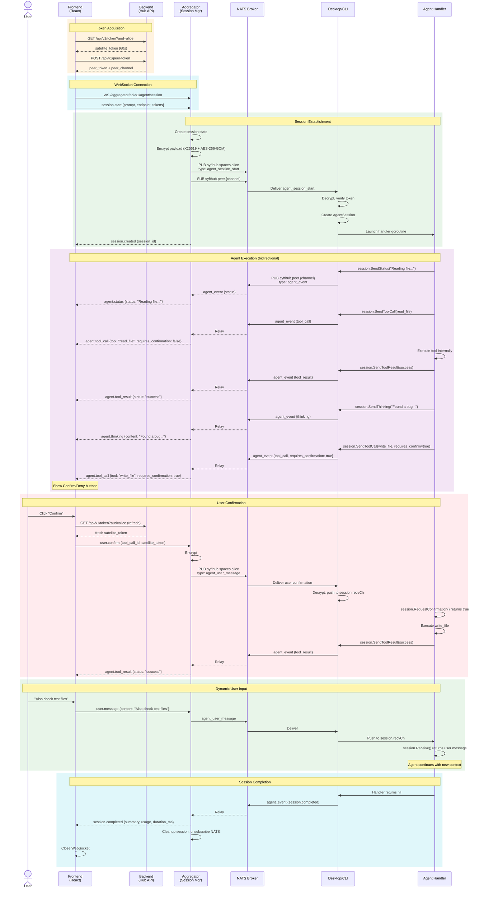

---

## 6. WebSocket Protocol (Frontend ↔ Aggregator)

### Message Envelope

Every WebSocket message is a JSON object with a common envelope:

```json
{
  "type": "<message_type>",
  "session_id": "<uuid>",
  "sequence": 42,
  "timestamp": "2026-03-19T10:30:00.123Z",
  "payload": { }
}
```

- `session_id` is absent in `session.start` (assigned by aggregator)
- `sequence` is monotonically increasing per direction (client sequences and server sequences are independent)
- All payloads are JSON objects

### Client → Server Messages

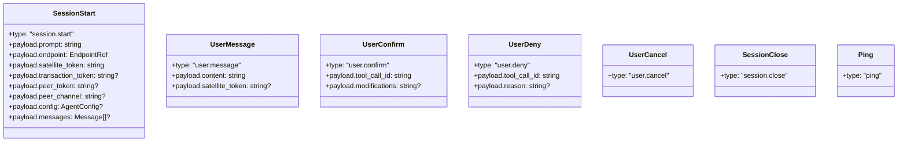

#### `session.start` — Initialize Agent Session

```json
{
  "type": "session.start",
  "sequence": 1,
  "timestamp": "2026-03-19T10:30:00Z",
  "payload": {
    "prompt": "Find and fix the bug in auth.py",
    "endpoint": {
      "owner": "alice",
      "slug": "code-assistant"
    },
    "satellite_token": "eyJ...",
    "transaction_token": "tx_...",
    "peer_token": "peer_...",
    "peer_channel": "a1b2c3d4-...",
    "config": {
      "max_tokens": 4096,
      "temperature": 0.7,
      "system_prompt": "You are a coding assistant.",
      "metadata": { "project": "syfthub" }
    },
    "messages": [
      { "role": "user", "content": "Previous context..." },
      { "role": "assistant", "content": "Previous response..." }
    ]
  }
}
```

#### `user.message` — Send Input Mid-Session

```json
{
  "type": "user.message",
  "session_id": "sess_abc123",
  "sequence": 2,
  "timestamp": "2026-03-19T10:31:15Z",
  "payload": {
    "content": "Also check the test files for similar issues",
    "satellite_token": "eyJ...(fresh token)..."
  }
}
```

#### `user.confirm` / `user.deny` — Respond to Tool Call

```json
{
  "type": "user.confirm",
  "session_id": "sess_abc123",
  "sequence": 3,
  "payload": {
    "tool_call_id": "tc_xyz789"
  }
}
```

```json
{
  "type": "user.deny",
  "session_id": "sess_abc123",
  "sequence": 3,
  "payload": {
    "tool_call_id": "tc_xyz789",
    "reason": "Don't modify that file, it's managed by another team"
  }
}
```

### Server → Client Messages

```mermaid
classDiagram
    class SessionCreated {
        +type: "session.created"
        +payload.session_id: string
        +payload.endpoint: EndpointInfo
    }

    class AgentThinking {
        +type: "agent.thinking"
        +payload.content: string
        +payload.is_streaming: boolean
    }

    class AgentToolCall {
        +type: "agent.tool_call"
        +payload.tool_call_id: string
        +payload.tool_name: string
        +payload.arguments: object
        +payload.requires_confirmation: boolean
        +payload.description: string?
    }

    class AgentToolResult {
        +type: "agent.tool_result"
        +payload.tool_call_id: string
        +payload.status: "success" | "error"
        +payload.result: any?
        +payload.error: string?
        +payload.duration_ms: int
    }

    class AgentMessage {
        +type: "agent.message"
        +payload.content: string
        +payload.is_complete: boolean
    }

    class AgentToken {
        +type: "agent.token"
        +payload.content: string
    }

    class AgentStatus {
        +type: "agent.status"
        +payload.status: string
        +payload.detail: string?
        +payload.progress: Progress?
    }

    class AgentRequestInput {
        +type: "agent.request_input"
        +payload.prompt: string
        +payload.input_type: "text"|"confirmation"|"choice"
        +payload.choices: string[]?
        +payload.default: string?
    }

    class AgentError {
        +type: "agent.error"
        +payload.code: string
        +payload.message: string
        +payload.recoverable: boolean
    }

    class SessionCompleted {
        +type: "session.completed"
        +payload.summary: string?
        +payload.usage: TokenUsage?
        +payload.duration_ms: int
    }

    class SessionFailed {
        +type: "session.failed"
        +payload.code: string
        +payload.message: string
    }
```

#### Event Type Reference

| Event | Direction | Purpose | Phase |
|-------|-----------|---------|-------|
| `session.start` | Client→Server | Initialize session | Setup |
| `session.created` | Server→Client | Session confirmed | Setup |
| `agent.thinking` | Server→Client | Agent reasoning (transparency) | Running |
| `agent.tool_call` | Server→Client | Agent wants to use a tool | Running |
| `agent.tool_result` | Server→Client | Tool execution result | Running |
| `agent.message` | Server→Client | Agent text response | Running |
| `agent.token` | Server→Client | Streamed response chunk | Running |
| `agent.status` | Server→Client | Progress update | Running |
| `agent.request_input` | Server→Client | Agent pauses for input | Running→Awaiting |
| `agent.error` | Server→Client | Error (may be recoverable) | Any |
| `user.message` | Client→Server | User sends input | Running/Awaiting |
| `user.confirm` | Client→Server | Confirm tool call | Awaiting |
| `user.deny` | Client→Server | Deny tool call | Awaiting |
| `user.cancel` | Client→Server | Cancel current run | Running/Awaiting |
| `session.close` | Client→Server | Terminate session | Any |
| `session.completed` | Server→Client | Agent finished | Terminal |
| `session.failed` | Server→Client | Unrecoverable error | Terminal |
| `ping`/`pong` | Both | Keepalive | Any |

---

## 7. NATS Session Protocol (Aggregator ↔ Space)

### Extension of Existing Tunnel Protocol

The agent session protocol extends `syfthub-tunnel/v1` with new message types. Existing types (`endpoint_request`, `endpoint_response`) are unchanged.

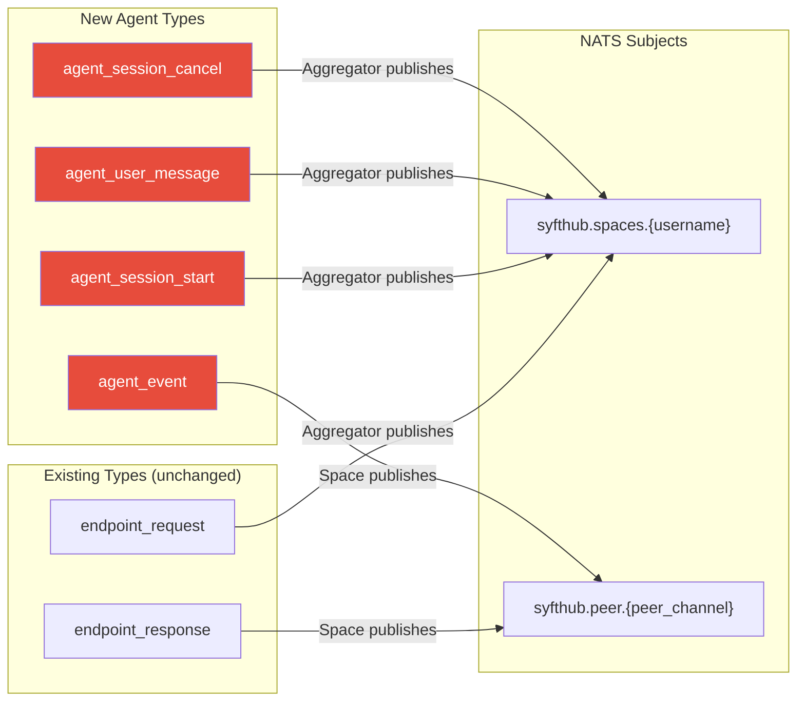

### Aggregator → Space Messages

All published to `syfthub.spaces.{username}`:

#### `agent_session_start`

```json
{
  "protocol": "syfthub-tunnel/v1",
  "type": "agent_session_start",
  "correlation_id": "corr-uuid-1",
  "session_id": "sess-uuid-1",
  "reply_to": "peer-channel-uuid",
  "endpoint": { "slug": "code-assistant", "type": "agent" },
  "satellite_token": "eyJ...",
  "timeout_ms": 0,
  "encryption_info": {
    "algorithm": "X25519-ECDH-AES-256-GCM",
    "ephemeral_public_key": "base64url...",
    "nonce": "base64url..."
  },
  "encrypted_payload": "base64url(encrypted JSON)"
}
```

Decrypted payload:
```json
{
  "prompt": "Find and fix the bug in auth.py",
  "config": {
    "max_tokens": 4096,
    "temperature": 0.7,
    "system_prompt": "You are a coding assistant."
  },
  "messages": [],
  "transaction_token": "tx_..."
}
```

#### `agent_user_message`

```json
{
  "protocol": "syfthub-tunnel/v1",
  "type": "agent_user_message",
  "correlation_id": "corr-uuid-2",
  "session_id": "sess-uuid-1",
  "reply_to": "peer-channel-uuid",
  "satellite_token": "eyJ...(fresh)...",
  "encryption_info": { ... },
  "encrypted_payload": "base64url(encrypted JSON)"
}
```

Decrypted payload:
```json
{
  "message_type": "user_message",
  "content": "Also check test files"
}
```

Or for confirmations:
```json
{
  "message_type": "user_confirm",
  "tool_call_id": "tc_xyz789"
}
```

#### `agent_session_cancel`

```json
{
  "protocol": "syfthub-tunnel/v1",
  "type": "agent_session_cancel",
  "correlation_id": "corr-uuid-3",
  "session_id": "sess-uuid-1",
  "reply_to": "peer-channel-uuid",
  "encryption_info": { ... },
  "encrypted_payload": "base64url(encrypted {})"
}
```

### Space → Aggregator Messages

All published to `syfthub.peer.{peer_channel}`:

#### `agent_event`

```json
{
  "protocol": "syfthub-tunnel/v1",
  "type": "agent_event",
  "correlation_id": "corr-uuid-4",
  "session_id": "sess-uuid-1",
  "endpoint_slug": "code-assistant",
  "encryption_info": { ... },
  "encrypted_payload": "base64url(encrypted JSON)",
  "timing": {
    "received_at": "2026-03-19T10:30:00Z",
    "processed_at": "2026-03-19T10:30:00.050Z",
    "duration_ms": 50
  }
}
```

Decrypted payload (the actual agent event):
```json
{
  "event_type": "tool_call",
  "sequence": 5,
  "data": {
    "tool_call_id": "tc_xyz789",
    "tool_name": "write_file",
    "arguments": { "path": "auth.py", "content": "..." },
    "requires_confirmation": true,
    "description": "Fix authentication bug in auth.py"
  }
}
```

### NATS Subject Reuse

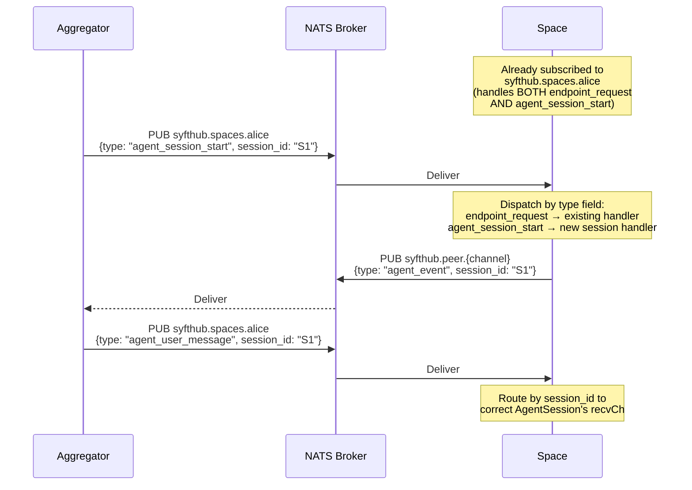

### Encryption Per Message

Each NATS message is independently encrypted — exactly the same as existing tunnel protocol:

- Aggregator generates a **new ephemeral keypair per message**
- Space generates a **new ephemeral keypair per event**
- AAD = `correlation_id` (unique per message, NOT session_id)
- Same HKDF info labels: `syfthub-tunnel-request-v1` / `syfthub-tunnel-response-v1`

This means each message has forward secrecy independent of all other messages.

---

## 8. HTTP Direct Transport (Non-Tunnel Spaces)

For spaces with a public URL (not tunneling), the aggregator uses HTTP:

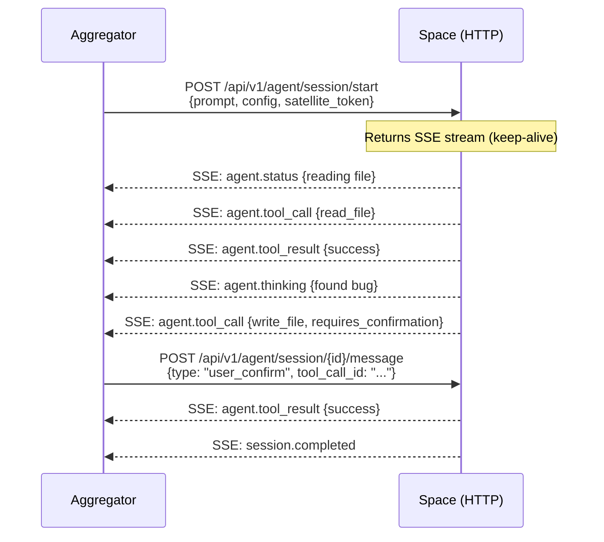

### Space HTTP Endpoints (new)

| Method | Path | Purpose |
|--------|------|---------|
| `POST` | `/api/v1/agent/session/start` | Start session, returns SSE stream |
| `POST` | `/api/v1/agent/session/{id}/message` | Send user message/confirm/deny |
| `POST` | `/api/v1/agent/session/{id}/cancel` | Cancel session |

### Transport Abstraction

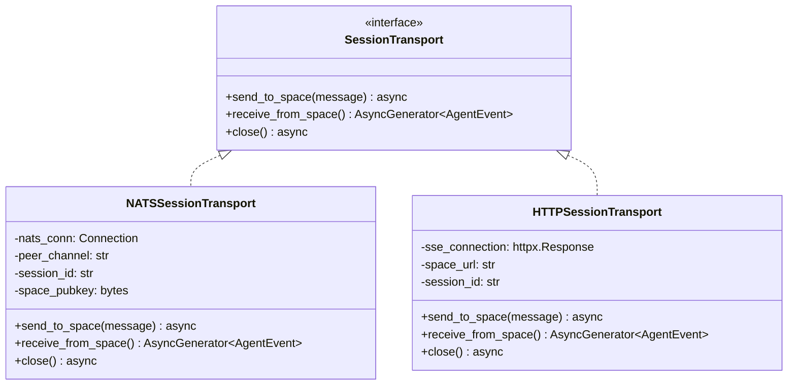

---

## 9. Aggregator Session Manager

### Architecture

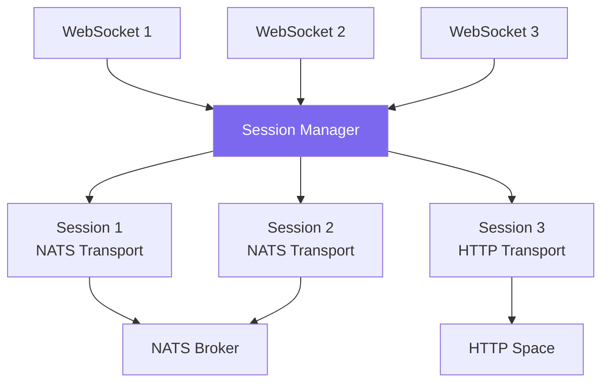

### Session State

```python
@dataclass
class AgentSession:
    session_id: str
    websocket: WebSocket
    transport: SessionTransport
    endpoint_ref: ResolvedEndpoint
    owner_username: str
    state: Literal["initializing", "running", "awaiting_input",
                    "completed", "failed", "cancelled"]
    created_at: datetime
    last_activity: datetime
    sequence_counter: int = 0
    config: dict = field(default_factory=dict)
```

### WebSocket Handler (FastAPI)

```python
@router.websocket("/agent/session")
async def agent_session(websocket: WebSocket):
    await websocket.accept()
    session: AgentSession | None = None

    try:
        # 1. Wait for session.start message
        start_msg = await asyncio.wait_for(
            websocket.receive_json(), timeout=30.0
        )
        validate_session_start(start_msg)

        # 2. Resolve endpoint, create transport
        endpoint = resolve_agent_endpoint(start_msg)
        transport = create_transport(endpoint, start_msg)

        # 3. Create session
        session = AgentSession(
            session_id=str(uuid.uuid4()),
            websocket=websocket,
            transport=transport,
            endpoint_ref=endpoint,
            ...
        )

        # 4. Send session.created to frontend
        await websocket.send_json({
            "type": "session.created",
            "session_id": session.session_id,
            ...
        })

        # 5. Start bidirectional relay
        await asyncio.gather(
            relay_space_to_frontend(session),   # Transport → WebSocket
            relay_frontend_to_space(session),   # WebSocket → Transport
        )

    except WebSocketDisconnect:
        if session:
            await session.transport.send_to_space(cancel_message())
    finally:
        if session:
            await session.transport.close()
```

### Relay Coroutines

```python
async def relay_space_to_frontend(session: AgentSession):
    """Forward agent events from space to frontend WebSocket."""
    async for event in session.transport.receive_from_space():
        session.last_activity = datetime.utcnow()
        session.sequence_counter += 1

        ws_message = {
            "type": event.event_type,      # agent.thinking, agent.tool_call, etc.
            "session_id": session.session_id,
            "sequence": session.sequence_counter,
            "timestamp": datetime.utcnow().isoformat(),
            "payload": event.data,
        }

        # Update session state based on event
        if event.event_type == "agent.request_input":
            session.state = "awaiting_input"
        elif event.event_type == "session.completed":
            session.state = "completed"
        elif event.event_type == "session.failed":
            session.state = "failed"
        else:
            session.state = "running"

        await session.websocket.send_json(ws_message)

        if session.state in ("completed", "failed"):
            break


async def relay_frontend_to_space(session: AgentSession):
    """Forward user messages from frontend WebSocket to space."""
    while session.state not in ("completed", "failed", "cancelled"):
        try:
            msg = await asyncio.wait_for(
                session.websocket.receive_json(),
                timeout=1800.0  # 30-minute inactivity timeout
            )
        except asyncio.TimeoutError:
            session.state = "timed_out"
            await session.transport.send_to_space(cancel_message())
            break

        session.last_activity = datetime.utcnow()

        if msg["type"] == "user.cancel":
            session.state = "cancelled"
            await session.transport.send_to_space(cancel_message())
            break
        elif msg["type"] == "session.close":
            session.state = "cancelled"
            await session.transport.send_to_space(cancel_message())
            break
        elif msg["type"] in ("user.message", "user.confirm", "user.deny"):
            await session.transport.send_to_space(msg)
        elif msg["type"] == "ping":
            await session.websocket.send_json({"type": "pong"})
```

---

## 10. Go SDK Server — Agent Handler Framework

### Handler Interface

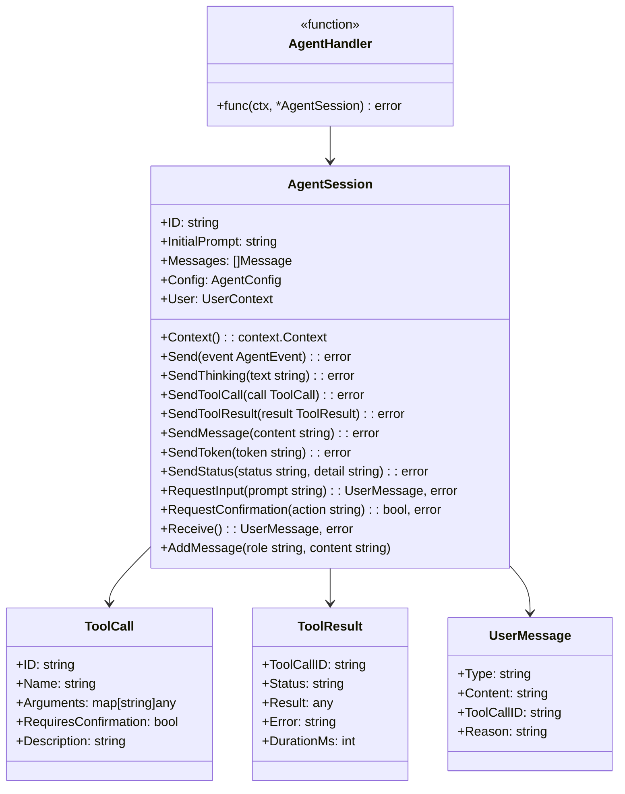

### Registration API

```go
// Endpoint registration (alongside existing DataSource/Model)
api.Agent("code-assistant").
    Name("Code Assistant").
    Description("An AI agent that can read, write, and debug code").
    Version("1.0.0").
    Tools([]syfthubapi.ToolDef{
        {Name: "read_file",    Description: "Read a file",     RequiresConfirmation: false},
        {Name: "write_file",   Description: "Write a file",    RequiresConfirmation: true},
        {Name: "run_command",  Description: "Execute a command", RequiresConfirmation: true},
        {Name: "search_code",  Description: "Search codebase",  RequiresConfirmation: false},
    }).
    Handler(myAgentHandler)
```

### Example Agent Handler

```go
func myAgentHandler(ctx context.Context, session *syfthubapi.AgentSession) error {
    prompt := session.InitialPrompt

    for {
        // 1. Think about the prompt
        session.SendThinking("Analyzing the request: " + prompt)

        // 2. Decide on action
        session.SendStatus("searching", "Looking for relevant files...")

        // 3. Use a tool (no confirmation needed)
        session.SendToolCall(syfthubapi.ToolCall{
            ID:   uuid.New().String(),
            Name: "read_file",
            Arguments: map[string]any{"path": "auth.py"},
            RequiresConfirmation: false,
            Description: "Reading auth.py to understand the code",
        })

        content, err := readFile("auth.py")
        if err != nil {
            return err
        }

        session.SendToolResult(syfthubapi.ToolResult{
            ToolCallID: toolCallID,
            Status:     "success",
            Result:     content,
        })

        // 4. Use a tool that requires confirmation
        confirmed, err := session.RequestConfirmation(
            "I want to modify auth.py to fix the token validation bug",
        )
        if err != nil {
            return err // Session cancelled or disconnected
        }

        if confirmed {
            // Apply fix
            session.SendStatus("writing", "Applying fix to auth.py")
            // ... write file ...
            session.SendMessage("Fixed the bug in auth.py!")
        } else {
            session.SendMessage("OK, I won't modify auth.py.")
        }

        // 5. Check for additional user input
        session.SendMessage("Is there anything else you'd like me to do?")
        msg, err := session.Receive()
        if err != nil {
            return err // Session ended
        }

        if msg.Content == "" || strings.ToLower(msg.Content) == "no" {
            break
        }
        prompt = msg.Content // Continue with new prompt
    }

    return nil // Session completes successfully
}
```

### Internal Session Management (Space Side)

```mermaid
flowchart TD
    NATS_MSG[NATS Message Received] --> TYPE_CHECK{Message type?}

    TYPE_CHECK -->|endpoint_request| EXISTING[Existing handler<br/>(unchanged)]
    TYPE_CHECK -->|agent_session_start| NEW_SESSION
    TYPE_CHECK -->|agent_user_message| ROUTE_SESSION
    TYPE_CHECK -->|agent_session_cancel| CANCEL_SESSION

    NEW_SESSION[Create AgentSession<br/>with channels] --> DECRYPT[Decrypt payload]
    DECRYPT --> VERIFY[Verify satellite token]
    VERIFY --> LOOKUP[Lookup agent endpoint]
    LOOKUP --> SPAWN["go handler(ctx, session)"]
    SPAWN --> RELAY_LOOP["Relay goroutine:<br/>session.sendCh → NATS<br/>(encrypt & publish to peer_channel)"]

    ROUTE_SESSION[Find session by session_id] --> DECRYPT2[Decrypt payload]
    DECRYPT2 --> PUSH["Push to session.recvCh"]

    CANCEL_SESSION[Find session by session_id] --> CTX_CANCEL["Cancel session context<br/>Handler goroutine returns"]

    style NEW_SESSION fill:#E74C3C,color:#fff
    style ROUTE_SESSION fill:#E8A838,color:#fff
    style CANCEL_SESSION fill:#95A5A6,color:#fff
```

---

## 11. Go SDK Client — Agent Resource

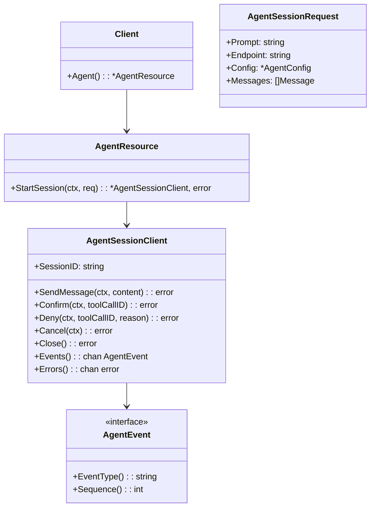

Usage:
```go
client, _ := syfthub.NewClient(syfthub.WithAPIToken("syft_pat_..."))
session, _ := client.Agent().StartSession(ctx, &syfthub.AgentSessionRequest{
    Prompt:   "Fix the auth bug",
    Endpoint: "alice/code-assistant",
})
defer session.Close()

for event := range session.Events() {
    switch e := event.(type) {
    case *syfthub.ToolCallEvent:
        if e.RequiresConfirmation {
            session.Confirm(ctx, e.ToolCallID)
        }
    case *syfthub.TokenEvent:
        fmt.Print(e.Content)
    case *syfthub.RequestInputEvent:
        session.SendMessage(ctx, getUserInput())
    case *syfthub.SessionCompletedEvent:
        fmt.Println("\nDone:", e.Summary)
        return
    }
}
```

---

## 12. TypeScript SDK — Agent Client

```typescript
// In @syfthub/sdk
class AgentResource {
  async startSession(options: AgentSessionOptions): Promise<AgentSessionClient> {
    // 1. Resolve endpoint
    // 2. Fetch tokens (satellite, transaction, peer)
    // 3. Open WebSocket to aggregator
    // 4. Send session.start
    // 5. Wait for session.created
    // 6. Return AgentSessionClient
  }
}

interface AgentSessionClient {
  readonly sessionId: string;
  readonly state: AgentSessionState;

  // Send messages
  sendMessage(content: string): Promise<void>;
  confirm(toolCallId: string): Promise<void>;
  deny(toolCallId: string, reason?: string): Promise<void>;
  cancel(): Promise<void>;
  close(): void;

  // Receive events (async iterable)
  events(): AsyncIterable<AgentEvent>;

  // Event listeners (alternative API)
  on(event: 'thinking', handler: (e: ThinkingEvent) => void): void;
  on(event: 'tool_call', handler: (e: ToolCallEvent) => void): void;
  on(event: 'tool_result', handler: (e: ToolResultEvent) => void): void;
  on(event: 'message', handler: (e: MessageEvent) => void): void;
  on(event: 'token', handler: (e: TokenEvent) => void): void;
  on(event: 'status', handler: (e: StatusEvent) => void): void;
  on(event: 'request_input', handler: (e: RequestInputEvent) => void): void;
  on(event: 'completed', handler: (e: CompletedEvent) => void): void;
  on(event: 'failed', handler: (e: FailedEvent) => void): void;
  on(event: 'error', handler: (e: ErrorEvent) => void): void;
}

// Usage
const client = new SyftHubClient({ apiToken: '...' });
const session = await client.agent.startSession({
  prompt: 'Fix the auth bug',
  endpoint: 'alice/code-assistant',
});

for await (const event of session.events()) {
  if (event.type === 'agent.token') {
    process.stdout.write(event.payload.content);
  } else if (event.type === 'agent.tool_call' && event.payload.requires_confirmation) {
    await session.confirm(event.payload.tool_call_id);
  } else if (event.type === 'agent.request_input') {
    const input = await getUserInput(event.payload.prompt);
    await session.sendMessage(input);
  }
}
```

---

## 13. Frontend — Agent UI

### Component Hierarchy

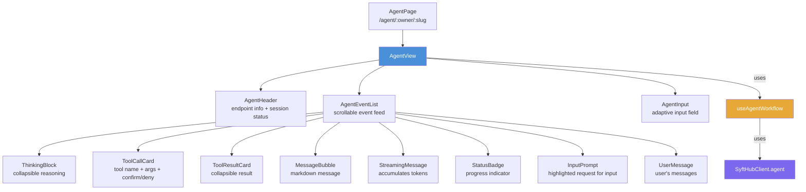

### useAgentWorkflow Hook

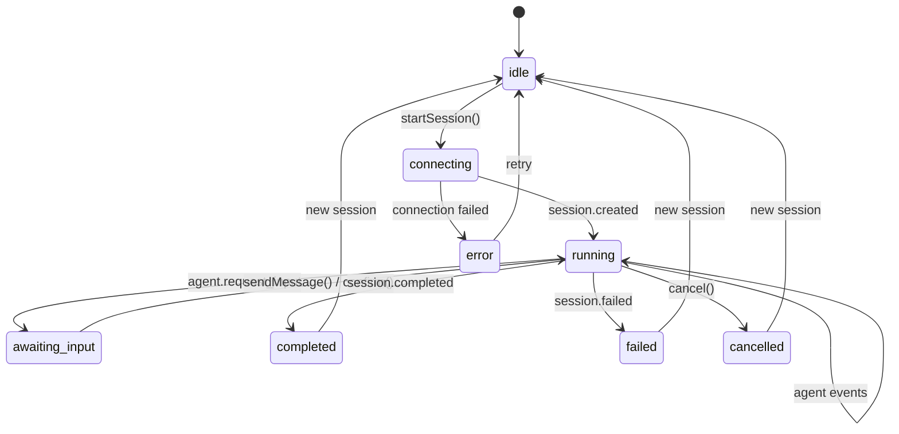

### UI Mockup Flow

```
┌─────────────────────────────────────────────┐
│  Code Assistant (alice/code-assistant)  [●]  │  ← AgentHeader
├─────────────────────────────────────────────┤
│                                             │
│  You: Find and fix the bug in auth.py       │  ← UserMessage
│                                             │
│  ┌─ Thinking ─────────────────────────────┐ │  ← ThinkingBlock
│  │ Analyzing the request. I'll start by   │ │    (collapsible)
│  │ reading auth.py to understand the code.│ │
│  └────────────────────────────────────────┘ │
│                                             │
│  ◎ Reading file...                          │  ← StatusBadge
│                                             │
│  ┌─ Tool: read_file ─────────────────────┐ │  ← ToolCallCard
│  │ path: "auth.py"                        │ │
│  │ ┌─ Result (success) ───────────────┐   │ │  ← ToolResultCard
│  │ │ def validate_token(token):       │   │ │    (collapsible)
│  │ │     ...124 lines...              │   │ │
│  │ └─────────────────────────────────┘   │ │
│  └────────────────────────────────────────┘ │
│                                             │
│  ┌─ Tool: write_file ────────────────────┐ │  ← ToolCallCard
│  │ path: "auth.py"                        │ │    (confirmation)
│  │ Fix authentication bug in auth.py      │ │
│  │                                        │ │
│  │  [✓ Confirm]  [✗ Deny]                │ │  ← Action buttons
│  └────────────────────────────────────────┘ │
│                                             │
├─────────────────────────────────────────────┤
│ ⏳ Waiting for your confirmation...         │  ← AgentInput
│ ┌─────────────────────────────────── [Send]│ │    (shows prompt)
│ └───────────────────────────────────────────│
└─────────────────────────────────────────────┘
```

---

## 14. Authentication & Token Strategy

### Token Lifecycle for Agent Sessions

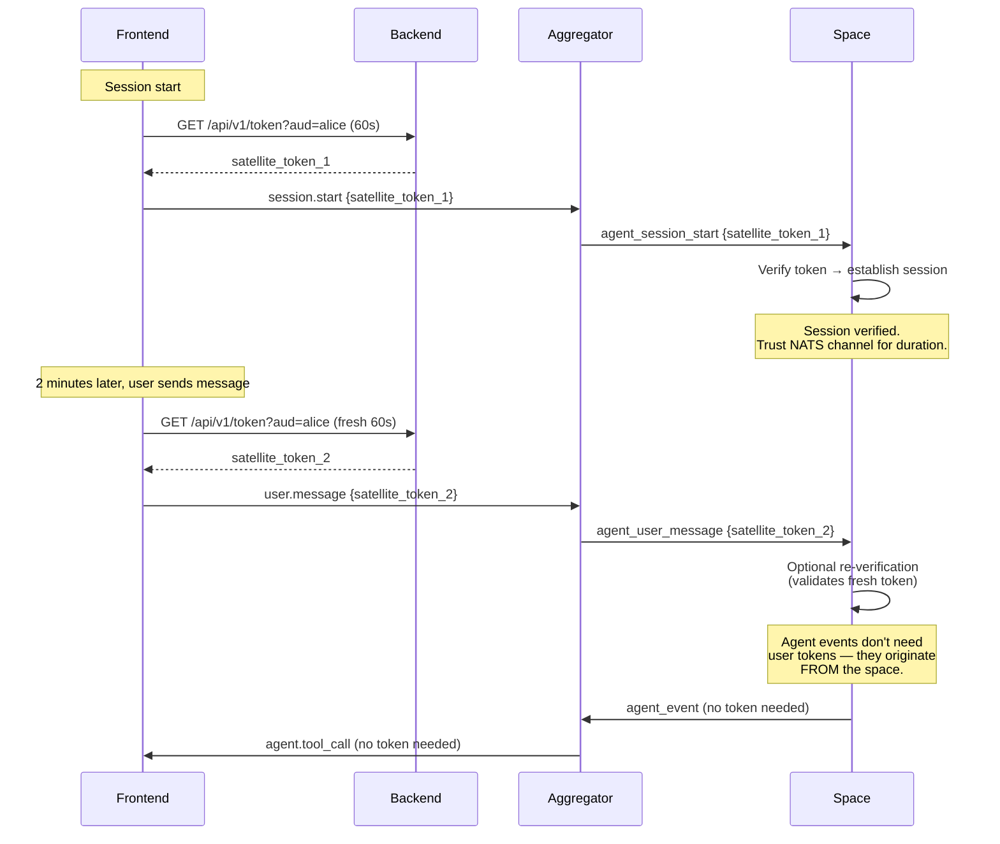

### Token Strategy Summary

| Message Direction | Token Required | When Verified |
|-------------------|----------------|---------------|
| `session.start` (FE→Space) | Satellite token (mandatory) | At session creation |
| `user.message` (FE→Space) | Satellite token (optional, recommended) | If present, re-verified |
| `user.confirm/deny` (FE→Space) | None | Trusted within session |
| `agent_event` (Space→FE) | None | N/A (originates from space) |
| `session.cancel` (FE→Space) | None | Trusted within session |

### Peer Token for Agent Sessions

The peer token (for NATS tunneling) may need a longer TTL for agent sessions:

- Current default: short-lived (minutes)
- Agent sessions: may last 30+ minutes
- Solution: Backend accepts an optional `session_type: "agent"` parameter in `POST /api/v1/peer-token` that issues a longer-lived peer token (e.g., 2 hours)
- Alternative: Frontend refreshes peer token periodically and aggregator handles re-subscription

---

## 15. Comparison: Chat vs Agent Workflow

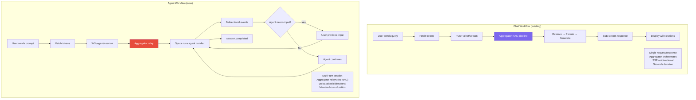

### Feature Comparison

| Feature | Chat (model/data_source) | Agent |
|---------|-------------------------|-------|
| **Transport (FE↔AG)** | SSE (POST) | WebSocket |
| **Transport (AG↔Space)** | NATS req/resp or HTTP | NATS session or HTTP SSE+POST |
| **Direction** | Unidirectional (server→client) | Bidirectional |
| **Aggregator role** | RAG orchestrator | Message relay |
| **Session duration** | Seconds (single request) | Minutes to hours |
| **User input** | Single prompt | Multiple inputs during session |
| **Agent autonomy** | None (dumb model) | Full (tool calls, reasoning) |
| **Tool calls** | N/A | First-class with confirmation |
| **Streaming** | Token events via SSE | Token events via WebSocket |
| **Endpoint type** | `model`, `data_source` | `agent` |
| **Handler signature** | `(query) → response` | `(session) → runs until done` |

---

## 16. Error Handling & Edge Cases

### Connection Failures

```mermaid
flowchart TD
    subgraph "WebSocket Disconnect (Frontend)"
        WS_DC[Browser disconnect] --> AG_DETECT[Aggregator detects<br/>WebSocket close]
        AG_DETECT --> AG_CANCEL["Send agent_session_cancel<br/>to space via NATS"]
        AG_CANCEL --> SP_CANCEL[Space cancels<br/>handler context]
        SP_CANCEL --> CLEANUP[Session cleanup]
    end

    subgraph "Space Goes Offline"
        SP_OFF[Desktop/CLI offline] --> NATS_LOST[NATS messages<br/>undelivered]
        NATS_LOST --> AG_TIMEOUT[Aggregator message<br/>timeout (30s)]
        AG_TIMEOUT --> AG_ERR["Send agent.error to FE<br/>{recoverable: false}"]
        AG_ERR --> FE_ERR[Frontend shows<br/>connection lost]
    end

    subgraph "Agent Handler Crash"
        PANIC[Handler panics] --> RECOVER[Recovery middleware<br/>catches panic]
        RECOVER --> SP_FAIL["Space sends session.failed<br/>via NATS"]
        SP_FAIL --> AG_RELAY[Aggregator relays<br/>session.failed to FE]
        AG_RELAY --> FE_FAIL[Frontend shows<br/>agent error]
    end

    subgraph "Inactivity Timeout"
        NO_ACTIVITY[30min no messages] --> AG_TIMEOUT2[Aggregator timeout]
        AG_TIMEOUT2 --> AG_CANCEL2["Send cancel to space<br/>+ close WebSocket"]
    end

    style WS_DC fill:#E8A838,color:#fff
    style SP_OFF fill:#E74C3C,color:#fff
    style PANIC fill:#E74C3C,color:#fff
    style NO_ACTIVITY fill:#95A5A6,color:#fff
```

### Error Codes (Agent-Specific)

| Code | Meaning | Recoverable |
|------|---------|-------------|
| `SESSION_INIT_FAILED` | Couldn't establish session with space | No |
| `AGENT_NOT_FOUND` | Agent endpoint slug not in registry | No |
| `AGENT_DISABLED` | Agent endpoint exists but disabled | No |
| `HANDLER_CRASHED` | Agent handler panicked/errored | No |
| `HANDLER_TIMEOUT` | Handler exceeded max session duration | No |
| `SPACE_DISCONNECTED` | Space went offline mid-session | No |
| `TOKEN_EXPIRED` | Satellite token expired, refresh failed | Yes (send fresh token) |
| `TOOL_EXECUTION_ERROR` | Tool call failed | Yes (agent can retry) |
| `MESSAGE_TOO_LARGE` | Message exceeds size limit | Yes (send smaller) |
| `SESSION_TIMEOUT` | Inactivity timeout exceeded | No |

### Concurrent User Messages

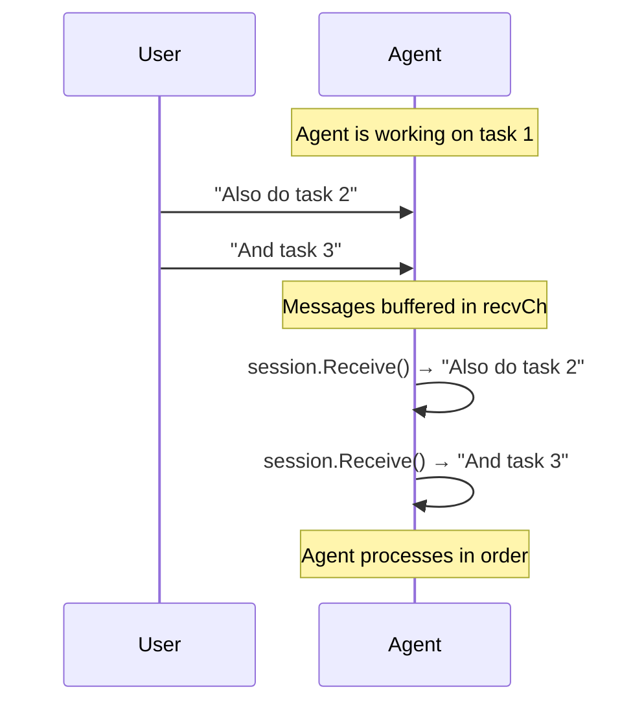

The agent's `recvCh` is a buffered channel. Messages are queued and the agent processes them when ready via `session.Receive()`.

---

## 17. Backward Compatibility Checklist

Every existing component remains unchanged:

| Component | Change Required | Impact on Existing |
|-----------|----------------|-------------------|
| **Backend: Auth endpoints** | None | Zero — satellite/peer tokens work as-is |
| **Backend: Chat endpoints** | None | Zero |
| **Backend: DB models** | Add `agent` to EndpointType enum | Additive enum value |
| **Backend: Endpoint sync** | Accept `type: "agent"` | Already handles unknown types |
| **Aggregator: /chat/stream** | None | Zero |
| **Aggregator: /chat** | None | Zero |
| **Aggregator: Orchestrator** | None | Zero |
| **Aggregator: NATS transport** | Handle new message types | Existing types unchanged |
| **Go SDK (syfthubapi): processor** | Add `agent` case | Existing cases unchanged |
| **Go SDK (syfthubapi): NATS transport** | Handle new message types | Existing handler unchanged |
| **Go SDK (syfthub): Chat resource** | None | Zero |
| **TS SDK: Chat resource** | None | Zero |
| **Frontend: Chat components** | None | Zero |
| **Frontend: Routes** | Add `/agent/:owner/:slug` | Existing routes unchanged |
| **Nginx** | Add WebSocket proxy rule | Existing rules unchanged |
| **NATS subjects** | Reuse existing subjects | No new subjects needed |
| **Encryption** | Same protocol | Same X25519+AES-256-GCM |

---

## 18. Implementation Phases

### Phase 1: Foundation (Core Protocol)

```mermaid
gantt
    title Phase 1 — Foundation
    dateFormat  X
    axisFormat %s

    section Backend
    Add agent to EndpointType enum      :a1, 0, 1
    Accept agent in endpoint sync       :a2, 0, 1

    section Aggregator
    WebSocket endpoint stub             :b1, 0, 2
    Session Manager                     :b2, 1, 3
    NATS Session Transport              :b3, 2, 4

    section Go SDK (syfthubapi)
    AgentSession struct + channels      :c1, 0, 2
    AgentHandler type + registration    :c2, 1, 3
    NATS agent message handling         :c3, 2, 4
    Session goroutine management        :c4, 3, 5

    section Integration
    End-to-end test (WS→NATS→Space)     :d1, 4, 6
```

**Deliverables:**
- Agent endpoint type in database
- Working WebSocket → NATS → Space → Agent handler pipeline
- Basic `AgentSession` with `Send()`, `Receive()`, `RequestConfirmation()`

### Phase 2: Client & UI

**Deliverables:**
- Go SDK client `Agent()` resource with `StartSession()`
- TypeScript SDK `agent.startSession()` with WebSocket client
- Frontend `useAgentWorkflow` hook
- Frontend `AgentView` with event rendering
- Tool confirmation UI (confirm/deny buttons)

### Phase 3: Polish & HTTP Transport

**Deliverables:**
- HTTP direct transport for non-tunneled agent endpoints
- Token refresh during long sessions
- Session timeout/cleanup
- Ping/pong keepalive
- Agent status progress bars
- Thinking block UI (collapsible)

### Phase 4: Advanced Features

**Deliverables:**
- Session persistence and resumption after disconnect
- Session history in backend database
- Agent-side data source access (agent calls other SyftHub endpoints)
- File/image attachments in user messages
- Shared tool registry
- Multi-agent orchestration (agent spawns sub-agents)

---

## Appendix A: Full Message Type Catalog

### Client → Server

| Type | Payload Fields | When Sent |
|------|---------------|-----------|
| `session.start` | `prompt`, `endpoint`, `satellite_token`, `peer_token?`, `peer_channel?`, `transaction_token?`, `config?`, `messages?` | Once, to initialize |
| `user.message` | `content`, `satellite_token?` | Any time during session |
| `user.confirm` | `tool_call_id`, `modifications?` | After `agent.tool_call` with `requires_confirmation` |
| `user.deny` | `tool_call_id`, `reason?` | After `agent.tool_call` with `requires_confirmation` |
| `user.cancel` | — | Any time to stop agent |
| `session.close` | — | To terminate session |
| `ping` | — | Keepalive |

### Server → Client

| Type | Payload Fields | When Sent |
|------|---------------|-----------|
| `session.created` | `session_id`, `endpoint` | After successful initialization |
| `agent.thinking` | `content`, `is_streaming` | Agent reasoning |
| `agent.tool_call` | `tool_call_id`, `tool_name`, `arguments`, `requires_confirmation`, `description?` | Agent wants to use tool |
| `agent.tool_result` | `tool_call_id`, `status`, `result?`, `error?`, `duration_ms` | After tool execution |
| `agent.message` | `content`, `is_complete` | Agent text output |
| `agent.token` | `content` | Streamed response chunk |
| `agent.status` | `status`, `detail?`, `progress?` | Progress update |
| `agent.request_input` | `prompt`, `input_type`, `choices?`, `default?` | Agent pauses for input |
| `agent.error` | `code`, `message`, `recoverable` | Error occurred |
| `session.completed` | `summary?`, `usage?`, `duration_ms` | Agent finished |
| `session.failed` | `code`, `message` | Unrecoverable error |
| `pong` | — | Keepalive response |

## Appendix B: NATS Message Type Catalog

### Aggregator → Space (on `syfthub.spaces.{username}`)

| Type | Purpose | Encryption |
|------|---------|-----------|
| `endpoint_request` | Existing: single query | Per-message ephemeral |
| `agent_session_start` | New: initialize agent session | Per-message ephemeral |
| `agent_user_message` | New: relay user input to agent | Per-message ephemeral |
| `agent_session_cancel` | New: cancel agent session | Per-message ephemeral |

### Space → Aggregator (on `syfthub.peer.{peer_channel}`)

| Type | Purpose | Encryption |
|------|---------|-----------|
| `endpoint_response` | Existing: single response | Per-message ephemeral |
| `agent_event` | New: agent event (wraps all event types) | Per-message ephemeral |

## Appendix C: Configuration Reference

| Component | Setting | Default | Purpose |
|-----------|---------|---------|---------|
| Aggregator | `AGENT_SESSION_TIMEOUT_SECONDS` | 1800 (30min) | Inactivity timeout |
| Aggregator | `AGENT_MAX_SESSIONS` | 100 | Max concurrent sessions |
| Aggregator | `AGENT_MAX_MESSAGE_SIZE_BYTES` | 524288 (512KB) | Max per-message size |
| Space | `AGENT_HANDLER_TIMEOUT_SECONDS` | 3600 (1hr) | Max session duration |
| Space | `AGENT_RECV_BUFFER_SIZE` | 100 | Buffered channel size |
| Backend | `AGENT_PEER_TOKEN_TTL_SECONDS` | 7200 (2hr) | Peer token TTL for agent sessions |

## Appendix D: File Locations (Proposed)

| Component | New Files | Purpose |
|-----------|-----------|---------|
| **Aggregator** | `api/endpoints/agent.py` | WebSocket endpoint |
| | `services/session_manager.py` | Session lifecycle |
| | `services/session_transport.py` | NATS + HTTP transport abstraction |
| | `schemas/agent.py` | Agent message schemas |
| **Go SDK (syfthubapi)** | `agent.go` | AgentSession, AgentHandler |
| | `agent_builder.go` | Agent endpoint builder |
| | `session_manager.go` | Space-side session tracking |
| **Go SDK (syfthub)** | `agent.go` | Agent client resource |
| | `agent_session.go` | AgentSessionClient |
| **TS SDK** | `resources/agent.ts` | Agent client resource |
| | `types/agent.ts` | Agent event types |
| **Frontend** | `pages/agent.tsx` | Agent page |
| | `components/agent/agent-view.tsx` | Main agent UI |
| | `components/agent/agent-event-list.tsx` | Event feed |
| | `components/agent/event-cards/*.tsx` | Per-event-type cards |
| | `hooks/use-agent-workflow.ts` | Agent workflow hook |
| **Backend** | Migration: add `agent` to endpoint type enum | DB schema |
