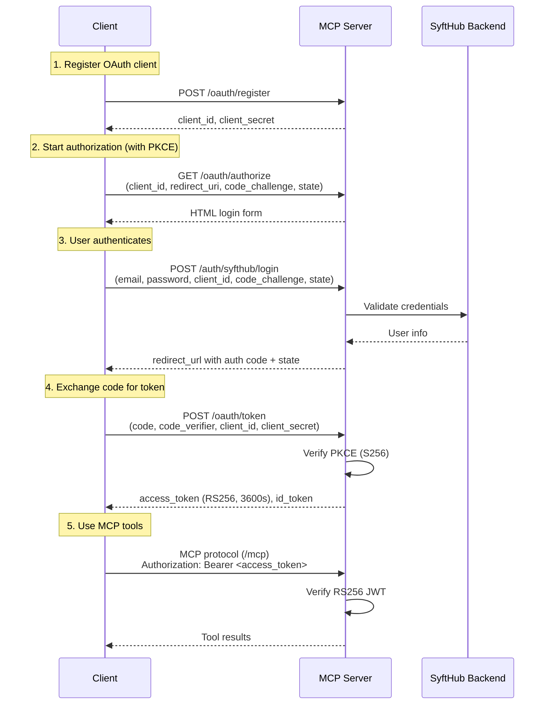

# API Reference: MCP Server

> **Base URL (dev):** `http://localhost:8080/mcp`
> **Base URL (prod):** `https://{domain}/mcp`
> **Authentication:** OAuth 2.1 with PKCE (RS256 Bearer tokens)
> **Content-Type:** `application/json`
> **Last updated:** 2026-03-27
> **Total HTTP endpoints:** 10
> **MCP tools:** 2 (+ 1 prompt)

---

## Authentication

The MCP server implements a full OAuth 2.1 flow with PKCE. Clients obtain an RS256-signed JWT access token through the authorization code grant, then use it as a Bearer token for MCP tool invocations.

### Bearer Token

```http
Authorization: Bearer <mcp-access-token>
```

Obtain via the OAuth 2.1 flow described below. Tokens are RS256-signed JWTs with a `kid` of `mcp-key-1`, an audience of `mcp-server`, and an expiry of 3600 seconds (1 hour).

---

## Error Format

All errors return consistent JSON:

```json
{
  "detail": "Human-readable error message"
}
```

### Common HTTP Status Codes

| Status | Meaning |
|---|---|
| 200 | Success |
| 302 | Redirect (authorization callback) |
| 400 | Bad request / invalid parameters |
| 401 | Missing, expired, or invalid token |
| 403 | Insufficient scope |
| 404 | Resource not found |
| 422 | Unprocessable entity (validation) |
| 500 | Internal server error |
| 503 | Service unavailable (dependencies down) |

---

## Discovery Endpoints

### `GET /.well-known/oauth-protected-resource`

OAuth 2.0 Protected Resource Metadata (RFC 9728). Declares the resource server and its associated authorization server.

**Auth:** None.

**Response `200 OK`:**
```json
{
  "resource": "http://localhost:8080/mcp",
  "authorization_servers": ["http://localhost:8080/mcp"],
  "bearer_methods_supported": ["header"]
}
```

---

### `GET /.well-known/oauth-authorization-server`

OAuth 2.0 Authorization Server Metadata (RFC 8414). Returns all endpoint URLs and supported grant types.

**Auth:** None.

**Response `200 OK`:**
```json
{
  "issuer": "http://localhost:8080/mcp",
  "authorization_endpoint": "http://localhost:8080/mcp/oauth/authorize",
  "token_endpoint": "http://localhost:8080/mcp/oauth/token",
  "registration_endpoint": "http://localhost:8080/mcp/oauth/register",
  "userinfo_endpoint": "http://localhost:8080/mcp/oauth/userinfo",
  "jwks_uri": "http://localhost:8080/mcp/.well-known/jwks.json",
  "response_types_supported": ["code"],
  "grant_types_supported": ["authorization_code"],
  "token_endpoint_auth_methods_supported": ["client_secret_post"],
  "code_challenge_methods_supported": ["S256"],
  "scopes_supported": ["openid", "profile", "email"]
}
```

---

### `GET /.well-known/openid-configuration`

OpenID Connect Discovery 1.0. Returns OIDC-specific metadata including supported claims and subject types.

**Auth:** None.

**Response `200 OK`:**
```json
{
  "issuer": "http://localhost:8080/mcp",
  "authorization_endpoint": "http://localhost:8080/mcp/oauth/authorize",
  "token_endpoint": "http://localhost:8080/mcp/oauth/token",
  "userinfo_endpoint": "http://localhost:8080/mcp/oauth/userinfo",
  "jwks_uri": "http://localhost:8080/mcp/.well-known/jwks.json",
  "response_types_supported": ["code"],
  "grant_types_supported": ["authorization_code"],
  "subject_types_supported": ["public"],
  "id_token_signing_alg_values_supported": ["RS256"],
  "scopes_supported": ["openid", "profile", "email"],
  "claims_supported": ["sub", "email", "name", "email_verified"]
}
```

---

### `GET /.well-known/jwks.json`

JSON Web Key Set containing the RSA public key(s) used to verify access tokens and ID tokens.

**Auth:** None.

**Response `200 OK`:**
```json
{
  "keys": [
    {
      "kty": "RSA",
      "kid": "mcp-key-1",
      "use": "sig",
      "alg": "RS256",
      "n": "<modulus>",
      "e": "AQAB"
    }
  ]
}
```

---

### `GET /health`

Health check endpoint. Returns the server status and dependency connectivity.

**Auth:** None.

**Response `200 OK`:**
```json
{
  "status": "healthy",
  "dependencies": {
    "syfthub_backend": "reachable",
    "aggregator": "reachable"
  }
}
```

---

## OAuth 2.1 Flow Endpoints

### `POST /oauth/register`

Dynamic Client Registration (RFC 7591). Registers a new OAuth client and returns credentials.

**Auth:** None.

**Request Body:**
```json
{
  "client_name": "My MCP Client",
  "redirect_uris": ["http://localhost:3000/callback"],
  "grant_types": ["authorization_code"],
  "scope": "openid profile email"
}
```

| Field | Type | Required | Description |
|---|---|---|---|
| `client_name` | string | Yes | Human-readable client name |
| `redirect_uris` | string[] | Yes | Allowed redirect URIs |
| `grant_types` | string[] | No | Grant types (default: `["authorization_code"]`) |
| `scope` | string | No | Space-separated scopes (default: `"openid profile email"`) |

**Response `200 OK`:**
```json
{
  "client_id": "client_abc123",
  "client_secret": "secret_xyz789",
  "client_name": "My MCP Client",
  "redirect_uris": ["http://localhost:3000/callback"],
  "grant_types": ["authorization_code"],
  "scope": "openid profile email"
}
```

**Errors:**

| Status | Cause |
|---|---|
| 400 | Missing required fields or invalid redirect URI |

---

### `GET /oauth/authorize`

Authorization endpoint. Returns an HTML login form for user authentication. This is the entry point for the OAuth authorization code flow with PKCE.

**Auth:** None.

**Query Parameters:**

| Parameter | Type | Required | Description |
|---|---|---|---|
| `response_type` | string | Yes | Must be `code` |
| `client_id` | string | Yes | Registered client ID |
| `redirect_uri` | string | Yes | Must match a registered redirect URI |
| `scope` | string | No | Space-separated scopes |
| `state` | string | Yes | Opaque CSRF protection value |
| `code_challenge` | string | Yes | PKCE code challenge (base64url-encoded SHA-256 hash) |
| `code_challenge_method` | string | Yes | Must be `S256` |

**Response `200 OK`:**

Returns an HTML page containing a login form. The form submits credentials to `POST /auth/syfthub/login`.

**Errors:**

| Status | Cause |
|---|---|
| 400 | Missing or invalid parameters, unregistered client_id |

---

### `POST /auth/syfthub/login`

User authentication endpoint. Validates SyftHub credentials against the backend, generates an authorization code, and returns a redirect URL with the code and state.

**Auth:** None.

**Request Body:**
```json
{
  "email": "user@example.com",
  "password": "secret",
  "client_id": "client_abc123",
  "redirect_uri": "http://localhost:3000/callback",
  "scope": "openid profile email",
  "state": "random_csrf_state",
  "code_challenge": "E9Melhoa2OwvFrEMTJguCHaoeK1t8URWbuGJSstw-cM",
  "code_challenge_method": "S256"
}
```

| Field | Type | Required | Description |
|---|---|---|---|
| `email` | string | Yes | User's SyftHub email |
| `password` | string | Yes | User's SyftHub password |
| `client_id` | string | Yes | Registered client ID |
| `redirect_uri` | string | Yes | Must match a registered redirect URI |
| `scope` | string | No | Space-separated scopes |
| `state` | string | Yes | Must match the state from `/oauth/authorize` |
| `code_challenge` | string | Yes | PKCE code challenge |
| `code_challenge_method` | string | Yes | Must be `S256` |

**Response `200 OK`:**
```json
{
  "redirect_url": "http://localhost:3000/callback?code=auth_code_abc123&state=random_csrf_state"
}
```

The authorization code expires in **10 minutes**.

**Errors:**

| Status | Cause |
|---|---|
| 400 | Invalid client_id or redirect_uri |
| 401 | Invalid email or password |

---

### `POST /oauth/token`

Token endpoint. Exchanges an authorization code (with PKCE verification) for an access token and optional ID token.

**Auth:** None.

**Request Body (`application/x-www-form-urlencoded`):**

| Field | Type | Required | Description |
|---|---|---|---|
| `grant_type` | string | Yes | Must be `authorization_code` |
| `code` | string | Yes | Authorization code from the redirect |
| `redirect_uri` | string | Yes | Must match the original redirect URI |
| `client_id` | string | Yes | Registered client ID |
| `client_secret` | string | Yes | Client secret from registration |
| `code_verifier` | string | Yes | PKCE code verifier (plain text, before SHA-256) |

**Response `200 OK`:**
```json
{
  "access_token": "eyJhbGciOiJSUzI1NiIsInR5cCI6IkpXVCIsImtpZCI6Im1jcC1rZXktMSJ9...",
  "token_type": "Bearer",
  "expires_in": 3600,
  "scope": "openid profile email",
  "id_token": "eyJhbGciOiJSUzI1NiIsInR5cCI6IkpXVCIsImtpZCI6Im1jcC1rZXktMSJ9..."
}
```

The access token is an RS256-signed JWT with the following claims:

| Claim | Value |
|---|---|
| `iss` | Configured `OAUTH_ISSUER` |
| `sub` | User's SyftHub user ID |
| `aud` | `mcp-server` |
| `exp` | Current time + 3600 seconds |
| `kid` (header) | `mcp-key-1` |

The `id_token` is included when the `openid` scope was requested. It contains `sub`, `email`, `name`, and `email_verified` claims.

**Errors:**

| Status | Cause |
|---|---|
| 400 | Invalid grant_type, expired/invalid code, PKCE verification failure, invalid client credentials |

---

### `GET /oauth/userinfo`

Returns information about the authenticated user.

**Auth:** Bearer token (RS256 access token).

```http
Authorization: Bearer <access_token>
```

**Response `200 OK`:**
```json
{
  "sub": "user_123",
  "email": "user@example.com",
  "name": "Jane Doe",
  "email_verified": true
}
```

**Errors:**

| Status | Cause |
|---|---|
| 401 | Missing or invalid Bearer token |

---

## MCP Protocol Endpoint

### `POST /mcp` (and SSE/Streamable HTTP)

The MCP protocol endpoint, served by FastMCP. Clients connect using the MCP protocol (JSON-RPC over SSE or Streamable HTTP) to invoke tools and prompts.

**Auth:** Bearer token (RS256 access token).

**Transport:** SSE (Server-Sent Events) or Streamable HTTP, as negotiated by the MCP client.

---

## MCP Tools

### `discover_syfthub_endpoints`

Discover all available endpoints registered in SyftHub. Returns a formatted list of models and data sources with their metadata.

**Parameters:** None.

**Auth:** Bearer token (RS256 access token).

**Behavior:** Read-only, idempotent. Queries the SyftHub backend for all public endpoints.

**Response:**
```json
{
  "success": true,
  "formatted_output": "# Available SyftHub Endpoints\n\n## Models\n- owner/model-slug: Description...\n\n## Data Sources\n- owner/source-slug: Description...",
  "models": [
    {
      "owner": "alice",
      "slug": "gpt-4-proxy",
      "description": "GPT-4 proxy endpoint"
    }
  ],
  "data_sources": [
    {
      "owner": "bob",
      "slug": "company-docs",
      "description": "Company documentation index"
    }
  ],
  "total_endpoints": 2,
  "timestamp": "2026-03-27T12:00:00Z"
}
```

---

### `chat_with_syfthub`

Execute a RAG (Retrieval-Augmented Generation) query using SyftHub endpoints. Sends a prompt to a specified model, optionally augmented with context retrieved from data source endpoints.

**Parameters:**

| Parameter | Type | Required | Description |
|---|---|---|---|
| `prompt` | string | Yes | The user's query (1-4000 characters) |
| `model` | string | Yes | Model endpoint in `owner/slug` format (1-200 characters) |
| `data_sources` | string[] | No | Data source endpoints in `owner/slug` format (0-10 items) |

**Auth:** Bearer token (RS256 access token).

**Request Example (MCP tool call):**
```json
{
  "prompt": "What is the refund policy?",
  "model": "alice/gpt-4-proxy",
  "data_sources": ["bob/company-docs", "carol/support-kb"]
}
```

**Response:**
```json
{
  "success": true,
  "response": "Based on the documentation, the refund policy states...",
  "sources": [
    {
      "endpoint": "bob/company-docs",
      "chunks": ["Refund policy section..."]
    }
  ],
  "metadata": {
    "model_latency_ms": 1200,
    "retrieval_latency_ms": 340
  },
  "prompt": "What is the refund policy?",
  "model": "alice/gpt-4-proxy",
  "data_sources_used": ["bob/company-docs", "carol/support-kb"],
  "user": "user_123",
  "timestamp": "2026-03-27T12:00:00Z"
}
```

**Errors (returned in tool result):**

| Error | Cause |
|---|---|
| `"success": false` | Model endpoint unreachable, invalid endpoint slug, aggregator error |

---

## MCP Prompt

### `ask`

An autonomous RAG workflow prompt. When invoked, it returns a prompt template that guides the LLM through the full discovery-to-query pipeline: discover available endpoints, select an appropriate model and data sources, execute the query, and return the response.

**Parameter:**

| Parameter | Type | Required | Description |
|---|---|---|---|
| `query` | string | Yes | The user's natural language question |

**Behavior:** Returns a prompt template (not a direct response). The LLM client uses this template to orchestrate calls to `discover_syfthub_endpoints` and `chat_with_syfthub` automatically.

---

## OAuth 2.1 Flow Diagram



---

## Security

| Mechanism | Detail |
|---|---|
| **Token signing** | RS256 (asymmetric). Public key available at `/.well-known/jwks.json` |
| **Key ID** | `mcp-key-1` |
| **PKCE** | Required. Only `S256` method supported |
| **Auth code expiry** | 10 minutes |
| **Access token expiry** | 3600 seconds (1 hour) |
| **State parameter** | Required for CSRF protection |
| **Token audience** | `mcp-server` |

---

## Configuration

Environment variables for the MCP server:

| Variable | Default | Description |
|---|---|---|
| `MCP_PORT` | `8002` | Port the MCP server listens on |
| `OAUTH_ISSUER` | `http://localhost:8080/mcp` | JWT issuer claim and metadata base URL |
| `OAUTH_AUDIENCE` | `mcp-server` | JWT audience claim |
| `API_BASE_URL` | `http://localhost:8080/mcp` | Public-facing base URL for OAuth endpoints |
| `SYFTHUB_URL` | `http://backend:8000` | Internal SyftHub backend URL (for credential validation) |
| `SYFTHUB_PUBLIC_URL` | `http://localhost:8080` | Public SyftHub URL (returned in endpoint metadata) |
| `AGGREGATOR_URL` | `http://localhost:8001` | Aggregator service URL (for RAG queries) |
| `RSA_PRIVATE_KEY` | -- | Base64-encoded RSA private key PEM (required for token signing) |
