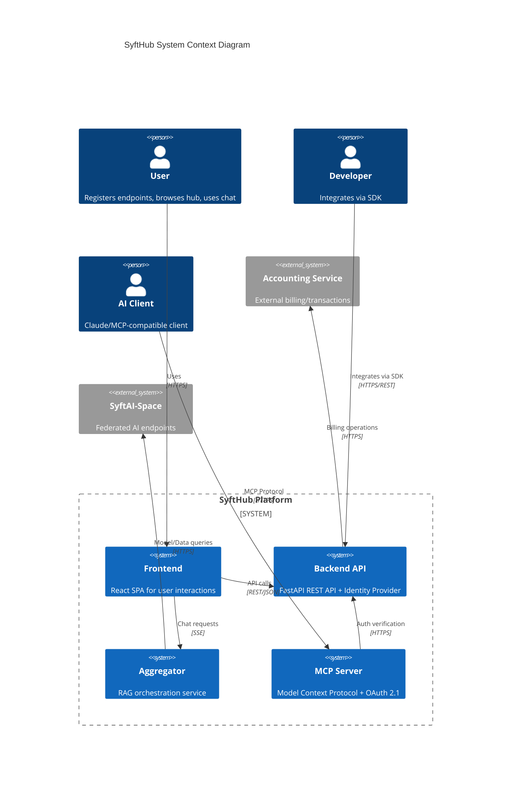
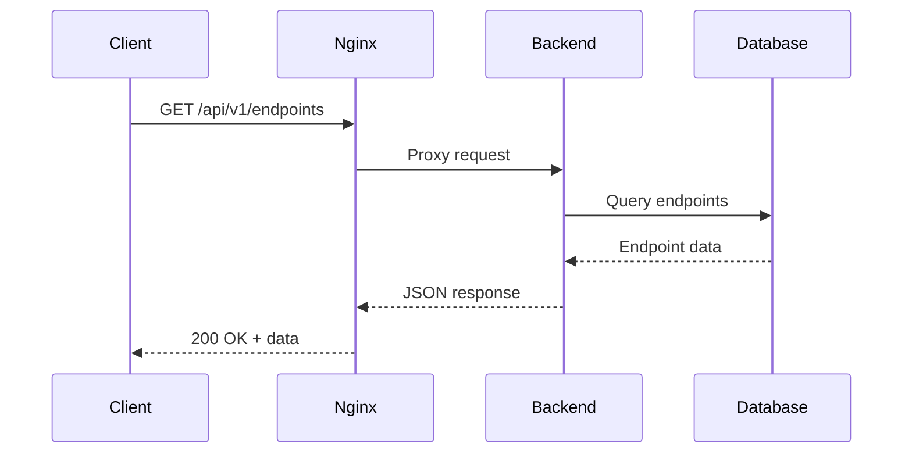
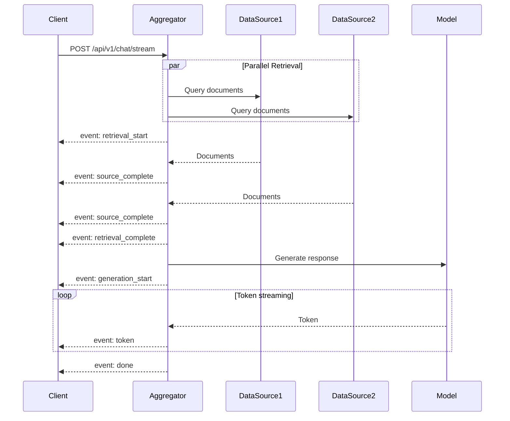
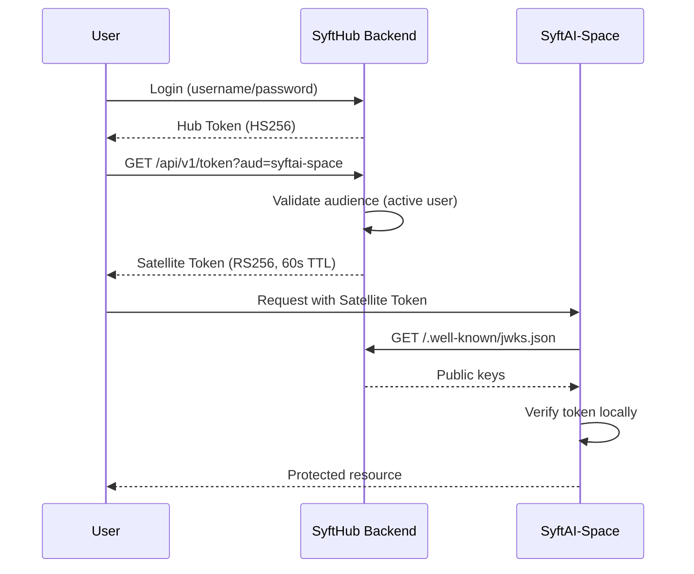

# SyftHub System Architecture

> A comprehensive guide to the system design and architecture of SyftHub - the GitHub for AI Endpoints.

## Table of Contents

- [Overview](#overview)
- [High-Level Architecture](#high-level-architecture)
- [Component Diagram](#component-diagram)
- [Service Responsibilities](#service-responsibilities)
- [Communication Patterns](#communication-patterns)
- [Data Flow](#data-flow)
- [Technology Stack](#technology-stack)
- [Design Principles](#design-principles)
- [Scalability Considerations](#scalability-considerations)

---

## Overview

SyftHub is a **federated AI endpoint registry** that enables users and organizations to:

1. **Register** AI endpoints (models and data sources)
2. **Discover** publicly available AI services
3. **Authenticate** across federated services using satellite tokens
4. **Query** data sources and models through a unified RAG interface
5. **Manage** organizations and collaborate on endpoints

The system follows a **microservices architecture** with clear separation of concerns between the API backend, aggregator service, MCP server, and frontend application.

---

## High-Level Architecture

```
┌─────────────────────────────────────────────────────────────────────────────────┐
│                                   CLIENTS                                        │
├─────────────────────────────────────────────────────────────────────────────────┤
│                                                                                  │
│   ┌──────────────┐    ┌──────────────┐    ┌──────────────┐    ┌──────────────┐ │
│   │   Browser    │    │  Python SDK  │    │    TS SDK    │    │  MCP Client  │ │
│   │  (React UI)  │    │              │    │              │    │   (Claude)   │ │
│   └──────┬───────┘    └──────┬───────┘    └──────┬───────┘    └──────┬───────┘ │
│          │                   │                   │                   │          │
└──────────┼───────────────────┼───────────────────┼───────────────────┼──────────┘
           │                   │                   │                   │
           ▼                   ▼                   ▼                   ▼
┌─────────────────────────────────────────────────────────────────────────────────┐
│                              NGINX REVERSE PROXY                                 │
│                              (Port 8080 / 80/443)                                │
│  ┌────────────────────────────────────────────────────────────────────────────┐ │
│  │  /api/*  → Backend    /mcp/* → MCP    /* → Frontend    /aggregator → Agg  │ │
│  └────────────────────────────────────────────────────────────────────────────┘ │
└─────────────────────────────────────────────────────────────────────────────────┘
           │                   │                   │                   │
           ▼                   ▼                   ▼                   ▼
┌─────────────────────────────────────────────────────────────────────────────────┐
│                              CORE SERVICES                                       │
├─────────────────────────────────────────────────────────────────────────────────┤
│                                                                                  │
│  ┌─────────────────┐  ┌─────────────────┐  ┌─────────────────┐  ┌────────────┐ │
│  │                 │  │                 │  │                 │  │            │ │
│  │  Backend API    │  │   Aggregator    │  │   MCP Server    │  │  Frontend  │ │
│  │   (FastAPI)     │  │   (RAG/Chat)    │  │  (OAuth 2.1)    │  │  (React)   │ │
│  │                 │  │                 │  │                 │  │            │ │
│  │  Port: 8000     │  │  Port: 8001     │  │  Port: 8002     │  │ Port: 3000 │ │
│  │                 │  │                 │  │                 │  │            │ │
│  └────────┬────────┘  └────────┬────────┘  └────────┬────────┘  └────────────┘ │
│           │                    │                    │                           │
└───────────┼────────────────────┼────────────────────┼───────────────────────────┘
            │                    │                    │
            ▼                    ▼                    ▼
┌─────────────────────────────────────────────────────────────────────────────────┐
│                              DATA LAYER                                          │
├─────────────────────────────────────────────────────────────────────────────────┤
│                                                                                  │
│      ┌─────────────────┐              ┌─────────────────┐                       │
│      │                 │              │                 │                       │
│      │   PostgreSQL    │              │      Redis      │                       │
│      │   (Primary DB)  │              │   (Cache/Sessions)                      │
│      │                 │              │                 │                       │
│      │   Port: 5432    │              │   Port: 6379    │                       │
│      │                 │              │                 │                       │
│      └─────────────────┘              └─────────────────┘                       │
│                                                                                  │
└─────────────────────────────────────────────────────────────────────────────────┘
            │
            ▼
┌─────────────────────────────────────────────────────────────────────────────────┐
│                           EXTERNAL SERVICES                                      │
├─────────────────────────────────────────────────────────────────────────────────┤
│                                                                                  │
│      ┌─────────────────┐              ┌─────────────────┐                       │
│      │   Accounting    │              │  SyftAI-Space   │                       │
│      │    Service      │              │   Endpoints     │                       │
│      │  (Billing API)  │              │ (Models/Data)   │                       │
│      └─────────────────┘              └─────────────────┘                       │
│                                                                                  │
└─────────────────────────────────────────────────────────────────────────────────┘
```

---

## Component Diagram



---

## Service Responsibilities

### 1. Backend API (FastAPI)

**Primary Role:** Core business logic, authentication, and data management

| Responsibility | Description |
|----------------|-------------|
| **User Management** | Registration, authentication, profile management |
| **Endpoint Registry** | CRUD operations for AI endpoints |
| **Organization Management** | Team workspaces with role-based access |
| **Identity Provider (IdP)** | Satellite token issuance and verification |
| **Accounting Proxy** | Integration with external billing service |
| **Content Delivery** | GitHub-style endpoint URLs and proxy invocation |

**Key Characteristics:**
- Stateful (database-backed)
- JWT-based authentication (HS256 for hub, RS256 for satellites)
- RESTful API design
- Correlation ID tracking for observability

### 2. Aggregator Service

**Primary Role:** Stateless RAG orchestration for chat functionality

| Responsibility | Description |
|----------------|-------------|
| **Retrieval** | Parallel querying of multiple data sources |
| **Prompt Building** | RAG prompt construction with context injection |
| **Generation** | Model endpoint invocation |
| **Streaming** | Server-Sent Events for real-time responses |

**Key Characteristics:**
- Completely stateless (all context passed per-request)
- Parallel async operations
- Token-based auth forwarding
- Configurable timeouts

### 3. MCP Server (FastMCP)

**Primary Role:** AI client integration via Model Context Protocol

| Responsibility | Description |
|----------------|-------------|
| **OAuth 2.1 Authorization** | PKCE-based authorization server |
| **Tool Exposure** | MCP tools for endpoint discovery and chat |
| **Session Management** | SyftHub credential storage |
| **JWT Issuance** | RS256 tokens for MCP clients |

**Key Characteristics:**
- OAuth 2.1 + PKCE compliant
- Dynamic client registration
- JWKS endpoint for verification
- Single-worker limitation (in-memory storage)

### 4. Frontend (React)

**Primary Role:** User interface for all platform interactions

| Responsibility | Description |
|----------------|-------------|
| **Authentication UI** | Login, registration, session management |
| **Endpoint Management** | Create, edit, browse endpoints |
| **Chat Interface** | Real-time streaming chat with RAG |
| **Organization UI** | Team and member management |

**Key Characteristics:**
- React 19 with TypeScript
- Context-based state management
- Lazy-loaded routes
- Error boundary with backend reporting

---

## Communication Patterns

### Synchronous Communication (REST)



### Streaming Communication (SSE)



### Token-Based Federation



---

## Data Flow

### Read Path (Endpoint Discovery)

```
┌─────────┐     ┌─────────┐     ┌─────────┐     ┌────────────┐
│ Browser │────▶│  Nginx  │────▶│ Backend │────▶│ PostgreSQL │
└─────────┘     └─────────┘     └─────────┘     └────────────┘
                                     │
                                     ▼
                              ┌─────────────┐
                              │ JSON Response│
                              │ (Endpoints) │
                              └─────────────┘
```

### Write Path (Endpoint Creation)

```
┌─────────┐     ┌─────────┐     ┌─────────┐     ┌────────────┐
│ Browser │────▶│  Nginx  │────▶│ Backend │────▶│ PostgreSQL │
└─────────┘     └─────────┘     └─────────┘     └────────────┘
     │                               │
     │                               ▼
     │                        ┌─────────────┐
     │                        │  Validation │
     │                        │  - Slug     │
     │                        │  - Perms    │
     │                        └─────────────┘
     │                               │
     ▼                               ▼
┌─────────────┐              ┌─────────────┐
│   Success   │◀─────────────│   Created   │
│   Response  │              │   Endpoint  │
└─────────────┘              └─────────────┘
```

### Chat/RAG Path

```
┌─────────┐     ┌────────────┐     ┌─────────────┐     ┌──────────────┐
│ Browser │────▶│ Aggregator │────▶│ Data Sources│────▶│   Documents  │
└─────────┘     └────────────┘     └─────────────┘     └──────────────┘
                     │                                        │
                     │◀───────────────────────────────────────┘
                     │
                     ▼
              ┌─────────────┐     ┌─────────────┐
              │   Prompt    │────▶│    Model    │
              │   Builder   │     │   Endpoint  │
              └─────────────┘     └─────────────┘
                                        │
                                        ▼
                                 ┌─────────────┐
                                 │  Streaming  │
                                 │   Response  │
                                 └─────────────┘
```

---

## Technology Stack

### Backend Services

| Layer | Technology | Purpose |
|-------|------------|---------|
| **Runtime** | Python 3.10+ | Primary language |
| **Framework** | FastAPI 0.121+ | REST API framework |
| **ORM** | SQLAlchemy 2.0 | Database abstraction |
| **Validation** | Pydantic 2.x | Request/response models |
| **Auth** | PyJWT + Cryptography | Token handling |
| **HTTP Client** | httpx | Async HTTP requests |
| **Logging** | structlog | Structured logging |

### Frontend

| Layer | Technology | Purpose |
|-------|------------|---------|
| **Framework** | React 19 | UI framework |
| **Language** | TypeScript 5.9 | Type safety |
| **Build** | Vite 7.2 | Build tooling |
| **Styling** | Tailwind CSS 4.x | Utility-first CSS |
| **Components** | Radix UI | Accessible primitives |
| **Routing** | React Router 7 | Client-side routing |
| **Animation** | Framer Motion | UI animations |

### Infrastructure

| Component | Technology | Purpose |
|-----------|------------|---------|
| **Database** | PostgreSQL 16 | Primary data store |
| **Cache** | Redis 7 | Sessions, caching |
| **Proxy** | Nginx | Reverse proxy, TLS |
| **Containers** | Docker | Deployment |
| **CI/CD** | GitHub Actions | Automation |

---

## Design Principles

### 1. Separation of Concerns

Each service has a single, well-defined responsibility:
- **Backend**: Business logic and data management
- **Aggregator**: RAG orchestration only
- **MCP**: AI client integration only
- **Frontend**: User interface only

### 2. Stateless Where Possible

The Aggregator is completely stateless:
- All context passed per-request
- No database connection
- Enables horizontal scaling
- Simplifies deployment

### 3. Token-Based Federation

Services authenticate via short-lived, audience-bound tokens:
- Hub tokens for internal operations
- Satellite tokens for federated services
- JWKS for distributed verification
- No shared sessions

### 4. Defense in Depth

Multiple security layers:
- Input validation (Pydantic)
- Authentication (JWT)
- Authorization (RBAC + visibility)
- Rate limiting (external)
- Audit logging

### 5. Observability First

Built-in observability:
- Correlation IDs across all services
- Structured logging (JSON)
- Error persistence
- Performance metrics

---

## Scalability Considerations

### Horizontal Scaling

| Component | Scalability | Considerations |
|-----------|-------------|----------------|
| **Backend** | ✅ Stateless API | Shared database, token blacklist needs Redis |
| **Aggregator** | ✅ Fully stateless | Scale independently based on load |
| **MCP** | ⚠️ Limited | In-memory OAuth state; needs Redis for multi-worker |
| **Frontend** | ✅ Static assets | CDN-friendly |

### Database Scaling

```
                    ┌─────────────────┐
                    │   Read Replica  │
                    │   (Analytics)   │
                    └────────▲────────┘
                             │
┌─────────────┐     ┌────────┴────────┐     ┌─────────────┐
│   Backend   │────▶│    Primary      │────▶│   Backup    │
│   Writes    │     │   PostgreSQL    │     │  (Standby)  │
└─────────────┘     └─────────────────┘     └─────────────┘
```

### Caching Strategy

```
┌─────────────┐     ┌─────────────┐     ┌─────────────┐
│   Request   │────▶│    Redis    │────▶│  PostgreSQL │
└─────────────┘     │   (Cache)   │     │  (Source)   │
                    └─────────────┘     └─────────────┘
                          │
                          ▼
                    ┌─────────────┐
                    │  Cached:    │
                    │  - Sessions │
                    │  - JWKS     │
                    │  - Blacklist│
                    └─────────────┘
```

### Load Balancing

```
                         ┌─────────────┐
                         │    Load     │
                         │  Balancer   │
                         └──────┬──────┘
                                │
           ┌────────────────────┼────────────────────┐
           │                    │                    │
           ▼                    ▼                    ▼
    ┌─────────────┐     ┌─────────────┐     ┌─────────────┐
    │  Backend 1  │     │  Backend 2  │     │  Backend N  │
    └─────────────┘     └─────────────┘     └─────────────┘
```

---

## Related Documentation

- [02-data-models.md](./02-data-models.md) - Database schema and relationships
- [03-api-reference.md](./03-api-reference.md) - Complete API documentation
- [04-authentication-security.md](./04-authentication-security.md) - Security architecture
- [05-workflows-sequences.md](./05-workflows-sequences.md) - Detailed workflows
- [10-deployment-operations.md](./10-deployment-operations.md) - Deployment guide
