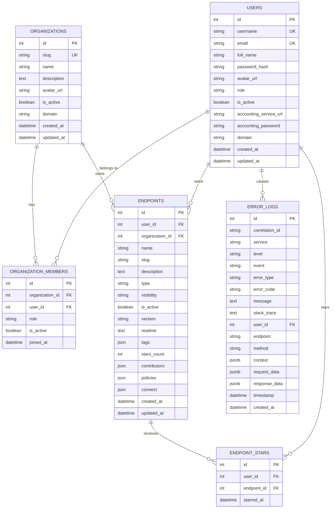

# SyftHub Data Models & Relationships

> A comprehensive guide to the database schema, entity relationships, and data structures in SyftHub.

## Table of Contents

- [Overview](#overview)
- [Entity Relationship Diagram](#entity-relationship-diagram)
- [Core Entities](#core-entities)
- [Relationship Details](#relationship-details)
- [Data Types & Constraints](#data-types--constraints)
- [Indexes & Performance](#indexes--performance)
- [Pydantic Schemas](#pydantic-schemas)
- [JSON/JSONB Fields](#jsonjsonb-fields)
- [Enumerations](#enumerations)

---

## Overview

SyftHub uses **SQLAlchemy 2.0+** with declarative mapping for ORM and **Pydantic** for API validation. The database supports both **PostgreSQL** (production) and **SQLite** (development/testing).

### Key Design Decisions

1. **XOR Ownership**: Endpoints must have exactly one owner (user OR organization, never both)
2. **Soft Deletes**: Endpoints use `is_active` flag instead of hard deletes
3. **Audit Timestamps**: All entities track `created_at` and `updated_at`
4. **JSON Storage**: Flexible fields like `policies` and `connect` use JSON/JSONB
5. **Unique Slugs**: Slugs are unique per owner for GitHub-style URLs

---

## Entity Relationship Diagram



---

## Core Entities

### 1. Users

The `users` table stores all user accounts with authentication and profile information.

```python
class UserModel(BaseModel, TimestampMixin):
    __tablename__ = "users"

    # Identity
    username: Mapped[str] = mapped_column(String(50), unique=True, index=True)
    email: Mapped[str] = mapped_column(String(255), unique=True, index=True)
    full_name: Mapped[str] = mapped_column(String(100))
    password_hash: Mapped[str] = mapped_column(String(255))

    # Profile
    avatar_url: Mapped[Optional[str]] = mapped_column(String(500))
    role: Mapped[str] = mapped_column(String(20), default="user", index=True)
    is_active: Mapped[bool] = mapped_column(Boolean, default=True, index=True)

    # External Integration
    accounting_service_url: Mapped[Optional[str]] = mapped_column(String(500))
    accounting_password: Mapped[Optional[str]] = mapped_column(String(255))

    # Domain Configuration
    domain: Mapped[Optional[str]] = mapped_column(String(253))

    # Relationships
    endpoints: Mapped[List["EndpointModel"]] = relationship(back_populates="user", cascade="all, delete-orphan")
    organization_memberships: Mapped[List["OrganizationMemberModel"]] = relationship(back_populates="user", cascade="all, delete-orphan")
```

| Field | Type | Constraints | Description |
|-------|------|-------------|-------------|
| `id` | Integer | PK, Auto-increment | Unique identifier |
| `username` | String(50) | Unique, Indexed | Login username |
| `email` | String(255) | Unique, Indexed | Email address |
| `full_name` | String(100) | Required | Display name |
| `password_hash` | String(255) | Required | Argon2 hashed password |
| `avatar_url` | String(500) | Nullable | Profile picture URL |
| `role` | String(20) | Default: "user" | admin/user/guest |
| `is_active` | Boolean | Default: true | Account status |
| `accounting_service_url` | String(500) | Nullable | External billing service |
| `accounting_password` | String(255) | Nullable | Encrypted accounting password |
| `domain` | String(253) | Nullable | Custom domain for endpoints |

---

### 2. Organizations

The `organizations` table represents team workspaces for collaborative endpoint management.

```python
class OrganizationModel(BaseModel, TimestampMixin):
    __tablename__ = "organizations"

    # Identity
    name: Mapped[str] = mapped_column(String(100))
    slug: Mapped[str] = mapped_column(String(63), unique=True, index=True)
    description: Mapped[str] = mapped_column(Text, default="")

    # Branding
    avatar_url: Mapped[Optional[str]] = mapped_column(String(255))

    # Status
    is_active: Mapped[bool] = mapped_column(Boolean, default=True, index=True)

    # Domain Configuration
    domain: Mapped[Optional[str]] = mapped_column(String(253))

    # Relationships
    members: Mapped[List["OrganizationMemberModel"]] = relationship(back_populates="organization", cascade="all, delete-orphan")
    endpoints: Mapped[List["EndpointModel"]] = relationship(back_populates="organization", cascade="all, delete-orphan")
```

| Field | Type | Constraints | Description |
|-------|------|-------------|-------------|
| `id` | Integer | PK, Auto-increment | Unique identifier |
| `name` | String(100) | Required | Display name |
| `slug` | String(63) | Unique, Indexed | URL-safe identifier |
| `description` | Text | Default: "" | Organization description |
| `avatar_url` | String(255) | Nullable | Organization logo |
| `is_active` | Boolean | Default: true | Organization status |
| `domain` | String(253) | Nullable | Custom domain for endpoints |

**Reserved Slugs:**
- System: `api`, `auth`, `docs`, `redoc`, `openapi.json`, `health`, `admin`, `www`, `mail`, `ftp`, `blog`
- Account: `dashboard`, `settings`, `profile`, `account`, `accounts`, `user`, `users`
- Organization: `org`, `orgs`, `organization`, `organizations`

---

### 3. Organization Members

The `organization_members` table is a join table linking users to organizations with role assignments.

```python
class OrganizationMemberModel(BaseModel):
    __tablename__ = "organization_members"

    # Foreign Keys
    organization_id: Mapped[int] = mapped_column(ForeignKey("organizations.id", ondelete="CASCADE"), index=True)
    user_id: Mapped[int] = mapped_column(ForeignKey("users.id", ondelete="CASCADE"), index=True)

    # Membership Details
    role: Mapped[str] = mapped_column(String(20), default="member", index=True)
    is_active: Mapped[bool] = mapped_column(Boolean, default=True, index=True)
    joined_at: Mapped[datetime] = mapped_column(DateTime(timezone=True), default=func.now())

    # Relationships
    organization: Mapped["OrganizationModel"] = relationship(back_populates="members")
    user: Mapped["UserModel"] = relationship(back_populates="organization_memberships")

    # Constraints
    __table_args__ = (
        UniqueConstraint("organization_id", "user_id", name="idx_org_members_unique"),
    )
```

| Field | Type | Constraints | Description |
|-------|------|-------------|-------------|
| `id` | Integer | PK, Auto-increment | Unique identifier |
| `organization_id` | Integer | FK, Cascade Delete | Reference to organization |
| `user_id` | Integer | FK, Cascade Delete | Reference to user |
| `role` | String(20) | Default: "member" | owner/admin/member |
| `is_active` | Boolean | Default: true | Membership status |
| `joined_at` | DateTime(tz) | Auto-set | When user joined |

**Unique Constraint:** `(organization_id, user_id)` - prevents duplicate memberships

---

### 4. Endpoints

The `endpoints` table is the core registry storing all AI endpoints (models and data sources).

```python
class EndpointModel(BaseModel, TimestampMixin):
    __tablename__ = "endpoints"

    # Ownership (XOR constraint - exactly one must be set)
    user_id: Mapped[Optional[int]] = mapped_column(ForeignKey("users.id"), index=True)
    organization_id: Mapped[Optional[int]] = mapped_column(ForeignKey("organizations.id"), index=True)

    # Identity
    name: Mapped[str] = mapped_column(String(100))
    slug: Mapped[str] = mapped_column(String(63), index=True)
    description: Mapped[str] = mapped_column(Text, default="")

    # Classification
    type: Mapped[str] = mapped_column(String(20))  # model, data_source
    visibility: Mapped[str] = mapped_column(String(20), default="public")  # public, private, internal

    # Status
    is_active: Mapped[bool] = mapped_column(Boolean, default=True, index=True)
    version: Mapped[str] = mapped_column(String(20), default="0.1.0")

    # Content
    readme: Mapped[str] = mapped_column(Text, default="")

    # Metadata (JSON)
    tags: Mapped[List[str]] = mapped_column(JSON, default=list)
    stars_count: Mapped[int] = mapped_column(Integer, default=0, index=True)
    contributors: Mapped[List[int]] = mapped_column(JSON, default=list)
    policies: Mapped[List[dict]] = mapped_column(JSON, default=list)
    connect: Mapped[List[dict]] = mapped_column(JSON, default=list)

    # Relationships
    user: Mapped[Optional["UserModel"]] = relationship(back_populates="endpoints")
    organization: Mapped[Optional["OrganizationModel"]] = relationship(back_populates="endpoints")

    # Constraints
    __table_args__ = (
        CheckConstraint(
            "(user_id IS NULL) != (organization_id IS NULL)",
            name="endpoint_owner_xor"
        ),
        UniqueConstraint("user_id", "slug", name="idx_endpoints_user_slug"),
        UniqueConstraint("organization_id", "slug", name="idx_endpoints_org_slug"),
    )
```

| Field | Type | Constraints | Description |
|-------|------|-------------|-------------|
| `id` | Integer | PK, Auto-increment | Unique identifier |
| `user_id` | Integer | FK, Nullable | Owner user (XOR with org) |
| `organization_id` | Integer | FK, Nullable | Owner organization (XOR with user) |
| `name` | String(100) | Required | Display name |
| `slug` | String(63) | Indexed | URL-safe identifier |
| `description` | Text | Default: "" | Brief description |
| `type` | String(20) | Required | model / data_source |
| `visibility` | String(20) | Default: "public" | public / private / internal |
| `is_active` | Boolean | Default: true | Endpoint status |
| `version` | String(20) | Default: "0.1.0" | Semantic version |
| `readme` | Text | Default: "" | Markdown documentation |
| `tags` | JSON | Default: [] | Categorization tags (max 10) |
| `stars_count` | Integer | Default: 0 | Number of stars |
| `contributors` | JSON | Default: [] | User IDs of contributors |
| `policies` | JSON | Default: [] | Policy configurations |
| `connect` | JSON | Default: [] | Connection configurations |

**Check Constraint:** `endpoint_owner_xor` ensures exactly one of `user_id` or `organization_id` is set.

---

### 5. Endpoint Stars

The `endpoint_stars` table tracks which users have starred which endpoints.

```python
class EndpointStarModel(BaseModel):
    __tablename__ = "endpoint_stars"

    # Foreign Keys
    user_id: Mapped[int] = mapped_column(ForeignKey("users.id", ondelete="CASCADE"), index=True)
    endpoint_id: Mapped[int] = mapped_column(ForeignKey("endpoints.id", ondelete="CASCADE"), index=True)

    # Metadata
    starred_at: Mapped[datetime] = mapped_column(DateTime(timezone=True), default=func.now())

    # Constraints
    __table_args__ = (
        UniqueConstraint("user_id", "endpoint_id", name="idx_endpoint_stars_unique"),
    )
```

| Field | Type | Constraints | Description |
|-------|------|-------------|-------------|
| `id` | Integer | PK, Auto-increment | Unique identifier |
| `user_id` | Integer | FK, Cascade Delete | User who starred |
| `endpoint_id` | Integer | FK, Cascade Delete | Endpoint being starred |
| `starred_at` | DateTime(tz) | Auto-set | When starred |

**Unique Constraint:** `(user_id, endpoint_id)` - prevents duplicate stars

---

### 6. Error Logs

The `error_logs` table stores error events for observability and debugging.

```python
class ErrorLogModel(Base):
    __tablename__ = "error_logs"

    id: Mapped[int] = mapped_column(Integer, primary_key=True)
    correlation_id: Mapped[str] = mapped_column(String(36), index=True)

    # Service Info
    service: Mapped[str] = mapped_column(String(50), index=True)
    level: Mapped[str] = mapped_column(String(20))
    event: Mapped[str] = mapped_column(String(100), index=True)

    # Error Details
    error_type: Mapped[Optional[str]] = mapped_column(String(100))
    error_code: Mapped[Optional[str]] = mapped_column(String(50))
    message: Mapped[Optional[str]] = mapped_column(Text)
    stack_trace: Mapped[Optional[str]] = mapped_column(Text)

    # Context
    user_id: Mapped[Optional[int]] = mapped_column(ForeignKey("users.id", ondelete="SET NULL"))
    endpoint: Mapped[Optional[str]] = mapped_column(String(255))
    method: Mapped[Optional[str]] = mapped_column(String(10))

    # JSON Context (JSONB for PostgreSQL)
    context: Mapped[Optional[dict]] = mapped_column(JSONB)  # Falls back to JSON for SQLite
    request_data: Mapped[Optional[dict]] = mapped_column(JSONB)
    response_data: Mapped[Optional[dict]] = mapped_column(JSONB)

    # Timestamps
    timestamp: Mapped[datetime] = mapped_column(DateTime(timezone=True))
    created_at: Mapped[datetime] = mapped_column(DateTime(timezone=True), default=func.now())
```

| Field | Type | Constraints | Description |
|-------|------|-------------|-------------|
| `id` | Integer | PK | Unique identifier |
| `correlation_id` | String(36) | Indexed | Request trace ID |
| `service` | String(50) | Indexed | Service name |
| `level` | String(20) | - | ERROR, WARNING, etc. |
| `event` | String(100) | Indexed | Event type identifier |
| `error_type` | String(100) | Nullable | Exception class name |
| `error_code` | String(50) | Nullable | Domain error code |
| `message` | Text | Nullable | Error message |
| `stack_trace` | Text | Nullable | Full stack trace |
| `user_id` | Integer | FK, Set Null | Associated user |
| `endpoint` | String(255) | Nullable | API endpoint path |
| `method` | String(10) | Nullable | HTTP method |
| `context` | JSONB | Nullable | Additional context |
| `request_data` | JSONB | Nullable | Request payload |
| `response_data` | JSONB | Nullable | Response payload |

---

## Relationship Details

### Relationship Cardinality

```
┌─────────────────────────────────────────────────────────────────┐
│                      RELATIONSHIP MAP                            │
├─────────────────────────────────────────────────────────────────┤
│                                                                  │
│   Users ─────────┬───────── 1:N ────────── Endpoints             │
│                  │                         (user-owned)          │
│                  │                                               │
│                  ├───────── 1:N ────────── OrganizationMembers   │
│                  │                                               │
│                  ├───────── 1:N ────────── EndpointStars         │
│                  │                                               │
│                  └───────── 1:N ────────── ErrorLogs             │
│                             (SET NULL)                           │
│                                                                  │
│   Organizations ─┬───────── 1:N ────────── Endpoints             │
│                  │                         (org-owned)           │
│                  │                                               │
│                  └───────── 1:N ────────── OrganizationMembers   │
│                                                                  │
│   Endpoints ─────────────── 1:N ────────── EndpointStars         │
│                                                                  │
└─────────────────────────────────────────────────────────────────┘
```

### Cascade Behaviors

| Relationship | On Delete | Behavior |
|--------------|-----------|----------|
| User → Endpoints | CASCADE | Deleting user deletes their endpoints |
| User → OrganizationMembers | CASCADE | Deleting user removes all memberships |
| User → EndpointStars | CASCADE | Deleting user removes their stars |
| User → ErrorLogs | SET NULL | Logs preserved, user_id nullified |
| Organization → Endpoints | CASCADE | Deleting org deletes its endpoints |
| Organization → OrganizationMembers | CASCADE | Deleting org removes all memberships |
| Endpoint → EndpointStars | CASCADE | Deleting endpoint removes all stars |

---

## Data Types & Constraints

### String Length Constraints

| Field | Max Length | Pattern/Format |
|-------|------------|----------------|
| `username` | 50 | `^[a-zA-Z0-9_-]+$` (alphanumeric + _ -) |
| `email` | 255 | RFC 5322 compliant |
| `full_name` | 100 | Free text |
| `slug` | 63 | `^[a-z0-9]([a-z0-9-]*[a-z0-9])?$` |
| `role` | 20 | Enum: owner/admin/member/user/guest |
| `type` | 20 | Enum: model/data_source |
| `visibility` | 20 | Enum: public/private/internal |
| `version` | 20 | Semantic: `\d+\.\d+\.\d+` |
| `domain` | 253 | DNS label compliant |
| `tag` (each) | 30 | `^[a-z0-9-]+$` (lowercase, no consecutive hyphens) |

### Validation Rules

```python
# Username validation
def validate_username(username: str) -> str:
    pattern = r"^[a-zA-Z0-9_-]+$"
    if not re.match(pattern, username):
        raise ValueError("Invalid characters")
    if len(username) < 3 or len(username) > 50:
        raise ValueError("Length must be 3-50")
    return username.lower()

# Slug validation
def validate_slug(slug: str) -> str:
    pattern = r"^[a-z0-9]([a-z0-9-]*[a-z0-9])?$"
    if not re.match(pattern, slug):
        raise ValueError("Invalid slug format")
    if len(slug) < 3 or len(slug) > 63:
        raise ValueError("Length must be 3-63")
    return slug

# Tag validation
def validate_tags(tags: List[str]) -> List[str]:
    if len(tags) > 10:
        raise ValueError("Maximum 10 tags")
    validated = []
    for tag in tags:
        if not re.match(r"^[a-z0-9-]+$", tag):
            raise ValueError(f"Invalid tag: {tag}")
        if "--" in tag:
            raise ValueError("No consecutive hyphens")
        validated.append(tag.lower())
    return list(dict.fromkeys(validated))  # Deduplicate
```

---

## Indexes & Performance

### Index Strategy

| Table | Index Name | Columns | Purpose |
|-------|------------|---------|---------|
| users | `idx_users_username` | username | Login lookup |
| users | `idx_users_email` | email | Email lookup |
| users | `idx_users_role` | role | Role filtering |
| users | `idx_users_is_active` | is_active | Active user filtering |
| organizations | `idx_organizations_slug` | slug | URL routing |
| organizations | `idx_organizations_is_active` | is_active | Active filtering |
| organization_members | `idx_org_members_org_id` | organization_id | Get org members |
| organization_members | `idx_org_members_user_id` | user_id | Get user's orgs |
| organization_members | `idx_org_members_unique` | (org_id, user_id) | Uniqueness + lookup |
| endpoints | `idx_endpoints_user_id` | user_id | User's endpoints |
| endpoints | `idx_endpoints_organization_id` | organization_id | Org's endpoints |
| endpoints | `idx_endpoints_slug` | slug | Slug search |
| endpoints | `idx_endpoints_user_slug` | (user_id, slug) | Unique user endpoint |
| endpoints | `idx_endpoints_org_slug` | (org_id, slug) | Unique org endpoint |
| endpoints | `idx_endpoints_type` | type | Type filtering |
| endpoints | `idx_endpoints_visibility` | visibility | Visibility filtering |
| endpoints | `idx_endpoints_stars_count` | stars_count | Trending sort |
| endpoint_stars | `idx_endpoint_stars_unique` | (user_id, endpoint_id) | Uniqueness |
| error_logs | `idx_error_logs_correlation_id` | correlation_id | Request tracing |
| error_logs | `idx_error_logs_timestamp` | timestamp DESC | Recent errors |

### Query Optimization Tips

```sql
-- Efficient: Uses idx_endpoints_user_slug composite index
SELECT * FROM endpoints WHERE user_id = ? AND slug = ?;

-- Efficient: Uses idx_endpoints_visibility, then filters
SELECT * FROM endpoints WHERE visibility = 'public' ORDER BY stars_count DESC LIMIT 10;

-- Efficient: Uses idx_org_members_unique for membership check
SELECT 1 FROM organization_members WHERE organization_id = ? AND user_id = ? AND is_active = true;

-- Less efficient: Full table scan for LIKE prefix
SELECT * FROM users WHERE username LIKE '%search%';

-- Better: Use trigram index or full-text search for partial matching
```

---

## Pydantic Schemas

### User Schemas

```python
class UserBase(BaseModel):
    username: str = Field(..., min_length=3, max_length=50)
    email: EmailStr
    full_name: str = Field(..., min_length=1, max_length=100)

class UserCreate(UserBase):
    password: str = Field(..., min_length=8)
    accounting_service_url: Optional[str] = None
    accounting_password: Optional[str] = None

class UserResponse(UserBase):
    id: int
    avatar_url: Optional[str]
    role: UserRole
    is_active: bool
    domain: Optional[str]
    accounting_service_url: Optional[str]  # Never expose password
    created_at: datetime
    updated_at: datetime

    class Config:
        from_attributes = True
```

### Endpoint Schemas

```python
class EndpointBase(BaseModel):
    name: str = Field(..., min_length=1, max_length=100)
    description: str = Field(default="", max_length=500)
    type: EndpointType
    visibility: Visibility = Visibility.PUBLIC
    version: str = Field(default="0.1.0", pattern=r"^\d+\.\d+\.\d+$")
    readme: str = Field(default="", max_length=50000)
    tags: List[str] = Field(default_factory=list, max_length=10)
    policies: List[Policy] = Field(default_factory=list)
    connect: List[Connection] = Field(default_factory=list)

class EndpointCreate(EndpointBase):
    slug: Optional[str] = Field(None, min_length=3, max_length=63)
    contributors: List[int] = Field(default_factory=list)

class EndpointResponse(EndpointBase):
    id: int
    user_id: Optional[int]
    organization_id: Optional[int]
    slug: str
    is_active: bool
    stars_count: int
    created_at: datetime
    updated_at: datetime

class EndpointPublicResponse(BaseModel):
    """Limited fields for public API responses"""
    name: str
    slug: str
    description: str
    type: EndpointType
    version: str
    readme: str
    tags: List[str]
    owner_username: str
    contributors_count: int  # Not individual IDs
    stars_count: int
    policies: List[Policy]
    connect: List[Connection]
    created_at: datetime
    updated_at: datetime
```

---

## JSON/JSONB Fields

### Tags Structure

```json
["machine-learning", "nlp", "transformer", "gpt"]
```

**Constraints:**
- Maximum 10 tags
- Each tag: 1-30 characters
- Lowercase alphanumeric + hyphens
- No consecutive hyphens
- Automatically deduplicated

### Contributors Structure

```json
[1, 5, 23, 42]
```

**Contents:** Array of user IDs who contributed to the endpoint.

### Policies Structure

```json
[
  {
    "type": "rate-limit",
    "version": "1.0",
    "enabled": true,
    "description": "Rate limiting policy",
    "config": {
      "requests_per_minute": 60,
      "burst": 10
    }
  },
  {
    "type": "access-control",
    "version": "1.0",
    "enabled": true,
    "description": "IP allowlist",
    "config": {
      "allowed_ips": ["10.0.0.0/8"]
    }
  }
]
```

### Connect Structure

```json
[
  {
    "type": "rest_api",
    "enabled": true,
    "description": "Primary REST endpoint",
    "config": {
      "path": "/api/v1/inference",
      "method": "POST",
      "timeout": 30
    }
  },
  {
    "type": "websocket",
    "enabled": false,
    "description": "WebSocket streaming",
    "config": {
      "path": "/ws/stream"
    }
  }
]
```

**Connection Types:**
- `rest_api` → Protocol: `https://`
- `websocket` / `ws` → Protocol: `wss://`
- `grpc` → Protocol: `grpcs://`

---

## Enumerations

### UserRole

```python
class UserRole(str, Enum):
    ADMIN = "admin"     # Full system access
    USER = "user"       # Standard user (default)
    GUEST = "guest"     # Limited access
```

### OrganizationRole

```python
class OrganizationRole(str, Enum):
    OWNER = "owner"     # Full control, can delete org
    ADMIN = "admin"     # Manage members and settings
    MEMBER = "member"   # Basic resource access
```

### EndpointType

```python
class EndpointType(str, Enum):
    MODEL = "model"             # AI/ML model endpoint
    DATA_SOURCE = "data_source" # Data retrieval endpoint
```

### Visibility

```python
class Visibility(str, Enum):
    PUBLIC = "public"       # Visible to everyone
    PRIVATE = "private"     # Visible to owner only
    INTERNAL = "internal"   # Visible to authenticated users
```

---

## Related Documentation

- [01-system-architecture.md](./01-system-architecture.md) - System overview
- [03-api-reference.md](./03-api-reference.md) - API endpoints
- [05-workflows-sequences.md](./05-workflows-sequences.md) - Data workflows
- [06-services-business-logic.md](./06-services-business-logic.md) - Business logic
