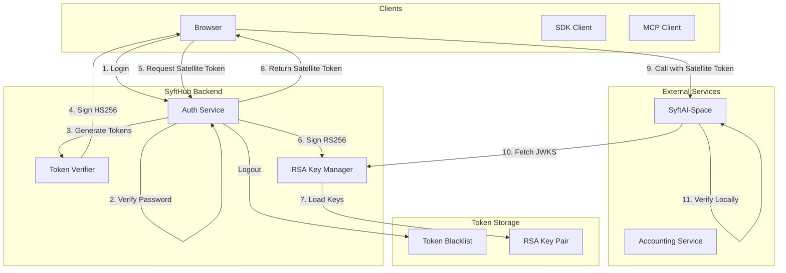
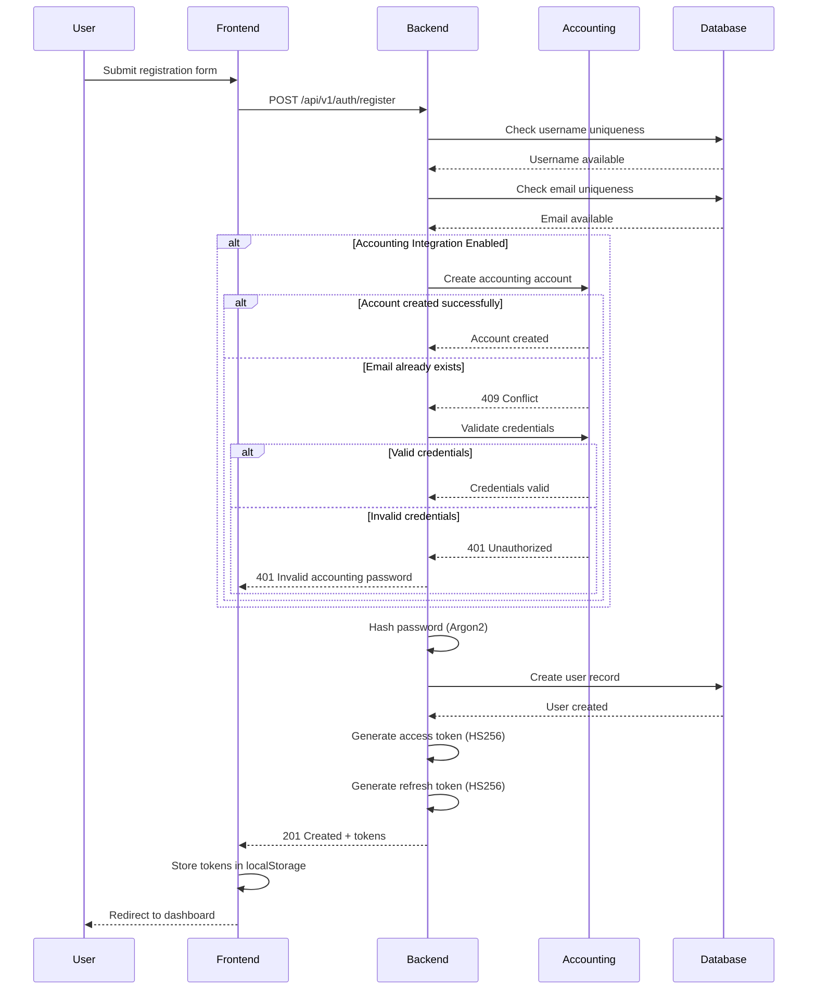
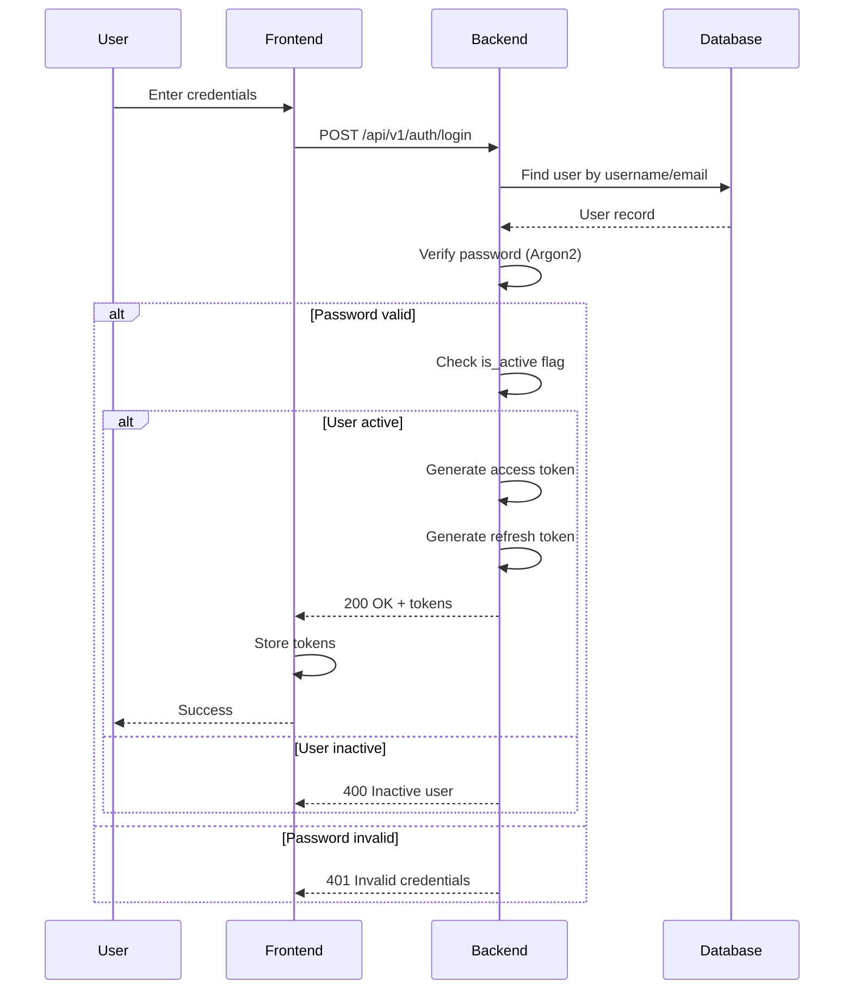
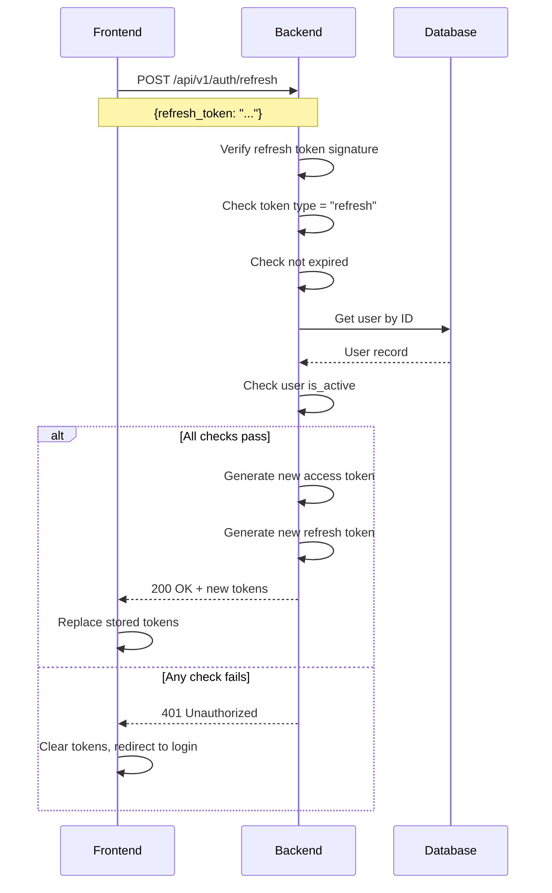
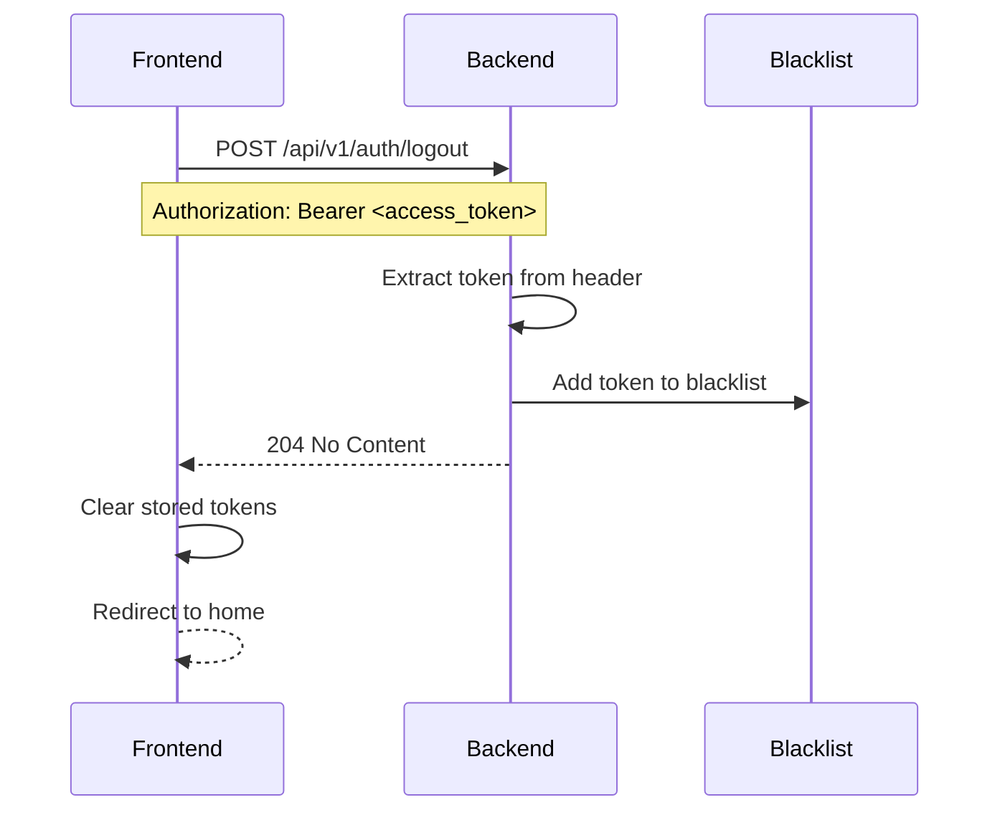
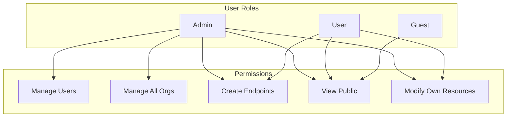
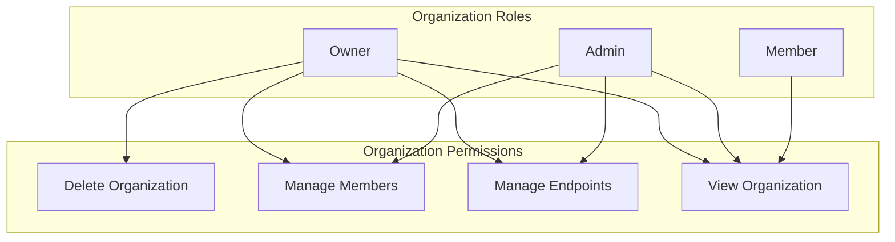

# SyftHub Authentication & Security

> A comprehensive guide to authentication flows, token management, and security architecture in SyftHub.

## Table of Contents

- [Overview](#overview)
- [Authentication Architecture](#authentication-architecture)
- [Token Types](#token-types)
- [Authentication Flows](#authentication-flows)
- [Authorization Model](#authorization-model)
- [Satellite Token System](#satellite-token-system)
- [Password Security](#password-security)
- [Security Best Practices](#security-best-practices)
- [Threat Model](#threat-model)

---

## Overview

SyftHub implements a **dual-token authentication architecture** that supports both internal operations and federated service authentication:

1. **Hub Tokens (HS256)**: For authenticating with the SyftHub backend
2. **Satellite Tokens (RS256)**: For authenticating with external federated services

This design enables **zero-trust federation** where satellite services can verify user identity without calling back to SyftHub for every request.

### Key Security Principles

| Principle | Implementation |
|-----------|----------------|
| **Defense in Depth** | Multiple validation layers (input, auth, authz) |
| **Least Privilege** | Role-based access with minimal default permissions |
| **Token-Based Auth** | Stateless JWT tokens, no server sessions |
| **Short-Lived Tokens** | Satellite tokens expire in 60 seconds |
| **Cryptographic Signing** | HS256 for hub, RS256 for satellites |
| **Secure Password Storage** | Argon2 hashing algorithm |

---

## Authentication Architecture



---

## Token Types

### Hub Access Token

Used for authenticating API requests to SyftHub backend.

```json
{
  "alg": "HS256",
  "typ": "JWT"
}
{
  "sub": "123",
  "username": "johndoe",
  "email": "john@example.com",
  "role": "user",
  "type": "access",
  "iat": 1705745340,
  "exp": 1705747140,
  "iss": "https://hub.syfthub.com",
  "aud": "https://hub.syfthub.com"
}
```

| Claim | Description |
|-------|-------------|
| `sub` | User ID (string) |
| `username` | User's username |
| `email` | User's email |
| `role` | User role (admin/user/guest) |
| `type` | Token type marker ("access") |
| `iat` | Issued at (Unix timestamp) |
| `exp` | Expiration (Unix timestamp) |
| `iss` | Issuer URL |
| `aud` | Audience URL |

**Configuration:**
- Algorithm: HS256
- Default expiration: 30 minutes
- Secret: Configurable via `SECRET_KEY` environment variable

---

### Hub Refresh Token

Used for obtaining new access tokens without re-authentication.

```json
{
  "alg": "HS256",
  "typ": "JWT"
}
{
  "sub": "123",
  "type": "refresh",
  "iat": 1705745340,
  "exp": 1706350140
}
```

| Claim | Description |
|-------|-------------|
| `sub` | User ID |
| `type` | Token type marker ("refresh") |
| `iat` | Issued at |
| `exp` | Expiration |

**Configuration:**
- Algorithm: HS256
- Default expiration: 7 days
- Secret: Same as access token

---

### Satellite Token

Used for authenticating with federated services (SyftAI-Space endpoints).

```json
{
  "alg": "RS256",
  "typ": "JWT",
  "kid": "hub-key-1"
}
{
  "sub": "123",
  "email": "john@example.com",
  "username": "johndoe",
  "role": "user",
  "iss": "https://hub.syfthub.com",
  "aud": "syftai-space",
  "iat": 1705745340,
  "exp": 1705745400
}
```

| Claim | Description |
|-------|-------------|
| `sub` | User ID |
| `email` | User's email |
| `username` | User's username |
| `role` | User role |
| `iss` | Hub issuer URL |
| `aud` | Target service (audience) |
| `iat` | Issued at |
| `exp` | Expiration |
| `kid` (header) | Key ID for key rotation |

**Configuration:**
- Algorithm: RS256
- Default expiration: 60 seconds
- Keys: RSA key pair (2048-bit minimum)

---

## Authentication Flows

### User Registration Flow



### Login Flow



### Token Refresh Flow



### Logout Flow



---

## Authorization Model

### Role-Based Access Control (RBAC)



### Organization Roles



### Endpoint Visibility

| Visibility | Unauthenticated | Authenticated | Owner | Admin |
|------------|-----------------|---------------|-------|-------|
| `public` | ✅ View | ✅ View | ✅ Full | ✅ Full |
| `internal` | ❌ | ✅ View | ✅ Full | ✅ Full |
| `private` | ❌ (404) | ❌ (404) | ✅ Full | ✅ Full |

**Security Note:** Private endpoints return 404 instead of 403 to prevent information leakage about endpoint existence.

### Permission Check Flow

```python
def check_endpoint_access(user: User | None, endpoint: Endpoint) -> bool:
    # Public endpoints are always accessible
    if endpoint.visibility == Visibility.PUBLIC:
        return True

    # No access without authentication for non-public
    if user is None:
        return False

    # Admins can access everything
    if user.role == UserRole.ADMIN:
        return True

    # Internal: any authenticated user
    if endpoint.visibility == Visibility.INTERNAL:
        return True

    # Private: owner only
    if endpoint.visibility == Visibility.PRIVATE:
        if endpoint.user_id == user.id:
            return True
        if endpoint.organization_id:
            return is_org_member(user.id, endpoint.organization_id)

    return False
```

---

## Satellite Token System

### Architecture Overview

```
┌─────────────────────────────────────────────────────────────────┐
│                    SATELLITE TOKEN FLOW                          │
├─────────────────────────────────────────────────────────────────┤
│                                                                  │
│  ┌──────────┐     ┌──────────────┐     ┌──────────────────────┐ │
│  │   User   │     │   SyftHub    │     │   SyftAI-Space       │ │
│  │          │     │   Backend    │     │   (Satellite)        │ │
│  └────┬─────┘     └──────┬───────┘     └──────────┬───────────┘ │
│       │                  │                        │              │
│       │  1. Login        │                        │              │
│       │─────────────────▶│                        │              │
│       │                  │                        │              │
│       │  2. Hub Token    │                        │              │
│       │◀─────────────────│                        │              │
│       │                  │                        │              │
│       │  3. Request      │                        │              │
│       │  Satellite Token │                        │              │
│       │  (aud=syftai)    │                        │              │
│       │─────────────────▶│                        │              │
│       │                  │                        │              │
│       │                  │  4. Validate audience  │              │
│       │                  │  (check user exists)   │              │
│       │                  │                        │              │
│       │  5. RS256 Token  │                        │              │
│       │  (60s TTL)       │                        │              │
│       │◀─────────────────│                        │              │
│       │                  │                        │              │
│       │  6. API Request with Satellite Token      │              │
│       │──────────────────────────────────────────▶│              │
│       │                  │                        │              │
│       │                  │  7. Fetch JWKS         │              │
│       │                  │◀───────────────────────│              │
│       │                  │                        │              │
│       │                  │  8. Public Keys        │              │
│       │                  │───────────────────────▶│              │
│       │                  │                        │              │
│       │                  │        9. Verify token │              │
│       │                  │           locally      │              │
│       │                  │                        │              │
│       │  10. Protected Response                   │              │
│       │◀──────────────────────────────────────────│              │
│       │                  │                        │              │
└───────┴──────────────────┴────────────────────────┴──────────────┘
```

### Audience Validation

Satellite tokens use **dynamic audience validation** - any active user's username is a valid audience:

```python
def validate_audience(audience: str, user_repo: UserRepository) -> AudienceValidationResult:
    """
    Dynamic validation: Check if audience is an active user's username.
    This allows any registered user to be a satellite service.
    """
    # Normalize input
    audience = audience.strip().lower()

    # Query database for user
    user = user_repo.get_by_username(audience)

    if user is None:
        return AudienceValidationResult(
            valid=False,
            error_code="audience_not_found",
            message=f"Audience '{audience}' is not a registered user"
        )

    if not user.is_active:
        return AudienceValidationResult(
            valid=False,
            error_code="audience_inactive",
            message=f"Audience user '{audience}' is inactive"
        )

    return AudienceValidationResult(valid=True)
```

### JWKS Endpoint

The `/.well-known/jwks.json` endpoint provides public keys for token verification:

```json
{
  "keys": [
    {
      "kty": "RSA",
      "kid": "hub-key-1",
      "use": "sig",
      "alg": "RS256",
      "n": "0vx7agoebGcQSuuPiLJXZptN9nndrQmbXEps2aiAFbWhM78LhWx4cbbfAAtVT86zwu1RK7aPFFxuhDR1L6tSoc_BJECPebWKRXjBZCiFV4n3oknjhMstn64tZ_2W-5JsGY4Hc5n9yBXArwl93lqt7_RN5w6Cf0h4QyQ5v-65YGjQR0_FDW2QvzqY368QQMicAtaSqzs8KJZgnYb9c7d0zgdAZHzu6qMQvRL5hajrn1n91CbOpbISD08qNLyrdkt-bFTWhAI4vMQFh6WeZu0fM4lFd2NcRwr3XPksINHaQ-G_xBniIqbw0Ls1jF44-csFCur-kEgU8awapJzKnqDKgw",
      "e": "AQAB"
    }
  ]
}
```

### Key Rotation

The `kid` (Key ID) claim in satellite tokens enables key rotation:

1. Generate new key pair with new `kid`
2. Add new public key to JWKS endpoint
3. Start signing new tokens with new key
4. Keep old public key in JWKS until old tokens expire
5. Remove old public key after grace period

---

## Password Security

### Hashing Algorithm: Argon2

SyftHub uses **Argon2** for password hashing, the winner of the Password Hashing Competition:

```python
from passlib.context import CryptContext

pwd_context = CryptContext(schemes=["argon2"], deprecated="auto")

def hash_password(password: str) -> str:
    """Hash password using Argon2."""
    return pwd_context.hash(password)

def verify_password(plain_password: str, hashed_password: str) -> bool:
    """Verify password against stored hash."""
    return pwd_context.verify(plain_password, hashed_password)
```

**Why Argon2?**
- Memory-hard function (resistant to GPU/ASIC attacks)
- Configurable memory, time, and parallelism costs
- No length limitations (unlike bcrypt's 72-byte limit)
- Automatic salt generation

### Password Requirements

| Requirement | Value | Reason |
|-------------|-------|--------|
| Minimum length | 8 characters | Balance security vs usability |
| Required character types | 1 digit + 1 letter | Prevent dictionary words |
| Maximum length | None | No artificial limits |

```python
def validate_password(password: str) -> str:
    """Validate password meets requirements."""
    if len(password) < 8:
        raise ValueError("Password must be at least 8 characters")

    if not any(c.isdigit() for c in password):
        raise ValueError("Password must contain at least one digit")

    if not any(c.isalpha() for c in password):
        raise ValueError("Password must contain at least one letter")

    return password
```

---

## Security Best Practices

### Token Handling

```python
# ✅ DO: Use secure token storage
localStorage.setItem('access_token', token)  # Client-side only

# ✅ DO: Clear tokens on logout
def logout():
    blacklist_token(current_token)
    clear_local_storage()

# ✅ DO: Validate token type
if payload.get("type") != "access":
    raise InvalidTokenError("Wrong token type")

# ❌ DON'T: Log tokens
logger.info(f"Token: {token}")  # Never do this!

# ❌ DON'T: Send tokens in URL
GET /api/v1/users?token=eyJ...  # Never do this!
```

### API Security

```python
# ✅ DO: Use parameterized queries (SQLAlchemy does this)
user = session.query(User).filter(User.username == username).first()

# ✅ DO: Validate input
class UserCreate(BaseModel):
    username: str = Field(..., min_length=3, max_length=50)
    email: EmailStr
    password: str = Field(..., min_length=8)

# ✅ DO: Return 404 for private resources (information hiding)
if not can_access(user, endpoint):
    raise HTTPException(status_code=404)  # Not 403

# ❌ DON'T: Expose internal errors
except Exception as e:
    raise HTTPException(status_code=500, detail=str(e))  # Never expose!
```

### Sensitive Data Handling

```python
# Fields automatically redacted in logs
SENSITIVE_FIELDS = {
    "password", "new_password", "current_password",
    "token", "access_token", "refresh_token",
    "api_key", "secret_key", "private_key",
    "credit_card", "cvv", "ssn"
}

def sanitize_for_logging(data: dict) -> dict:
    """Remove sensitive fields before logging."""
    return {
        k: "[REDACTED]" if k.lower() in SENSITIVE_FIELDS else v
        for k, v in data.items()
    }
```

---

## Threat Model

### Attack Vectors and Mitigations

| Threat | Attack Vector | Mitigation |
|--------|---------------|------------|
| **Credential Theft** | Phishing, keyloggers | Short-lived tokens, MFA (planned) |
| **Token Theft** | XSS, network sniffing | HTTPS only, HttpOnly cookies (planned) |
| **Brute Force** | Password guessing | Rate limiting (planned), Argon2 slow hashing |
| **Session Hijacking** | Token interception | Short expiry, token blacklisting |
| **Privilege Escalation** | Role tampering | Server-side role validation |
| **SQL Injection** | Malicious input | SQLAlchemy ORM, parameterized queries |
| **XSS** | Script injection | React's auto-escaping, CSP headers |
| **CSRF** | Forged requests | SameSite cookies, CORS validation |

### Security Headers

```python
# Recommended headers (configure in nginx)
X-Content-Type-Options: nosniff
X-Frame-Options: DENY
X-XSS-Protection: 1; mode=block
Strict-Transport-Security: max-age=31536000; includeSubDomains
Content-Security-Policy: default-src 'self'
```

### Rate Limiting (Recommended)

```python
# Recommended rate limits (implement externally)
AUTH_ENDPOINTS = {
    "/auth/login": "5/minute",      # Prevent brute force
    "/auth/register": "3/minute",   # Prevent spam
    "/auth/refresh": "10/minute",   # Normal usage
}

API_ENDPOINTS = {
    "default": "100/minute",        # Standard limit
    "search": "30/minute",          # Resource-intensive
    "chat": "10/minute",            # Expensive operation
}
```

---

## Configuration Reference

### Environment Variables

| Variable | Description | Default |
|----------|-------------|---------|
| `SECRET_KEY` | JWT signing secret | **Must change!** |
| `ACCESS_TOKEN_EXPIRE_MINUTES` | Access token lifetime | 30 |
| `REFRESH_TOKEN_EXPIRE_DAYS` | Refresh token lifetime | 7 |
| `SATELLITE_TOKEN_EXPIRE_SECONDS` | Satellite token lifetime | 60 |
| `PASSWORD_MIN_LENGTH` | Minimum password length | 8 |
| `RSA_PRIVATE_KEY` | Base64-encoded RSA private key | Auto-generated |
| `RSA_PUBLIC_KEY` | Base64-encoded RSA public key | Auto-generated |
| `RSA_KEY_ID` | Key ID for JWKS | hub-key-1 |

### Production Checklist

- [ ] Change `SECRET_KEY` from default
- [ ] Configure RSA keys (don't auto-generate in production)
- [ ] Enable HTTPS/TLS
- [ ] Configure rate limiting
- [ ] Set up Redis for token blacklist (multi-worker)
- [ ] Enable security headers in nginx
- [ ] Configure CORS properly
- [ ] Set up audit logging
- [ ] Regular key rotation schedule

---

## Related Documentation

- [01-system-architecture.md](./01-system-architecture.md) - System overview
- [03-api-reference.md](./03-api-reference.md) - API endpoints
- [05-workflows-sequences.md](./05-workflows-sequences.md) - Auth workflows
- [10-deployment-operations.md](./10-deployment-operations.md) - Security configuration
