# SyftHub Workflows and Sequences

> A comprehensive guide to all key workflows and sequences in SyftHub - the GitHub for AI Endpoints.

## Table of Contents

- [Overview](#overview)
- [1. User Registration Workflow](#1-user-registration-workflow)
- [2. Login and Session Management](#2-login-and-session-management)
- [3. Endpoint Lifecycle](#3-endpoint-lifecycle)
- [4. Organization Workflow](#4-organization-workflow)
- [5. Chat/RAG Workflow](#5-chatrag-workflow)
- [6. Satellite Token Workflow](#6-satellite-token-workflow)
- [7. Endpoint Invocation Workflow](#7-endpoint-invocation-workflow)
- [Error Handling Patterns](#error-handling-patterns)

---

## Overview

This document describes the key workflows and sequences that power SyftHub. Each workflow includes:

- **Sequence diagrams** showing component interactions
- **Step-by-step descriptions** of each phase
- **Decision points** and branching logic
- **Error handling** paths and recovery strategies
- **Edge cases** and their resolutions

### System Components

| Component | Role | Port |
|-----------|------|------|
| **Frontend** | React SPA, user interface | 3000 |
| **Backend API** | FastAPI, core business logic | 8000 |
| **Aggregator** | RAG orchestration service | 8001 |
| **MCP Server** | Model Context Protocol server | 8002 |
| **PostgreSQL** | Primary database | 5432 |
| **Accounting Service** | External billing/payments | External |
| **SyftAI-Space** | Federated endpoint hosts | External |

---

## 1. User Registration Workflow

The registration workflow handles new user creation with optional accounting service integration. This is one of the most complex flows due to the need to coordinate between SyftHub and the external accounting service.

### 1.1 Sequence Diagram

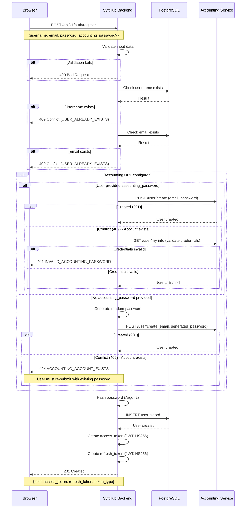
```mermaid
sequenceDiagram
    participant Client as Browser
    participant Backend as SyftHub Backend
    participant DB as PostgreSQL
    participant Accounting as Accounting Service

    Client->>Backend: POST /api/v1/auth/register
    Note over Client,Backend: {username, email, password, accounting_password?}

    %% Input Validation
    Backend->>Backend: Validate input data
    alt Validation fails
        Backend-->>Client: 400 Bad Request
    end

    %% Check uniqueness in SyftHub
    Backend->>DB: Check username exists
    DB-->>Backend: Result
    alt Username exists
        Backend-->>Client: 409 Conflict (USER_ALREADY_EXISTS)
    end

    Backend->>DB: Check email exists
    DB-->>Backend: Result
    alt Email exists
        Backend-->>Client: 409 Conflict (USER_ALREADY_EXISTS)
    end

    %% Accounting Integration
    alt Accounting URL configured
        alt User provided accounting_password
            Backend->>Accounting: POST /user/create (email, password)
            alt Created (201)
                Accounting-->>Backend: User created
            else Conflict (409) - Account exists
                Backend->>Accounting: GET /user/my-info (validate credentials)
                alt Credentials invalid
                    Backend-->>Client: 401 INVALID_ACCOUNTING_PASSWORD
                else Credentials valid
                    Accounting-->>Backend: User validated
                end
            end
        else No accounting_password provided
            Backend->>Backend: Generate random password
            Backend->>Accounting: POST /user/create (email, generated_password)
            alt Created (201)
                Accounting-->>Backend: User created
            else Conflict (409) - Account exists
                Backend-->>Client: 424 ACCOUNTING_ACCOUNT_EXISTS
                Note over Client,Backend: User must re-submit with existing password
            end
        end
    end

    %% Create user in SyftHub
    Backend->>Backend: Hash password (Argon2)
    Backend->>DB: INSERT user record
    DB-->>Backend: User created

    %% Generate tokens
    Backend->>Backend: Create access_token (JWT, HS256)
    Backend->>Backend: Create refresh_token (JWT, HS256)

    Backend-->>Client: 201 Created
    Note over Backend,Client: {user, access_token, refresh_token, token_type}
```

### 1.2 Step-by-Step Description

#### Phase 1: Input Validation

| Step | Action | Validation Rule |
|------|--------|-----------------|
| 1 | Validate username | Minimum 3 characters |
| 2 | Validate password | Minimum 8 characters |
| 3 | Validate email format | Valid email pattern |

#### Phase 2: Uniqueness Check

```
IF username exists in SyftHub DB:
    RETURN 409 Conflict (code: USER_ALREADY_EXISTS, field: username)

IF email exists in SyftHub DB:
    RETURN 409 Conflict (code: USER_ALREADY_EXISTS, field: email)
```

#### Phase 3: Accounting Integration

The accounting integration follows a "try-create-first" approach:

```
IF accounting_url is configured:
    IF user provided accounting_password:
        TRY create account with provided password
        IF success:
            USE provided password
        ELSE IF conflict (409):
            VALIDATE credentials against accounting service
            IF valid:
                USE provided password (linking existing account)
            ELSE:
                RETURN 401 INVALID_ACCOUNTING_PASSWORD
    ELSE:
        GENERATE secure random password (32 chars)
        TRY create account with generated password
        IF success:
            USE generated password
        ELSE IF conflict (409):
            RETURN 424 ACCOUNTING_ACCOUNT_EXISTS
            NOTE: User must re-submit with their existing password
```

#### Phase 4: User Creation

| Field | Value |
|-------|-------|
| `password_hash` | Argon2 hash of provided password |
| `accounting_service_url` | Configured URL or user-provided |
| `accounting_password` | Generated or user-provided |
| `is_active` | `true` |
| `role` | `user` (default) |

#### Phase 5: Token Generation

| Token | Algorithm | Expiry | Claims |
|-------|-----------|--------|--------|
| Access Token | HS256 | 30 minutes (configurable) | `sub`, `username`, `role`, `type: access` |
| Refresh Token | HS256 | 7 days (configurable) | `sub`, `username`, `type: refresh` |

### 1.3 Edge Cases

| Edge Case | Handling |
|-----------|----------|
| Email exists in SyftHub but not in Accounting | 409 Conflict (SyftHub check first) |
| Email exists in Accounting but not in SyftHub | 424 - requires accounting_password |
| Accounting service unavailable | 503 Service Unavailable |
| Accounting service timeout | 503 Service Unavailable |
| Password too short | 400 Bad Request |
| Username already taken | 409 Conflict |

### 1.4 Flowchart

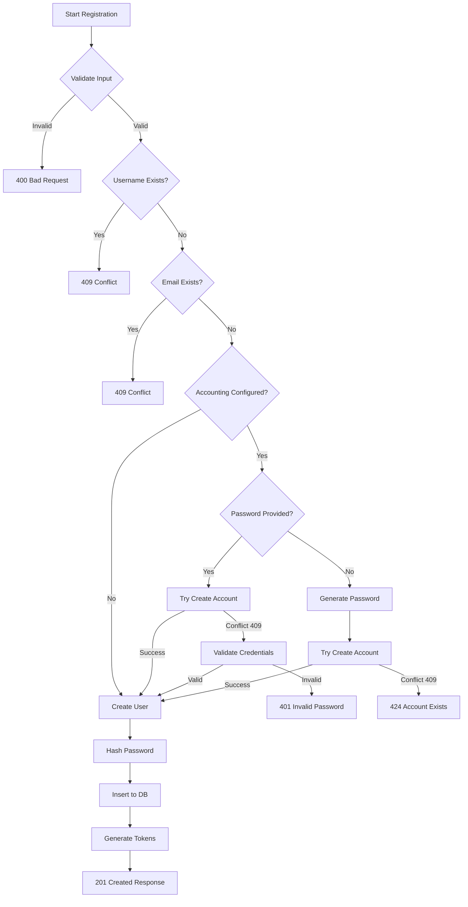
```mermaid
flowchart TD
    A[Start Registration] --> B{Validate Input}
    B -->|Invalid| B1[400 Bad Request]
    B -->|Valid| C{Username Exists?}
    C -->|Yes| C1[409 Conflict]
    C -->|No| D{Email Exists?}
    D -->|Yes| D1[409 Conflict]
    D -->|No| E{Accounting Configured?}

    E -->|No| J[Create User]
    E -->|Yes| F{Password Provided?}

    F -->|Yes| G[Try Create Account]
    G -->|Success| J
    G -->|Conflict 409| H[Validate Credentials]
    H -->|Valid| J
    H -->|Invalid| H1[401 Invalid Password]

    F -->|No| I[Generate Password]
    I --> K[Try Create Account]
    K -->|Success| J
    K -->|Conflict 409| K1[424 Account Exists]

    J --> L[Hash Password]
    L --> M[Insert to DB]
    M --> N[Generate Tokens]
    N --> O[201 Created Response]
```

---

## 2. Login and Session Management

### 2.1 Login Sequence

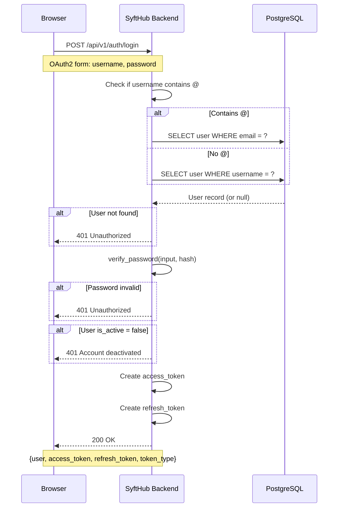
```mermaid
sequenceDiagram
    participant Client as Browser
    participant Backend as SyftHub Backend
    participant DB as PostgreSQL

    Client->>Backend: POST /api/v1/auth/login
    Note over Client,Backend: OAuth2 form: username, password

    %% Lookup user
    Backend->>Backend: Check if username contains @
    alt Contains @
        Backend->>DB: SELECT user WHERE email = ?
    else No @
        Backend->>DB: SELECT user WHERE username = ?
    end
    DB-->>Backend: User record (or null)

    alt User not found
        Backend-->>Client: 401 Unauthorized
    end

    %% Verify password
    Backend->>Backend: verify_password(input, hash)
    alt Password invalid
        Backend-->>Client: 401 Unauthorized
    end

    %% Check active status
    alt User is_active = false
        Backend-->>Client: 401 Account deactivated
    end

    %% Generate tokens
    Backend->>Backend: Create access_token
    Backend->>Backend: Create refresh_token

    Backend-->>Client: 200 OK
    Note over Backend,Client: {user, access_token, refresh_token, token_type}
```

### 2.2 Token Lifecycle

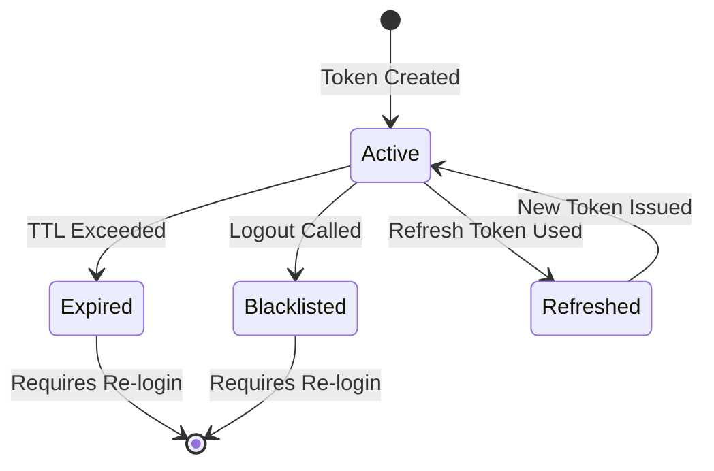
```mermaid
stateDiagram-v2
    [*] --> Active: Token Created
    Active --> Expired: TTL Exceeded
    Active --> Blacklisted: Logout Called
    Active --> Refreshed: Refresh Token Used
    Refreshed --> Active: New Token Issued
    Expired --> [*]: Requires Re-login
    Blacklisted --> [*]: Requires Re-login
```

### 2.3 Token Refresh Flow

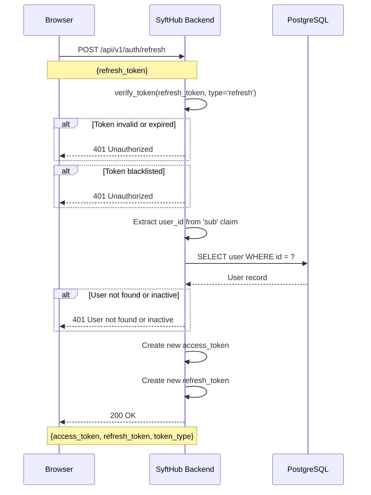
```mermaid
sequenceDiagram
    participant Client as Browser
    participant Backend as SyftHub Backend
    participant DB as PostgreSQL

    Client->>Backend: POST /api/v1/auth/refresh
    Note over Client,Backend: {refresh_token}

    Backend->>Backend: verify_token(refresh_token, type='refresh')

    alt Token invalid or expired
        Backend-->>Client: 401 Unauthorized
    end

    alt Token blacklisted
        Backend-->>Client: 401 Unauthorized
    end

    %% Extract user ID
    Backend->>Backend: Extract user_id from 'sub' claim
    Backend->>DB: SELECT user WHERE id = ?
    DB-->>Backend: User record

    alt User not found or inactive
        Backend-->>Client: 401 User not found or inactive
    end

    %% Issue new tokens
    Backend->>Backend: Create new access_token
    Backend->>Backend: Create new refresh_token

    Backend-->>Client: 200 OK
    Note over Backend,Client: {access_token, refresh_token, token_type}
```

### 2.4 Logout Flow

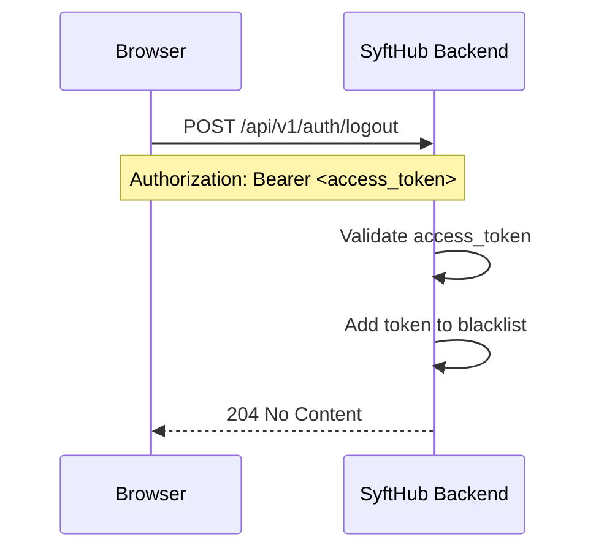
```mermaid
sequenceDiagram
    participant Client as Browser
    participant Backend as SyftHub Backend

    Client->>Backend: POST /api/v1/auth/logout
    Note over Client,Backend: Authorization: Bearer <access_token>

    Backend->>Backend: Validate access_token
    Backend->>Backend: Add token to blacklist

    Backend-->>Client: 204 No Content
```

### 2.5 Session Management Details

| Aspect | Implementation |
|--------|----------------|
| Token Storage (Client) | LocalStorage or HttpOnly cookie |
| Token Blacklist (Server) | In-memory Set (production: Redis) |
| Password Hashing | Argon2 (via passlib) |
| Token Signing | HS256 with SECRET_KEY |

### 2.6 Protected Route Access

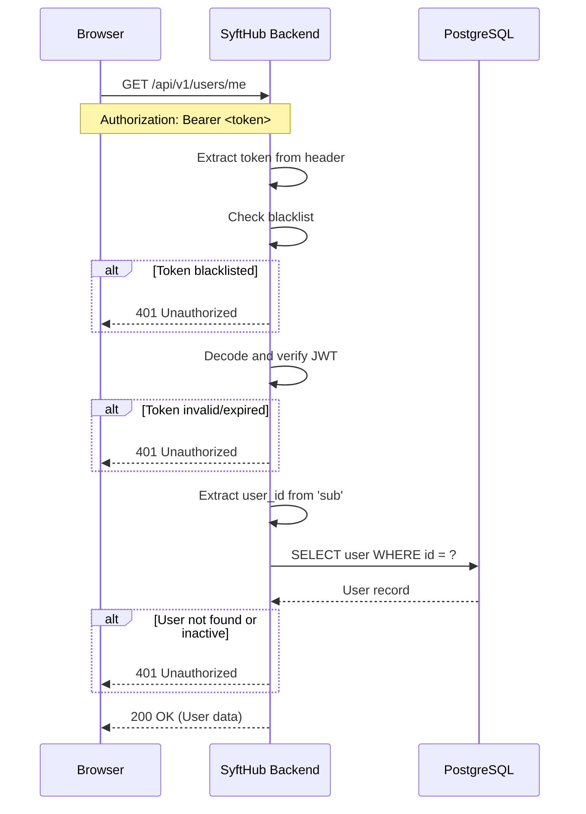
```mermaid
sequenceDiagram
    participant Client as Browser
    participant Backend as SyftHub Backend
    participant DB as PostgreSQL

    Client->>Backend: GET /api/v1/users/me
    Note over Client,Backend: Authorization: Bearer <token>

    Backend->>Backend: Extract token from header
    Backend->>Backend: Check blacklist

    alt Token blacklisted
        Backend-->>Client: 401 Unauthorized
    end

    Backend->>Backend: Decode and verify JWT

    alt Token invalid/expired
        Backend-->>Client: 401 Unauthorized
    end

    Backend->>Backend: Extract user_id from 'sub'
    Backend->>DB: SELECT user WHERE id = ?
    DB-->>Backend: User record

    alt User not found or inactive
        Backend-->>Client: 401 Unauthorized
    end

    Backend-->>Client: 200 OK (User data)
```

---

## 3. Endpoint Lifecycle

Endpoints are the core entities in SyftHub - they represent AI models or data sources that users can register, discover, and invoke.

### 3.1 Create Endpoint

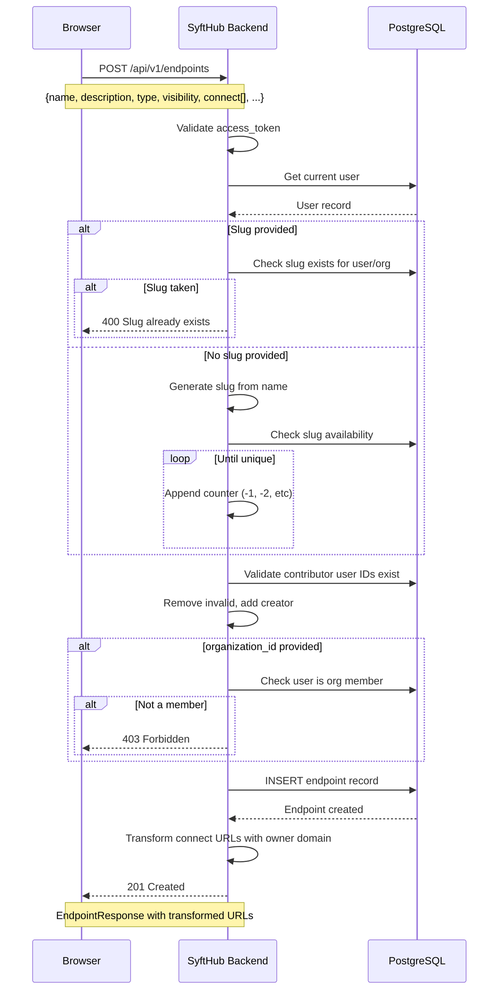
```mermaid
sequenceDiagram
    participant Client as Browser
    participant Backend as SyftHub Backend
    participant DB as PostgreSQL

    Client->>Backend: POST /api/v1/endpoints
    Note over Client,Backend: {name, description, type, visibility, connect[], ...}

    %% Auth check
    Backend->>Backend: Validate access_token
    Backend->>DB: Get current user
    DB-->>Backend: User record

    %% Slug handling
    alt Slug provided
        Backend->>DB: Check slug exists for user/org
        alt Slug taken
            Backend-->>Client: 400 Slug already exists
        end
    else No slug provided
        Backend->>Backend: Generate slug from name
        Backend->>DB: Check slug availability
        loop Until unique
            Backend->>Backend: Append counter (-1, -2, etc)
        end
    end

    %% Validate contributors
    Backend->>DB: Validate contributor user IDs exist
    Backend->>Backend: Remove invalid, add creator

    %% Check organization permissions (if org endpoint)
    alt organization_id provided
        Backend->>DB: Check user is org member
        alt Not a member
            Backend-->>Client: 403 Forbidden
        end
    end

    %% Create endpoint
    Backend->>DB: INSERT endpoint record
    DB-->>Backend: Endpoint created

    %% Transform URLs for response
    Backend->>Backend: Transform connect URLs with owner domain

    Backend-->>Client: 201 Created
    Note over Backend,Client: EndpointResponse with transformed URLs
```

### 3.2 Update Endpoint

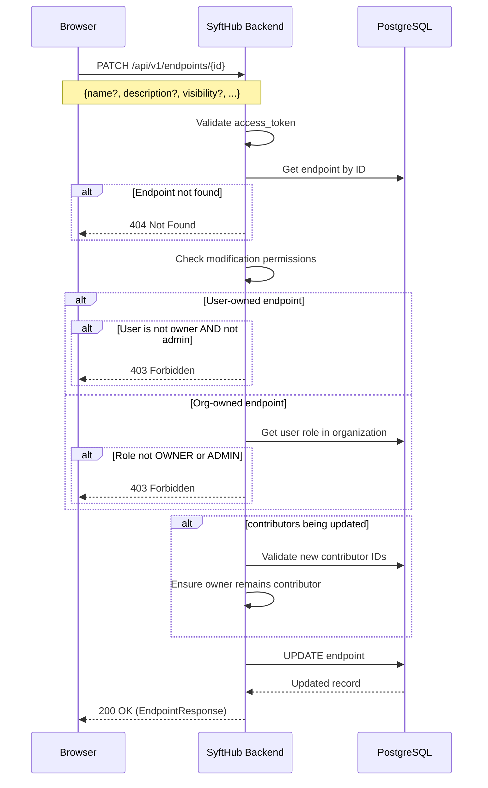
```mermaid
sequenceDiagram
    participant Client as Browser
    participant Backend as SyftHub Backend
    participant DB as PostgreSQL

    Client->>Backend: PATCH /api/v1/endpoints/{id}
    Note over Client,Backend: {name?, description?, visibility?, ...}

    Backend->>Backend: Validate access_token
    Backend->>DB: Get endpoint by ID

    alt Endpoint not found
        Backend-->>Client: 404 Not Found
    end

    %% Permission check
    Backend->>Backend: Check modification permissions

    alt User-owned endpoint
        alt User is not owner AND not admin
            Backend-->>Client: 403 Forbidden
        end
    else Org-owned endpoint
        Backend->>DB: Get user role in organization
        alt Role not OWNER or ADMIN
            Backend-->>Client: 403 Forbidden
        end
    end

    %% Update with validation
    alt contributors being updated
        Backend->>DB: Validate new contributor IDs
        Backend->>Backend: Ensure owner remains contributor
    end

    Backend->>DB: UPDATE endpoint
    DB-->>Backend: Updated record

    Backend-->>Client: 200 OK (EndpointResponse)
```

### 3.3 Star/Unstar Endpoint

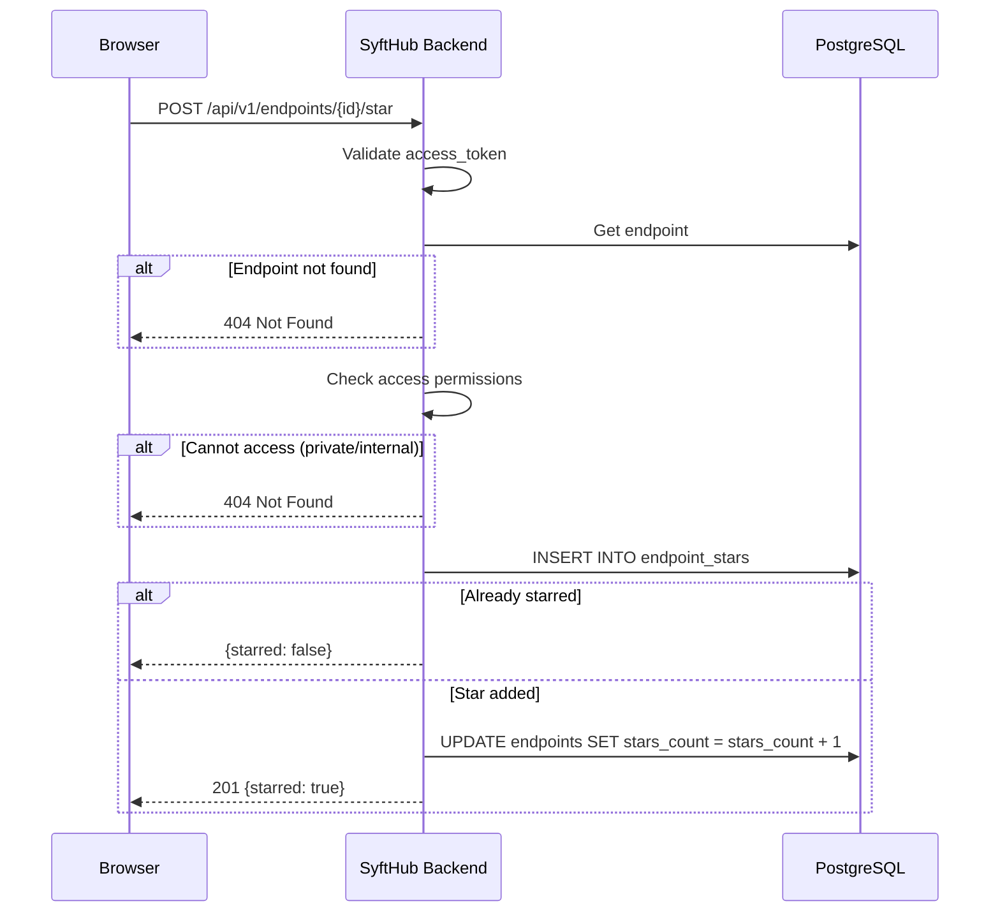
```mermaid
sequenceDiagram
    participant Client as Browser
    participant Backend as SyftHub Backend
    participant DB as PostgreSQL

    Client->>Backend: POST /api/v1/endpoints/{id}/star

    Backend->>Backend: Validate access_token
    Backend->>DB: Get endpoint

    alt Endpoint not found
        Backend-->>Client: 404 Not Found
    end

    %% Access check
    Backend->>Backend: Check access permissions

    alt Cannot access (private/internal)
        Backend-->>Client: 404 Not Found
    end

    %% Add star
    Backend->>DB: INSERT INTO endpoint_stars

    alt Already starred
        Backend-->>Client: {starred: false}
    else Star added
        Backend->>DB: UPDATE endpoints SET stars_count = stars_count + 1
        Backend-->>Client: 201 {starred: true}
    end
```

### 3.4 Delete Endpoint

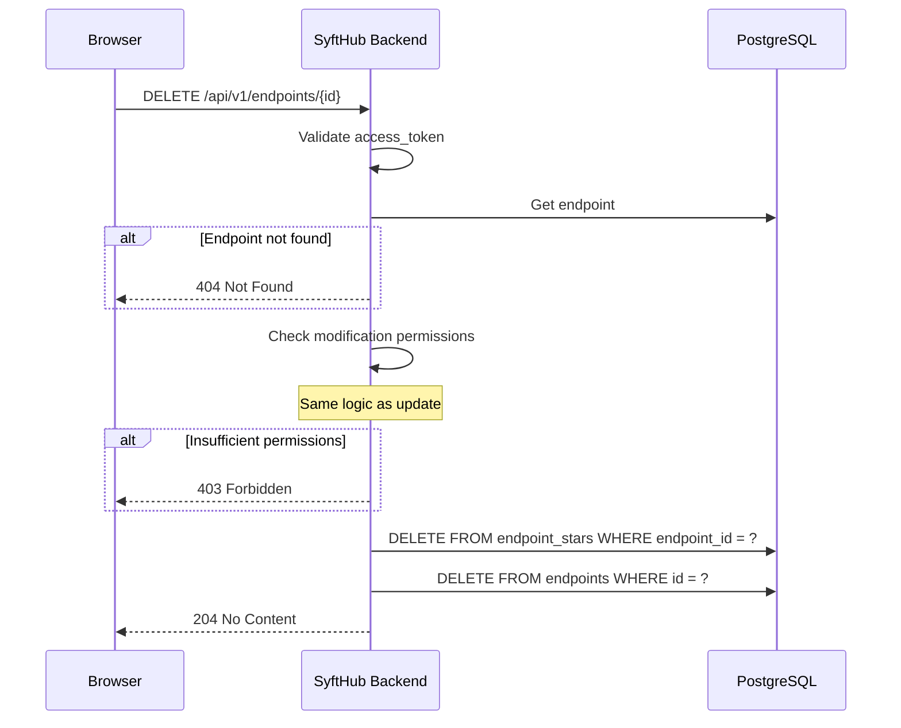
```mermaid
sequenceDiagram
    participant Client as Browser
    participant Backend as SyftHub Backend
    participant DB as PostgreSQL

    Client->>Backend: DELETE /api/v1/endpoints/{id}

    Backend->>Backend: Validate access_token
    Backend->>DB: Get endpoint

    alt Endpoint not found
        Backend-->>Client: 404 Not Found
    end

    %% Permission check
    Backend->>Backend: Check modification permissions
    Note over Backend: Same logic as update

    alt Insufficient permissions
        Backend-->>Client: 403 Forbidden
    end

    Backend->>DB: DELETE FROM endpoint_stars WHERE endpoint_id = ?
    Backend->>DB: DELETE FROM endpoints WHERE id = ?

    Backend-->>Client: 204 No Content
```

### 3.5 Endpoint Visibility Rules

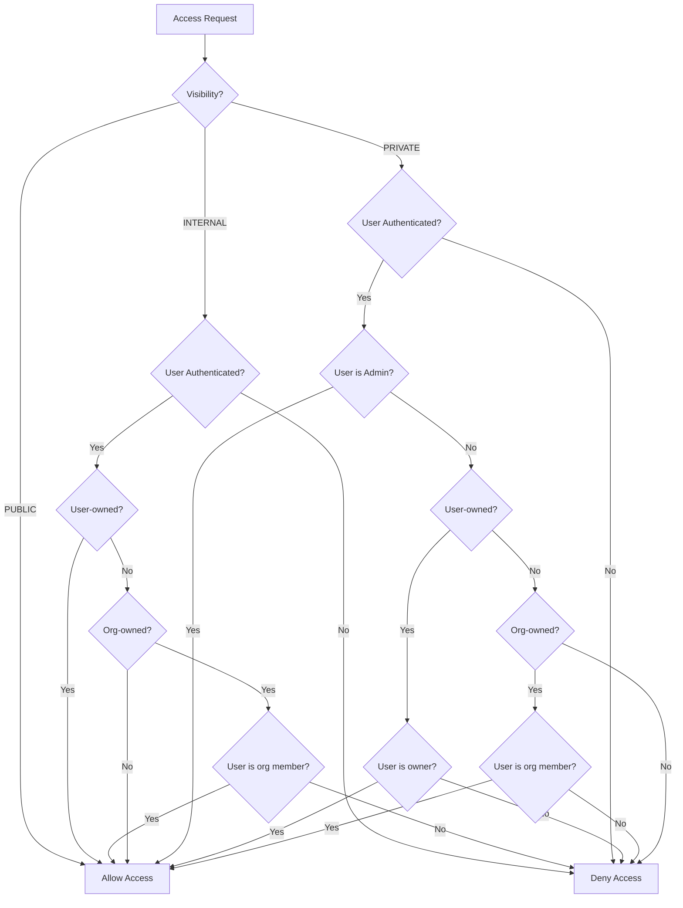
```mermaid
flowchart TD
    A[Access Request] --> B{Visibility?}

    B -->|PUBLIC| C[Allow Access]

    B -->|INTERNAL| D{User Authenticated?}
    D -->|No| E[Deny Access]
    D -->|Yes| F{User-owned?}
    F -->|Yes| C
    F -->|No| G{Org-owned?}
    G -->|Yes| H{User is org member?}
    H -->|Yes| C
    H -->|No| E
    G -->|No| C

    B -->|PRIVATE| I{User Authenticated?}
    I -->|No| E
    I -->|Yes| J{User is Admin?}
    J -->|Yes| C
    J -->|No| K{User-owned?}
    K -->|Yes| L{User is owner?}
    L -->|Yes| C
    L -->|No| E
    K -->|No| M{Org-owned?}
    M -->|Yes| N{User is org member?}
    N -->|Yes| C
    N -->|No| E
    M -->|No| E
```

### 3.6 Endpoint State Diagram

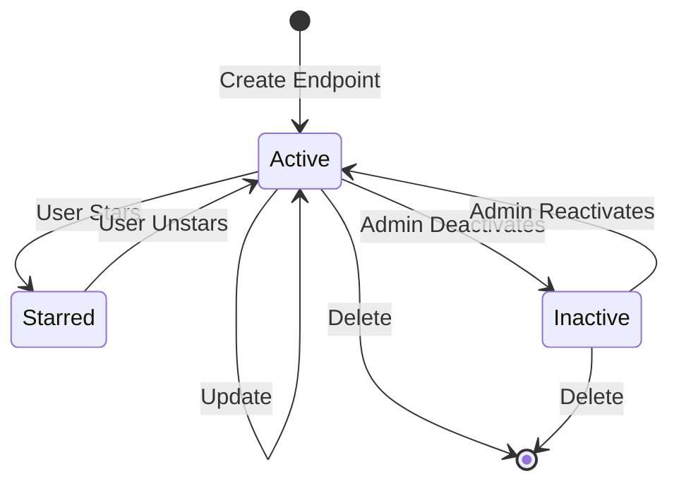
```mermaid
stateDiagram-v2
    [*] --> Active: Create Endpoint
    Active --> Active: Update
    Active --> Starred: User Stars
    Starred --> Active: User Unstars
    Active --> Inactive: Admin Deactivates
    Inactive --> Active: Admin Reactivates
    Active --> [*]: Delete
    Inactive --> [*]: Delete
```

---

## 4. Organization Workflow

Organizations allow users to collaborate on endpoints with role-based access control.

### 4.1 Create Organization

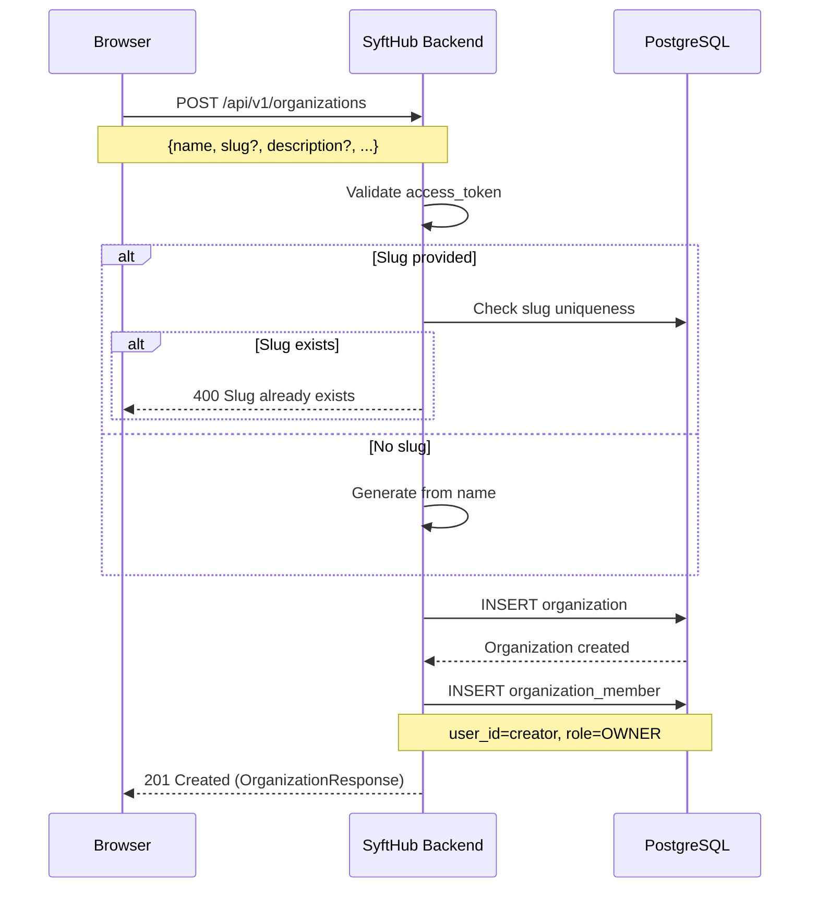
```mermaid
sequenceDiagram
    participant Client as Browser
    participant Backend as SyftHub Backend
    participant DB as PostgreSQL

    Client->>Backend: POST /api/v1/organizations
    Note over Client,Backend: {name, slug?, description?, ...}

    Backend->>Backend: Validate access_token

    %% Slug validation
    alt Slug provided
        Backend->>DB: Check slug uniqueness
        alt Slug exists
            Backend-->>Client: 400 Slug already exists
        end
    else No slug
        Backend->>Backend: Generate from name
    end

    %% Create organization
    Backend->>DB: INSERT organization
    DB-->>Backend: Organization created

    %% Add creator as owner
    Backend->>DB: INSERT organization_member
    Note over Backend,DB: user_id=creator, role=OWNER

    Backend-->>Client: 201 Created (OrganizationResponse)
```

### 4.2 Member Management

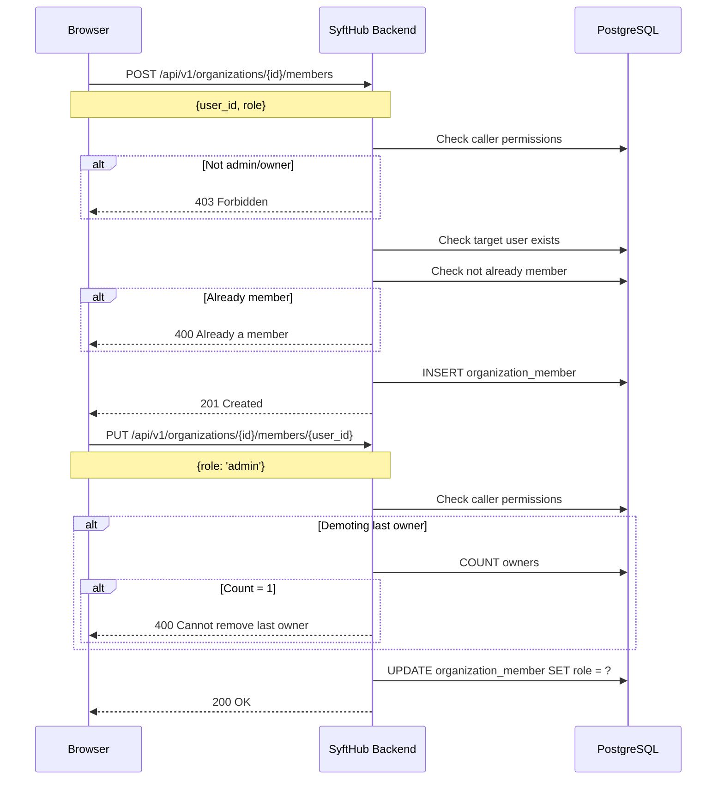
```mermaid
sequenceDiagram
    participant Client as Browser
    participant Backend as SyftHub Backend
    participant DB as PostgreSQL

    %% Add Member
    Client->>Backend: POST /api/v1/organizations/{id}/members
    Note over Client,Backend: {user_id, role}

    Backend->>DB: Check caller permissions
    alt Not admin/owner
        Backend-->>Client: 403 Forbidden
    end

    Backend->>DB: Check target user exists
    Backend->>DB: Check not already member

    alt Already member
        Backend-->>Client: 400 Already a member
    end

    Backend->>DB: INSERT organization_member
    Backend-->>Client: 201 Created

    %% Update Member Role
    Client->>Backend: PUT /api/v1/organizations/{id}/members/{user_id}
    Note over Client,Backend: {role: 'admin'}

    Backend->>DB: Check caller permissions

    %% Last owner protection
    alt Demoting last owner
        Backend->>DB: COUNT owners
        alt Count = 1
            Backend-->>Client: 400 Cannot remove last owner
        end
    end

    Backend->>DB: UPDATE organization_member SET role = ?
    Backend-->>Client: 200 OK
```

### 4.3 Role Transitions

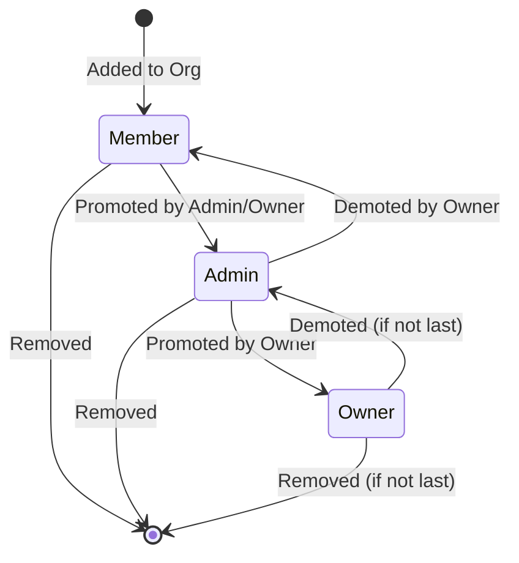
```mermaid
stateDiagram-v2
    [*] --> Member: Added to Org

    Member --> Admin: Promoted by Admin/Owner
    Admin --> Member: Demoted by Owner
    Admin --> Owner: Promoted by Owner
    Owner --> Admin: Demoted (if not last)

    Member --> [*]: Removed
    Admin --> [*]: Removed
    Owner --> [*]: Removed (if not last)
```

### 4.4 Organization Permission Matrix

| Action | Member | Admin | Owner | Platform Admin |
|--------|--------|-------|-------|----------------|
| View org details | Yes | Yes | Yes | Yes |
| View members | Yes | Yes | Yes | Yes |
| Create endpoint | Yes | Yes | Yes | Yes |
| Update endpoint | Own only | Any | Any | Any |
| Delete endpoint | Own only | Any | Any | Any |
| Add member | No | Yes | Yes | Yes |
| Remove member | Self only | Yes | Yes | Yes |
| Change member role | No | Limited | Yes | Yes |
| Update org settings | No | Yes | Yes | Yes |
| Delete organization | No | No | Yes | Yes |

### 4.5 Organization Deletion

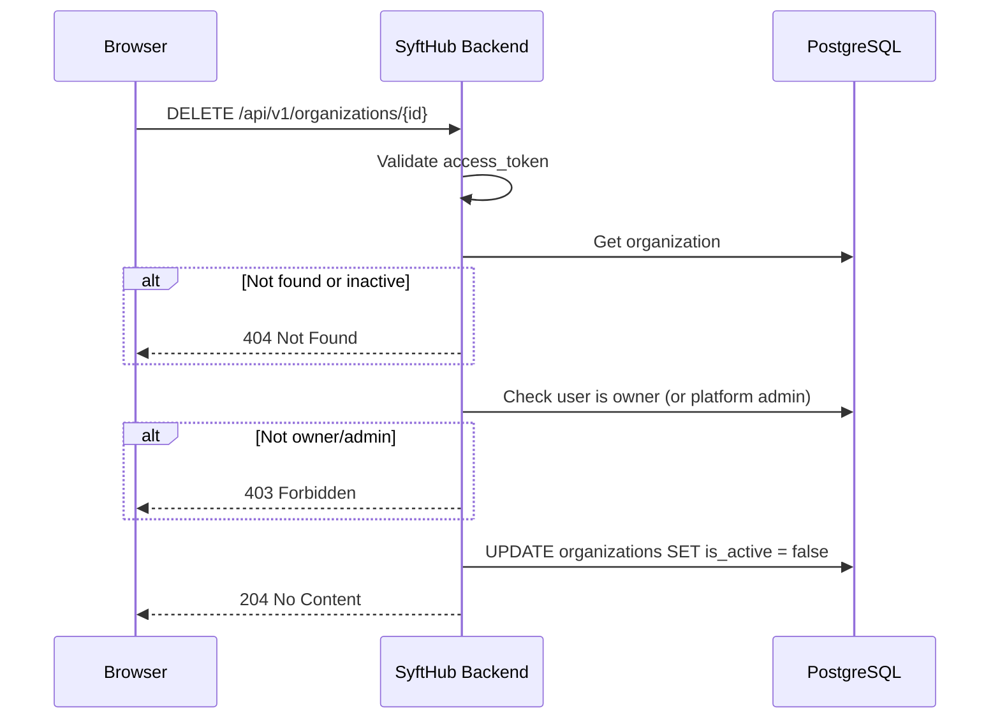
```mermaid
sequenceDiagram
    participant Client as Browser
    participant Backend as SyftHub Backend
    participant DB as PostgreSQL

    Client->>Backend: DELETE /api/v1/organizations/{id}

    Backend->>Backend: Validate access_token
    Backend->>DB: Get organization

    alt Not found or inactive
        Backend-->>Client: 404 Not Found
    end

    Backend->>DB: Check user is owner (or platform admin)

    alt Not owner/admin
        Backend-->>Client: 403 Forbidden
    end

    %% Soft delete
    Backend->>DB: UPDATE organizations SET is_active = false

    Backend-->>Client: 204 No Content
```

---

## 5. Chat/RAG Workflow

The Chat/RAG workflow orchestrates retrieval-augmented generation across multiple data sources and model endpoints.

### 5.1 Complete Chat Flow

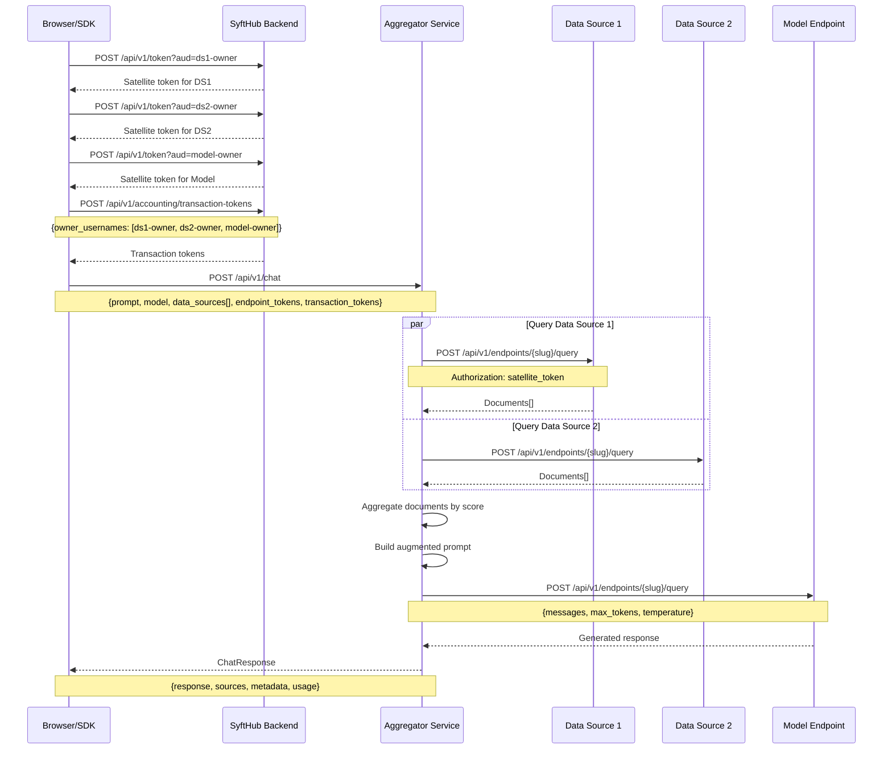
```mermaid
sequenceDiagram
    participant Client as Browser/SDK
    participant Backend as SyftHub Backend
    participant Aggregator as Aggregator Service
    participant DS1 as Data Source 1
    participant DS2 as Data Source 2
    participant Model as Model Endpoint

    %% Token Acquisition Phase
    Client->>Backend: POST /api/v1/token?aud=ds1-owner
    Backend-->>Client: Satellite token for DS1
    Client->>Backend: POST /api/v1/token?aud=ds2-owner
    Backend-->>Client: Satellite token for DS2
    Client->>Backend: POST /api/v1/token?aud=model-owner
    Backend-->>Client: Satellite token for Model

    Client->>Backend: POST /api/v1/accounting/transaction-tokens
    Note over Client,Backend: {owner_usernames: [ds1-owner, ds2-owner, model-owner]}
    Backend-->>Client: Transaction tokens

    %% Chat Request
    Client->>Aggregator: POST /api/v1/chat
    Note over Client,Aggregator: {prompt, model, data_sources[], endpoint_tokens, transaction_tokens}

    %% Retrieval Phase (Parallel)
    par Query Data Source 1
        Aggregator->>DS1: POST /api/v1/endpoints/{slug}/query
        Note over Aggregator,DS1: Authorization: satellite_token
        DS1-->>Aggregator: Documents[]
    and Query Data Source 2
        Aggregator->>DS2: POST /api/v1/endpoints/{slug}/query
        DS2-->>Aggregator: Documents[]
    end

    %% Context Aggregation
    Aggregator->>Aggregator: Aggregate documents by score
    Aggregator->>Aggregator: Build augmented prompt

    %% Generation Phase
    Aggregator->>Model: POST /api/v1/endpoints/{slug}/query
    Note over Aggregator,Model: {messages, max_tokens, temperature}
    Model-->>Aggregator: Generated response

    %% Response
    Aggregator-->>Client: ChatResponse
    Note over Aggregator,Client: {response, sources, metadata, usage}
```

### 5.2 Streaming Chat Flow

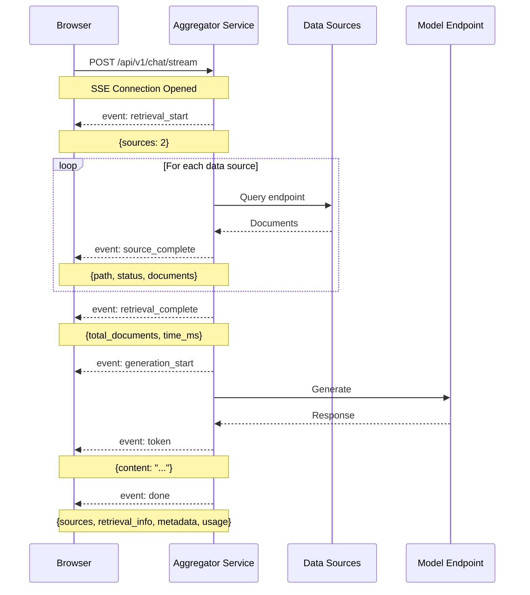
```mermaid
sequenceDiagram
    participant Client as Browser
    participant Aggregator as Aggregator Service
    participant DS as Data Sources
    participant Model as Model Endpoint

    Client->>Aggregator: POST /api/v1/chat/stream
    Note over Client,Aggregator: SSE Connection Opened

    %% Retrieval Events
    Aggregator-->>Client: event: retrieval_start
    Note over Aggregator,Client: {sources: 2}

    loop For each data source
        Aggregator->>DS: Query endpoint
        DS-->>Aggregator: Documents
        Aggregator-->>Client: event: source_complete
        Note over Aggregator,Client: {path, status, documents}
    end

    Aggregator-->>Client: event: retrieval_complete
    Note over Aggregator,Client: {total_documents, time_ms}

    %% Generation Events
    Aggregator-->>Client: event: generation_start

    Aggregator->>Model: Generate
    Model-->>Aggregator: Response

    Aggregator-->>Client: event: token
    Note over Aggregator,Client: {content: "..."}

    Aggregator-->>Client: event: done
    Note over Aggregator,Client: {sources, retrieval_info, metadata, usage}
```

### 5.3 SSE Event Types

| Event Type | Payload | Description |
|------------|---------|-------------|
| `retrieval_start` | `{sources: N}` | Starting retrieval from N sources |
| `source_complete` | `{path, status, documents}` | One source finished |
| `retrieval_complete` | `{total_documents, time_ms}` | All retrieval done |
| `generation_start` | `{}` | Starting model generation |
| `token` | `{content: "..."}` | Response content chunk |
| `error` | `{message: "..."}` | Error occurred |
| `done` | `{sources, metadata, usage}` | Complete response |

### 5.4 Retrieval Service Flow

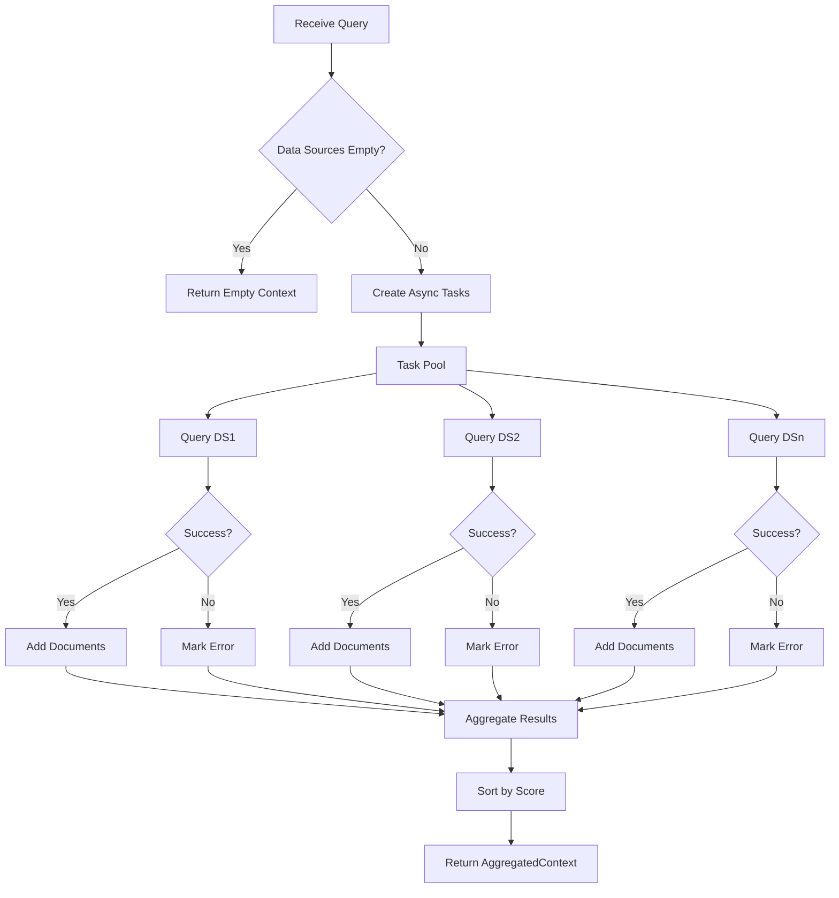
```mermaid
flowchart TD
    A[Receive Query] --> B{Data Sources Empty?}
    B -->|Yes| C[Return Empty Context]
    B -->|No| D[Create Async Tasks]

    D --> E[Task Pool]

    E --> F1[Query DS1]
    E --> F2[Query DS2]
    E --> F3[Query DSn]

    F1 --> G1{Success?}
    F2 --> G2{Success?}
    F3 --> G3{Success?}

    G1 -->|Yes| H1[Add Documents]
    G1 -->|No| I1[Mark Error]
    G2 -->|Yes| H2[Add Documents]
    G2 -->|No| I2[Mark Error]
    G3 -->|Yes| H3[Add Documents]
    G3 -->|No| I3[Mark Error]

    H1 --> J[Aggregate Results]
    H2 --> J
    H3 --> J
    I1 --> J
    I2 --> J
    I3 --> J

    J --> K[Sort by Score]
    K --> L[Return AggregatedContext]
```

### 5.5 Prompt Building

The prompt builder constructs an augmented prompt with retrieved context:

```
System Prompt:
├── Custom system prompt (if provided)
│   OR
├── Default RAG system prompt
│   └── "Answer questions using ONLY the provided context..."
│
└── Context Section (if documents available):
    └── For each document:
        ├── Source: {endpoint_path}
        ├── Title: {document_title}
        └── Content: {document_content}

User Message:
└── Original user prompt
```

### 5.6 Error Handling in Chat

| Error Type | Response | Recovery |
|------------|----------|----------|
| Invalid endpoint token | 401 Unauthorized | Refresh satellite token |
| Data source unavailable | Partial results + error in `retrieval_info` | Continue with available sources |
| Model timeout | 504 Gateway Timeout | Retry with exponential backoff |
| Model error | 400/500 | Return error in SSE `error` event |
| All sources fail | Empty context, model answers without RAG | Inform user of degraded quality |

---

## 6. Satellite Token Workflow

Satellite tokens enable federated authentication across SyftHub and external services (SyftAI-Space endpoints).

### 6.1 Token Exchange Flow

```mermaid
sequenceDiagram
    participant Client as Browser/SDK
    participant Backend as SyftHub Backend
    participant DB as PostgreSQL
    participant KeyMgr as RSA Key Manager
    participant Satellite as SyftAI-Space

    %% Token Request
    Client->>Backend: GET /api/v1/token?aud=target-username
    Note over Client,Backend: Authorization: Bearer <hub_token>

    %% Validate Hub Session
    Backend->>Backend: Verify hub_token (HS256)
    alt Invalid/expired hub token
        Backend-->>Client: 401 Unauthorized
    end

    %% Validate Audience
    Backend->>DB: SELECT user WHERE username = 'target-username'
    DB-->>Backend: User record (or null)

    alt Audience not found
        Backend-->>Client: 400 audience_not_found
    end

    alt Audience user inactive
        Backend-->>Client: 400 audience_inactive
    end

    %% Check IdP Configuration
    Backend->>KeyMgr: Check is_configured
    alt RSA keys not configured
        Backend-->>Client: 503 IdP not configured
    end

    %% Create Satellite Token
    Backend->>Backend: Build payload
    Note over Backend: sub, iss, aud, exp, iat, role
    Backend->>KeyMgr: Get current private key
    Backend->>Backend: Sign with RS256

    Backend-->>Client: 200 OK
    Note over Backend,Client: {target_token, expires_in: 60}

    %% Use Satellite Token
    Client->>Satellite: Request with satellite token
    Note over Client,Satellite: Authorization: Bearer <satellite_token>
    Satellite->>Satellite: Verify RS256 signature (JWKS)
    Satellite->>Satellite: Check audience matches self
    Satellite-->>Client: Response
```

### 6.2 Satellite Token Claims

| Claim | Description | Example |
|-------|-------------|---------|
| `sub` | User's unique ID | `"123"` |
| `iss` | Issuer URL | `"https://hub.syft.org"` |
| `aud` | Target service (username) | `"syftai-space"` |
| `exp` | Expiration timestamp | `1699999999` |
| `iat` | Issued at timestamp | `1699999939` |
| `role` | User's role | `"admin"` or `"user"` |

### 6.3 Token Verification (Server-Side)

```mermaid
sequenceDiagram
    participant Service as Satellite Service
    participant Backend as SyftHub Backend
    participant DB as PostgreSQL
    participant KeyMgr as RSA Key Manager

    Service->>Backend: POST /api/v1/verify
    Note over Service,Backend: {token: "eyJ..."}<br/>Authorization: Bearer <service_token>

    %% Authenticate service
    Backend->>Backend: Verify service's hub token
    Backend->>Backend: Get service username (authorized_audience)

    %% Verify satellite token
    Backend->>KeyMgr: Get public key by kid
    Backend->>Backend: Verify RS256 signature

    alt Invalid signature
        Backend-->>Service: {valid: false, error: "invalid_signature"}
    end

    Backend->>Backend: Check expiration

    alt Token expired
        Backend-->>Service: {valid: false, error: "token_expired"}
    end

    Backend->>Backend: Check audience matches authorized_audience

    alt Audience mismatch
        Backend-->>Service: {valid: false, error: "audience_mismatch"}
    end

    %% Lookup user
    Backend->>DB: SELECT user WHERE id = sub

    alt User not found or inactive
        Backend-->>Service: {valid: false, error: "user_inactive"}
    end

    Backend-->>Service: 200 OK
    Note over Backend,Service: {valid: true, sub, email, username, role, aud, exp, iat}
```

### 6.4 Token Verification (Local - JWKS)

```mermaid
sequenceDiagram
    participant Service as Satellite Service
    participant Backend as SyftHub Backend

    %% Get JWKS (cached)
    Service->>Backend: GET /.well-known/jwks.json
    Backend-->>Service: {keys: [{kid, n, e, ...}]}

    %% Verify locally
    Service->>Service: Extract 'kid' from token header
    Service->>Service: Find matching key in JWKS
    Service->>Service: Verify RS256 signature
    Service->>Service: Check exp, aud claims

    Note over Service: No backend call needed<br/>for subsequent verifications
```

### 6.5 Audience Validation Logic

```mermaid
flowchart TD
    A[Validate Audience] --> B{user_repo provided?}

    B -->|Yes| C[Query DB for username]
    C --> D{User found?}
    D -->|No| E[Error: audience_not_found]
    D -->|Yes| F{User active?}
    F -->|No| G[Error: audience_inactive]
    F -->|Yes| H[Valid]

    B -->|No| I[Check static config]
    I --> J{In allowed_audiences?}
    J -->|Yes| H
    J -->|No| K[Error: invalid_audience]
```

---

## 7. Endpoint Invocation Workflow

When endpoints are invoked (via Chat or directly), the request flows through multiple services with authentication and billing.

### 7.1 Complete Invocation Flow

```mermaid
sequenceDiagram
    participant Client as Client
    participant Backend as SyftHub Backend
    participant Accounting as Accounting Service
    participant Space as SyftAI-Space

    %% Step 1: Get satellite token for endpoint owner
    Client->>Backend: GET /api/v1/token?aud=endpoint-owner
    Backend-->>Client: satellite_token

    %% Step 2: Create transaction token
    Client->>Backend: POST /api/v1/accounting/transaction-tokens
    Note over Client,Backend: {owner_usernames: ["endpoint-owner"]}

    Backend->>Backend: Lookup owner email
    Backend->>Accounting: POST /token/create
    Note over Backend,Accounting: {recipientEmail: owner@email.com}
    Accounting-->>Backend: {token: "tx_token..."}

    Backend-->>Client: {tokens: {"endpoint-owner": "tx_token..."}}

    %% Step 3: Invoke endpoint
    Client->>Space: POST /api/v1/endpoints/{slug}/query
    Note over Client,Space: Authorization: satellite_token<br/>X-Transaction-Token: tx_token

    Space->>Space: Verify satellite token
    Space->>Space: Process request

    %% Step 4: Charge transaction
    Space->>Accounting: POST /transactions/delegated
    Note over Space,Accounting: Using transaction token
    Accounting-->>Space: Transaction confirmed

    Space-->>Client: Response
```

### 7.2 Token Flow Diagram

```mermaid
flowchart LR
    subgraph Client
        A[User App]
    end

    subgraph SyftHub
        B[Backend API]
        C[Key Manager]
    end

    subgraph External
        D[Accounting]
        E[SyftAI-Space]
    end

    A -->|1. Hub Token| B
    B -->|2. RS256 Sign| C
    C -->|3. Satellite Token| A

    A -->|4. Create TX Token| B
    B -->|5. Proxy| D
    D -->|6. TX Token| B
    B -->|7. TX Token| A

    A -->|8. Satellite + TX Token| E
    E -->|9. Verify Satellite| B
    E -->|10. Charge TX| D
    E -->|11. Response| A
```

### 7.3 Transaction Token Creation

```mermaid
sequenceDiagram
    participant Client as Client
    participant Backend as SyftHub Backend
    participant DB as PostgreSQL
    participant Accounting as Accounting Service

    Client->>Backend: POST /api/v1/accounting/transaction-tokens
    Note over Client,Backend: {owner_usernames: ["alice", "bob"]}

    %% Validate caller
    Backend->>Backend: Check caller has accounting configured

    alt No accounting configured
        Backend-->>Client: 400 Accounting not configured
    end

    loop For each owner_username
        %% Lookup owner
        Backend->>DB: SELECT user WHERE username = ?

        alt User not found
            Backend->>Backend: Add to errors map
        else User found
            %% Create token
            Backend->>Accounting: POST /token/create
            Note over Backend,Accounting: {recipientEmail: owner.email}

            alt Success
                Accounting-->>Backend: {token: "..."}
                Backend->>Backend: Add to tokens map
            else Error
                Backend->>Backend: Add to errors map
            end
        end
    end

    Backend-->>Client: 200 OK
    Note over Backend,Client: {tokens: {...}, errors: {...}}
```

### 7.4 Endpoint Query Flow (SyftAI-Space)

```mermaid
flowchart TD
    A[Receive Request] --> B{Satellite Token Present?}
    B -->|No| C[401 Unauthorized]
    B -->|Yes| D[Verify RS256 Signature]

    D --> E{Signature Valid?}
    E -->|No| F[401 Invalid Token]
    E -->|Yes| G{Token Expired?}

    G -->|Yes| H[401 Token Expired]
    G -->|No| I{Audience Matches?}

    I -->|No| J[403 Wrong Audience]
    I -->|Yes| K[Process Request]

    K --> L{Transaction Token Present?}
    L -->|Yes| M[Create Delegated Transaction]
    L -->|No| N[Free tier / Skip billing]

    M --> O[Return Response]
    N --> O
```

---

## Error Handling Patterns

### HTTP Status Code Usage

| Status Code | Meaning | Usage in SyftHub |
|-------------|---------|------------------|
| 200 | OK | Successful GET, PUT, PATCH |
| 201 | Created | Successful POST (create) |
| 204 | No Content | Successful DELETE, logout |
| 400 | Bad Request | Validation errors, invalid input |
| 401 | Unauthorized | Invalid/missing/expired token |
| 403 | Forbidden | Insufficient permissions |
| 404 | Not Found | Resource doesn't exist or hidden |
| 409 | Conflict | Duplicate username/email in SyftHub |
| 424 | Failed Dependency | Accounting account exists (requires password) |
| 500 | Internal Server Error | Unexpected server errors |
| 502 | Bad Gateway | External service (accounting) error |
| 503 | Service Unavailable | IdP not configured, accounting down |
| 504 | Gateway Timeout | External service timeout |

### Error Response Format

```json
{
  "detail": {
    "code": "ERROR_CODE",
    "message": "Human-readable message",
    "field": "optional_field_name"
  }
}
```

### Common Error Codes

| Code | Description | HTTP Status |
|------|-------------|-------------|
| `USER_ALREADY_EXISTS` | Username or email taken | 409 |
| `ACCOUNTING_ACCOUNT_EXISTS` | Email exists in accounting | 424 |
| `INVALID_ACCOUNTING_PASSWORD` | Wrong accounting password | 401 |
| `ACCOUNTING_SERVICE_UNAVAILABLE` | Accounting service down | 503 |
| `audience_not_found` | Satellite token audience invalid | 400 |
| `audience_inactive` | Target user is inactive | 400 |
| `token_expired` | Satellite token expired | 401 |
| `invalid_signature` | Token signature invalid | 401 |
| `audience_mismatch` | Token not for this service | 403 |

### Retry Strategies

| Operation | Retry Policy |
|-----------|--------------|
| Accounting API calls | 3 retries with exponential backoff (1s, 2s, 4s) |
| Data source queries | No retry (fail fast, partial results OK) |
| Model generation | 2 retries with 5s delay |
| Satellite token verification | No retry (fail fast) |

### Circuit Breaker Pattern

```mermaid
stateDiagram-v2
    [*] --> Closed: Start
    Closed --> Open: Failures > Threshold
    Open --> HalfOpen: Timeout Elapsed
    HalfOpen --> Closed: Success
    HalfOpen --> Open: Failure
```

Applied to:
- Accounting service calls
- External endpoint invocations
- Health check monitoring

---

## Summary

This document covered the seven core workflows in SyftHub:

1. **User Registration** - Multi-step flow with accounting integration and edge case handling
2. **Login and Session** - Token-based authentication with refresh and blacklist
3. **Endpoint Lifecycle** - CRUD operations with visibility and permission controls
4. **Organization Workflow** - Role-based collaboration with protection rules
5. **Chat/RAG Workflow** - Parallel retrieval and streaming generation
6. **Satellite Token Workflow** - Federated authentication with RS256 signing
7. **Endpoint Invocation** - Token exchange and transaction management

Each workflow includes proper error handling, edge case management, and follows consistent patterns for authentication and authorization.
