# SyftHub Service Layer & Business Logic

> A comprehensive guide to the service layer architecture, business rules, and domain logic in SyftHub.

## Table of Contents

- [Overview](#overview)
- [Service Layer Architecture](#service-layer-architecture)
- [Repository Pattern](#repository-pattern)
- [Dependency Injection](#dependency-injection)
- [Auth Service](#auth-service)
- [User Service](#user-service)
- [Endpoint Service](#endpoint-service)
- [Organization Service](#organization-service)
- [Accounting Client](#accounting-client)
- [Business Rules & Validation](#business-rules--validation)
- [Error Handling](#error-handling)
- [Integration Patterns](#integration-patterns)

---

## Overview

SyftHub implements a **layered architecture** with clear separation between API routes, business logic (services), and data access (repositories). This design promotes:

1. **Testability** - Services can be unit tested with mocked repositories
2. **Maintainability** - Business logic is centralized and consistent
3. **Reusability** - Services can be composed and reused across different API endpoints
4. **Transaction Management** - Database operations are properly scoped

### Architecture Layers

```
┌─────────────────────────────────────────────────────────────────────────────┐
│                              API LAYER (Routes)                              │
│  ┌──────────────┐ ┌──────────────┐ ┌──────────────┐ ┌──────────────────┐   │
│  │ Auth Routes  │ │ User Routes  │ │Endpoint Routes│ │ Organization    │   │
│  │ /api/v1/auth │ │ /api/v1/users│ │/api/v1/endpoint││   Routes        │   │
│  └──────┬───────┘ └──────┬───────┘ └──────┬───────┘ └────────┬─────────┘   │
│         │                │                │                   │              │
└─────────┼────────────────┼────────────────┼───────────────────┼──────────────┘
          │                │                │                   │
          ▼                ▼                ▼                   ▼
┌─────────────────────────────────────────────────────────────────────────────┐
│                           SERVICE LAYER (Business Logic)                     │
│  ┌──────────────┐ ┌──────────────┐ ┌──────────────┐ ┌──────────────────┐   │
│  │ AuthService  │ │ UserService  │ │EndpointService│ │OrganizationService│  │
│  │              │ │              │ │               │ │                  │   │
│  │ - register() │ │ - profile()  │ │ - create()   │ │ - create()       │   │
│  │ - login()    │ │ - update()   │ │ - update()   │ │ - add_member()   │   │
│  │ - refresh()  │ │ - search()   │ │ - star()     │ │ - get_members()  │   │
│  └──────┬───────┘ └──────┬───────┘ └──────┬───────┘ └────────┬─────────┘   │
│         │                │                │                   │              │
└─────────┼────────────────┼────────────────┼───────────────────┼──────────────┘
          │                │                │                   │
          ▼                ▼                ▼                   ▼
┌─────────────────────────────────────────────────────────────────────────────┐
│                         REPOSITORY LAYER (Data Access)                       │
│  ┌──────────────┐ ┌──────────────┐ ┌──────────────┐ ┌──────────────────┐   │
│  │UserRepository│ │EndpointRepo  │ │ StarRepo     │ │OrganizationRepo  │   │
│  │              │ │              │ │              │ │MemberRepository  │   │
│  │ - get_by_id()│ │ - create()   │ │ - star()     │ │ - add_member()   │   │
│  │ - create()   │ │ - update()   │ │ - unstar()   │ │ - get_role()     │   │
│  └──────┬───────┘ └──────┬───────┘ └──────┬───────┘ └────────┬─────────┘   │
│         │                │                │                   │              │
└─────────┼────────────────┼────────────────┼───────────────────┼──────────────┘
          │                │                │                   │
          ▼                ▼                ▼                   ▼
┌─────────────────────────────────────────────────────────────────────────────┐
│                              DATABASE (PostgreSQL)                           │
│  ┌──────────────────────────────────────────────────────────────────────┐   │
│  │  users │ endpoints │ endpoint_stars │ organizations │ org_members    │   │
│  └──────────────────────────────────────────────────────────────────────┘   │
└─────────────────────────────────────────────────────────────────────────────┘
```

---

## Service Layer Architecture

### Base Service Class

All services inherit from `BaseService` which provides common database operations and transaction management.

```python
# /backend/src/syfthub/services/base.py

class BaseService:
    """Base service with common functionality."""

    def __init__(self, session: Session):
        """Initialize service with database session."""
        self.session = session

    def commit(self) -> None:
        """Commit the current transaction."""
        self.session.commit()

    def rollback(self) -> None:
        """Rollback the current transaction."""
        self.session.rollback()

    def refresh(self, instance: Any) -> None:
        """Refresh an instance from the database."""
        self.session.refresh(instance)
```

### Service Class Diagram

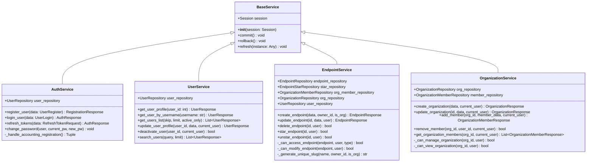

---

## Repository Pattern

### Base Repository

The repository pattern abstracts database operations, providing a consistent interface for CRUD operations.

```python
# /backend/src/syfthub/repositories/base.py

class BaseRepository(Generic[T]):
    """Base repository with common CRUD operations."""

    def __init__(self, session: Session, model: Type[T]):
        """Initialize repository with database session and model class."""
        self.session = session
        self.model = model

    def get_by_id(self, id: int) -> Optional[T]:
        """Get a record by ID."""
        return self.session.get(self.model, id)

    def get_all(
        self,
        skip: int = 0,
        limit: int = 100,
        filters: Optional[dict[str, Any]] = None,
    ) -> List[T]:
        """Get all records with pagination and optional filtering."""
        query = select(self.model)
        if filters:
            conditions = []
            for field, value in filters.items():
                if hasattr(self.model, field):
                    conditions.append(getattr(self.model, field) == value)
            if conditions:
                query = query.where(and_(*conditions))
        query = query.offset(skip).limit(limit)
        result = self.session.execute(query)
        return result.scalars().all()

    def create(self, **kwargs) -> Optional[T]:
        """Create a new record."""
        obj = self.model(**kwargs)
        self.session.add(obj)
        self.session.commit()
        self.session.refresh(obj)
        return obj

    def update(self, id: int, **kwargs) -> Optional[T]:
        """Update a record by ID."""
        obj = self.get_by_id(id)
        if not obj:
            return None
        for field, value in kwargs.items():
            if hasattr(obj, field):
                setattr(obj, field, value)
        self.session.commit()
        self.session.refresh(obj)
        return obj

    def delete(self, id: int) -> bool:
        """Delete a record by ID."""
        obj = self.get_by_id(id)
        if not obj:
            return False
        self.session.delete(obj)
        self.session.commit()
        return True

    def exists(self, **filters) -> bool:
        """Check if a record exists with the given filters."""
        query = select(self.model)
        conditions = []
        for field, value in filters.items():
            if hasattr(self.model, field):
                conditions.append(getattr(self.model, field) == value)
        if conditions:
            query = query.where(and_(*conditions))
        result = self.session.execute(query.limit(1))
        return result.scalar() is not None
```

### Repository Hierarchy

```
BaseRepository[T]
    ├── UserRepository         - User CRUD + authentication queries
    ├── EndpointRepository     - Endpoint CRUD + visibility filtering
    ├── EndpointStarRepository - Star/unstar operations
    ├── OrganizationRepository - Organization CRUD
    └── OrganizationMemberRepository - Membership management
```

### Repository Responsibilities

| Repository | Key Methods | Purpose |
|------------|-------------|---------|
| `UserRepository` | `get_by_username()`, `get_by_email()`, `username_exists()` | User lookup and uniqueness checks |
| `EndpointRepository` | `get_by_user_and_slug()`, `get_public_endpoints()`, `increment_stars()` | Endpoint management with visibility |
| `EndpointStarRepository` | `star_endpoint()`, `unstar_endpoint()`, `is_starred()` | Star relationship management |
| `OrganizationRepository` | `get_by_slug()`, `slug_exists()` | Organization lookup |
| `OrganizationMemberRepository` | `is_member()`, `get_member_role()`, `add_member()` | Membership and permissions |

---

## Dependency Injection

SyftHub uses FastAPI's dependency injection system to provide services with database sessions.

### Database Session Dependency

```python
# Typical dependency injection pattern

from fastapi import Depends
from sqlalchemy.orm import Session
from syfthub.core.database import get_db

def get_auth_service(session: Session = Depends(get_db)) -> AuthService:
    return AuthService(session)

def get_endpoint_service(session: Session = Depends(get_db)) -> EndpointService:
    return EndpointService(session)

# Usage in routes
@router.post("/register")
async def register(
    data: UserRegister,
    auth_service: AuthService = Depends(get_auth_service)
):
    return auth_service.register_user(data)
```

### Dependency Flow Diagram

```
┌─────────────────────────────────────────────────────────────────────┐
│                          HTTP Request                                │
└─────────────────────────────────────────────────────────────────────┘
                                    │
                                    ▼
┌─────────────────────────────────────────────────────────────────────┐
│                          FastAPI Router                              │
│                                                                      │
│   @router.post("/endpoints")                                        │
│   async def create_endpoint(                                        │
│       data: EndpointCreate,                                         │
│       current_user: User = Depends(get_current_user),    ◄────┐    │
│       service: EndpointService = Depends(get_endpoint_service) │    │
│   ):                                                              │    │
└───────────────────────────────────────────────────────────────────┘
                                    │                               │
                    ┌───────────────┴──────────────┐                │
                    ▼                              ▼                │
┌─────────────────────────────┐    ┌─────────────────────────────┐ │
│   get_endpoint_service()    │    │    get_current_user()       │ │
│                             │    │                             │ │
│   session = get_db()        │    │   token = get_token()       │─┘
│   return EndpointService(   │    │   payload = verify(token)   │
│       session               │    │   user = get_user(id)       │
│   )                         │    │   return user               │
└─────────────────────────────┘    └─────────────────────────────┘
                │
                ▼
┌─────────────────────────────────────────────────────────────────────┐
│                        EndpointService                               │
│                                                                      │
│   Repositories initialized with shared session:                     │
│   - self.endpoint_repository = EndpointRepository(session)          │
│   - self.star_repository = EndpointStarRepository(session)          │
│   - self.org_member_repository = OrganizationMemberRepository(...)  │
│   - self.org_repository = OrganizationRepository(session)           │
│   - self.user_repository = UserRepository(session)                  │
└─────────────────────────────────────────────────────────────────────┘
```

---

## Auth Service

The `AuthService` handles all authentication-related business logic including user registration, login, token management, and password operations.

### Class Structure

```python
# /backend/src/syfthub/services/auth_service.py

class AuthService(BaseService):
    """Authentication service for handling user authentication operations."""

    def __init__(self, session: Session):
        super().__init__(session)
        self.user_repository = UserRepository(session)
```

### Method Reference

| Method | Parameters | Returns | Description |
|--------|------------|---------|-------------|
| `register_user` | `UserRegister` | `RegistrationResponse` | Complete registration flow |
| `login_user` | `UserLogin` | `AuthResponse` | Authenticate and issue tokens |
| `refresh_tokens` | `RefreshTokenRequest` | `AuthResponse` | Refresh expired access token |
| `change_password` | `User, str, str` | `None` | Update user password |
| `get_user_by_username` | `str` | `Optional[User]` | Lookup by username |
| `get_user_by_email` | `str` | `Optional[User]` | Lookup by email |
| `get_user_by_id` | `int` | `Optional[User]` | Lookup by ID |

### Registration Flow

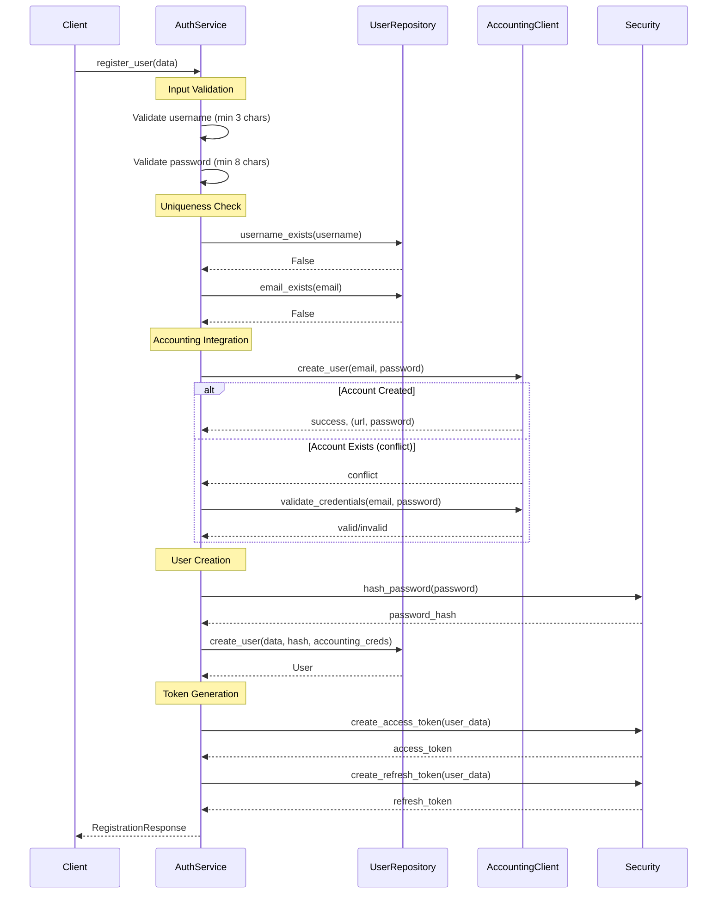

### Login Flow

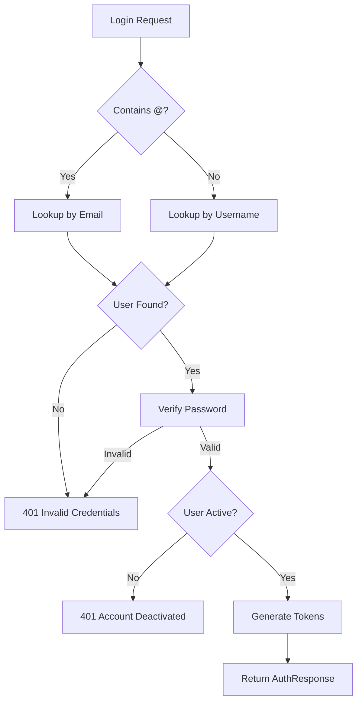

### Accounting Integration Strategies

The registration process supports multiple accounting service integration scenarios:

```python
def _handle_accounting_registration(
    self,
    email: str,
    accounting_url: Optional[str],
    accounting_password: Optional[str],
) -> Tuple[Optional[str], Optional[str]]:
    """
    Handle accounting service registration during user signup.

    Strategy Matrix:
    ┌────────────────┬────────────────────────────────────────────────┐
    │ Password Given │ Behavior                                       │
    ├────────────────┼────────────────────────────────────────────────┤
    │ Yes            │ Try create → On conflict → Validate existing  │
    │ No             │ Auto-generate → Create → On conflict → Error  │
    └────────────────┴────────────────────────────────────────────────┘
    """
```

---

## User Service

The `UserService` handles user profile management, admin operations, and user discovery.

### Class Structure

```python
# /backend/src/syfthub/services/user_service.py

class UserService(BaseService):
    """User service for handling user management operations."""

    def __init__(self, session: Session):
        super().__init__(session)
        self.user_repository = UserRepository(session)
```

### Method Reference

| Method | Parameters | Returns | Description |
|--------|------------|---------|-------------|
| `get_user_profile` | `user_id: int` | `Optional[UserResponse]` | Get user by ID |
| `get_user_by_username` | `username: str` | `Optional[UserResponse]` | Get user by username |
| `get_users_list` | `skip, limit, active_only` | `List[UserResponse]` | Paginated user list |
| `update_user_profile` | `user_id, data, current_user` | `UserResponse` | Update with permission check |
| `deactivate_user` | `user_id, current_user` | `bool` | Admin-only deactivation |
| `search_users` | `query, limit` | `List[UserResponse]` | Search by username/name |
| `get_user_stats` | `user_id` | `dict` | Get user statistics |
| `username_available` | `username: str` | `bool` | Check availability |
| `email_available` | `email: str` | `bool` | Check availability |

### Permission Model

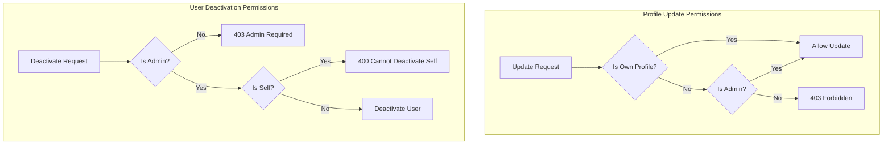

### Update Profile Business Rules

```python
def update_user_profile(
    self, user_id: int, user_data: UserUpdate, current_user: User
) -> UserResponse:
    """
    Business Rules:
    1. Users can only update their own profile (or admin can update any)
    2. Username must remain unique if changed
    3. Email must remain unique if changed
    4. Changes are validated before persistence
    """
    # Permission check
    if current_user.id != user_id and current_user.role != "admin":
        raise HTTPException(403, "Permission denied")

    # Username uniqueness (if being updated)
    if user_data.username:
        existing = self.user_repository.get_by_username(user_data.username)
        if existing and existing.id != user_id:
            raise HTTPException(400, "Username already exists")

    # Email uniqueness (if being updated)
    if user_data.email:
        existing = self.user_repository.get_by_email(user_data.email)
        if existing and existing.id != user_id:
            raise HTTPException(400, "Email already exists")

    return self.user_repository.update_user(user_id, user_data)
```

---

## Endpoint Service

The `EndpointService` is the most complex service, handling endpoint CRUD operations, access control, starring, and slug management.

### Class Structure

```python
# /backend/src/syfthub/services/endpoint_service.py

class EndpointService(BaseService):
    """Endpoint service for handling endpoint operations."""

    def __init__(self, session: Session):
        super().__init__(session)
        self.endpoint_repository = EndpointRepository(session)
        self.star_repository = EndpointStarRepository(session)
        self.org_member_repository = OrganizationMemberRepository(session)
        self.org_repository = OrganizationRepository(session)
        self.user_repository = UserRepository(session)
```

### Method Reference

| Method | Parameters | Returns | Description |
|--------|------------|---------|-------------|
| `create_endpoint` | `data, owner_id, is_org, user` | `EndpointResponse` | Create new endpoint |
| `get_endpoint` | `endpoint_id, current_user` | `EndpointResponse` | Get with access check |
| `get_user_endpoints` | `user_id, skip, limit, visibility, search, user` | `List[EndpointResponse]` | User's endpoints |
| `get_organization_endpoints` | `org_id, skip, limit, visibility, user` | `List[EndpointResponse]` | Org's endpoints |
| `get_public_endpoints` | `skip, limit, endpoint_type` | `List[EndpointPublicResponse]` | Public discovery |
| `list_trending_endpoints` | `skip, limit, min_stars, type` | `List[EndpointPublicResponse]` | Sorted by stars |
| `update_endpoint` | `endpoint_id, data, current_user` | `EndpointResponse` | Update with permission |
| `delete_endpoint` | `endpoint_id, current_user` | `bool` | Soft delete |
| `star_endpoint` | `endpoint_id, current_user` | `bool` | Add star |
| `unstar_endpoint` | `endpoint_id, current_user` | `bool` | Remove star |
| `is_endpoint_starred` | `endpoint_id, current_user` | `bool` | Check star status |

### Endpoint Creation Flow

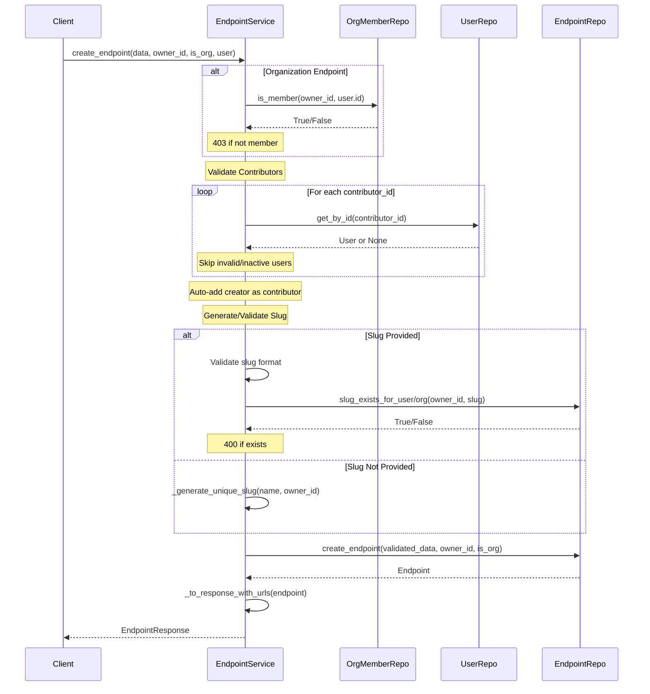

### Visibility & Access Control

```python
def _can_access_endpoint(
    self, endpoint: Endpoint, current_user: Optional[User], owner_type: str
) -> bool:
    """
    Access Control Matrix:
    ┌────────────┬───────────┬────────────────┬────────────────┬──────────────┐
    │ Visibility │ Anonymous │ Authenticated │ Org Member     │ Owner/Admin  │
    ├────────────┼───────────┼────────────────┼────────────────┼──────────────┤
    │ PUBLIC     │ ✓         │ ✓              │ ✓              │ ✓            │
    │ INTERNAL   │ ✗         │ ✓ (user-owned) │ ✓              │ ✓            │
    │ PRIVATE    │ ✗         │ ✗              │ ✓ (org-owned)  │ ✓            │
    └────────────┴───────────┴────────────────┴────────────────┴──────────────┘
    """
    # Public endpoints are always accessible
    if endpoint.visibility == EndpointVisibility.PUBLIC:
        return True

    # Unauthenticated users can only see public
    if current_user is None:
        return False

    # Admin can access everything
    if current_user.role == "admin":
        return True

    # User-owned endpoints
    if owner_type == "user" and endpoint.user_id:
        if endpoint.user_id == current_user.id:
            return True
        return endpoint.visibility == EndpointVisibility.INTERNAL

    # Organization-owned endpoints
    if owner_type == "organization" and endpoint.organization_id:
        return self.org_member_repository.is_member(
            endpoint.organization_id, current_user.id
        )

    return False
```

### Modification Permissions

```python
def _can_modify_endpoint(self, endpoint: Endpoint, current_user: User) -> bool:
    """
    Modification Permission Matrix:
    ┌─────────────────────┬──────────────────────────────────────────┐
    │ Owner Type          │ Who Can Modify                           │
    ├─────────────────────┼──────────────────────────────────────────┤
    │ User-owned          │ Owner OR Admin                           │
    │ Organization-owned  │ Org Owner/Admin role OR System Admin    │
    └─────────────────────┴──────────────────────────────────────────┘
    """
    if current_user.role == "admin":
        return True

    if endpoint.user_id:
        return endpoint.user_id == current_user.id

    if endpoint.organization_id:
        member_role = self.org_member_repository.get_member_role(
            endpoint.organization_id, current_user.id
        )
        return member_role in [OrganizationRole.OWNER, OrganizationRole.ADMIN]

    return False
```

### Slug Generation Algorithm

```python
def _generate_unique_slug(
    self,
    name: str,
    owner_id: int,
    is_organization: bool = False,
) -> str:
    """
    Slug Generation Rules:
    1. Convert name to lowercase
    2. Replace non-alphanumeric with hyphens
    3. Remove leading/trailing hyphens
    4. Ensure minimum length (3 chars)
    5. Truncate to max length (63 chars)
    6. If taken, append incrementing number (-1, -2, etc.)
    7. Fallback: append timestamp suffix
    """
    base_slug = generate_slug_from_name(name)

    # Check availability
    if is_organization:
        slug_available = not self.endpoint_repository.slug_exists_for_organization(
            owner_id, base_slug
        )
    else:
        slug_available = self._is_slug_available(base_slug, owner_id)

    if slug_available:
        return base_slug

    # Try numbered variants
    counter = 1
    while counter < 1000:
        new_slug = f"{base_slug}-{counter}"
        if len(new_slug) <= 63:
            if self._check_slug_available(new_slug, owner_id, is_organization):
                return new_slug
        counter += 1

    # Fallback to timestamp
    timestamp = str(int(datetime.now(timezone.utc).timestamp()))[-6:]
    return f"{base_slug[:50]}-{timestamp}"
```

### Reserved Slugs

The following slugs are reserved and cannot be used for endpoints:

```python
RESERVED_SLUGS = {
    "api", "auth", "docs", "redoc", "openapi.json", "health",
    "admin", "www", "mail", "ftp", "blog", "help", "support",
    "about", "contact", "terms", "privacy", "login", "register",
    "dashboard", "settings", "profile", "search", "explore"
}
```

### Starring System

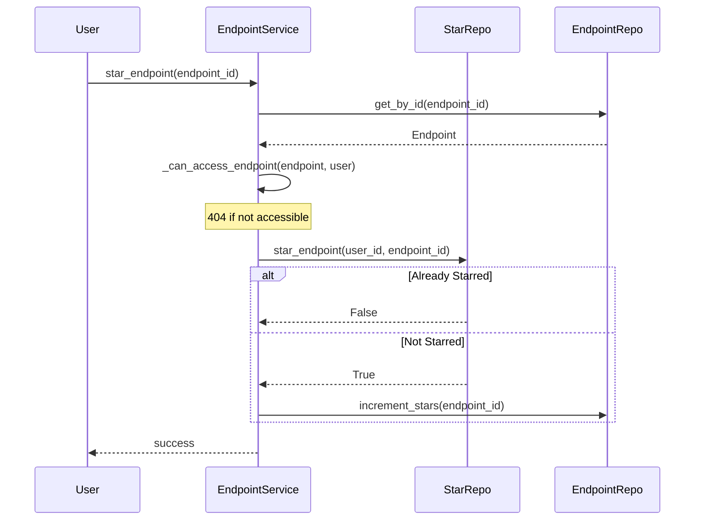

---

## Organization Service

The `OrganizationService` manages organizations and their memberships.

### Class Structure

```python
# /backend/src/syfthub/services/organization_service.py

class OrganizationService(BaseService):
    """Organization service for handling organization operations."""

    def __init__(self, session: Session):
        super().__init__(session)
        self.org_repository = OrganizationRepository(session)
        self.member_repository = OrganizationMemberRepository(session)
```

### Method Reference

| Method | Parameters | Returns | Description |
|--------|------------|---------|-------------|
| `create_organization` | `data, current_user` | `OrganizationResponse` | Create with owner |
| `get_organization` | `org_id, current_user` | `OrganizationResponse` | Get with access check |
| `get_organization_by_slug` | `slug` | `Optional[OrganizationResponse]` | Lookup by slug |
| `update_organization` | `org_id, data, current_user` | `OrganizationResponse` | Update with permission |
| `add_member` | `org_id, member_data, current_user` | `OrganizationMemberResponse` | Add new member |
| `remove_member` | `org_id, user_id, current_user` | `bool` | Remove member |
| `get_organization_members` | `org_id, current_user` | `List[OrganizationMemberResponse]` | List members |
| `get_user_organizations` | `user_id` | `List[OrganizationResponse]` | User's organizations |
| `is_member` | `org_id, user_id` | `bool` | Check membership |
| `get_member_role` | `org_id, user_id` | `Optional[OrganizationRole]` | Get user's role |

### Organization Creation Flow

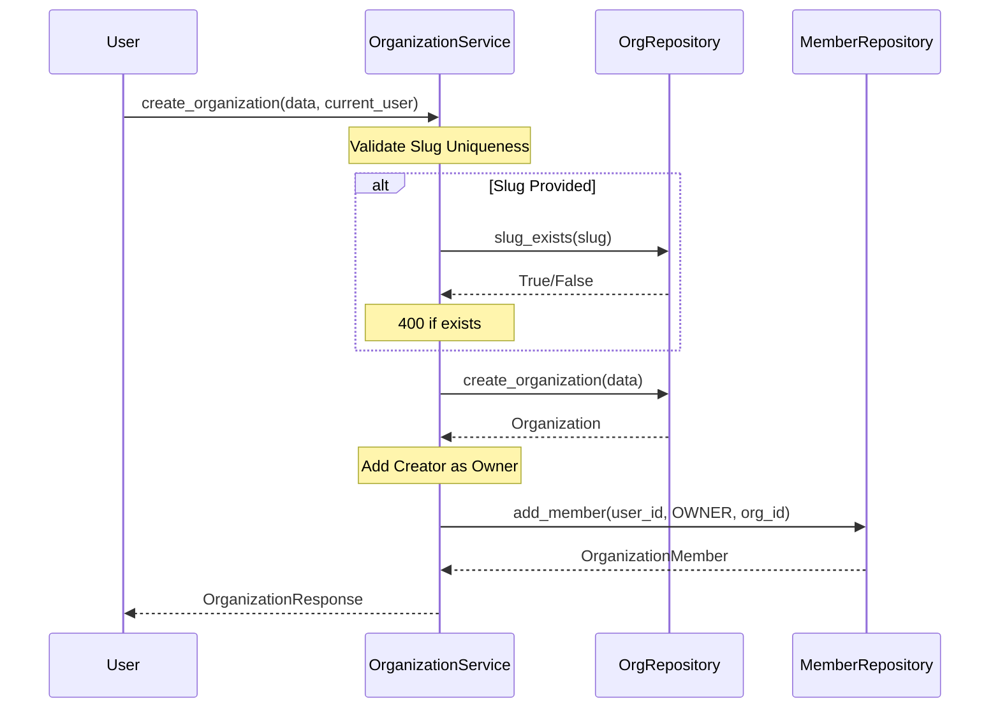

### Organization Role Permissions

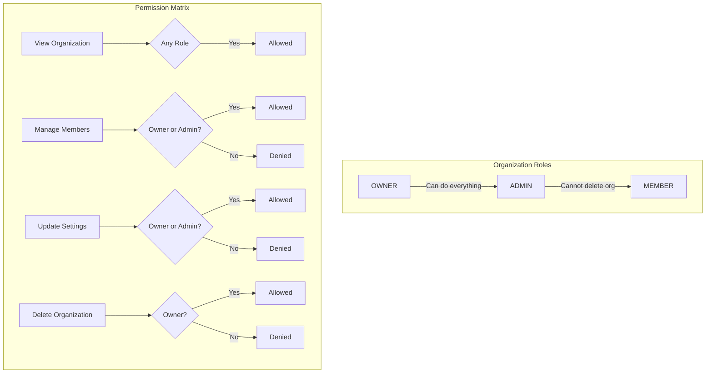

### Permission Check Methods

```python
def _can_manage_organization(self, org_id: int, user: User) -> bool:
    """Check if user can manage organization (owner/admin role)."""
    if user.role == "admin":  # System admin
        return True

    member_role = self.member_repository.get_member_role(org_id, user.id)
    return member_role in [OrganizationRole.OWNER, OrganizationRole.ADMIN]

def _can_view_organization(self, org_id: int, user: User) -> bool:
    """Check if user can view organization details."""
    if user.role == "admin":  # System admin
        return True

    return self.member_repository.is_member(org_id, user.id)
```

---

## Accounting Client

The `AccountingClient` provides integration with an external billing/accounting service.

### Client Structure

```python
# /backend/src/syfthub/services/accounting_client.py

@dataclass(frozen=True)
class AccountingUser:
    """User data from the accounting service."""
    id: str
    email: str
    balance: float
    organization: Optional[str] = None

@dataclass(frozen=True)
class AccountingUserResult:
    """Result of an accounting service user operation."""
    success: bool
    user: Optional[AccountingUser] = None
    conflict: bool = False
    error: Optional[str] = None

class AccountingClient:
    """HTTP client for external accounting service."""

    def __init__(self, base_url: str, timeout: float = 30.0):
        self.base_url = base_url.rstrip("/")
        self.timeout = timeout
        self._client: Optional[httpx.Client] = None
```

### API Methods

| Method | Parameters | Returns | Description |
|--------|------------|---------|-------------|
| `create_user` | `email, password, org` | `AccountingUserResult` | Create accounting account |
| `validate_credentials` | `email, password` | `bool` | Verify existing credentials |
| `get_user` | `email, password` | `Optional[AccountingUser]` | Get user info |

### Integration Flow

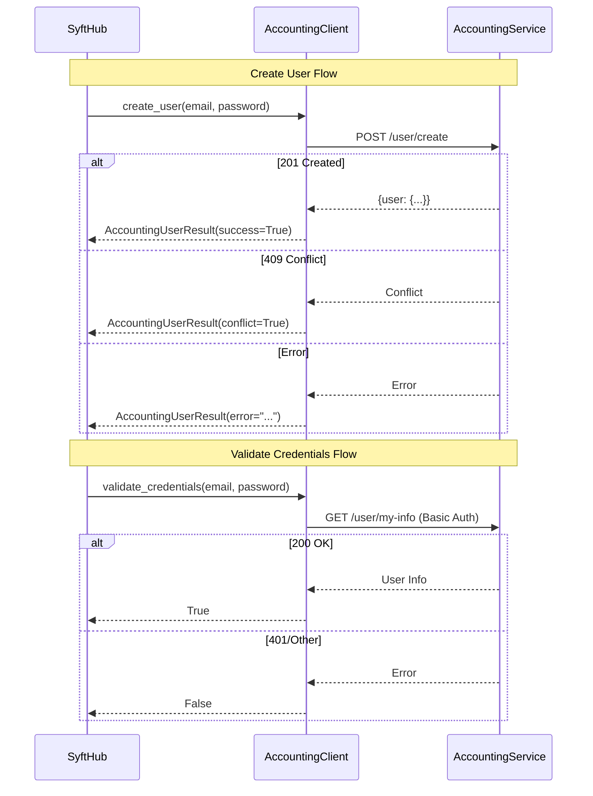

### Password Generation

```python
def generate_accounting_password(length: int = 32) -> str:
    """
    Generate a secure random password for accounting service.

    Requirements:
    - Mix of lowercase, uppercase, digits, and special characters
    - At least one of each character type
    - Cryptographically secure randomization
    - Shuffled to avoid predictable positions
    """
    alphabet = string.ascii_letters + string.digits + "!@#$%^&*"

    # Ensure at least one of each type
    password = [
        secrets.choice(string.ascii_lowercase),
        secrets.choice(string.ascii_uppercase),
        secrets.choice(string.digits),
        secrets.choice("!@#$%^&*"),
    ]

    # Fill the rest
    password.extend(secrets.choice(alphabet) for _ in range(length - 4))

    # Shuffle to avoid predictable positions
    password_list = list(password)
    secrets.SystemRandom().shuffle(password_list)

    return "".join(password_list)
```

### Error Handling

```python
def create_user(self, email: str, password: str, organization: Optional[str] = None) -> AccountingUserResult:
    try:
        response = self.client.post("/user/create", json=payload, headers=self._get_headers())

        if response.status_code == 201:
            return AccountingUserResult(success=True, user=self._parse_user_response(response.json()))

        if response.status_code == 409:
            return AccountingUserResult(success=False, conflict=True, error="User exists")

        return AccountingUserResult(success=False, error=self._extract_error_detail(response))

    except httpx.TimeoutException:
        return AccountingUserResult(success=False, error="Request timed out")

    except httpx.RequestError as e:
        return AccountingUserResult(success=False, error=f"Connection failed: {e}")

    except Exception as e:
        return AccountingUserResult(success=False, error=f"Unexpected error: {e}")
```

---

## Business Rules & Validation

### Input Validation Rules

```
┌─────────────────────────────────────────────────────────────────────────────┐
│                          VALIDATION RULES SUMMARY                            │
├─────────────────────────────────────────────────────────────────────────────┤
│                                                                              │
│  USER REGISTRATION                                                           │
│  ├── username: 3-50 chars, alphanumeric + _ -                               │
│  ├── email: Valid RFC 5322 format                                            │
│  ├── password: Minimum 8 characters                                          │
│  └── full_name: 1-100 characters                                            │
│                                                                              │
│  ENDPOINT CREATION                                                           │
│  ├── name: 1-100 characters                                                  │
│  ├── slug: 3-63 chars, lowercase alphanumeric + hyphens, not reserved       │
│  ├── description: Max 500 characters                                         │
│  ├── version: Semantic version format (X.Y.Z)                               │
│  ├── readme: Max 50,000 characters                                          │
│  └── tags: Max 10, each 1-30 chars, lowercase alphanumeric + hyphens        │
│                                                                              │
│  ORGANIZATION CREATION                                                       │
│  ├── name: 1-100 characters                                                  │
│  ├── slug: 3-63 chars, unique, not reserved                                 │
│  └── description: Max 1000 characters                                        │
│                                                                              │
└─────────────────────────────────────────────────────────────────────────────┘
```

### Domain Constraints

```python
# Constraint: Exactly one owner (XOR)
"""
An endpoint must have exactly ONE owner - either a user_id OR an organization_id,
but never both and never neither.

SQL Constraint: (user_id IS NULL) != (organization_id IS NULL)
"""

# Constraint: Unique slug per owner
"""
Slugs must be unique within the scope of their owner:
- User endpoints: unique (user_id, slug)
- Org endpoints: unique (organization_id, slug)

This allows: user/my-model AND org/my-model to coexist
"""

# Constraint: Soft deletes for endpoints
"""
Endpoints are never hard-deleted. Instead, is_active is set to False.
This preserves referential integrity and audit history.
"""

# Constraint: At least one contributor
"""
Every endpoint must have at least one contributor.
The creating user is automatically added if not specified.
"""
```

### Business Rule Implementations

```python
# Rule: Contributors must be valid, active users
def _validate_contributors(self, contributor_ids: List[int]) -> List[int]:
    """
    Validation Rules:
    1. Remove duplicate IDs (preserve order)
    2. Skip invalid user IDs (log warning, don't fail)
    3. Skip inactive users
    4. Return list of valid contributor IDs
    """
    unique_ids = []
    seen = set()
    for user_id in contributor_ids:
        if user_id not in seen:
            unique_ids.append(user_id)
            seen.add(user_id)

    valid_contributors = []
    for user_id in unique_ids:
        user = self.user_repository.get_by_id(user_id)
        if user and user.is_active:
            valid_contributors.append(user_id)

    return valid_contributors


# Rule: Uniqueness validation before update
def _validate_unique_on_update(self, field_name: str, new_value: str, current_id: int):
    """
    When updating username/email, check that the new value doesn't
    conflict with another existing record (excluding self).
    """
    existing = self.repository.get_by_field(field_name, new_value)
    if existing and existing.id != current_id:
        raise HTTPException(400, f"{field_name} already exists")
```

### State Machine: Endpoint Lifecycle

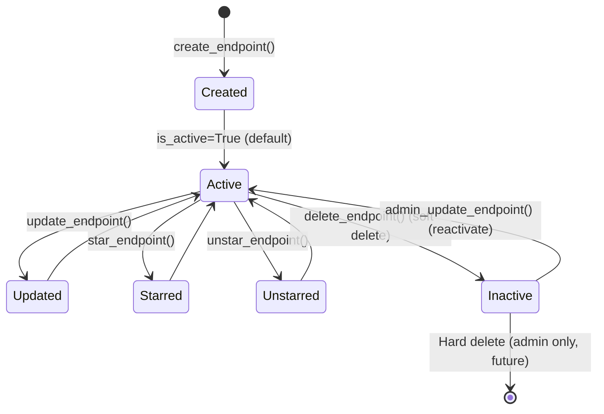

---

## Error Handling

### Domain Exception Hierarchy

```python
# /backend/src/syfthub/domain/exceptions.py

class DomainException(Exception):
    """Base exception for domain-related errors."""
    def __init__(self, message: str, error_code: str = "DOMAIN_ERROR"):
        self.message = message
        self.error_code = error_code
        super().__init__(message)


class ValidationError(DomainException):
    """Exception raised when domain validation fails."""
    def __init__(self, message: str):
        super().__init__(message, "VALIDATION_ERROR")


# User Registration Exceptions
class UserAlreadyExistsError(DomainException):
    """Raised when username or email already exists."""
    def __init__(self, field: str, value: str):
        self.field = field
        self.value = value
        super().__init__(f"{field.capitalize()} already exists", "USER_ALREADY_EXISTS")


# Accounting Service Exceptions
class AccountingException(DomainException):
    """Base exception for accounting service errors."""
    pass


class AccountingAccountExistsError(AccountingException):
    """Raised when email already has an account in accounting service."""
    def __init__(self, email: str):
        self.email = email
        self.requires_accounting_password = True
        super().__init__(
            f"Email ({email}) already has an accounting account. "
            "Please provide your existing accounting password.",
            "ACCOUNTING_ACCOUNT_EXISTS"
        )


class InvalidAccountingPasswordError(AccountingException):
    """Raised when the provided accounting password is invalid."""
    def __init__(self):
        super().__init__(
            "The provided accounting password is invalid.",
            "INVALID_ACCOUNTING_PASSWORD"
        )


class AccountingServiceUnavailableError(AccountingException):
    """Raised when the accounting service is unavailable."""
    def __init__(self, detail: str):
        self.detail = detail
        super().__init__(f"Accounting service error: {detail}", "ACCOUNTING_SERVICE_UNAVAILABLE")


# Identity Provider Exceptions
class IdPException(DomainException):
    """Base exception for Identity Provider errors."""
    pass


class AudienceNotFoundError(IdPException):
    """Raised when the requested audience is not a registered user."""
    def __init__(self, audience: str):
        self.audience = audience
        super().__init__(f"Audience '{audience}' is not a registered user.", "AUDIENCE_NOT_FOUND")


class AudienceInactiveError(IdPException):
    """Raised when the requested audience user is inactive."""
    def __init__(self, audience: str):
        self.audience = audience
        super().__init__(f"Audience '{audience}' is inactive.", "AUDIENCE_INACTIVE")
```

### Error Code Reference

| Error Code | Exception Class | HTTP Status | Description |
|------------|-----------------|-------------|-------------|
| `DOMAIN_ERROR` | `DomainException` | 400 | Generic domain error |
| `VALIDATION_ERROR` | `ValidationError` | 400 | Input validation failed |
| `USER_ALREADY_EXISTS` | `UserAlreadyExistsError` | 409 | Duplicate username/email |
| `ACCOUNTING_ACCOUNT_EXISTS` | `AccountingAccountExistsError` | 409 | Email exists in accounting |
| `INVALID_ACCOUNTING_PASSWORD` | `InvalidAccountingPasswordError` | 400 | Wrong accounting password |
| `ACCOUNTING_SERVICE_UNAVAILABLE` | `AccountingServiceUnavailableError` | 503 | Accounting service down |
| `AUDIENCE_NOT_FOUND` | `AudienceNotFoundError` | 404 | Token audience invalid |
| `AUDIENCE_INACTIVE` | `AudienceInactiveError` | 403 | Token audience inactive |
| `KEY_NOT_CONFIGURED` | `KeyNotConfiguredError` | 503 | RSA keys not configured |

### Error Handling Flow

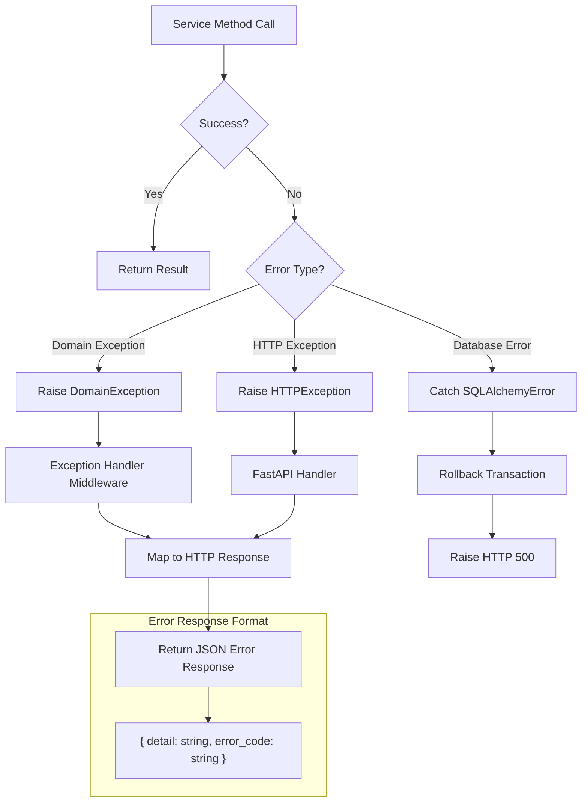

---

## Integration Patterns

### Service Composition

Services can use other services through repository sharing:

```python
class EndpointService(BaseService):
    def __init__(self, session: Session):
        super().__init__(session)
        # Multiple repositories share the same session
        self.endpoint_repository = EndpointRepository(session)
        self.star_repository = EndpointStarRepository(session)
        self.org_member_repository = OrganizationMemberRepository(session)
        self.org_repository = OrganizationRepository(session)
        self.user_repository = UserRepository(session)

    def create_endpoint(self, data, owner_id, is_organization, current_user):
        # Cross-repository operations in single transaction
        if is_organization:
            # Check org membership using org_member_repository
            if not self.org_member_repository.is_member(owner_id, current_user.id):
                raise HTTPException(403, "Not a member")

        # Validate contributors using user_repository
        valid_contributors = self._validate_contributors(data.contributors)

        # Create endpoint using endpoint_repository
        endpoint = self.endpoint_repository.create_endpoint(...)

        return endpoint
```

### Transaction Boundaries

```
┌─────────────────────────────────────────────────────────────────────────────┐
│                          TRANSACTION SCOPE                                   │
├─────────────────────────────────────────────────────────────────────────────┤
│                                                                              │
│   Session created per request (get_db dependency)                           │
│   │                                                                          │
│   ├── Service instantiated with session                                     │
│   │   └── All repositories share same session                               │
│   │                                                                          │
│   ├── Business logic executed                                               │
│   │   ├── Read operations (no commit needed)                                │
│   │   └── Write operations (commit in repository method)                    │
│   │                                                                          │
│   ├── On success: Transaction committed                                     │
│   └── On failure: Transaction rolled back                                   │
│                                                                              │
│   Session closed after request                                              │
│                                                                              │
└─────────────────────────────────────────────────────────────────────────────┘
```

### External Service Integration

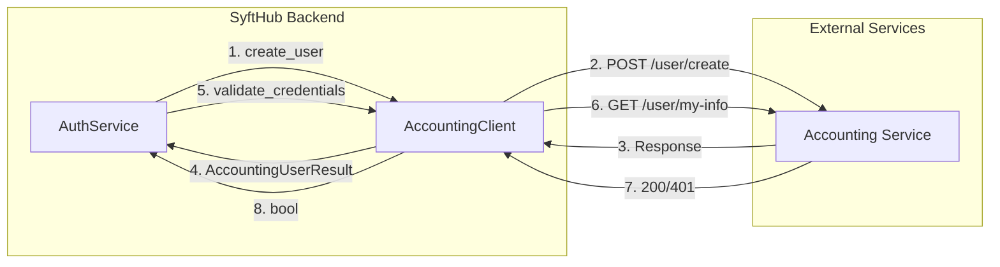

### Correlation ID Propagation

```python
class AccountingClient:
    def _get_headers(self) -> dict[str, str]:
        """Get headers including correlation ID for request tracing."""
        headers = {"Content-Type": "application/json"}
        correlation_id = get_correlation_id()
        if correlation_id:
            headers[CORRELATION_ID_HEADER] = correlation_id
        return headers
```

This ensures that requests to external services can be traced back to the originating SyftHub request.

---

## Related Documentation

- [01-system-architecture.md](./01-system-architecture.md) - System overview
- [02-data-models.md](./02-data-models.md) - Database schema
- [03-api-reference.md](./03-api-reference.md) - API endpoints
- [04-authentication-security.md](./04-authentication-security.md) - Auth & security
- [05-workflows-sequences.md](./05-workflows-sequences.md) - Detailed workflows
