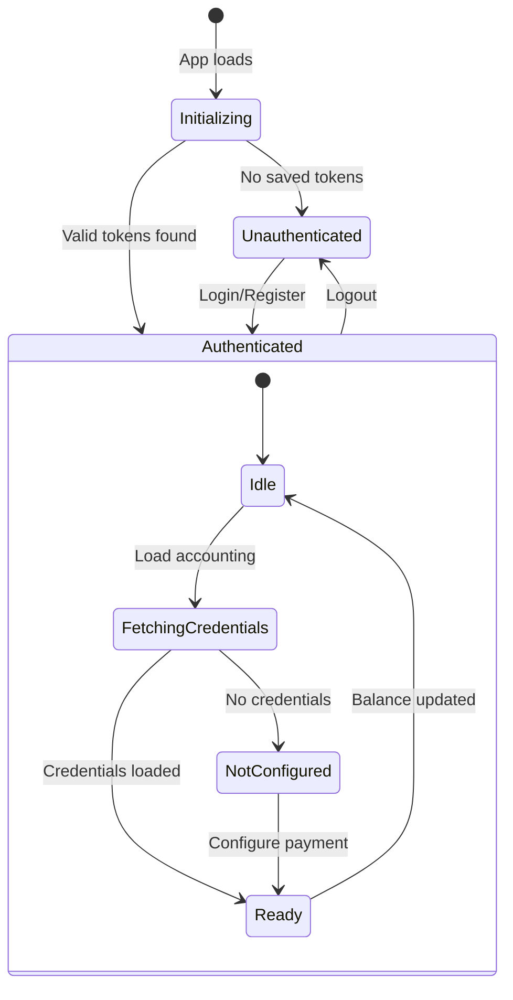

# SyftHub Frontend Architecture

> A comprehensive guide to the React frontend architecture of SyftHub - built with React 19, TypeScript, and modern web technologies.

## Table of Contents

- [Overview](#overview)
- [Technology Stack](#technology-stack)
- [Project Structure](#project-structure)
- [Application Bootstrap](#application-bootstrap)
- [State Management](#state-management)
- [Routing](#routing)
- [Component Architecture](#component-architecture)
- [Custom Hooks](#custom-hooks)
- [SDK Integration](#sdk-integration)
- [Error Handling](#error-handling)
- [Styling System](#styling-system)
- [Best Practices](#best-practices)

---

## Overview

The SyftHub frontend is a **modern single-page application (SPA)** built with React 19 and TypeScript. It provides:

1. **Authentication UI** - Login, registration, and session management
2. **Endpoint Management** - Create, edit, browse, and discover AI endpoints
3. **Chat Interface** - Real-time streaming chat with RAG capabilities
4. **Profile & Settings** - User profile management and accounting configuration
5. **Responsive Design** - Works across desktop and mobile devices

The application follows a **component-based architecture** with clear separation between UI components, business logic (hooks), and state management (contexts).

---

## Technology Stack

### Core Technologies

| Technology | Version | Purpose |
|------------|---------|---------|
| **React** | 19.1.1 | UI framework with latest features |
| **TypeScript** | 5.9.2 | Type safety and developer experience |
| **Vite** | 7.2.4 | Fast build tooling and HMR |
| **React Router** | 7.12.0 | Client-side routing |

### UI & Styling

| Technology | Version | Purpose |
|------------|---------|---------|
| **Tailwind CSS** | 4.1.17 | Utility-first CSS framework |
| **Radix UI** | Various | Accessible UI primitives |
| **Framer Motion** | 12.23.24 | Animation library |
| **Lucide React** | 0.544.0 | Icon library |
| **class-variance-authority** | 0.7.1 | Component variants |

### Utilities

| Technology | Purpose |
|------------|---------|
| **clsx** | Conditional class names |
| **tailwind-merge** | Merge Tailwind classes |
| **react-markdown** | Markdown rendering |
| **react-syntax-highlighter** | Code highlighting |

### SDK & API

| Technology | Purpose |
|------------|---------|
| **@syfthub/sdk** | Official TypeScript SDK |

---

## Project Structure

```
frontend/
├── src/
│   ├── app.tsx                 # Root component with routing
│   ├── main.tsx                # Application entry point
│   │
│   ├── components/             # React components
│   │   ├── ui/                 # Base UI components (Button, Card, Modal...)
│   │   ├── auth/               # Authentication components
│   │   ├── chat/               # Chat interface components
│   │   ├── settings/           # Settings modal tabs
│   │   ├── balance/            # Accounting balance components
│   │   └── providers/          # Provider wrapper components
│   │
│   ├── context/                # React Context providers
│   │   ├── auth-context.tsx    # Authentication state
│   │   ├── accounting-context.tsx  # Accounting credentials
│   │   ├── modal-context.tsx   # Auth modal state
│   │   └── settings-modal-context.tsx  # Settings modal state
│   │
│   ├── hooks/                  # Custom React hooks
│   │   ├── use-api.ts          # Generic API fetching
│   │   ├── use-form.ts         # Form state management
│   │   ├── use-accounting.ts   # Accounting context shortcuts
│   │   └── use-accounting-api.ts  # Accounting API operations
│   │
│   ├── layouts/                # Page layouts
│   │   └── main-layout.tsx     # Main app shell
│   │
│   ├── lib/                    # Utilities and types
│   │   ├── sdk-client.ts       # SDK singleton + helpers
│   │   ├── types.ts            # TypeScript type definitions
│   │   ├── utils.ts            # Utility functions (cn)
│   │   ├── validation.ts       # Form validation helpers
│   │   ├── cost-utils.ts       # Cost calculation utilities
│   │   └── endpoint-utils.ts   # Endpoint helpers
│   │
│   ├── observability/          # Error handling & logging
│   │   ├── index.ts            # Module exports
│   │   ├── error-boundary.tsx  # React error boundary
│   │   ├── logger.ts           # Structured logging
│   │   ├── reporter.ts         # Error reporting
│   │   ├── correlation.ts      # Correlation ID management
│   │   └── interceptors.ts     # HTTP interceptors
│   │
│   ├── pages/                  # Route page components
│   │   ├── home.tsx            # Home/Chat page
│   │   ├── browse.tsx          # Browse endpoints
│   │   ├── chat.tsx            # Chat interface
│   │   ├── build.tsx           # Developer portal
│   │   ├── about.tsx           # About page
│   │   ├── profile.tsx         # User profile
│   │   ├── endpoints.tsx       # Endpoint management
│   │   ├── endpoint-detail.tsx # Endpoint detail view
│   │   └── not-found.tsx       # 404 page
│   │
│   ├── styles/                 # Global styles
│   │   └── global.css          # Tailwind + design tokens
│   │
│   └── assets/                 # Static assets
│       └── fonts/              # Custom fonts
│
├── vite.config.ts              # Vite configuration
├── package.json                # Dependencies
├── tsconfig.json               # TypeScript config
└── tailwind.config.ts          # Tailwind config
```

---

## Application Bootstrap

### Entry Point (main.tsx)

The application bootstraps from a single entry point:

```tsx
// src/main.tsx
import './styles/global.css';

import React from 'react';
import { createRoot } from 'react-dom/client';

import App from './app';

const container = document.querySelector('#root');
const root = createRoot(container as HTMLElement);

root.render(<App />);
```

### Root Component (app.tsx)

The `App` component sets up the provider hierarchy and routing:

```tsx
// src/app.tsx
export default function App() {
  return (
    <ErrorBoundary>
      <RootProvider>
        <AuthProvider>
          <AccountingProvider>
            <ModalProvider>
              <SettingsModalProvider>
                <BrowserRouter>
                  <Routes>
                    <Route element={<MainLayout />}>
                      {/* Route definitions */}
                    </Route>
                  </Routes>
                </BrowserRouter>
              </SettingsModalProvider>
            </ModalProvider>
          </AccountingProvider>
        </AuthProvider>
      </RootProvider>
    </ErrorBoundary>
  );
}
```

### Provider Hierarchy

```
┌──────────────────────────────────────────────────────────────┐
│                        ErrorBoundary                          │
│  ┌────────────────────────────────────────────────────────┐  │
│  │                      RootProvider                       │  │
│  │  ┌──────────────────────────────────────────────────┐  │  │
│  │  │                    AuthProvider                   │  │  │
│  │  │  ┌────────────────────────────────────────────┐  │  │  │
│  │  │  │              AccountingProvider             │  │  │  │
│  │  │  │  ┌──────────────────────────────────────┐  │  │  │  │
│  │  │  │  │            ModalProvider              │  │  │  │  │
│  │  │  │  │  ┌────────────────────────────────┐  │  │  │  │  │
│  │  │  │  │  │      SettingsModalProvider      │  │  │  │  │  │
│  │  │  │  │  │  ┌──────────────────────────┐  │  │  │  │  │  │
│  │  │  │  │  │  │      BrowserRouter        │  │  │  │  │  │  │
│  │  │  │  │  │  │  ┌────────────────────┐  │  │  │  │  │  │  │
│  │  │  │  │  │  │  │     MainLayout      │  │  │  │  │  │  │  │
│  │  │  │  │  │  │  │  ┌──────────────┐  │  │  │  │  │  │  │  │
│  │  │  │  │  │  │  │  │   <Outlet/>   │  │  │  │  │  │  │  │  │
│  │  │  │  │  │  │  │  │  (Pages)     │  │  │  │  │  │  │  │  │
│  │  │  │  │  │  │  │  └──────────────┘  │  │  │  │  │  │  │  │
│  │  │  │  │  │  │  └────────────────────┘  │  │  │  │  │  │  │
│  │  │  │  │  │  └──────────────────────────┘  │  │  │  │  │  │
│  │  │  │  │  └────────────────────────────────┘  │  │  │  │  │
│  │  │  │  └──────────────────────────────────────┘  │  │  │  │
│  │  │  └────────────────────────────────────────────┘  │  │  │
│  │  └──────────────────────────────────────────────────┘  │  │
│  └────────────────────────────────────────────────────────┘  │
└──────────────────────────────────────────────────────────────┘
```

---

## State Management

SyftHub uses **React Context** for global state management. This approach is lightweight and well-suited for the application's needs.

### Context Providers

#### 1. AuthContext - Authentication State

**Location:** `src/context/auth-context.tsx`

**Purpose:** Manages user authentication, login/logout, and session persistence.

```tsx
interface AuthContextType {
  user: User | null;              // Current authenticated user
  isLoading: boolean;             // Loading state for auth operations
  isInitializing: boolean;        // Initial auth check in progress
  error: string | null;           // Auth error message
  login: (credentials) => Promise<void>;
  register: (userData) => Promise<void>;
  loginWithGoogle: () => Promise<void>;
  loginWithGitHub: () => Promise<void>;
  logout: () => Promise<void>;
  clearError: () => void;
  refreshUser: () => Promise<void>;
  updateUser: (user: User) => void;
}
```

**Key Features:**
- Token persistence in localStorage
- Automatic session restoration on app load
- SDK integration for all auth operations
- Error type classification for user-friendly messages

**Usage:**
```tsx
import { useAuth } from '@/context/auth-context';

function ProfileButton() {
  const { user, logout, isLoading } = useAuth();

  if (!user) return <LoginButton />;

  return (
    <button onClick={logout} disabled={isLoading}>
      Logout {user.name}
    </button>
  );
}
```

#### 2. AccountingContext - Payment Credentials

**Location:** `src/context/accounting-context.tsx`

**Purpose:** Manages accounting service credentials stored in the backend.

```tsx
interface AccountingContextType {
  credentials: AccountingCredentials | null;  // URL, email, password
  isLoading: boolean;
  error: string | null;
  isConfigured: boolean;                      // Has valid credentials
  fetchCredentials: () => Promise<void>;
  updateCredentials: (url, password) => Promise<boolean>;
  clearError: () => void;
}
```

**Key Features:**
- Credentials fetched from SyftHub backend (not stored locally)
- Auto-fetches when user logs in
- Derives `isConfigured` from credential presence

#### 3. ModalContext - Auth Modal State

**Location:** `src/context/modal-context.tsx`

**Purpose:** Controls the login/register modal visibility.

```tsx
interface ModalContextType {
  activeModal: 'login' | 'register' | null;
  openLogin: () => void;
  openRegister: () => void;
  closeModal: () => void;
  switchToLogin: () => void;
  switchToRegister: () => void;
}
```

**Usage:**
```tsx
import { useModal } from '@/context/modal-context';

function NavBar() {
  const { openLogin, openRegister } = useModal();

  return (
    <nav>
      <button onClick={openLogin}>Sign In</button>
      <button onClick={openRegister}>Sign Up</button>
    </nav>
  );
}
```

#### 4. SettingsModalContext - Settings Modal State

**Location:** `src/context/settings-modal-context.tsx`

**Purpose:** Controls the settings modal and active tab.

```tsx
type SettingsTab = 'profile' | 'security' | 'payment' | 'danger-zone';

interface SettingsModalContextType {
  isOpen: boolean;
  activeTab: SettingsTab;
  openSettings: (tab?: SettingsTab) => void;
  closeSettings: () => void;
  setActiveTab: (tab: SettingsTab) => void;
}
```

### State Flow Diagram



---

## Routing

### Route Configuration

SyftHub uses React Router v7 with lazy-loaded routes for optimal performance.

```tsx
// src/app.tsx
const HomePage = lazy(() => import('./pages/home'));
const BrowsePage = lazy(() => import('./pages/browse'));
const ChatPage = lazy(() => import('./pages/chat'));
const BuildPage = lazy(() => import('./pages/build'));
const AboutPage = lazy(() => import('./pages/about'));
const ProfilePage = lazy(() => import('./pages/profile'));
const EndpointsPage = lazy(() => import('./pages/endpoints'));
const EndpointDetailPage = lazy(() => import('./pages/endpoint-detail'));
const NotFoundPage = lazy(() => import('./pages/not-found'));
```

### Route Structure

| Path | Component | Protection | Description |
|------|-----------|------------|-------------|
| `/` | HomePage | Public | Home with hero and chat entry |
| `/browse` | BrowsePage | Public | Browse all public endpoints |
| `/chat` | ChatPage | Public | AI chat interface |
| `/build` | BuildPage | Public | Developer documentation |
| `/about` | AboutPage | Public | About SyftHub |
| `/profile` | ProfilePage | **Protected** | User profile management |
| `/endpoints` | EndpointsPage | **Protected** | Manage user's endpoints |
| `/:username/:slug` | EndpointDetailPage | Public | GitHub-style endpoint URLs |
| `*` | NotFoundPage | Public | 404 handler |

### Protected Routes

The `ProtectedRoute` component guards authenticated routes:

```tsx
// src/components/auth/protected-route.tsx
export function ProtectedRoute({ children, redirectTo = '/' }) {
  const { user, isInitializing } = useAuth();
  const location = useLocation();

  // Show loading while checking auth
  if (isInitializing) {
    return <LoadingSpinner size='lg' message='Loading...' />;
  }

  // Redirect if not authenticated
  if (!user) {
    return <Navigate to={redirectTo} state={{ from: location }} replace />;
  }

  return <>{children}</>;
}
```

**Usage in Routes:**
```tsx
<Route
  path='profile'
  element={
    <ProtectedRoute>
      <ProfilePage />
    </ProtectedRoute>
  }
/>
```

### MainLayout

The `MainLayout` component wraps all routes and provides:

- **Sidebar navigation** with React Router NavLink
- **User menu** (auth buttons or user info)
- **Suspense boundary** for lazy-loaded routes
- **Auth modals** (login/register)
- **Settings modal**
- **Skip link** for accessibility

```tsx
// src/layouts/main-layout.tsx
export function MainLayout() {
  const { user, logout, isInitializing } = useAuth();

  if (isInitializing) {
    return <LoadingSpinner fullScreen size='lg' message='Loading SyftHub...' />;
  }

  return (
    <div className='bg-background min-h-screen'>
      <a href='#main-content' className='sr-only focus:not-sr-only'>
        Skip to main content
      </a>

      <Sidebar />

      <div className='fixed top-4 right-4 z-40'>
        {user ? <UserMenu /> : <AuthButtons />}
      </div>

      <main id='main-content' className='ml-20'>
        <Suspense fallback={<LoadingSpinner />}>
          <Outlet />
        </Suspense>
      </main>

      <AuthModals />
      <SettingsModal />
    </div>
  );
}
```

---

## Component Architecture

### Component Categories

```
components/
├── ui/           # Base UI primitives (no business logic)
├── auth/         # Authentication-related components
├── chat/         # Chat interface components
├── settings/     # Settings modal tabs
├── balance/      # Accounting/balance display
└── providers/    # Context provider wrappers
```

### UI Components (Radix-based)

The UI component library is built on **Radix UI primitives** with **Tailwind CSS** styling and **class-variance-authority (CVA)** for variants.

#### Button Component

```tsx
// src/components/ui/button.tsx
const buttonVariants = cva(
  "inline-flex items-center justify-center gap-2 whitespace-nowrap rounded-md text-sm font-medium transition-all disabled:pointer-events-none disabled:opacity-50 outline-none focus-visible:ring-[3px]",
  {
    variants: {
      variant: {
        default: 'bg-primary text-primary-foreground shadow-xs hover:bg-primary/90',
        destructive: 'bg-destructive text-white shadow-xs hover:bg-destructive/90',
        outline: 'border bg-background shadow-xs hover:bg-accent',
        secondary: 'bg-secondary text-secondary-foreground shadow-xs hover:bg-secondary/80',
        ghost: 'hover:bg-accent hover:text-accent-foreground',
        link: 'text-primary underline-offset-4 hover:underline'
      },
      size: {
        default: 'h-9 px-4 py-2',
        sm: 'h-8 rounded-md gap-1.5 px-3',
        lg: 'h-10 rounded-md px-6',
        icon: 'size-9'
      }
    },
    defaultVariants: {
      variant: 'default',
      size: 'default'
    }
  }
);

function Button({ className, variant, size, asChild = false, ...props }) {
  const Comp = asChild ? Slot : 'button';
  return (
    <Comp
      data-slot='button'
      className={cn(buttonVariants({ variant, size, className }))}
      {...props}
    />
  );
}
```

**Usage:**
```tsx
<Button variant="default" size="sm">Submit</Button>
<Button variant="destructive">Delete</Button>
<Button variant="ghost" size="icon"><Settings /></Button>
```

#### Modal Component

Full-featured modal with accessibility support:

```tsx
// src/components/ui/modal.tsx
interface ModalProperties {
  isOpen: boolean;
  onClose: () => void;
  children: React.ReactNode;
  title?: string;
  description?: string;
  size?: 'sm' | 'md' | 'lg' | 'xl';
  closeOnOverlayClick?: boolean;
  showCloseButton?: boolean;
}
```

**Features:**
- Focus trapping (Tab key cycles within modal)
- Focus restoration (returns focus on close)
- Escape key handling
- Body scroll lock
- Animated entrance/exit (Framer Motion)
- ARIA attributes for accessibility

#### Card Component

Composable card with slots:

```tsx
// Usage
<Card>
  <CardHeader>
    <CardTitle>Endpoint Details</CardTitle>
    <CardDescription>Configure your endpoint</CardDescription>
    <CardAction>
      <Button variant="ghost" size="icon">
        <Settings />
      </Button>
    </CardAction>
  </CardHeader>
  <CardContent>
    {/* Content */}
  </CardContent>
  <CardFooter>
    <Button>Save Changes</Button>
  </CardFooter>
</Card>
```

### Component Hierarchy

```
App
├── ErrorBoundary
│   └── Providers (Auth → Accounting → Modal → Settings)
│       └── BrowserRouter
│           └── MainLayout
│               ├── Sidebar
│               │   ├── OpenMinedIcon (logo)
│               │   └── NavLink[] (navigation items)
│               │
│               ├── UserMenu (or AuthButtons)
│               │   ├── BalanceIndicator
│               │   ├── UserInfo
│               │   ├── SettingsButton
│               │   └── LogoutButton
│               │
│               ├── Outlet (page content)
│               │   ├── HomePage
│               │   ├── ChatPage → ChatView
│               │   │   ├── ModelSelector
│               │   │   ├── SourceSelector
│               │   │   ├── StatusIndicator
│               │   │   ├── MarkdownMessage
│               │   │   └── SourcesSection
│               │   ├── BrowsePage → BrowseView
│               │   ├── ProfilePage → ProfileView
│               │   └── ...
│               │
│               ├── AuthModals
│               │   ├── LoginModal
│               │   └── RegisterModal
│               │
│               └── SettingsModal
│                   ├── ProfileSettingsTab
│                   ├── SecuritySettingsTab
│                   ├── PaymentSettingsTab
│                   └── DangerZoneTab
```

---

## Custom Hooks

### useForm - Form State Management

**Location:** `src/hooks/use-form.ts`

A lightweight form management hook similar to Formik but simpler.

```tsx
interface UseFormOptions<T> {
  initialValues: T;
  validators?: { [K in keyof T]?: Validator<T, K> };
  onSubmit: (values: T) => Promise<void> | void;
  validateOnChange?: boolean;  // default: false
  validateOnBlur?: boolean;    // default: true
}

interface UseFormReturn<T> {
  values: T;
  errors: Partial<Record<keyof T, string>>;
  touched: Partial<Record<keyof T, boolean>>;
  isSubmitting: boolean;
  isValid: boolean;
  handleChange: (field) => (e) => void;
  handleBlur: (field) => () => void;
  handleSubmit: (e) => Promise<void>;
  setFieldValue: (field, value) => void;
  setFieldError: (field, error) => void;
  resetForm: () => void;
  validateField: (field) => string | null;
  validateForm: () => boolean;
}
```

**Usage:**
```tsx
const { values, errors, handleChange, handleSubmit, isSubmitting } = useForm({
  initialValues: { email: '', password: '' },
  validators: {
    email: (value) => !value ? 'Email is required' : null,
    password: (value) => value.length < 6 ? 'Password too short' : null,
  },
  onSubmit: async (values) => {
    await loginAPI(values);
  },
});

return (
  <form onSubmit={handleSubmit}>
    <input value={values.email} onChange={handleChange('email')} />
    {errors.email && <span>{errors.email}</span>}
    <button disabled={isSubmitting}>Submit</button>
  </form>
);
```

### useAPI - Data Fetching

**Location:** `src/hooks/use-api.ts`

Generic hook for API calls with loading and error states.

```tsx
interface UseAPIOptions<T> {
  initialData?: T | null;
  immediate?: boolean;        // Execute on mount
  onSuccess?: (data: T) => void;
  onError?: (error: Error) => void;
}

interface UseAPIReturn<T, Args> {
  data: T | null;
  error: Error | null;
  isLoading: boolean;
  execute: (...args: Args) => Promise<T | null>;
  reset: () => void;
  setData: Dispatch<SetStateAction<T | null>>;
}
```

**Usage:**
```tsx
// Immediate fetch on mount
const { data, isLoading, error } = useAPI(
  () => getPublicEndpoints({ limit: 50 }),
  { immediate: true }
);

// Manual fetch with arguments
const { data, execute, isLoading } = useAPI(
  (id: string) => getEndpoint(id)
);
// Later: execute('endpoint-123');

// Lazy variant (never auto-executes)
const { execute } = useAPILazy(deleteEndpoint, {
  onSuccess: () => toast.success('Deleted!'),
  onError: (err) => toast.error(err.message),
});
```

### useAccounting - Accounting Shortcuts

**Location:** `src/hooks/use-accounting.ts`

Convenience hooks for accessing accounting state.

```tsx
// Main hook - full context access
export function useAccounting() {
  return useAccountingContext();
}

// Selector hooks
export function useAccountingCredentials(): AccountingCredentials | null;
export function useAccountingError(): { error, clearError };
export function useAccountingReady(): boolean;

// Re-exported API hooks
export {
  useAccountingUser,
  useAccountingBalance,
  useTransactions,
  useCreateTransaction,
  // ...
} from './use-accounting-api';
```

### useAccountingAPI - Accounting Operations

**Location:** `src/hooks/use-accounting-api.ts`

Hooks for interacting with the accounting service via the backend proxy.

```tsx
// User & Balance
function useAccountingUser(): {
  user: AccountingUser | null;
  isLoading: boolean;
  error: string | null;
  refetch: () => Promise<void>;
}

function useAccountingBalance(): {
  balance: number | null;
  isLoading: boolean;
  error: string | null;
  refetch: () => Promise<void>;
}

// Transactions
function useTransactions(options?): {
  transactions: AccountingTransaction[];
  isLoading: boolean;
  error: string | null;
  hasMore: boolean;
  fetchMore: () => Promise<void>;
  refetch: () => Promise<void>;
}

function useCreateTransaction(): {
  create: (input) => Promise<AccountingTransaction | null>;
  isLoading: boolean;
  error: string | null;
  clearError: () => void;
}
```

**Key Features:**
- Auto-polling every 30 seconds (visibility-aware)
- Pauses when tab is hidden to save bandwidth
- Force refresh via `triggerBalanceRefresh()`
- Silent error handling during polling

---

## SDK Integration

### SDK Client Setup

**Location:** `src/lib/sdk-client.ts`

The SDK is configured as a singleton instance:

```tsx
import { SyftHubClient } from '@syfthub/sdk';

// Singleton instance
export const syftClient = new SyftHubClient({
  baseUrl: getBaseUrl(),  // Handles same-origin or direct backend
  timeout: 30_000
});
```

### Token Persistence

```tsx
// Storage keys
const ACCESS_TOKEN_KEY = 'syft_access_token';
const REFRESH_TOKEN_KEY = 'syft_refresh_token';

// Persist tokens after login
export function persistTokens(): boolean {
  const tokens = syftClient.getTokens();
  if (!tokens) return false;

  localStorage.setItem(ACCESS_TOKEN_KEY, tokens.accessToken);
  localStorage.setItem(REFRESH_TOKEN_KEY, tokens.refreshToken);
  return true;
}

// Restore tokens on app load
export function restoreTokens(): boolean {
  const accessToken = localStorage.getItem(ACCESS_TOKEN_KEY);
  const refreshToken = localStorage.getItem(REFRESH_TOKEN_KEY);

  if (accessToken && refreshToken) {
    syftClient.setTokens({
      accessToken,
      refreshToken,
      tokenType: 'bearer'
    });
    return true;
  }
  return false;
}

// Clear tokens on logout
export function clearPersistedTokens(): void {
  localStorage.removeItem(ACCESS_TOKEN_KEY);
  localStorage.removeItem(REFRESH_TOKEN_KEY);
}
```

### SDK Usage Examples

```tsx
// Authentication
const user = await syftClient.auth.login(email, password);
const user = await syftClient.auth.register({ username, email, password, fullName });
await syftClient.auth.logout();
const currentUser = await syftClient.auth.me();

// Endpoints
for await (const endpoint of syftClient.hub.browse()) {
  console.log(endpoint.name);
}

// Chat streaming
for await (const event of syftClient.chat.stream({
  prompt: 'What is machine learning?',
  model: 'owner/model-name',
  dataSources: ['owner/data-source'],
  signal: abortController.signal
})) {
  switch (event.type) {
    case 'token':
      appendToResponse(event.content);
      break;
    case 'retrieval_start':
      showStatus(`Searching ${event.sourceCount} sources...`);
      break;
    case 'done':
      handleSources(event.sources);
      break;
  }
}
```

### Re-exported Types

The SDK client module re-exports commonly used types:

```tsx
// Error types
export {
  SyftHubError,
  APIError,
  AuthenticationError,
  AuthorizationError,
  NotFoundError,
  ValidationError,
  NetworkError,
  AggregatorError,
  EndpointResolutionError,
  UserAlreadyExistsError,
  AccountingAccountExistsError,
  InvalidAccountingPasswordError,
} from '@syfthub/sdk';

// Model types
export type {
  User,
  Endpoint,
  EndpointPublic,
  ChatOptions,
  ChatResponse,
  ChatStreamEvent,
  // ...
} from '@syfthub/sdk';
```

---

## Error Handling

### Error Boundary

**Location:** `src/observability/error-boundary.tsx`

The application is wrapped in an error boundary that:

1. Catches JavaScript errors in child components
2. Logs errors with correlation IDs
3. Reports errors to the backend
4. Displays a fallback UI with retry option

```tsx
// Default fallback UI
function DefaultErrorFallback({ error, correlationId, resetError }) {
  return (
    <div role='alert'>
      <h2>Something went wrong</h2>
      <details>
        <summary>Error details</summary>
        <pre>{error.message}</pre>
      </details>
      <p>Reference ID: <code>{correlationId}</code></p>
      <button onClick={resetError}>Try again</button>
    </div>
  );
}

// Usage with custom fallback
<ErrorBoundary
  fallback={CustomErrorFallback}
  onError={(error, errorInfo) => console.error(error)}
  appState={{ currentRoute, userId }}
>
  <App />
</ErrorBoundary>
```

### Error Reporting

```tsx
// src/observability/reporter.ts
interface ErrorReport {
  message: string;
  stack?: string;
  source: string;           // e.g., 'frontend.react.error_boundary'
  correlationId: string;
  componentStack?: string;
  appState?: Record<string, unknown>;
  userAgent: string;
  url: string;
  timestamp: string;
}

export async function reportError(
  error: Error,
  source: string,
  componentStack?: string,
  appState?: Record<string, unknown>
): Promise<void>;
```

### Structured Logging

```tsx
// src/observability/logger.ts
export const logger = {
  debug: (event, context) => log(LogLevel.DEBUG, event, context),
  info: (event, context) => log(LogLevel.INFO, event, context),
  warn: (event, context, error?) => log(LogLevel.WARN, event, context, error),
  error: (event, context, error) => log(LogLevel.ERROR, event, context, error),
};

// Usage
logger.info('user.login.success', { userId: user.id });
logger.error('api.request.failed', { endpoint: '/users' }, error);
```

### Correlation IDs

Every request is tagged with a correlation ID for traceability:

```tsx
// src/observability/correlation.ts
export function generateCorrelationId(): string;
export function getOrCreateCorrelationId(): string;
export function setCorrelationId(id: string): void;
export function getCorrelationId(): string | null;

// HTTP interceptor adds header
export function attachCorrelationId(headers: Headers): Headers {
  headers.set(CORRELATION_ID_HEADER, getOrCreateCorrelationId());
  return headers;
}
```

---

## Styling System

### Design Tokens

**Location:** `src/styles/global.css`

SyftHub uses CSS custom properties for theming:

```css
:root {
  --radius: 0.5rem;

  /* Core colors */
  --background: #ffffff;
  --foreground: #272532;
  --primary: #272532;
  --primary-foreground: #fcfcfd;
  --secondary: #6976ae;
  --secondary-foreground: #fcfcfd;
  --muted: #f7f6f9;
  --muted-foreground: #5e5a72;
  --accent: #f1f0f4;
  --accent-foreground: #272532;
  --destructive: #ef4444;

  /* SyftHub brand colors */
  --syft-primary: #272532;
  --syft-secondary: #6976ae;
  --syft-green: #64bb62;
  --syft-purple: #937098;
  --syft-background: #fcfcfd;
  --syft-surface: #f7f6f9;
  --syft-border: #ecebef;
  --syft-text: #272532;
  --syft-text-muted: #5e5a72;
  --syft-text-placeholder: #b4b0bf;
}
```

### Typography

Two font families are used:

```css
body {
  font-family: 'Inter', system-ui, sans-serif;
}

h1, h2, h3, h4, h5, h6 {
  font-family: 'Rubik', system-ui, sans-serif;
}

/* Utility classes */
.font-rubik { font-family: 'Rubik', system-ui, sans-serif; }
.font-inter { font-family: 'Inter', system-ui, sans-serif; }
```

### Tailwind Integration

Tailwind is extended with SyftHub-specific utilities:

```css
@layer utilities {
  .text-syft-primary { color: var(--color-syft-primary); }
  .text-syft-secondary { color: var(--color-syft-secondary); }
  .text-syft-muted { color: var(--color-syft-text-muted); }
  .bg-syft-background { background-color: var(--color-syft-background); }
  .bg-syft-surface { background-color: var(--color-syft-surface); }
  .border-syft { border-color: var(--color-syft-border); }
  .border-syft-primary { border-color: var(--color-syft-primary); }
}
```

### Utility Function

The `cn` utility merges Tailwind classes:

```tsx
// src/lib/utils.ts
import { clsx, type ClassValue } from 'clsx';
import { twMerge } from 'tailwind-merge';

export function cn(...inputs: ClassValue[]) {
  return twMerge(clsx(inputs));
}

// Usage
<div className={cn(
  'rounded-lg border p-4',
  isActive && 'bg-syft-surface',
  className
)} />
```

### Tailwind Configuration

```tsx
// vite.config.ts
export default defineConfig({
  resolve: {
    alias: {
      "@": path.resolve(__dirname, "./src"),
    },
  },
  plugins: [react()],
  build: {
    rollupOptions: {
      output: {
        manualChunks: {
          vendor: ['react', 'react-dom', 'react-router-dom'],
        },
      },
    },
  }
});
```

---

## Best Practices

### 1. Component Design

- **Single Responsibility:** Each component does one thing well
- **Composition over Inheritance:** Use slots and children for flexibility
- **Readonly Props:** Mark all props as `Readonly<T>` for immutability
- **Data Slots:** Use `data-slot` attributes for styling hooks

```tsx
// Good
function Button({ children, ...props }: Readonly<ButtonProps>) {
  return <button data-slot="button" {...props}>{children}</button>;
}

// Avoid
function Button(props: ButtonProps) { // Missing Readonly
  props.onClick = () => {}; // Mutating props
}
```

### 2. State Management

- **Lift State Minimally:** Keep state as close to usage as possible
- **Context for Cross-Cutting Concerns:** Auth, modals, settings
- **Derived State:** Use `useMemo` for computed values

```tsx
// Good - derived state
const isConfigured = credentials !== null && Boolean(credentials.url);

// Avoid - storing derived state
const [isConfigured, setIsConfigured] = useState(false);
useEffect(() => {
  setIsConfigured(credentials?.url != null);
}, [credentials]);
```

### 3. Async Operations

- **Use Refs for Mount State:** Prevent updates after unmount
- **Handle Errors Gracefully:** Show user-friendly messages
- **Provide Loading States:** Always show feedback

```tsx
const isMounted = useRef(true);

useEffect(() => {
  isMounted.current = true;
  return () => { isMounted.current = false; };
}, []);

const fetchData = async () => {
  try {
    const data = await api.fetch();
    if (isMounted.current) {
      setData(data);
    }
  } catch (error) {
    if (isMounted.current) {
      setError(getErrorMessage(error));
    }
  }
};
```

### 4. Form Validation

- **Use Safe Regex:** Avoid ReDoS vulnerabilities
- **Validate on Blur:** Better UX than on every keystroke
- **Type-Safe Validators:** Use generics for field-specific validation

```tsx
// src/lib/validation.ts
// Safe email regex (avoids ReDoS)
const emailRegex = /^[a-zA-Z0-9._%+-]+@[a-zA-Z0-9.-]+\.[a-zA-Z]{2,}$/;

export const validateEmail = (email: string): string | null => {
  if (!email) return 'Email is required';
  if (!emailRegex.test(email) || email.length >= 255) {
    return 'Please enter a valid email address';
  }
  return null;
};
```

### 5. Accessibility

- **Skip Links:** Provide skip-to-content links
- **Focus Management:** Trap focus in modals, restore on close
- **ARIA Attributes:** Use proper roles and labels
- **Keyboard Navigation:** Support Tab, Escape, Enter

```tsx
// Modal accessibility
<div
  role="dialog"
  aria-modal="true"
  aria-labelledby="modal-title"
  aria-describedby="modal-description"
  onKeyDown={handleKeyDown} // Tab trapping
/>
```

### 6. Performance

- **Lazy Loading:** Use `React.lazy` for route components
- **Code Splitting:** Vite's `manualChunks` for vendor bundle
- **Memoization:** Use `useCallback` for stable references
- **Visibility-Aware Polling:** Pause when tab is hidden

```tsx
// Lazy loading
const ChatPage = lazy(() => import('./pages/chat'));

// Stable callback reference
const handleSubmit = useCallback(async (values) => {
  await submitForm(values);
}, [submitForm]);

// Visibility-aware polling
if (document.hidden) {
  stopPolling();
} else {
  startPolling();
}
```

---

## Related Documentation

- [01-system-architecture.md](./01-system-architecture.md) - Overall system design
- [02-data-models.md](./02-data-models.md) - Database schema and types
- [03-api-reference.md](./03-api-reference.md) - Backend API documentation
- [04-authentication-security.md](./04-authentication-security.md) - Auth architecture
