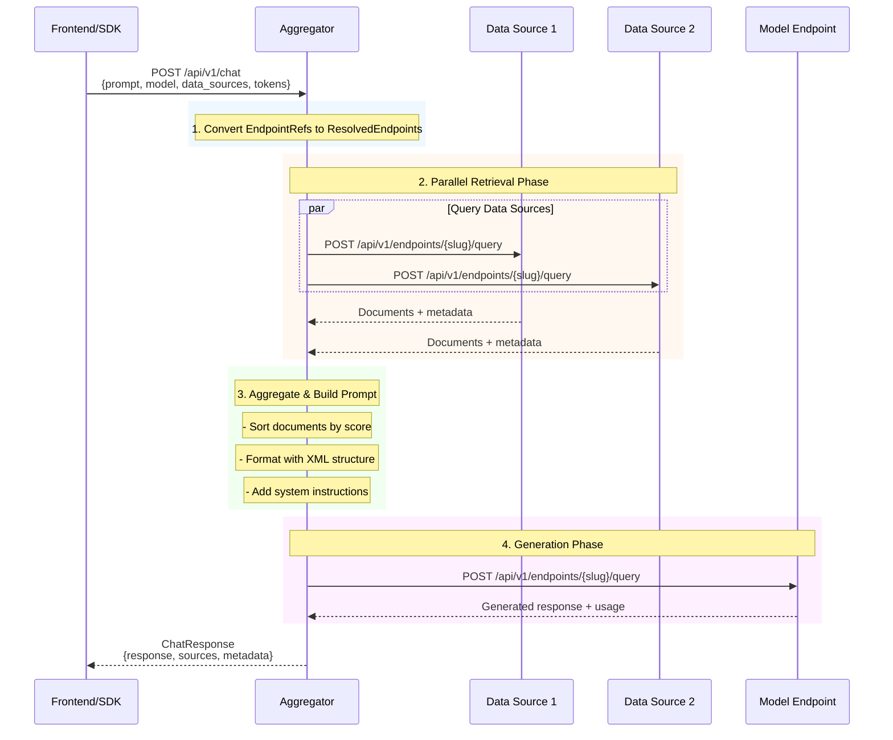
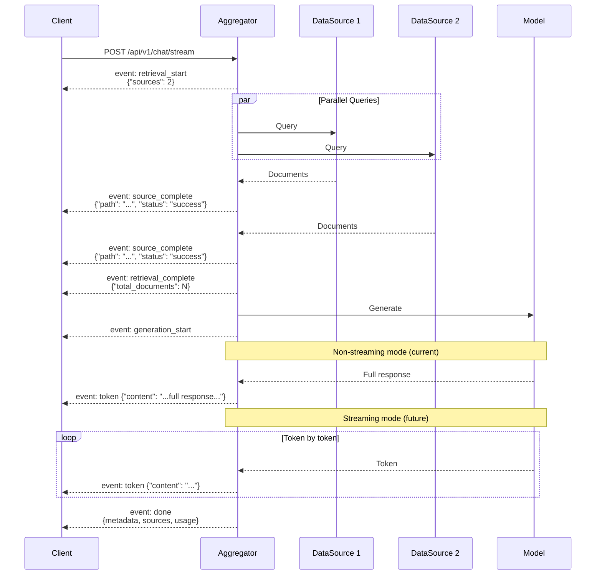

# Aggregator RAG System Architecture

> Comprehensive documentation of the SyftHub Aggregator service - a stateless RAG (Retrieval-Augmented Generation) orchestration system for federated AI endpoints.

## Table of Contents

- [Overview](#overview)
- [Architecture Overview](#architecture-overview)
- [RAG Pipeline](#rag-pipeline)
- [Data Source Querying](#data-source-querying)
- [Prompt Construction](#prompt-construction)
- [Model Generation](#model-generation)
- [Streaming Implementation](#streaming-implementation)
- [Token Management](#token-management)
- [Configuration](#configuration)
- [Error Handling](#error-handling)
- [Performance Considerations](#performance-considerations)
- [Related Documentation](#related-documentation)

---

## Overview

The **Aggregator** is a **stateless RAG orchestration service** that coordinates the workflow for chat-based interactions with SyftHub's federated AI endpoints. It aggregates context from multiple data sources and generates responses using model endpoints registered in SyftHub.

### Key Features

| Feature | Description |
|---------|-------------|
| **Stateless Design** | All context passed per-request; no database connection |
| **Parallel Retrieval** | Concurrent querying of multiple data sources |
| **RAG Prompting** | Document-grounded prompt construction with citations |
| **Streaming** | Real-time response streaming via Server-Sent Events |
| **Token Forwarding** | Satellite and transaction token propagation |
| **Graceful Degradation** | Partial failure handling for data sources |

### Service Responsibilities

```
+------------------------------------------------------------------+
|                        AGGREGATOR SERVICE                         |
|                                                                   |
|   +-------------------+  +-------------------+  +----------------+|
|   |     Retrieval     |  |  Prompt Builder   |  |   Generation   ||
|   |     Service       |  |                   |  |    Service     ||
|   +-------------------+  +-------------------+  +----------------+|
|           |                      |                      |         |
|           v                      v                      v         |
|   +-------------------+  +-------------------+  +----------------+|
|   |   DataSource      |  |   Context         |  |    Model       ||
|   |     Client        |  |   Formatting      |  |    Client      ||
|   +-------------------+  +-------------------+  +----------------+|
|                                                                   |
+------------------------------------------------------------------+
```

---

## Architecture Overview

### Stateless Design Principles

The Aggregator is designed for **complete statelessness**, enabling horizontal scaling and simplified deployment:

```
                     Request with Full Context
                              |
                              v
+------------------------------------------------------------------+
|                        AGGREGATOR INSTANCE                        |
|                                                                   |
|  Request Contains:                                                |
|  - User prompt                                                    |
|  - Model endpoint reference (URL, slug, tenant, owner)            |
|  - Data source references (URLs, slugs, tenants, owners)          |
|  - Satellite tokens (keyed by owner username)                     |
|  - Transaction tokens (keyed by owner username)                   |
|  - Generation parameters (max_tokens, temperature, etc.)          |
|                                                                   |
|  NO:                                                              |
|  - Database connections                                           |
|  - Session state                                                  |
|  - Cached user data                                               |
|  - Persistent endpoint configurations                             |
+------------------------------------------------------------------+
```

### Component Architecture

```
+------------------+     +-------------------+     +------------------+
|                  |     |                   |     |                  |
|   FastAPI App    |---->|   Orchestrator    |---->|  External APIs   |
|                  |     |                   |     |                  |
+------------------+     +-------------------+     +------------------+
        |                        |
        |                        |
        v                        v
+------------------+     +-------------------+
|                  |     |                   |
|  Chat Endpoints  |     |  Service Layer    |
|  /api/v1/chat    |     |  - Retrieval      |
|  /api/v1/chat/   |     |  - Generation     |
|       stream     |     |  - PromptBuilder  |
|                  |     |                   |
+------------------+     +-------------------+
```

### Request Flow Diagram



---

## RAG Pipeline

### Pipeline Overview

The RAG pipeline follows the **Retrieval -> Prompt Building -> Generation** pattern:

```
+---------------+     +------------------+     +----------------+
|   RETRIEVAL   |     | PROMPT BUILDING  |     |   GENERATION   |
+---------------+     +------------------+     +----------------+
        |                     |                       |
        v                     v                       v
+---------------+     +------------------+     +----------------+
| Query N data  |     | Format context   |     | Call model     |
| sources in    |---->| with XML tags    |---->| endpoint with  |
| parallel      |     | Add instructions |     | augmented      |
|               |     | Inject user Q    |     | prompt         |
+---------------+     +------------------+     +----------------+
        |                     |                       |
        v                     v                       v
+---------------+     +------------------+     +----------------+
| RetrievalResult|    | List[Message]    |     | GenerationResult|
| per source    |     | [system, user]   |     | response, usage|
+---------------+     +------------------+     +----------------+
```

### Pipeline Stages

#### Stage 1: Endpoint Resolution

```python
# Internal representation after resolution
class ResolvedEndpoint:
    path: str          # "owner/slug" for citations
    url: str           # Base URL of SyftAI-Space instance
    slug: str          # Endpoint slug for API path
    endpoint_type: str # "model" or "data_source"
    name: str          # Display name
    tenant_name: str   # For X-Tenant-Name header
    owner_username: str # For token lookup
```

#### Stage 2: Context Retrieval

```python
# Retrieval result per data source
class RetrievalResult:
    endpoint_path: str        # "owner/slug"
    documents: List[Document] # Retrieved documents
    status: str               # "success", "error", "timeout"
    error_message: str | None
    latency_ms: int
```

#### Stage 3: Context Aggregation

```python
# Aggregated context from all sources
class AggregatedContext:
    documents: List[Document]           # All docs, sorted by score
    retrieval_results: List[RetrievalResult]
    total_latency_ms: int
```

#### Stage 4: Prompt Construction

```python
# Final messages for model
messages = [
    Message(role="system", content=system_prompt),
    Message(role="user", content=instructions + context + question)
]
```

#### Stage 5: Response Generation

```python
# Generation result
class GenerationResult:
    response: str      # Generated text
    latency_ms: int
    usage: dict | None # Token usage stats
```

---

## Data Source Querying

### Parallel Retrieval Architecture

```
                      +----------------+
                      |   Retrieval    |
                      |    Service     |
                      +----------------+
                             |
              +--------------+--------------+
              |              |              |
              v              v              v
        +---------+    +---------+    +---------+
        |  Task 1 |    |  Task 2 |    |  Task N |
        | DS #1   |    | DS #2   |    | DS #N   |
        +---------+    +---------+    +---------+
              |              |              |
              v              v              v
        +---------+    +---------+    +---------+
        |SyftAI-  |    |SyftAI-  |    |SyftAI-  |
        |Space #1 |    |Space #2 |    |Space #N |
        +---------+    +---------+    +---------+
              |              |              |
              +--------------+--------------+
                             |
                             v
                      +----------------+
                      |  asyncio.gather |
                      |  or wait()     |
                      +----------------+
```

### Query Request Format

```python
# Request to SyftAI-Space data source endpoint
request_data = {
    "messages": query,              # Search query as string
    "limit": top_k,                 # Number of documents
    "similarity_threshold": 0.5,   # Minimum similarity
    "include_metadata": True,       # Return document metadata
    "transaction_token": token      # For billing (if provided)
}

# Headers
headers = {
    "Content-Type": "application/json",
    "X-Correlation-ID": correlation_id,
    "X-Tenant-Name": tenant_name,       # If multi-tenancy
    "Authorization": f"Bearer {satellite_token}"
}
```

### Response Parsing

```python
# SyftAI-Space QueryEndpointResponse format
{
    "summary": null,  # Not used for data sources
    "references": {
        "documents": [
            {
                "document_id": "doc-123",
                "content": "Document text...",
                "metadata": {"title": "Doc Title", ...},
                "similarity_score": 0.85
            }
        ],
        "provider_info": {...},
        "cost": 0.001
    }
}
```

### Timeout Handling

```
+------------------+     +------------------+     +------------------+
|  Request Start   |     |  Timeout Check   |     |     Result       |
+------------------+     +------------------+     +------------------+
        |                        |                        |
        v                        v                        v
   t=0 seconds              t=30 seconds             Status returned
        |                        |                        |
        |   +------------------->|                        |
        |   |  Response OK       |     "success"          |
        |   |  (< 30s)           |----------------------->|
        |   |                    |                        |
        |   +------------------->|                        |
        |   |  Timeout           |     "timeout"          |
        |   |  (>= 30s)          |----------------------->|
        |   |                    |                        |
        |   +------------------->|                        |
        |   |  HTTP Error        |     "error"            |
        |   |                    |----------------------->|
        +---+--------------------+------------------------+
```

### Streaming Retrieval

For streaming responses, results are yielded as they complete:

```python
async def retrieve_streaming(...):
    """Yield results as each data source completes."""
    tasks = {asyncio.create_task(query(ds)): ds for ds in data_sources}
    pending = set(tasks.keys())

    while pending:
        done, pending = await asyncio.wait(
            pending,
            return_when=asyncio.FIRST_COMPLETED,
        )
        for task in done:
            yield await task
```

---

## Prompt Construction

### System Prompt

The default system prompt establishes document-grounded behavior:

```
You are a document-grounded AI assistant. You ONLY provide answers based
on information explicitly stated in the provided documents. You never use
your training knowledge or make assumptions beyond what the documents contain.
```

### User Message Structure

```
+------------------------------------------------------------------+
|                      USER MESSAGE CONTENT                         |
+------------------------------------------------------------------+
|                                                                   |
|  +------------------------------------------------------------+  |
|  |                  CRITICAL RULES                             |  |
|  |  1. Answer EXCLUSIVELY from documents                       |  |
|  |  2. NEVER use training data                                 |  |
|  |  3. If no info, say "documents do not contain..."           |  |
|  +------------------------------------------------------------+  |
|                                                                   |
|  +------------------------------------------------------------+  |
|  |                   DOCUMENT FORMAT                           |  |
|  |  - source: owner/dataset_name                               |  |
|  |  - title: Document title                                    |  |
|  |  - relevance: Similarity score (0 to 1)                     |  |
|  |  - content: The document text                               |  |
|  +------------------------------------------------------------+  |
|                                                                   |
|  +------------------------------------------------------------+  |
|  |                  CITATION REQUIREMENTS                      |  |
|  |  - EVERY fact must have [owner/dataset_name] citation       |  |
|  |  - Multiple sources: [source1, source2]                     |  |
|  |  - NO "Sources" section (system provides separately)        |  |
|  +------------------------------------------------------------+  |
|                                                                   |
|  +------------------------------------------------------------+  |
|  |                    <documents>                              |  |
|  |      ... XML-formatted documents ...                        |  |
|  |                    </documents>                             |  |
|  +------------------------------------------------------------+  |
|                                                                   |
|  +------------------------------------------------------------+  |
|  |  ---                                                        |  |
|  |  USER QUESTION:                                             |  |
|  |  {user_prompt}                                              |  |
|  |  ---                                                        |  |
|  +------------------------------------------------------------+  |
|                                                                   |
+------------------------------------------------------------------+
```

### Document Formatting (XML Structure)

```xml
<documents>
<document index="1">
<source>acme-corp/product-docs</source>
<title>Product Overview</title>
<relevance>0.92</relevance>
<content>
The product features include...
</content>
</document>

<document index="2">
<source>acme-corp/faq</source>
<title>Frequently Asked Questions</title>
<relevance>0.87</relevance>
<content>
Q: How do I get started?
A: Follow these steps...
</content>
</document>
</documents>
```

### Context Edge Cases

| Scenario | Handling |
|----------|----------|
| **No data sources** | Include "No documents were provided" instruction |
| **Retrieval failures** | Include "No relevant documents retrieved" instruction |
| **Empty results** | Instruct model to refuse answering |
| **Custom system prompt** | Override default but keep user instructions |

---

## Model Generation

### Model Request Format

```python
# Request to SyftAI-Space model endpoint
request_data = {
    "messages": [
        {"role": "system", "content": system_prompt},
        {"role": "user", "content": augmented_prompt}
    ],
    "max_tokens": 1024,
    "temperature": 0.7,
    "stream": False,
    "stop_sequences": [],  # Allow complete responses
    "transaction_token": token  # For billing
}
```

### Model Response Parsing

```python
# SyftAI-Space QueryEndpointResponse for models
{
    "summary": {
        "id": "gen-abc123",
        "model": "gpt-4",
        "message": {
            "role": "assistant",
            "content": "Based on the documents...",
            "tokens": 150
        },
        "finish_reason": "stop",
        "usage": {
            "prompt_tokens": 500,
            "completion_tokens": 150,
            "total_tokens": 650
        },
        "cost": 0.013,
        "provider_info": {...}
    },
    "references": null
}
```

### Generation Flow

```
+------------------+     +------------------+     +------------------+
|  Prepare Request |     |   HTTP POST      |     | Parse Response   |
+------------------+     +------------------+     +------------------+
        |                        |                        |
        v                        v                        v
   Format messages          POST to model           Extract content
   Add parameters           endpoint with           from summary.
   Include tokens           timeout (120s)          message.content
        |                        |                        |
        +------------------------+------------------------+
                                 |
                                 v
                        +------------------+
                        | GenerationResult |
                        | - response       |
                        | - latency_ms     |
                        | - usage          |
                        +------------------+
```

---

## Streaming Implementation

### SSE Event Types

| Event | Payload | Phase | Description |
|-------|---------|-------|-------------|
| `retrieval_start` | `{"sources": N}` | Retrieval | Starting to query N data sources |
| `source_complete` | `{"path": "...", "status": "...", "documents": N}` | Retrieval | One data source completed |
| `retrieval_complete` | `{"total_documents": N, "time_ms": N}` | Retrieval | All sources done |
| `generation_start` | `{}` | Generation | Starting model generation |
| `token` | `{"content": "..."}` | Generation | Response chunk/token |
| `done` | `{sources, retrieval_info, metadata, usage}` | Complete | Final metadata |
| `error` | `{"message": "..."}` | Error | Error occurred |

### SSE Event Format

```
event: retrieval_start
data: {"sources": 3}

event: source_complete
data: {"path": "owner/dataset1", "status": "success", "documents": 5}

event: source_complete
data: {"path": "owner/dataset2", "status": "success", "documents": 3}

event: source_complete
data: {"path": "owner/dataset3", "status": "timeout", "documents": 0}

event: retrieval_complete
data: {"total_documents": 8, "time_ms": 1250}

event: generation_start
data: {}

event: token
data: {"content": "Based on the provided documents, "}

event: token
data: {"content": "the answer is..."}

event: done
data: {"sources": {...}, "retrieval_info": [...], "metadata": {...}, "usage": {...}}
```

### Streaming Sequence Diagram



### Streaming Configuration

```python
# Model streaming is currently disabled by default
# SyftAI-Space doesn't fully implement streaming yet

settings.model_streaming_enabled = False  # Default

# When enabled, aggregator will attempt to stream from model:
if settings.model_streaming_enabled:
    async for chunk in generation_service.generate_stream(...):
        yield sse_event("token", {"content": chunk})
else:
    # Non-streaming fallback - get full response then yield
    result = await generation_service.generate(...)
    yield sse_event("token", {"content": result.response})
```

### HTTP Response Headers

```python
StreamingResponse(
    content=event_generator,
    media_type="text/event-stream",
    headers={
        "Cache-Control": "no-cache",
        "Connection": "keep-alive",
        "X-Accel-Buffering": "no",  # Disable nginx buffering
    },
)
```

---

## Token Management

### Token Types

```
+------------------------------------------------------------------+
|                        TOKEN TYPES                                |
+------------------------------------------------------------------+
|                                                                   |
|  +----------------------+    +-------------------------------+   |
|  |   SATELLITE TOKENS   |    |     TRANSACTION TOKENS        |   |
|  +----------------------+    +-------------------------------+   |
|  | Purpose: Auth        |    | Purpose: Billing              |   |
|  | Header: Authorization|    | Header: In request body       |   |
|  | Format: Bearer {jwt} |    | Format: Opaque token          |   |
|  | TTL: 60 seconds      |    | TTL: Transaction-scoped       |   |
|  | Issuer: SyftHub      |    | Issuer: Accounting Service    |   |
|  +----------------------+    +-------------------------------+   |
|                                                                   |
+------------------------------------------------------------------+
```

### Token Mapping by Owner

```python
# Request contains mappings by owner username
ChatRequest:
    endpoint_tokens: {
        "alice": "sat_token_for_alice_endpoints",
        "bob": "sat_token_for_bob_endpoints"
    }
    transaction_tokens: {
        "alice": "tx_token_for_alice",
        "bob": "tx_token_for_bob"
    }

# Lookup during request processing
def get_token_for_endpoint(endpoint, token_mapping):
    if endpoint.owner_username in token_mapping:
        return token_mapping[endpoint.owner_username]
    return None
```

### Token Flow Diagram

```
+------------------+     +------------------+     +------------------+
|     Frontend     |     |    Aggregator    |     |   SyftAI-Space   |
+------------------+     +------------------+     +------------------+
        |                        |                        |
        | 1. User selects        |                        |
        |    endpoints           |                        |
        |                        |                        |
        | 2. Frontend fetches    |                        |
        |    satellite tokens    |                        |
        |    from SyftHub backend|                        |
        |                        |                        |
        | 3. Frontend fetches    |                        |
        |    transaction tokens  |                        |
        |    from Accounting     |                        |
        |                        |                        |
        | 4. Send chat request   |                        |
        |    with all tokens     |                        |
        |----------------------->|                        |
        |                        |                        |
        |                        | 5. Lookup token for    |
        |                        |    each endpoint by    |
        |                        |    owner_username      |
        |                        |                        |
        |                        | 6. Forward tokens      |
        |                        |    to SyftAI-Space     |
        |                        |----------------------->|
        |                        |                        |
        |                        |                        | 7. Verify satellite
        |                        |                        |    token via JWKS
        |                        |                        |
        |                        |                        | 8. Record billing
        |                        |                        |    with tx token
        |                        |                        |
```

### Headers Sent to SyftAI-Space

```python
headers = {
    # Always included
    "Content-Type": "application/json",

    # Correlation for tracing
    "X-Correlation-ID": correlation_id,

    # Tenant routing (if multi-tenancy)
    "X-Tenant-Name": endpoint.tenant_name,

    # Authentication
    "Authorization": f"Bearer {satellite_token}",
}

# Transaction token goes in request body
request_data["transaction_token"] = transaction_token
```

---

## Configuration

### Environment Variables

All environment variables use the `AGGREGATOR_` prefix.

| Variable | Type | Default | Description |
|----------|------|---------|-------------|
| `AGGREGATOR_DEBUG` | bool | `false` | Enable debug mode (enables /docs) |
| `AGGREGATOR_HOST` | str | `0.0.0.0` | Server bind host |
| `AGGREGATOR_PORT` | int | `8001` | Server bind port |
| `AGGREGATOR_LOG_LEVEL` | str | `INFO` | Log level (DEBUG, INFO, WARNING, ERROR) |
| `AGGREGATOR_LOG_FORMAT` | str | `json` | Log format ("json" or "console") |

### Timeout Configuration

| Variable | Type | Default | Description |
|----------|------|---------|-------------|
| `AGGREGATOR_RETRIEVAL_TIMEOUT` | float | `30.0` | Timeout for data source queries (seconds) |
| `AGGREGATOR_GENERATION_TIMEOUT` | float | `120.0` | Timeout for model generation (seconds) |
| `AGGREGATOR_TOTAL_TIMEOUT` | float | `180.0` | Total request timeout (seconds) |

### Retrieval Configuration

| Variable | Type | Default | Description |
|----------|------|---------|-------------|
| `AGGREGATOR_DEFAULT_TOP_K` | int | `5` | Default documents per source |
| `AGGREGATOR_MAX_TOP_K` | int | `20` | Maximum documents per source |
| `AGGREGATOR_MAX_DATA_SOURCES` | int | `10` | Maximum data sources per request |

### Feature Flags

| Variable | Type | Default | Description |
|----------|------|---------|-------------|
| `AGGREGATOR_MODEL_STREAMING_ENABLED` | bool | `false` | Enable model response streaming |

### CORS Configuration

| Variable | Type | Default | Description |
|----------|------|---------|-------------|
| `AGGREGATOR_CORS_ORIGINS` | list | `["*"]` | Allowed CORS origins |

### SyftHub Integration

| Variable | Type | Default | Description |
|----------|------|---------|-------------|
| `AGGREGATOR_SYFTHUB_URL` | str | `http://localhost:8000` | SyftHub backend URL |
| `AGGREGATOR_SYFTHUB_JWKS_CACHE_TTL` | int | `3600` | JWKS cache TTL (seconds) |

### Example Configuration

```bash
# .env file for production
AGGREGATOR_DEBUG=false
AGGREGATOR_HOST=0.0.0.0
AGGREGATOR_PORT=8001
AGGREGATOR_LOG_LEVEL=INFO
AGGREGATOR_LOG_FORMAT=json

# Timeouts
AGGREGATOR_RETRIEVAL_TIMEOUT=30.0
AGGREGATOR_GENERATION_TIMEOUT=120.0

# Limits
AGGREGATOR_MAX_DATA_SOURCES=10
AGGREGATOR_MAX_TOP_K=20

# Feature flags
AGGREGATOR_MODEL_STREAMING_ENABLED=false

# CORS (production)
AGGREGATOR_CORS_ORIGINS=["https://app.example.com"]
```

---

## Error Handling

### Error Categories

```
+------------------------------------------------------------------+
|                        ERROR TAXONOMY                             |
+------------------------------------------------------------------+
|                                                                   |
|  +---------------------+  +---------------------+                 |
|  |   RETRIEVAL ERRORS  |  |  GENERATION ERRORS  |                 |
|  +---------------------+  +---------------------+                 |
|  | - Timeout           |  | - Timeout           |                 |
|  | - HTTP error        |  | - HTTP error        |                 |
|  | - Access denied     |  | - Access denied     |                 |
|  | - Network error     |  | - Network error     |                 |
|  | - Parse error       |  | - Invalid response  |                 |
|  +---------------------+  +---------------------+                 |
|                                                                   |
|  +---------------------+  +---------------------+                 |
|  | ORCHESTRATION ERRORS|  |   CLIENT ERRORS     |                 |
|  +---------------------+  +---------------------+                 |
|  | - All sources failed|  | - Invalid request   |                 |
|  | - Model unavailable |  | - Missing tokens    |                 |
|  | - Context too large |  | - Bad parameters    |                 |
|  +---------------------+  +---------------------+                 |
|                                                                   |
+------------------------------------------------------------------+
```

### Partial Failure Handling

The aggregator gracefully handles partial failures in data source retrieval:

```python
# Each RetrievalResult has independent status
results = [
    RetrievalResult(endpoint_path="ds1", status="success", documents=[...]),
    RetrievalResult(endpoint_path="ds2", status="timeout", documents=[]),
    RetrievalResult(endpoint_path="ds3", status="error", documents=[]),
]

# Aggregation continues with successful results only
all_documents = []
for result in results:
    if result.status == "success":
        all_documents.extend(result.documents)

# Status communicated in response
retrieval_info = [
    {"path": "ds1", "status": "success", "documents_retrieved": 5},
    {"path": "ds2", "status": "timeout", "documents_retrieved": 0},
    {"path": "ds3", "status": "error", "documents_retrieved": 0},
]
```

### Error Response Format

```python
class ErrorResponse:
    error: str      # Error type
    message: str    # Human-readable message
    details: dict   # Additional context

# Example
{
    "error": "generation_failed",
    "message": "Model generation failed: Model request timed out",
    "details": {
        "model_path": "owner/model-endpoint",
        "latency_ms": 120000
    }
}
```

### Streaming Error Events

```
event: error
data: {"message": "Model generation failed: timeout after 120 seconds"}
```

### Timeout Behavior

```
+------------------+     +------------------+     +------------------+
|   Timeout Type   |     |     Behavior     |     |     Recovery     |
+------------------+     +------------------+     +------------------+
|                  |     |                  |     |                  |
| Retrieval        |     | Single source    |     | Mark source as   |
| (per source)     |---->| times out        |---->| "timeout" status |
| 30 seconds       |     | Others continue  |     | Continue with    |
|                  |     |                  |     | successful ones  |
+------------------+     +------------------+     +------------------+
|                  |     |                  |     |                  |
| Generation       |     | Model call       |     | Raise            |
| 120 seconds      |---->| times out        |---->| GenerationError  |
|                  |     | Request fails    |     | Return 400/500   |
+------------------+     +------------------+     +------------------+
```

### Retry Strategy

Currently, the aggregator does **not** implement automatic retries:

| Operation | Retry Behavior | Rationale |
|-----------|----------------|-----------|
| Data source queries | No retry | Fast timeout, partial success acceptable |
| Model generation | No retry | Long operation, user should retry |
| Network errors | No retry | Fail fast, let client retry |

---

## Performance Considerations

### Latency Breakdown

```
+------------------------------------------------------------------+
|                    TYPICAL LATENCY PROFILE                        |
+------------------------------------------------------------------+
|                                                                   |
|  Phase              | Min      | Typical   | Max                  |
|  -------------------|----------|-----------|--------------------  |
|  Retrieval (par)    | 50ms     | 500ms     | 30,000ms (timeout)   |
|  Prompt building    | 1ms      | 5ms       | 50ms (large context) |
|  Generation         | 500ms    | 3,000ms   | 120,000ms (timeout)  |
|  Response building  | 1ms      | 2ms       | 10ms                 |
|  -------------------|----------|-----------|--------------------  |
|  Total              | ~550ms   | ~3,500ms  | ~150,000ms           |
|                                                                   |
+------------------------------------------------------------------+
```

### Parallel Retrieval Benefits

```
Sequential Retrieval (N sources):
  Total time = T1 + T2 + T3 + ... + TN

Parallel Retrieval (N sources):
  Total time = max(T1, T2, T3, ..., TN)

Example with 5 sources (200ms each):
  Sequential: 5 * 200ms = 1000ms
  Parallel:   max(200ms, 200ms, 200ms, 200ms, 200ms) = 200ms
  Speedup:    5x
```

### Memory Considerations

```
+------------------------------------------------------------------+
|                    MEMORY USAGE FACTORS                           |
+------------------------------------------------------------------+
|                                                                   |
|  Component                | Size Factor                          |
|  -------------------------|------------------------------------  |
|  Retrieved documents      | top_k * num_sources * avg_doc_size   |
|  Formatted context        | ~1.2x document size (XML overhead)   |
|  Model prompt             | system_prompt + context + question   |
|  Response buffer          | max_tokens * ~4 bytes                |
|                                                                   |
|  Example calculation:                                             |
|  - 5 sources * 5 docs * 2KB avg = 50KB documents                  |
|  - Context formatting: 60KB                                       |
|  - Full prompt: ~65KB                                             |
|  - Response buffer: 4KB                                           |
|  - Total per request: ~130KB                                      |
|                                                                   |
+------------------------------------------------------------------+
```

### Scaling Recommendations

| Aspect | Recommendation |
|--------|----------------|
| **Horizontal scaling** | Stateless design allows unlimited instances |
| **Connection pooling** | Use httpx client reuse for performance |
| **Load balancing** | Round-robin or least-connections |
| **Resource limits** | Set max_data_sources and max_top_k appropriately |
| **Timeout tuning** | Adjust based on expected response times |

### Observability Events

The aggregator emits structured log events for monitoring:

```python
# Event types
LogEvents.CHAT_REQUEST_STARTED      # Request received
LogEvents.CHAT_RETRIEVAL_STARTED    # Starting retrieval phase
LogEvents.DATA_SOURCE_QUERY_STARTED # Individual source query
LogEvents.DATA_SOURCE_QUERY_COMPLETED
LogEvents.CHAT_RETRIEVAL_COMPLETED  # All sources done
LogEvents.CHAT_GENERATION_STARTED   # Starting generation
LogEvents.MODEL_QUERY_COMPLETED     # Model responded
LogEvents.CHAT_REQUEST_COMPLETED    # Full request done

# Log fields
- correlation_id     # For request tracing
- latency_ms         # Per-operation timing
- documents_count    # Results count
- status             # success/error/timeout
```

---

## Related Documentation

- [01-system-architecture.md](./01-system-architecture.md) - Overall system design
- [02-data-models.md](./02-data-models.md) - Database schema and relationships
- [03-api-reference.md](./03-api-reference.md) - Complete API documentation
- [04-authentication-security.md](./04-authentication-security.md) - Token and security details
- [Aggregator README](../../aggregator/README.md) - Quick start and development guide

---

## Appendix: Request/Response Examples

### Non-Streaming Chat Request

```python
# POST /api/v1/chat
{
    "prompt": "What are the key features of our product?",
    "model": {
        "url": "http://syftai-space:8080",
        "slug": "gpt-4-endpoint",
        "name": "GPT-4",
        "tenant_name": "acme-corp",
        "owner_username": "alice"
    },
    "data_sources": [
        {
            "url": "http://syftai-space:8080",
            "slug": "product-docs",
            "name": "Product Documentation",
            "tenant_name": "acme-corp",
            "owner_username": "alice"
        },
        {
            "url": "http://syftai-space:8080",
            "slug": "faq-dataset",
            "name": "FAQ",
            "tenant_name": "acme-corp",
            "owner_username": "bob"
        }
    ],
    "endpoint_tokens": {
        "alice": "eyJhbGciOiJSUzI1NiIs...",
        "bob": "eyJhbGciOiJSUzI1NiIs..."
    },
    "transaction_tokens": {
        "alice": "tx_abc123",
        "bob": "tx_def456"
    },
    "top_k": 5,
    "max_tokens": 1024,
    "temperature": 0.7,
    "similarity_threshold": 0.5
}
```

### Non-Streaming Chat Response

```python
# 200 OK
{
    "response": "Based on the documentation [alice/product-docs], the key features include:\n\n1. **Feature A** - Description from docs [alice/product-docs]\n2. **Feature B** - As mentioned in the FAQ [bob/faq-dataset]",
    "sources": {
        "Product Overview": {
            "slug": "alice/product-docs",
            "content": "Our product features include Feature A which provides..."
        },
        "FAQ - Features": {
            "slug": "bob/faq-dataset",
            "content": "Q: What is Feature B?\nA: Feature B allows users to..."
        }
    },
    "retrieval_info": [
        {
            "path": "alice/product-docs",
            "documents_retrieved": 5,
            "status": "success",
            "error_message": null
        },
        {
            "path": "bob/faq-dataset",
            "documents_retrieved": 3,
            "status": "success",
            "error_message": null
        }
    ],
    "metadata": {
        "retrieval_time_ms": 450,
        "generation_time_ms": 2100,
        "total_time_ms": 2550
    },
    "usage": {
        "prompt_tokens": 850,
        "completion_tokens": 120,
        "total_tokens": 970
    }
}
```

### Streaming Chat - Full Event Sequence

```
event: retrieval_start
data: {"sources": 2}

event: source_complete
data: {"path": "alice/product-docs", "status": "success", "documents": 5}

event: source_complete
data: {"path": "bob/faq-dataset", "status": "success", "documents": 3}

event: retrieval_complete
data: {"total_documents": 8, "time_ms": 450}

event: generation_start
data: {}

event: token
data: {"content": "Based on the documentation [alice/product-docs], the key features include:\n\n1. **Feature A** - Description from docs [alice/product-docs]\n2. **Feature B** - As mentioned in the FAQ [bob/faq-dataset]"}

event: done
data: {"sources": {"Product Overview": {"slug": "alice/product-docs", "content": "..."}, "FAQ - Features": {"slug": "bob/faq-dataset", "content": "..."}}, "retrieval_info": [{"path": "alice/product-docs", "documents_retrieved": 5, "status": "success"}, {"path": "bob/faq-dataset", "documents_retrieved": 3, "status": "success"}], "metadata": {"retrieval_time_ms": 450, "generation_time_ms": 2100, "total_time_ms": 2550}, "usage": {"prompt_tokens": 850, "completion_tokens": 120, "total_tokens": 970}}
```
