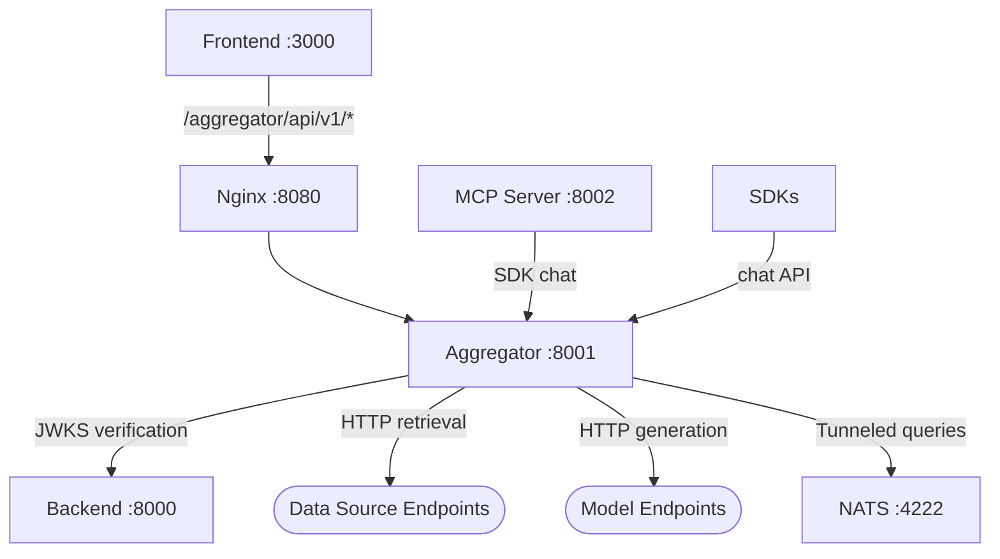
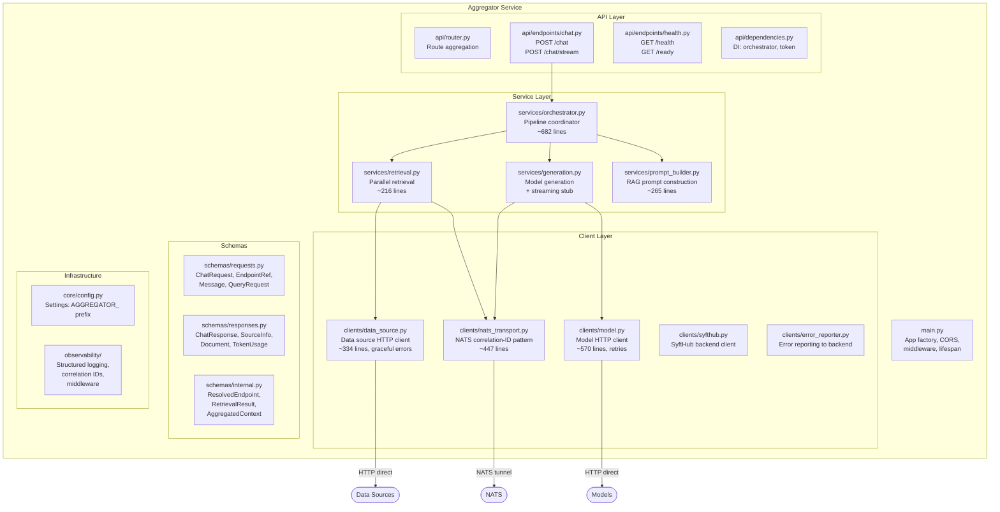
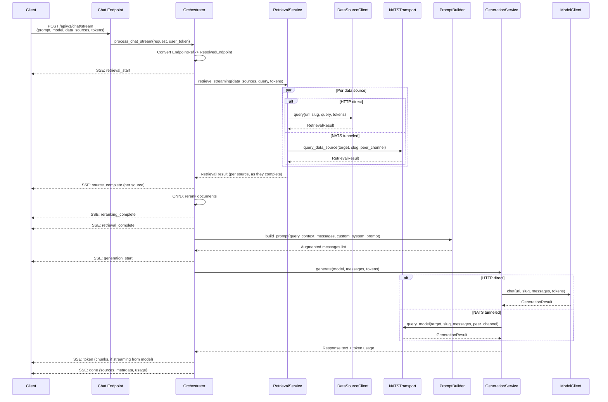
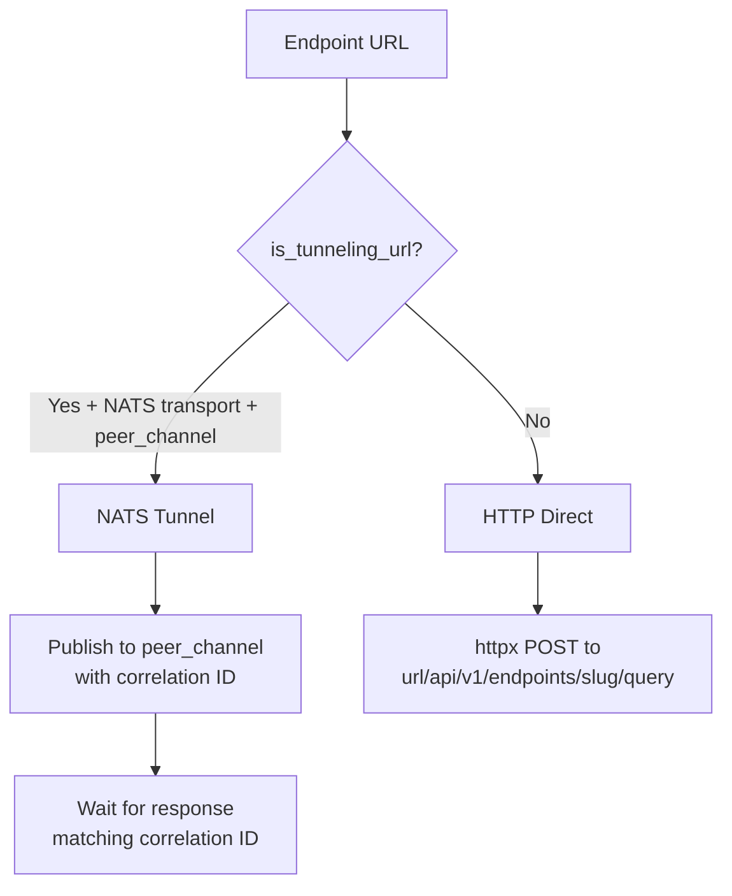

# Aggregator Service

The aggregator is a stateless FastAPI service that implements SyftHub's Retrieval-Augmented Generation (RAG) pipeline. It receives a chat request containing endpoint references, queries data sources in parallel, optionally reranks results with an ONNX model, builds an augmented prompt, and streams the model's response back via SSE.

**Path:** `components/aggregator/`
**Port:** 8001
**Framework:** FastAPI (Python)
**API prefix:** `/api/v1`

## Position in SyftHub



The aggregator sits between clients (frontend, MCP, SDKs) and the actual AI endpoints. It never stores state between requests -- all context (tokens, endpoint URLs, slugs) arrives with each request.

## Internal Structure (C4 Level 3)



## Module Responsibilities

| Module | Path | Responsibility |
|--------|------|----------------|
| `main.py` | `src/aggregator/main.py` | FastAPI app factory with `create_app()`, CORS, `CorrelationIDMiddleware`, `RequestLoggingMiddleware`, lifespan manager |
| `api/endpoints/chat.py` | `src/aggregator/api/endpoints/chat.py` | Two endpoints: `POST /api/v1/chat` (synchronous response) and `POST /api/v1/chat/stream` (SSE streaming) |
| `api/endpoints/health.py` | `src/aggregator/api/endpoints/health.py` | `GET /health` (basic) and `GET /ready` (readiness -- always ready since endpoint URLs come in request) |
| `api/dependencies.py` | `src/aggregator/api/dependencies.py` | FastAPI `Depends` factories: `get_orchestrator`, `get_optional_token` |
| `services/orchestrator.py` | `src/aggregator/services/orchestrator.py` | Central pipeline coordinator: converts `EndpointRef` to `ResolvedEndpoint`, drives retrieval, reranking, prompt building, generation; handles both sync (`process_chat`) and streaming (`process_chat_stream`) flows |
| `services/retrieval.py` | `src/aggregator/services/retrieval.py` | `RetrievalService` with `retrieve()` (parallel gather) and `retrieve_streaming()` (yield as complete); selects HTTP vs NATS transport per endpoint |
| `services/generation.py` | `src/aggregator/services/generation.py` | `GenerationService` with `generate()` and `generate_stream()` (stub -- model streaming not yet supported by SyftAI-Space) |
| `services/prompt_builder.py` | `src/aggregator/services/prompt_builder.py` | `PromptBuilder` constructs augmented prompts with `<documents>` XML tags, system prompt, user instructions, and conversation history |
| `clients/model.py` | `src/aggregator/clients/model.py` | `ModelClient` HTTP client for model endpoints; includes retry logic (2 retries, exponential backoff for 500/502/503/504) |
| `clients/data_source.py` | `src/aggregator/clients/data_source.py` | `DataSourceClient` HTTP client for data source endpoints; never raises -- returns `RetrievalResult` with error status on failure |
| `clients/nats_transport.py` | `src/aggregator/clients/nats_transport.py` | `NATSTransport` for tunneled communication: publishes request to `peer_channel` subject with correlation ID, waits for response |
| `clients/syfthub.py` | `src/aggregator/clients/syfthub.py` | Backend integration client (JWKS fetch for token verification) |
| `clients/error_reporter.py` | `src/aggregator/clients/error_reporter.py` | Reports errors back to the backend's error logging endpoint |
| `core/config.py` | `src/aggregator/core/config.py` | `pydantic-settings` with `AGGREGATOR_` env prefix: timeouts, retrieval limits, NATS config, CORS |
| `schemas/requests.py` | `src/aggregator/schemas/requests.py` | `ChatRequest` (prompt, model `EndpointRef`, data_sources, endpoint_tokens, transaction_tokens, LLM params, NATS peer fields), `QueryRequest`, `ChatCompletionRequest`, `Message` |
| `schemas/responses.py` | `src/aggregator/schemas/responses.py` | `ChatResponse`, `SourceInfo`, `Document`, `DocumentSource`, `ResponseMetadata`, `TokenUsage`, `ErrorResponse` |
| `schemas/internal.py` | `src/aggregator/schemas/internal.py` | `ResolvedEndpoint`, `RetrievalResult`, `AggregatedContext`, `GenerationResult` |
| `observability/*` | `src/aggregator/observability/` | Structured logging (structlog), correlation ID context, request logging middleware, log sanitizer |

## Data Models

The aggregator is stateless and has no database tables. All data flows through request/response schemas:

**Request flow:**

```
ChatRequest
  -> prompt (str)
  -> model (EndpointRef: url, slug, name, tenant_name, owner_username)
  -> data_sources (list[EndpointRef])
  -> endpoint_tokens (dict[owner_username -> satellite_token])
  -> transaction_tokens (dict[owner_username -> transaction_token])
  -> top_k, max_tokens, temperature, similarity_threshold
  -> messages (list[Message] for multi-turn)
  -> peer_token, peer_channel (NATS tunnel fields)
  -> stream (bool)
  -> custom_system_prompt (optional override)
```

**Internal flow:**

```
EndpointRef -> ResolvedEndpoint (with path, url, slug, type, owner)
RetrievalResult (per source: path, status, documents, latency)
AggregatedContext (all documents, all results, total latency)
GenerationResult (response text, token usage)
```

## API Surface

| Method | Path | Description | Response |
|--------|------|-------------|----------|
| `POST` | `/api/v1/chat` | Synchronous RAG chat | `ChatResponse` JSON |
| `POST` | `/api/v1/chat/stream` | Streaming RAG chat | SSE event stream |
| `GET` | `/health` | Basic health check | `{"status": "healthy"}` |
| `GET` | `/ready` | Readiness check | `{"status": "ready"}` |

**SSE Event Types (streaming):**

| Event | Payload | Phase |
|-------|---------|-------|
| `retrieval_start` | `{"sources": N}` | Start of retrieval |
| `source_complete` | `{"path": "...", "status": "...", "documents": N}` | One source finished |
| `reranking_start` | `{}` | ONNX reranking begins |
| `reranking_complete` | `{"documents": N}` | Reranking finished |
| `retrieval_complete` | `{"total_documents": N, "time_ms": N}` | All retrieval done |
| `generation_start` | `{}` | Model generation begins |
| `generation_heartbeat` | `{}` | Keep-alive during long generation |
| `token` | `{"content": "..."}` | Streaming response chunk |
| `done` | `{"sources": [...], "metadata": {...}, "usage": {...}}` | Complete |
| `error` | `{"message": "..."}` | Error occurred |

## Key Workflows

### RAG Pipeline (Full Sequence)



### Transport Selection



## Configuration

| Variable | Default | Description |
|----------|---------|-------------|
| `AGGREGATOR_SERVICE_NAME` | `syfthub-aggregator` | Service identifier |
| `AGGREGATOR_DEBUG` | `false` | Enable debug mode (enables /docs, /redoc) |
| `AGGREGATOR_HOST` | `0.0.0.0` | Bind host |
| `AGGREGATOR_PORT` | `8001` | Bind port |
| `AGGREGATOR_SYFTHUB_URL` | `http://localhost:8000` | Backend URL for JWKS verification |
| `AGGREGATOR_SYFTHUB_JWKS_CACHE_TTL` | `3600` | JWKS cache TTL in seconds |
| `AGGREGATOR_RETRIEVAL_TIMEOUT` | `30.0` | Per-source retrieval timeout (seconds) |
| `AGGREGATOR_GENERATION_TIMEOUT` | `120.0` | Model generation timeout (seconds) |
| `AGGREGATOR_TOTAL_TIMEOUT` | `180.0` | Total request timeout (seconds) |
| `AGGREGATOR_DEFAULT_TOP_K` | `5` | Default documents per source |
| `AGGREGATOR_MAX_TOP_K` | `20` | Maximum documents per source |
| `AGGREGATOR_MAX_DATA_SOURCES` | `10` | Maximum data source endpoints per request |
| `AGGREGATOR_MODEL_STREAMING_ENABLED` | `false` | Enable model streaming (blocked: SyftAI-Space does not implement it yet) |
| `AGGREGATOR_NATS_URL` | `nats://nats:4222` | NATS server URL |
| `AGGREGATOR_NATS_AUTH_TOKEN` | *(empty)* | NATS authentication token |
| `AGGREGATOR_NATS_TUNNEL_TIMEOUT` | `30.0` | NATS tunnel response timeout (seconds) |
| `AGGREGATOR_CORS_ORIGINS` | `["*"]` | CORS allowed origins |
| `AGGREGATOR_LOG_LEVEL` | `INFO` | Logging level |
| `AGGREGATOR_LOG_FORMAT` | `json` | Log format: `json` for production, `console` for development |
| `AGGREGATOR_LOG_REQUEST_HEADERS` | `false` | Log request headers (dev/debug only) |
| `AGGREGATOR_LOG_REQUEST_BODY` | `false` | Log request bodies (performance impact) |

## Dependencies

**Internal:**

| Component | How Used | Direction |
|-----------|----------|-----------|
| Backend | JWKS endpoint for satellite token verification | Aggregator -> Backend |
| NATS | Tunneled communication with spaces behind NAT | Aggregator -> NATS |

**External:**

| Service | Purpose | Required |
|---------|---------|----------|
| Data source endpoints | Document retrieval via POST `{url}/api/v1/endpoints/{slug}/query` | Yes (for RAG) |
| Model endpoints | Text generation via POST `{url}/api/v1/endpoints/{slug}/query` | Yes |

**Python dependencies:** FastAPI, httpx, pydantic, pydantic-settings, structlog, nats-py, onnxruntime (reranking), federated-aggregation.

## Error Handling

The aggregator has an intentionally asymmetric error handling design:

| Component | On Error | Rationale |
|-----------|----------|-----------|
| **Data source client** | Returns `RetrievalResult` with `status="error"` or `status="timeout"`, never raises | Graceful degradation -- fewer retrieved documents is acceptable; other sources may still succeed |
| **Model client** | Raises `ModelClientError` or `NATSTransportError` | Hard failure -- the model is required to generate a response; there is no fallback |
| **NATS transport** | Raises `NATSTransportError` on connection or timeout | Hard failure for tunneled endpoints; caught by calling service |
| **Orchestrator** | Raises `OrchestratorError` for invalid requests; catches and wraps service errors | Single error surface for the chat endpoint |
| **Chat endpoint** | Catches `OrchestratorError` (400), all others (500) | Structured error responses; streaming errors emit SSE `error` event |

**Model client retry policy:**
- Max 2 retries with exponential backoff (1s base delay)
- Only retries on status codes: 500, 502, 503, 504
- Client errors (4xx) are not retried

## Testing

```bash
cd components/aggregator && uv run python -m pytest
```

Tests are in `components/aggregator/tests/`:
- `test_health.py` -- health and readiness endpoint tests
- `test_schemas.py` -- schema validation tests
- `conftest.py` -- shared fixtures

## Known Limitations

| Category | Issue | Severity |
|----------|-------|----------|
| **Performance** | No shared `httpx.AsyncClient` -- new TCP connection per call in model.py and data_source.py | P1 |
| **Deprecated API** | `asyncio.get_event_loop()` in nats_transport.py:171 (should use `get_running_loop()`) | P1 |
| **Performance** | No ONNX model singleton -- may re-load ~570MB model per rerank call | P1 |
| **Code duplication** | Duplicate task-building logic between `retrieve()` and `retrieve_streaming()` | P1 |
| **Fragile contract** | `node["person"]` key from `federated_aggregation` is an undocumented assumption | P2 |
| **Model streaming** | `generate_stream()` is a stub -- SyftAI-Space ignores the `stream` parameter | Blocked |
| **Resource** | ONNX reranking model requires ~570MB on load; production limits: 3 CPU / 5GB memory | Operational |

**Recommended fixes:**
1. Create shared `httpx.AsyncClient` at startup (lifespan), inject via dependency
2. Replace `get_event_loop()` with `asyncio.get_running_loop()`
3. Warm ONNX model as singleton at startup, share across rerank calls
4. Deduplicate retrieval task-building (extract helper for HTTP vs NATS transport selection)

## Related

- [Architecture Overview](../overview.md)
- [Backend Component](./backend.md)
- [Frontend Component](./frontend.md)
- [MCP Server Component](./mcp.md)
- [Aggregator Complexity Analysis](../aggregator-complexity.md)
- [Aggregator API Reference](../../api/aggregator.md)
- [RAG Pipeline Explanation](../../explanation/rag-pipeline.md)
