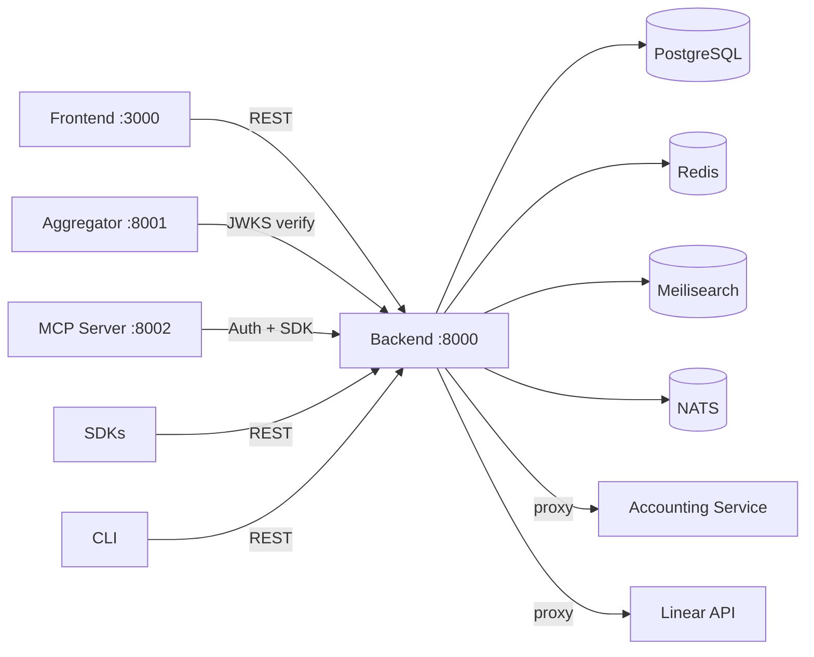
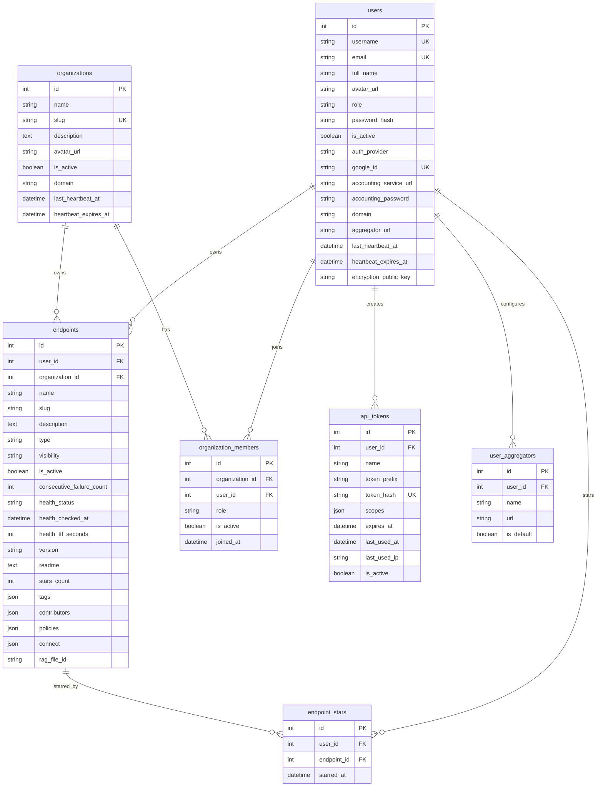
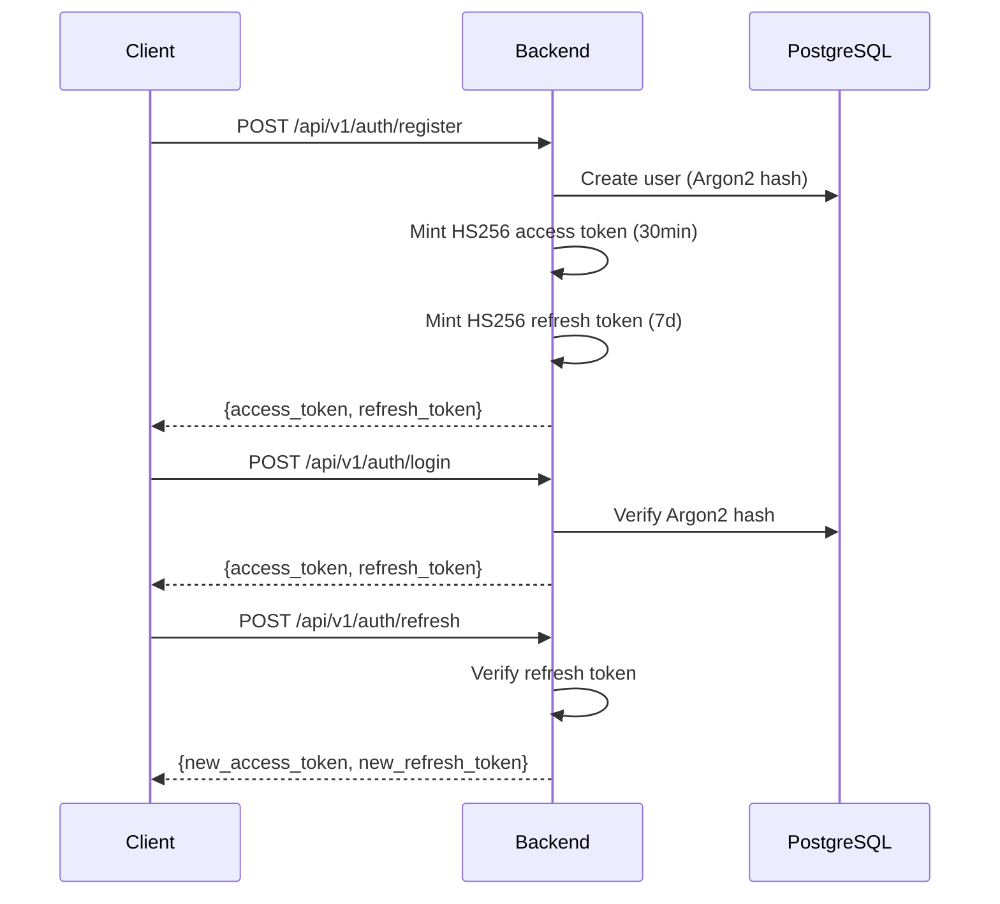
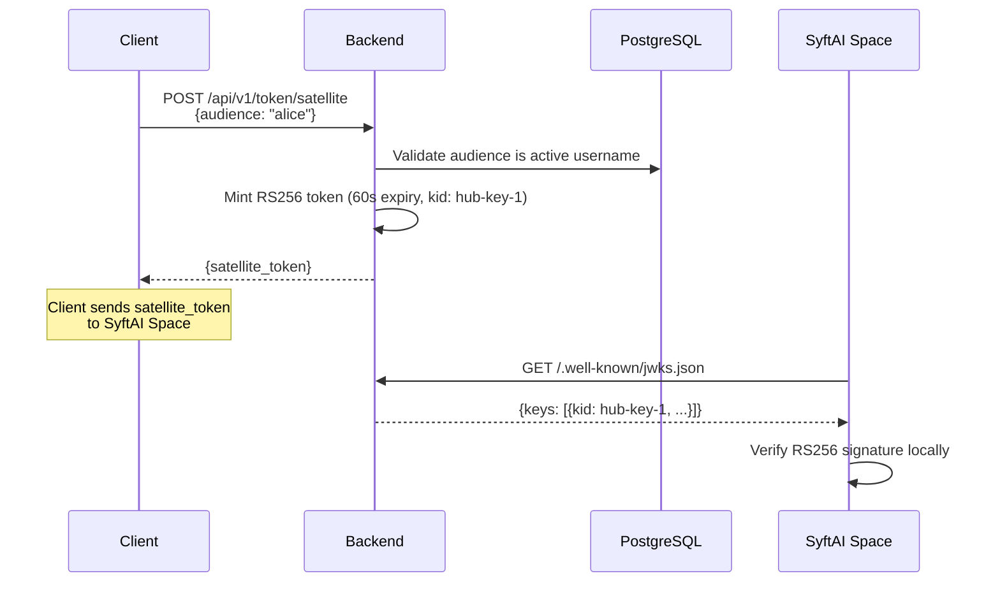
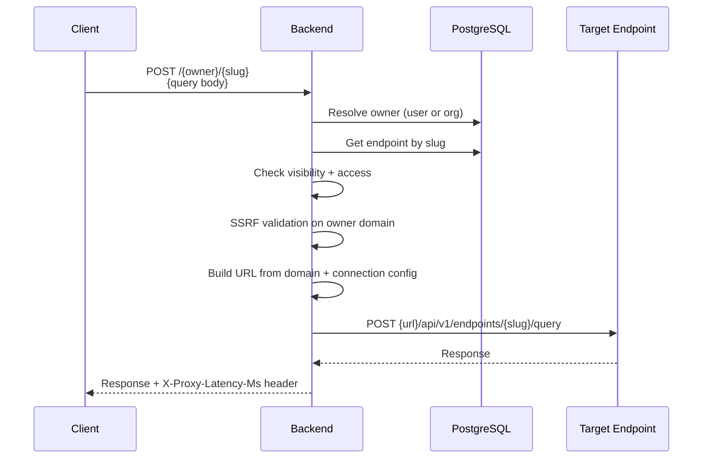
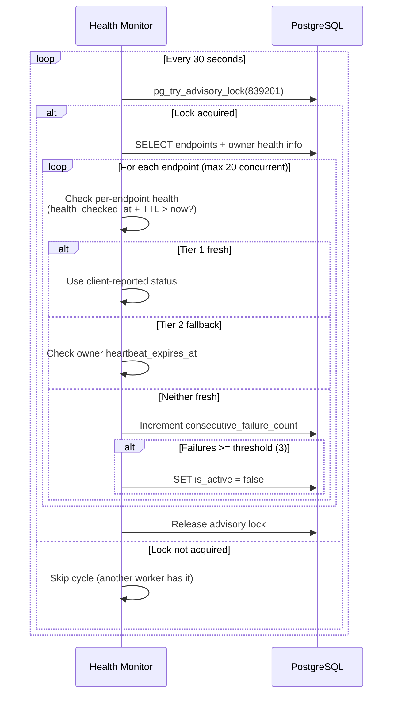

# Backend Service

The backend is the central API service for SyftHub. It handles authentication, endpoint management, user and organization CRUD, search indexing, health monitoring, and acts as both a REST API and an Identity Provider (IdP) for satellite services.

**Path:** `components/backend/`
**Port:** 8000
**Framework:** FastAPI (Python)
**API prefix:** `/api/v1`

## Position in SyftHub



The backend is the hub of all communication. Every client (frontend, SDKs, CLI, MCP server) authenticates through and retrieves data from this service. The aggregator fetches the backend's JWKS endpoint to verify satellite tokens locally.

## Internal Structure (C4 Level 3)

```mermaid
graph TB
    subgraph "Backend Service"
        MAIN[main.py<br/>App factory + lifespan]
        MW[Middleware<br/>CORS, CorrelationID,<br/>RequestLogging]
        EH[Exception Handlers<br/>register_exception_handlers]

        subgraph "API Layer"
            AR[api/router.py<br/>Route aggregation]
            AUTH_R[auth/router.py<br/>Login, register, refresh,<br/>Google OAuth]
            USR[api/endpoints/users.py]
            EP[api/endpoints/endpoints.py]
            ORG[api/endpoints/organizations.py]
            TOK[api/endpoints/token.py<br/>Satellite tokens]
            NATS_R[api/endpoints/nats.py<br/>Encryption keys, tunnels]
            PEER[api/endpoints/peer.py<br/>Peer tokens]
            ACCT_R[api/endpoints/accounting.py<br/>Proxy to accounting]
            FB[api/endpoints/feedback.py<br/>Linear issue creation]
            UA[api/endpoints/user_aggregators.py]
            ERR[api/endpoints/errors.py<br/>Frontend error reporting]
        end

        subgraph "Service Layer"
            AUTH_S[services/auth_service.py]
            USR_S[services/user_service.py]
            EP_S[services/endpoint_service.py]
            ORG_S[services/organization_service.py]
            TOK_S[services/api_token_service.py]
            RAG_S[services/rag_service.py<br/>Meilisearch indexing]
            ACCT_S[services/accounting_client.py]
            UA_S[services/user_aggregator_service.py]
        end

        subgraph "Repository Layer"
            USR_R[repositories/user.py]
            EP_R[repositories/endpoint.py]
            ORG_R[repositories/organization.py]
            TOK_R[repositories/api_token.py]
            UA_R[repositories/user_aggregator.py]
        end

        subgraph "Auth Module"
            SEC[auth/security.py<br/>JWT + Argon2]
            KEYS[auth/keys.py<br/>RSA key manager]
            SAT[auth/satellite_tokens.py<br/>RS256 minting]
            PAT[auth/api_tokens.py<br/>PAT validation]
            PEER_T[auth/peer_tokens.py<br/>NATS peer tokens]
            DB_DEP[auth/db_dependencies.py<br/>get_current_user]
        end

        subgraph "Infrastructure"
            CFG[core/config.py<br/>pydantic-settings]
            DB[database/connection.py<br/>SQLAlchemy engine]
            DEP[database/dependencies.py<br/>Session + repo DI]
            REDIS[core/redis_client.py]
            SSRF[core/ssrf_protection.py]
            URL[core/url_builder.py]
            HTML[core/html_sanitizer.py]
        end

        subgraph "Background Jobs"
            HM[jobs/health_monitor.py<br/>30s cycle, advisory lock]
        end

        subgraph "Observability"
            OBS_MW[observability/middleware.py]
            OBS_LOG[observability/logger.py]
            OBS_CTX[observability/context.py]
            OBS_MOD[observability/models.py]
            OBS_REPO[observability/repository.py]
            OBS_SAN[observability/sanitizer.py]
        end
    end

    AR --> AUTH_R & USR & EP & ORG & TOK & NATS_R & PEER & ACCT_R & FB & UA & ERR
    USR --> USR_S --> USR_R --> DB
    EP --> EP_S --> EP_R --> DB
    ORG --> ORG_S --> ORG_R --> DB
    EP_S --> RAG_S --> MS[(Meilisearch)]
    HM --> DB
```



## Module Responsibilities

| Module | Path | Responsibility |
|--------|------|----------------|
| `main.py` | `src/syfthub/main.py` | App factory, lifespan (DB init, RSA keys, health monitor), middleware registration, CORS, GitHub-style routes (`/{owner}/{slug}`), endpoint proxy |
| `core/config.py` | `src/syfthub/core/config.py` | All settings via `pydantic-settings` with env var binding, 80+ configuration fields |
| `api/router.py` | `src/syfthub/api/router.py` | Aggregates all endpoint routers under `/api/v1` |
| `auth/security.py` | `src/syfthub/auth/security.py` | Argon2 password hashing, HS256 JWT creation/verification |
| `auth/keys.py` | `src/syfthub/auth/keys.py` | RSA key manager (load from PEM, env, file, or auto-generate), JWKS endpoint |
| `auth/satellite_tokens.py` | `src/syfthub/auth/satellite_tokens.py` | RS256 satellite token minting with dynamic audience validation |
| `auth/api_tokens.py` | `src/syfthub/auth/api_tokens.py` | PAT validation (SHA-256 hash lookup, `syft_pat_` prefix) |
| `auth/peer_tokens.py` | `src/syfthub/auth/peer_tokens.py` | NATS peer token generation for tunnel authentication |
| `services/*` | `src/syfthub/services/` | Business logic layer; each service receives repositories via constructor injection |
| `repositories/*` | `src/syfthub/repositories/` | Data access layer using SQLAlchemy ORM, repository pattern |
| `jobs/health_monitor.py` | `src/syfthub/jobs/health_monitor.py` | Background health checks every 30s, PostgreSQL advisory lock `839201` for multi-worker safety |
| `observability/*` | `src/syfthub/observability/` | Structured logging (structlog), correlation IDs, request/response logging middleware, error log persistence |
| `core/ssrf_protection.py` | `src/syfthub/core/ssrf_protection.py` | Domain validation before proxying POST requests to endpoints |
| `core/url_builder.py` | `src/syfthub/core/url_builder.py` | Build connection URLs from owner domain + connection config |
| `core/html_sanitizer.py` | `src/syfthub/core/html_sanitizer.py` | Sanitize README markdown HTML to prevent XSS |
| `domain/exceptions.py` | `src/syfthub/domain/exceptions.py` | Domain-specific exception hierarchy (DomainException, IdPException, AccountingException, etc.) |
| `domain/value_objects.py` | `src/syfthub/domain/value_objects.py` | Immutable domain value objects |

## Data Models



**Constraints:**
- `endpoints` has a check constraint: exactly one of `user_id` or `organization_id` must be non-null (`ck_endpoints_single_owner`)
- Unique slug per user (`idx_endpoints_user_slug`) and per organization (`idx_endpoints_org_slug`)
- Unique star per user-endpoint pair (`idx_endpoint_stars_unique`)
- Unique membership per user-organization pair (`idx_org_members_unique`)

## API Surface

The backend exposes 89 API routes under `/api/v1` plus top-level routes:

| Tag | Prefix | Key Endpoints |
|-----|--------|---------------|
| **authentication** | `/api/v1/auth` | `POST /register`, `POST /login`, `POST /refresh`, `POST /google`, `POST /logout` |
| **users** | `/api/v1/users` | `GET /me`, `PUT /me`, `DELETE /me`, `GET /me/starred`, `POST /me/heartbeat` (deprecated), `GET /{username}` |
| **user-aggregators** | `/api/v1/users` | `GET /me/aggregators`, `POST /me/aggregators`, `PUT /me/aggregators/{id}`, `DELETE /me/aggregators/{id}` |
| **endpoints** | `/api/v1/endpoints` | Full CRUD, `POST /{id}/star`, `DELETE /{id}/star`, `POST /health`, `GET /search`, `GET /browse` |
| **organizations** | `/api/v1/organizations` | Full CRUD, member management, `POST /{id}/heartbeat` (deprecated) |
| **identity-provider** | `/api/v1/token` | `POST /satellite` (mint RS256 token), `GET /api-tokens`, `POST /api-tokens`, `DELETE /api-tokens/{id}` |
| **nats-peer** | `/api/v1/peer-token` | `POST /peer-token` (NATS peer auth) |
| **nats** | `/api/v1/nats` | `PUT /encryption-key`, `GET /credentials` (ngrok tunnel) |
| **accounting** | `/api/v1/accounting` | Proxy: `POST /register`, `POST /login`, `GET /balance`, `POST /transfer`, `POST /transaction-token` |
| **feedback** | `/api/v1/feedback` | `POST /feedback` (creates Linear issue) |
| **observability** | `/api/v1/errors` | `POST /errors` (frontend error reporting) |
| **(top-level)** | `/` | `GET /` (root), `GET /health`, `GET /.well-known/jwks.json`, `GET /{owner}`, `GET /{owner}/{slug}`, `POST /{owner}/{slug}` (proxy invocation) |

## Key Workflows

### Authentication Flow



### Satellite Token Minting



### Endpoint Proxy Invocation



### Health Monitor Cycle



## Configuration

| Variable | Default | Description |
|----------|---------|-------------|
| `APP_NAME` | `"Syfthub API"` | Application display name |
| `DEBUG` | `false` | Enable debug mode |
| `HOST` | `0.0.0.0` | Bind host |
| `PORT` | `8000` | Bind port |
| `WORKERS` | `1` | Uvicorn worker count |
| `SECRET_KEY` | *(dev placeholder)* | HS256 JWT signing key |
| `ACCESS_TOKEN_EXPIRE_MINUTES` | `30` | Hub access token lifetime |
| `REFRESH_TOKEN_EXPIRE_DAYS` | `7` | Refresh token lifetime |
| `DATABASE_URL` | `sqlite:///./syfthub.db` | SQLAlchemy connection string |
| `REDIS_URL` | `redis://localhost:6379/0` | Redis connection URL |
| `CORS_ORIGINS` | `*` | Comma-separated allowed origins |
| `ISSUER_URL` | `https://hub.syft.com` | JWT issuer claim |
| `RSA_PRIVATE_KEY_PEM` | *(none)* | Base64-encoded RSA private key |
| `RSA_PUBLIC_KEY_PEM` | *(none)* | Base64-encoded RSA public key |
| `RSA_KEY_ID` | `hub-key-1` | JWKS key ID |
| `AUTO_GENERATE_RSA_KEYS` | `true` | Auto-generate keys in dev |
| `SATELLITE_TOKEN_EXPIRE_SECONDS` | `60` | Satellite token lifetime |
| `GOOGLE_CLIENT_ID` | *(none)* | Google OAuth client ID |
| `MEILI_URL` | *(none)* | Meilisearch URL |
| `MEILI_MASTER_KEY` | *(none)* | Meilisearch API key |
| `NATS_URL` | `nats://nats:4222` | NATS server URL |
| `NATS_AUTH_TOKEN` | *(empty)* | NATS auth token |
| `HEALTH_CHECK_ENABLED` | `true` | Enable health monitor |
| `HEALTH_CHECK_INTERVAL_SECONDS` | `30` | Check interval |
| `HEALTH_CHECK_FAILURE_THRESHOLD` | `3` | Failures before marking unhealthy |
| `HEALTH_CHECK_MAX_CONCURRENT` | `20` | Max parallel checks |
| `LINEAR_API_KEY` | *(none)* | Linear API key for feedback |
| `LINEAR_TEAM_ID` | *(none)* | Linear team for feedback issues |
| `LOG_LEVEL` | `INFO` | Logging level |
| `LOG_FORMAT` | `json` | `json` or `console` |

## Dependencies

| Dependency | Purpose | Connection |
|------------|---------|------------|
| **PostgreSQL** | Primary data store | `DATABASE_URL` env var |
| **Redis** | Rate limiting, caching | `REDIS_URL` env var |
| **Meilisearch** | Full-text endpoint search | `MEILI_URL` env var (optional) |
| **NATS** | Tunnel communication for spaces | `NATS_URL` env var |
| **Accounting Service** | External billing integration | `DEFAULT_ACCOUNTING_URL` env var |
| **Linear** | Bug reports / feedback issues | `LINEAR_API_KEY` env var (optional) |

## Error Handling

The backend uses a structured domain exception hierarchy rooted at `DomainException`:

| Exception | Error Code | HTTP Status | Use Case |
|-----------|-----------|-------------|----------|
| `ValidationError` | `VALIDATION_ERROR` | 400 | Domain validation failures |
| `NotFoundError` | `NOT_FOUND` | 404 | Resource not found |
| `PermissionDeniedError` | `PERMISSION_DENIED` | 403 | Insufficient permissions |
| `ConflictError` | `CONFLICT` | 409 | Duplicate resource |
| `UserAlreadyExistsError` | `USER_ALREADY_EXISTS` | 409 | Duplicate registration |
| `InvalidAudienceError` | `INVALID_AUDIENCE` | 400 | Bad satellite token audience |
| `AudienceNotFoundError` | `AUDIENCE_NOT_FOUND` | 404 | Unknown audience username |
| `AudienceInactiveError` | `AUDIENCE_INACTIVE` | 403 | Deactivated audience user |
| `KeyNotConfiguredError` | `KEY_NOT_CONFIGURED` | 503 | RSA keys missing |
| `AccountingServiceUnavailableError` | `ACCOUNTING_SERVICE_UNAVAILABLE` | 502 | Accounting service down |

Global exception handlers in `observability/handlers.py` catch domain exceptions and return structured JSON with error codes. Unhandled exceptions return 500 with correlation ID for tracing.

## Testing

```bash
cd components/backend && uv run python -m pytest
```

Tests are in `components/backend/tests/` using pytest. Test database uses SQLite (via SQLAlchemy's `JSON` type variant fallback).

## Known Limitations

| Category | Issue | Severity |
|----------|-------|----------|
| **Security** | `accounting_password` stored plaintext in DB | High |
| **Security** | Wildcard CORS with credentials enabled | High |
| **Security** | Implicit Google account linking (no confirmation flow) | Medium |
| **Security** | Proxy error leakage exposes target endpoint details | Medium |
| **Security** | INTERNAL visibility allows any authenticated user | Medium |
| **Security** | JWT does not check `is_active` status on every request | Low |
| **Performance** | N+1 owner domain lookups per endpoint list | Medium |
| **Performance** | Client-side endpoint filtering before pagination | Medium |
| **Performance** | New `httpx.AsyncClient` per proxy request | Medium |
| **Performance** | Slug generation can issue up to 999 DB queries | Low |

## Related

- [Architecture Overview](../overview.md)
- [Frontend Component](./frontend.md)
- [Aggregator Component](./aggregator.md)
- [MCP Server Component](./mcp.md)
- [Authentication Explanation](../../explanation/authentication.md)
- [API Reference](../../api/backend.md)
