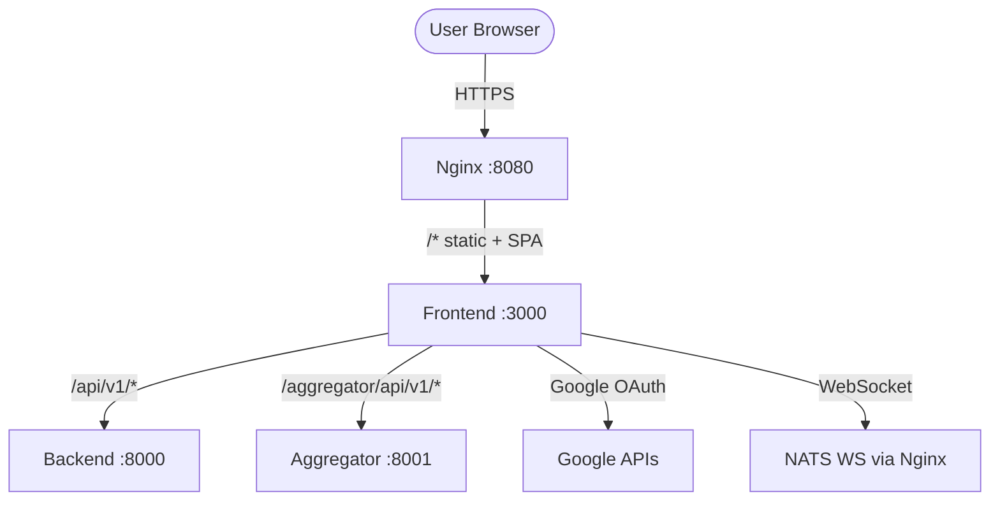
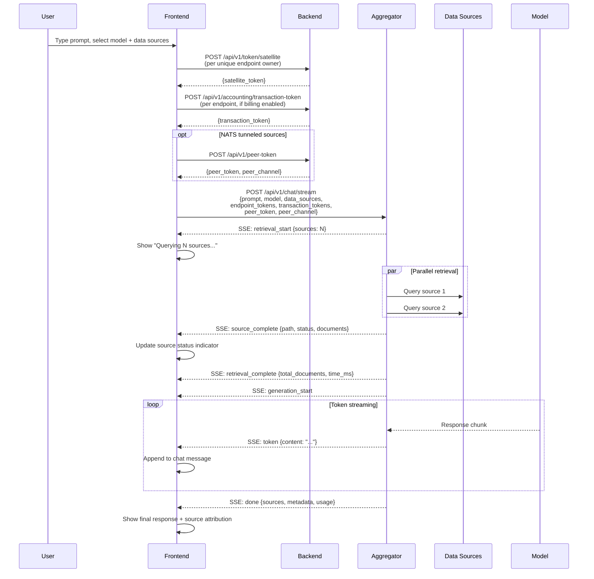
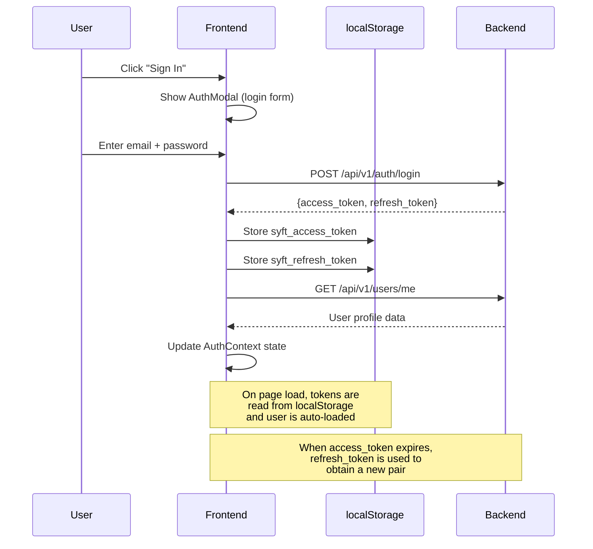
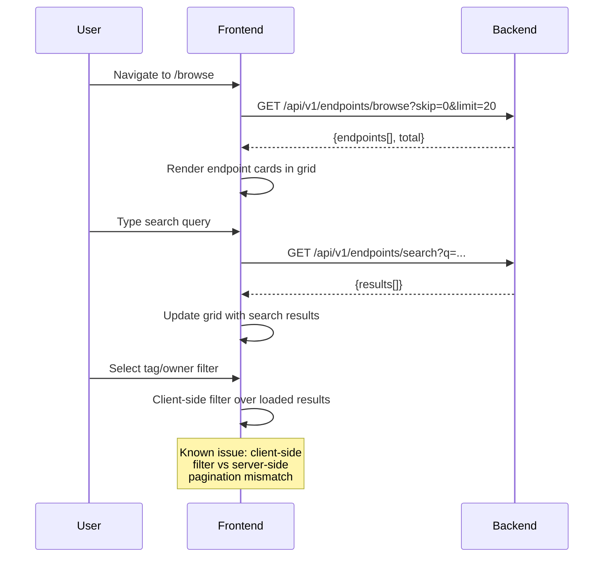

# Frontend Service

The frontend is a React 19 single-page application that provides the user interface for SyftHub -- endpoint browsing, AI chat with RAG, endpoint management, user profiles, and settings.

**Path:** `components/frontend/`
**Port:** 3000
**Framework:** React 19 + Vite
**Styling:** Tailwind CSS + shadcn/ui

## Position in SyftHub



The frontend is the primary user-facing interface. It communicates with the backend for all data operations and authentication, and with the aggregator for RAG chat workflows. All traffic is routed through Nginx at port 8080 in production.

## Internal Structure (C4 Level 3)

```mermaid
graph TB
    subgraph "Frontend SPA"
        ENTRY[main.tsx<br/>React root mount]
        APP[app.tsx<br/>Router + providers]

        subgraph "Provider Stack (top to bottom)"
            EB[ErrorBoundary]
            QCP[QueryClientProvider<br/>React Query cache]
            ROOT[RootProvider<br/>Theme context]
            GAUTH[GoogleOAuthWrapper<br/>Conditional Google OAuth]
            AUTHP[AuthProvider<br/>Login state + tokens]
            ACCTP[AccountingProvider<br/>Balance + transactions]
        end

        subgraph "Layout Layer"
            ML[MainLayout<br/>Sidebar + user menu + Outlet]
            RB[RouteBoundary<br/>Suspense + ErrorBoundary]
            PR[ProtectedRoute<br/>Auth guard redirect]
        end

        subgraph "Pages (lazy-loaded via lazyWithRetry)"
            HOME[HomePage<br/>Hero + recent items]
            BROWSE[BrowsePage<br/>Browse + search]
            CHAT[ChatPage<br/>RAG chat interface]
            BUILD[BuildPage<br/>Developer portal]
            ABOUT[AboutPage]
            PROFILE[ProfilePage<br/>Settings]
            ENDPOINTS[EndpointsPage<br/>Manage + onboarding]
            DETAIL[EndpointDetailPage<br/>GitHub-style detail]
            NF[NotFoundPage]
        end

        subgraph "Key Components"
            SIDEBAR[Sidebar<br/>Navigation + branding]
            BV[BrowseView<br/>Tag/owner filters + grid]
            BFM[BrowseFiltersModal]
            CC[ConnectionCard]
            MS[ModelSelector<br/>Chat model picker]
            CP[ContextPill<br/>Selected source indicator]
            SS[SuggestedSources]
            CB[CostBadges<br/>Token cost display]
            WF[WorkflowDisplay<br/>SSE event visualization]
            BI[BalanceIndicator<br/>Account balance]
            TD[TransactionList]
            ST[Settings Tabs<br/>Profile, API Tokens,<br/>Aggregator, Payment,<br/>Danger Zone]
            AM[AuthModals<br/>Login + Register forms]
        end

        subgraph "Hooks (Business Logic)"
            UCW[use-chat-workflow<br/>Chat orchestration + SSE]
            UAA[use-accounting-api<br/>Accounting singleton]
            UEQ[use-endpoint-queries]
            UMQ[use-model-queries]
            UDSQ[use-data-source-queries]
            UAQ[use-accounting-queries]
            UM[use-models]
            UDS[use-data-sources]
            UAC[use-accounting]
        end

        subgraph "Lib (Utilities)"
            EU[endpoint-utils<br/>Dual fetch, format, filter]
            CU[cost-utils<br/>Token cost calculation]
            MU[mention-utils<br/>@mention parsing]
            VAL[validation<br/>Form validation rules]
            QC[query-client<br/>React Query config]
            SDK[sdk-client<br/>API base URL, Google ID]
            SRCH[search-service<br/>Meilisearch wrapper]
            LWR[lazy-with-retry<br/>Stale chunk auto-reload]
        end

        subgraph "State (Zustand)"
            ZCS[context-selection-store<br/>Selected models + sources]
            ZUA[user-aggregators-store<br/>Aggregator configs]
        end

        subgraph "Context (React Context)"
            AC[auth-context<br/>Login/logout/refresh/user]
            ACC[accounting-context<br/>Balance provider]
            TC[theme-context<br/>Dark/light mode]
        end

        subgraph "Observability"
            OEB[error-boundary<br/>Global error catch]
            CORR[correlation<br/>Request ID propagation]
            LOG[logger<br/>Structured client logging]
            INT[interceptors<br/>Fetch middleware]
            REP[reporter<br/>Error report to backend]
        end

        subgraph "UI Primitives (shadcn/ui)"
            BTN[Button] --- CARD[Card]
            INP[Input] --- MOD[Modal]
            SEL[Select] --- TAB[Tabs]
            BADGE[Badge] --- DD[DropdownMenu]
            POP[Popover] --- SL[Slider]
            MORE[+12 more components]
        end
    end

    ENTRY --> APP --> EB --> QCP --> ROOT --> GAUTH --> AUTHP --> ACCTP
    ACCTP --> ML
    ML --> RB --> PAGES
```

## Module Responsibilities

| Module | Path | Responsibility |
|--------|------|----------------|
| `main.tsx` | `src/main.tsx` | React DOM mount point |
| `app.tsx` | `src/app.tsx` | Root component: provider stack, BrowserRouter, Route definitions, lazy-loaded pages |
| `context/auth-context.tsx` | `src/context/auth-context.tsx` | `AuthProvider` with login, register, Google login, refresh, logout; token persistence in localStorage (`syft_access_token`, `syft_refresh_token`) |
| `context/accounting-context.tsx` | `src/context/accounting-context.tsx` | `AccountingProvider` wrapping balance state and transaction operations |
| `context/theme-context.tsx` | `src/context/theme-context.tsx` | Dark/light theme toggle via context |
| `hooks/use-chat-workflow.ts` | `src/hooks/use-chat-workflow.ts` | Chat orchestration: SSE event stream processing with 180-line `processStreamEventForStatus` switch, manages retrieval/generation/done phases |
| `hooks/use-accounting-api.ts` | `src/hooks/use-accounting-api.ts` | Global accounting singleton with `refreshListeners` Set, balance queries, transfers, transaction tokens |
| `hooks/use-endpoint-queries.ts` | `src/hooks/use-endpoint-queries.ts` | React Query hooks for endpoint CRUD |
| `hooks/use-model-queries.ts` | `src/hooks/use-model-queries.ts` | React Query hooks for model endpoints |
| `hooks/use-data-source-queries.ts` | `src/hooks/use-data-source-queries.ts` | React Query hooks for data source endpoints |
| `lib/endpoint-utils.ts` | `src/lib/endpoint-utils.ts` | Dual fetch strategies (browse API vs search API), `formatRelativeTime`, stop-word list, `getTotalEndpointsCount` with O(n) fetch |
| `lib/search-service.ts` | `src/lib/search-service.ts` | Meilisearch integration, `categorizeResults` wrapper, `formatRelativeTime` copy |
| `lib/lazy-with-retry.ts` | `src/lib/lazy-with-retry.ts` | `React.lazy` wrapper that auto-reloads on stale chunk import errors |
| `lib/query-client.ts` | `src/lib/query-client.ts` | React Query `QueryClient` configuration (stale time, retry, etc.) |
| `lib/validation.ts` | `src/lib/validation.ts` | Form field validation rules (username, email, password) |
| `lib/cost-utils.ts` | `src/lib/cost-utils.ts` | Token cost calculation and formatting |
| `components/browse-view.tsx` | `src/components/browse-view.tsx` | Browse page body: tag/owner client-side filters over server-paginated results |
| `components/settings/*` | `src/components/settings/` | Five settings tabs: profile, API tokens (PAT management), aggregator, payment, danger zone |
| `components/workflow/*` | `src/components/workflow/` | SSE event visualization during chat (retrieval progress, source status) |
| `stores/context-selection-store.ts` | `src/stores/context-selection-store.ts` | Zustand store for chat context: selected model and data source endpoints |
| `stores/user-aggregators-store.ts` | `src/stores/user-aggregators-store.ts` | Zustand store for user aggregator URL configurations |
| `observability/*` | `src/observability/` | Error boundary, correlation ID injection into fetch headers, structured client logger, error reporter to `POST /api/v1/errors` |

## Routes

| Path | Component | Auth | Description |
|------|-----------|------|-------------|
| `/` | `HomePage` | Public | Hero section, recent models and data sources |
| `/browse` | `BrowsePage` | Public | Browse all endpoints with tag/owner filters |
| `/chat` | `ChatPage` | Public | AI chat interface with RAG streaming workflow |
| `/build` | `BuildPage` | Public | Developer portal and SDK documentation |
| `/about` | `AboutPage` | Public | About SyftHub |
| `/profile` | `ProfilePage` | Protected | User profile and settings (5 tabs) |
| `/endpoints` | `EndpointsPage` | Protected | Endpoint management with onboarding flow |
| `/:username/:slug` | `EndpointDetailPage` | Public | GitHub-style endpoint detail page |
| `*` | `NotFoundPage` | Public | 404 fallback |

All routes are lazy-loaded using `lazyWithRetry` (handles stale chunk errors by triggering page reload) and wrapped in `RouteBoundary` (React `Suspense` + local `ErrorBoundary`). Protected routes use `ProtectedRoute` which redirects unauthenticated users to login.

## API Surface

The frontend does not expose an API. It consumes the following:

**Backend Endpoints:**

| Endpoint | Frontend Usage |
|----------|----------------|
| `POST /api/v1/auth/login` | Email/password login |
| `POST /api/v1/auth/register` | User registration |
| `POST /api/v1/auth/refresh` | Token refresh |
| `POST /api/v1/auth/google` | Google OAuth login |
| `GET /api/v1/endpoints/browse` | Browse page data |
| `GET /api/v1/endpoints/search` | Meilisearch-backed search |
| `POST /api/v1/endpoints` | Create endpoint |
| `PUT /api/v1/endpoints/{id}` | Update endpoint |
| `POST /api/v1/endpoints/{id}/star` | Star endpoint |
| `DELETE /api/v1/endpoints/{id}/star` | Unstar endpoint |
| `GET /api/v1/users/me` | Current user profile |
| `PUT /api/v1/users/me` | Update profile |
| `GET /api/v1/users/me/aggregators` | List user aggregators |
| `POST /api/v1/users/me/aggregators` | Add aggregator |
| `POST /api/v1/token/satellite` | Mint satellite token for chat |
| `GET /api/v1/token/api-tokens` | List PATs |
| `POST /api/v1/token/api-tokens` | Create PAT |
| `POST /api/v1/accounting/*` | Balance, transactions, transfers |
| `POST /api/v1/peer-token` | NATS peer token for tunneled chat |
| `POST /api/v1/feedback` | Bug reports (Linear) |
| `POST /api/v1/errors` | Frontend error reporting |

**Aggregator Endpoints:**

| Endpoint | Frontend Usage |
|----------|----------------|
| `POST /api/v1/chat` | Non-streaming RAG chat |
| `POST /api/v1/chat/stream` | Streaming RAG chat (SSE) |

## Key Workflows

### Chat with RAG (Streaming)



### Authentication Flow



### Endpoint Browsing



## Configuration

| Variable | Set At | Default | Description |
|----------|--------|---------|-------------|
| `VITE_API_BASE_URL` | Build time | `http://localhost:8080` | Backend API base URL (via Nginx) |
| `VITE_GOOGLE_CLIENT_ID` | Build time | *(none)* | Google OAuth Client ID (optional; omitting disables Google login) |

Configuration is injected at build time via Vite's `import.meta.env` system.

## Dependencies

| Dependency | Purpose |
|------------|---------|
| **React 19** | UI framework with concurrent features |
| **React Router v6** | Client-side routing with `BrowserRouter` |
| **TanStack React Query** | Server state management: caching, refetching, optimistic updates, mutations |
| **Zustand** | Lightweight client-side state stores |
| **Tailwind CSS** | Utility-first CSS framework |
| **shadcn/ui** | Pre-built accessible component primitives (20+ components: Button, Card, Modal, Select, Tabs, etc.) |
| **Vite** | Build tool and development server with HMR |
| **@react-oauth/google** | Google Sign-In integration (conditional) |
| **TypeScript** | Type safety across the entire frontend |

## Error Handling

| Layer | Strategy |
|-------|----------|
| **App level** | Top-level `ErrorBoundary` from `observability/error-boundary.tsx` catches unhandled render errors |
| **Route level** | Every page wrapped in `RouteBoundary` = `React.Suspense` (loading fallback) + route-scoped `ErrorBoundary` |
| **API calls** | React Query `onError` callbacks handle per-query failures; global `queryClient` config handles retries |
| **Fetch middleware** | `observability/interceptors.ts` injects `X-Correlation-ID` headers and intercepts responses for auth errors |
| **Auth errors** | `AuthContext.refreshUser` catches `AuthenticationError` and triggers logout/redirect |
| **Client error reporting** | `observability/reporter.ts` sends structured error reports to `POST /api/v1/errors` for backend persistence |
| **Stale chunks** | `lazyWithRetry` catches chunk load failures from stale deploys and triggers page reload |

## Testing

```bash
cd components/frontend
npm test              # Playwright E2E tests
npm run lint          # ESLint
npm run typecheck     # TypeScript type checking
npm run format        # Prettier
```

Test locations:
- **Component unit tests:** `src/components/__tests__/` (balance-indicator, model-selector, settings-modal, login-modal)
- **Hook unit tests:** `src/hooks/__tests__/` (use-accounting-api, use-chat-workflow)
- **Context tests:** `src/context/__tests__/` (auth-context)
- **Lib unit tests:** `src/lib/__tests__/` (endpoint-utils, validation, cost-utils)
- **E2E tests:** `__tests__/` (Playwright)

## Known Limitations

| Category | Issue | Severity |
|----------|-------|----------|
| **Code duplication** | 3 copies of `formatRelativeTime` across endpoint-utils.ts, search-service.ts, and settings tab | Medium |
| **Anti-pattern** | `isMounted` ref guard in `use-accounting-api.ts` instead of `AbortController` cancellation | Medium |
| **Data fetching** | Client-side tag/owner filter vs server-side pagination mismatch in browse-view (filters run over current page, not full dataset) | Medium |
| **State** | Global `isProcessing` boolean in aggregator-settings-tab (not per-card, blocks all actions during any single operation) | Low |
| **Dead code** | `onAuthRequired` prop threaded through browse-view is unused | Low |
| **UX debt** | 4x duplicated modal backdrop markup in API tokens settings tab | Low |
| **Compat** | `execCommand('copy')` fallback for clipboard copy (deprecated Web API) | Low |
| **Performance** | `getTotalEndpointsCount` in endpoint-utils.ts does O(n) fetch to count all endpoints | Low |

**Recommended refactors:**
1. Extract `lib/date-utils.ts` to deduplicate `formatRelativeTime` (3 copies)
2. Replace `isMounted` ref pattern with `AbortController` in accounting hook
3. Move browse tag/owner filters to server-side query parameters
4. Per-card processing state in aggregator settings (replace global boolean)

## Related

- [Architecture Overview](../overview.md)
- [Backend Component](./backend.md)
- [Aggregator Component](./aggregator.md)
- [MCP Server Component](./mcp.md)
- [Frontend Complexity Analysis](../frontend-complexity.md)
- [Backend API Reference](../../api/backend.md)
- [Aggregator API Reference](../../api/aggregator.md)
