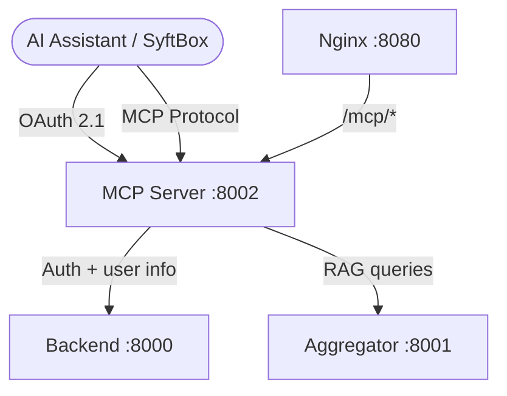
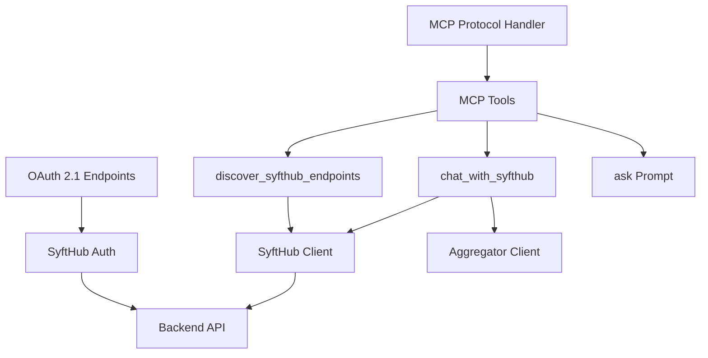
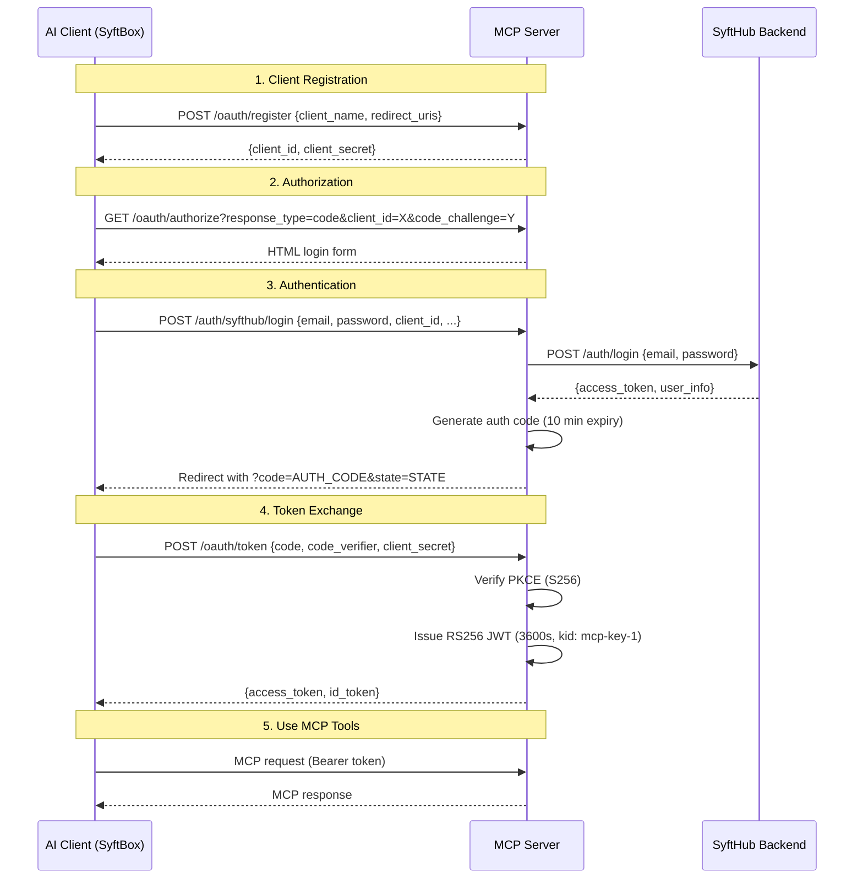

# Architecture: MCP Server

> **Audience:** Engineers, architects
> **Level:** C4 Level 3 (Component)
> **Last updated:** 2026-03-27
> **Source:** `components/mcp/`

---

## Purpose

The MCP server implements the Model Context Protocol with OAuth 2.1 authentication, enabling AI assistants (Claude, etc.) to discover and interact with SyftHub endpoints. It provides a standards-compliant OAuth flow and exposes SyftHub capabilities as MCP tools.

---

## Position in SyftHub

---

## Internal Structure

### Module Responsibilities

| Module | File | Responsibility |
|---|---|---|
| Server | `server.py` (~2250 lines) | Full MCP + OAuth implementation |
| SyftHub client | `syfthub_client.py` (~300 lines) | HTTP client for backend API |
| Config | `.env` / `.env.example` | Environment configuration |
| Deployment | `fastmcp.json` | FastMCP deployment config |

The MCP server is implemented as a single file using the FastMCP framework, with an auxiliary HTTP client for backend communication.

---

## OAuth 2.1 Flow

### Security Features

| Feature | Implementation |
|---|---|
| PKCE | S256 code challenge/verifier |
| JWT signing | RS256 with RSA-2048 key pair |
| Auth code expiry | 10 minutes |
| Access token expiry | 3600 seconds (1 hour) |
| Client auth | HTTP Basic or form-data credentials |
| CSRF protection | State parameter |
| Scopes | openid, profile, email |

---

## MCP Tools

### 1. `discover_syfthub_endpoints`

Discover all available endpoints in SyftHub.

| Property | Value |
|---|---|
| Parameters | None |
| Returns | Models list, data sources list, formatted markdown table |
| Hints | Read-only, idempotent |

### 2. `chat_with_syfthub`

Execute RAG queries using SyftHub endpoints.

| Parameter | Type | Required | Description |
|---|---|---|---|
| `prompt` | string | Yes | User question (1-4000 chars) |
| `model` | string | Yes | Model path (owner/slug) |
| `data_sources` | string[] | No | Data source paths (0-10 items) |

Returns: response, sources, metadata, usage.

### 3. `ask` (Prompt)

Autonomous RAG workflow that discovers endpoints, selects the best model and data sources, and executes a query.

| Parameter | Type | Required | Description |
|---|---|---|---|
| `query` | string | Yes | Research question |

Returns: A prompt template that guides the LLM through discovery → selection → query → response.

---

## Storage

All state is held in-memory (not persisted):

| Store | Contents | Lifetime |
|---|---|---|
| `oauth_clients` | Client registrations | Server lifetime |
| `oauth_authorization_codes` | Auth codes | 10 minutes |
| `oauth_access_tokens` | Issued tokens | 1 hour |
| `syfthub_sessions` | Cached user sessions | Server lifetime |

**Implication:** Restarting the MCP server invalidates all tokens and client registrations.

---

## Configuration

| Variable | Default | Description |
|---|---|---|
| `MCP_PORT` | `8002` | Server port |
| `OAUTH_ISSUER` | `http://localhost:8080/mcp` | OAuth issuer URL |
| `OAUTH_AUDIENCE` | `mcp-server` | OAuth audience |
| `API_BASE_URL` | `http://localhost:8080/mcp` | External API base URL |
| `SYFTHUB_URL` | `http://backend:8000` | Internal backend URL |
| `SYFTHUB_PUBLIC_URL` | `http://localhost:8080` | Public frontend URL |
| `AGGREGATOR_URL` | `http://localhost:8001` | Aggregator service URL |
| `RSA_PRIVATE_KEY` | — | Base64-encoded RSA private key (PEM) |
| `ENVIRONMENT` | `development` | Environment name |
| `LOG_LEVEL` | `info` | Log level |

---

## Dependencies

### Internal
| Component | How it's used | Direction |
|---|---|---|
| Backend | User authentication, user info, accounting | MCP → Backend |
| Aggregator | RAG query execution | MCP → Aggregator |

### External
None. The MCP server only depends on internal SyftHub services.

---

## API Surface

| Method | Path | Auth | Description |
|---|---|---|---|
| GET | `/.well-known/oauth-protected-resource` | None | OAuth resource metadata |
| GET | `/.well-known/oauth-authorization-server` | None | OAuth server metadata |
| GET | `/.well-known/openid-configuration` | None | OIDC discovery |
| GET | `/.well-known/jwks.json` | None | RSA public keys |
| GET | `/health` | None | Health check |
| POST | `/oauth/register` | None | Dynamic client registration |
| GET | `/oauth/authorize` | None | Authorization (returns login form) |
| POST | `/auth/syfthub/login` | None | SyftHub authentication |
| POST | `/oauth/token` | Client creds | Token exchange |
| GET | `/oauth/userinfo` | Bearer token | User info |

Full reference: [MCP API Reference](../../api/mcp.md)

---

## Known Limitations

- All state is in-memory — server restart loses all tokens and registrations
- Single-file implementation (~2250 lines) could benefit from modularization
- No token revocation endpoint
- No refresh token support (clients must re-authenticate after 1 hour)

---

## Related

- [MCP API Reference](../../api/mcp.md) — full endpoint documentation
- [PKI Workflow](../../explanation/pki-workflow.md) — MCP OAuth flow details
- [Architecture Overview](../overview.md) — system context
