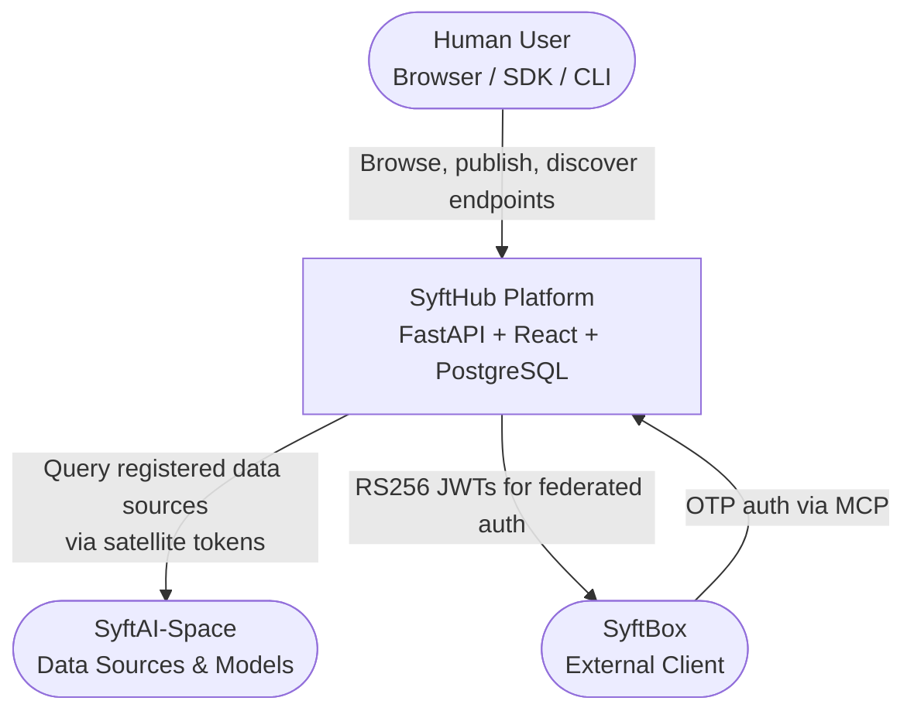
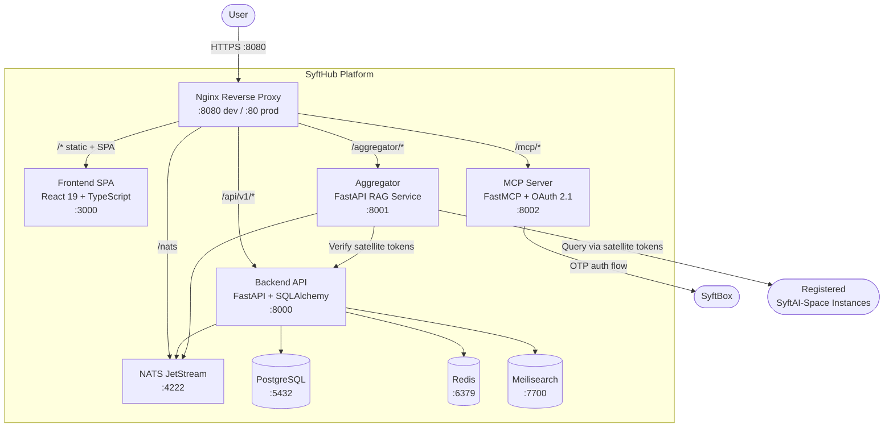
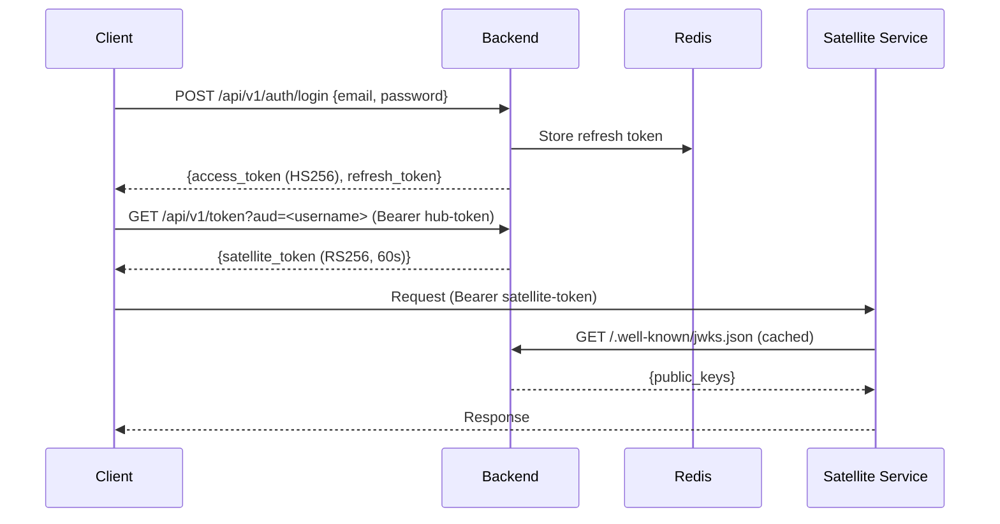
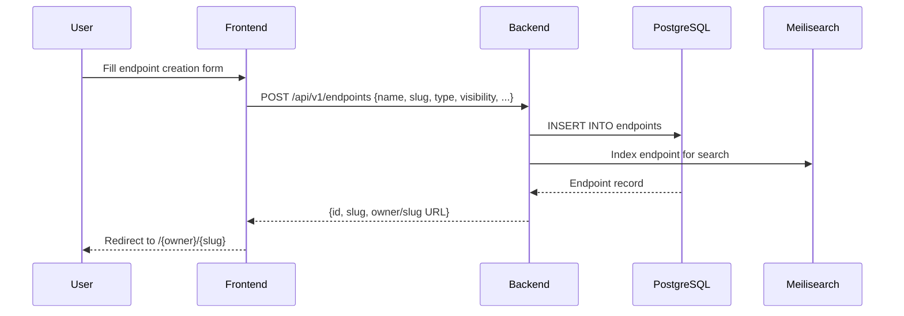
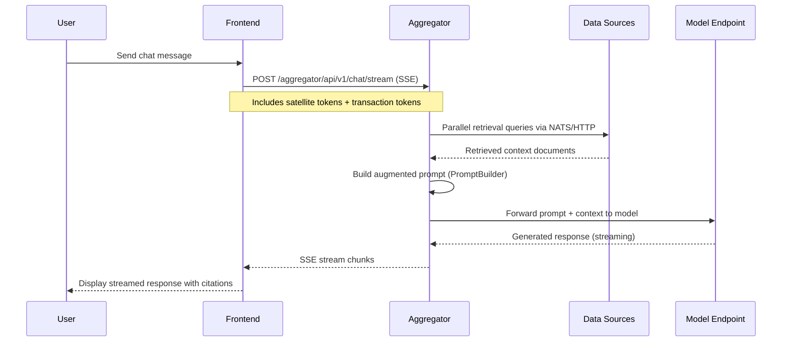
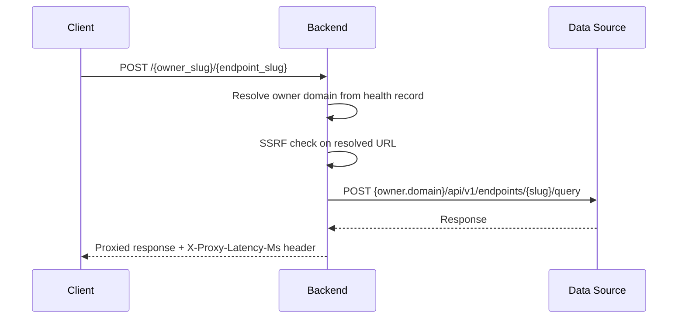

# SyftHub Architecture Overview

> **Audience:** Engineers, architects, new team members
> **Level:** C4 Level 1 (System Context) and Level 2 (Container)
> **Last updated:** 2026-03-27

---

## System Purpose

SyftHub is a **registry and discovery platform for AI/ML endpoints** — "GitHub for AI endpoints." It solves the problem of fragmented, undiscoverable AI/ML services by providing:

- A central registry where teams publish model and data source endpoints
- Discovery and search (full-text via Meilisearch)
- Standardized access through SDKs (Python, TypeScript, Go) and a CLI
- Multi-tenancy and organization-level access control
- A stateless RAG aggregator for chat workflows using registered endpoints
- MCP (Model Context Protocol) integration for connecting AI assistants to registered services
- Federated identity — SyftHub acts as an IdP, issuing RS256 satellite tokens verified locally by external services via JWKS

**Core metaphor:** GitHub for AI endpoints — with `owner/slug` addressing, stars, and visibility controls.

---

## C4 Level 1 — System Context

**External actors:**
- **Human users** interact via the web UI, SDKs, or CLI
- **SyftBox** integrates via the MCP OAuth 2.1 flow
- **SyftAI-Space instances** are external data sources and models that the aggregator queries during RAG workflows

---

## C4 Level 2 — Container Diagram

---

## Services

| Service | Path | Port | Technology | Responsibility |
|---|---|---|---|---|
| **Nginx** | `deploy/nginx/` | 8080 (dev) / 80 (prod) | Nginx | Reverse proxy, TLS termination, routing |
| **Backend** | `components/backend/` | 8000 | Python 3.12 / FastAPI | Auth, endpoint registry, IdP, health monitor, search indexing |
| **Frontend** | `components/frontend/` | 3000 | TypeScript / React 19 / Vite | Web SPA (Tailwind CSS, shadcn/ui) |
| **Aggregator** | `components/aggregator/` | 8001 | Python 3.12 / FastAPI | RAG orchestration, chat streaming via SSE |
| **MCP Server** | `components/mcp/` | 8002 | Python / FastMCP | OAuth 2.1 + Model Context Protocol tools |
| **PostgreSQL** | — | 5432 | PostgreSQL | Primary relational store |
| **Redis** | — | 6379 | Redis | Token blacklist, refresh tokens, peer tokens, session cache |
| **Meilisearch** | — | 7700 | Meilisearch | Endpoint discovery search index |
| **NATS** | `deploy/nats/` | 4222 | NATS JetStream | Pub/sub for tunneled Space communication |

---

## Nginx Routing

| Path Pattern | Target | Description |
|---|---|---|
| `/api/v1/*` | Backend :8000 | REST API |
| `/aggregator/api/v1/*` | Aggregator :8001 | RAG chat endpoints |
| `/mcp/*` | MCP Server :8002 | MCP protocol + OAuth |
| `/.well-known/jwks.json` | Backend :8000 | Public JWKS for satellite token verification |
| `/nats` | NATS :4222 | NATS WebSocket |
| `/docs` | Backend :8000 | Swagger UI (dev only) |
| `/*` | Frontend :3000 | SPA catch-all |

---

## Token Architecture

SyftHub uses a multi-token system for different trust boundaries:

| Token | Algorithm | Lifetime | Issued By | Purpose |
|---|---|---|---|---|
| Hub Access Token | HS256 | 30 min | Backend | Authenticate with `/api/v1/*` |
| Hub Refresh Token | Opaque (Redis) | 7 days | Backend | Renew expired access tokens |
| Satellite Token | RS256 | 60 s | Backend IdP | Authenticate with external SyftAI-Space services |
| Guest Token | RS256 | 60 s | Backend | Unauthenticated access to policy-free endpoints |
| PAT | Opaque (SHA-256 hash stored) | Configurable | Backend | Long-lived programmatic access (`syft_pat_` prefix) |
| Peer Token | Opaque (Redis) | 120 s | Backend | NATS pub/sub tunnel auth |
| MCP Token | RS256 | 3600 s | MCP Server | MCP client-to-server auth (kid: `mcp-key-1`) |

**Key insight:** SyftHub acts as an Identity Provider. Satellite services verify RS256 tokens locally via JWKS (`/.well-known/jwks.json`) — no round-trip to the hub on every request.

---

## Key Data Flows

### 1. Authentication — Login to Satellite Token

### 2. Endpoint Publishing

### 3. RAG Chat (Streaming)

### 4. Endpoint Proxy Invocation

---

## Database Schema (Key Tables)

| Table | Key Fields | Description |
|---|---|---|
| `users` | id (UUID), email, username, password_hash, encryption_public_key, heartbeat_expires_at | User accounts |
| `endpoints` | id, user_id, organization_id, name, slug, type, visibility, connect (JSON), policies (JSON), stars_count, health_status, health_checked_at | Registered endpoints |
| `endpoint_stars` | id, user_id, endpoint_id | Star associations (denormalized with endpoints.stars_count) |
| `organizations` | id, name, slug, owner_id, heartbeat_expires_at | Team groupings |
| `organization_members` | org_id, user_id, role | Org membership with roles |
| `api_tokens` | id, user_id, name, token_hash, scopes | Personal access tokens |
| `user_aggregators` | id, user_id, config (JSON) | Per-user aggregator configurations |

---

## Technology Stack

| Layer | Technology |
|---|---|
| **Backend** | Python 3.12, FastAPI, SQLAlchemy, Pydantic, Alembic, Argon2 |
| **Frontend** | React 19, TypeScript, Vite, Tailwind CSS, shadcn/ui, React Query, Zustand |
| **Aggregator** | Python 3.12, FastAPI, ONNX Runtime (reranking), httpx |
| **MCP Server** | Python, FastMCP |
| **Database** | PostgreSQL (primary), Redis (cache/sessions), Meilisearch (search) |
| **Messaging** | NATS JetStream |
| **Package Management** | uv (Python), npm (TypeScript/frontend), Go modules (Go SDK/CLI) |
| **Testing** | pytest (backend), Playwright (frontend E2E), vitest |
| **CI/CD** | GitHub Actions |
| **Deployment** | Docker Compose, GHCR (container registry), Nginx |

---

## Environment Variables

| Variable | Required | Default | Component | Description |
|---|---|---|---|---|
| `DOMAIN` | Yes | — | All | Public domain name |
| `DATABASE_URL` | Yes | — | Backend | PostgreSQL connection string |
| `REDIS_URL` | Yes | — | Backend | Redis connection string |
| `JWT_SECRET` | Yes | — | Backend | Hub token signing key (HS256) |
| `JWT_PRIVATE_KEY` | Yes | — | Backend | Satellite token signing key (RSA private) |
| `JWT_PUBLIC_KEY` | Yes | — | Backend | Satellite token verification key (RSA public) |
| `NATS_URL` | Yes | — | Backend, Aggregator | NATS server connection |
| `MEILI_URL` | Yes | — | Backend | Meilisearch URL |
| `MEILI_KEY` | Yes | — | Backend | Meilisearch API key |
| `VITE_API_BASE_URL` | Yes | — | Frontend | API base URL (build-time) |
| `AUTO_GENERATE_RSA_KEYS` | No | `true` | Backend | Auto-generate RSA keys in dev |
| `ACCESS_TOKEN_EXPIRE_MINUTES` | No | `30` | Backend | Hub access token lifetime |
| `REFRESH_TOKEN_EXPIRE_DAYS` | No | `7` | Backend | Refresh token lifetime |
| `CORS_ORIGINS` | No | `*` | Backend | Allowed CORS origins |
| `ALLOWED_AUDIENCES` | No | `syftai-space` | Backend | Comma-separated satellite audiences |

Full list with defaults: `.env.example` in project root.

---

## Related Documentation

- [Component Architecture: Backend](components/backend.md)
- [Component Architecture: Frontend](components/frontend.md)
- [Component Architecture: Aggregator](components/aggregator.md)
- [Component Architecture: MCP Server](components/mcp.md)
- [API Reference: Backend](../api/backend.md)
- [API Reference: Aggregator](../api/aggregator.md)
- [API Reference: MCP](../api/mcp.md)
- [Authentication Explained](../explanation/authentication.md)
- [Glossary](../glossary.md)
