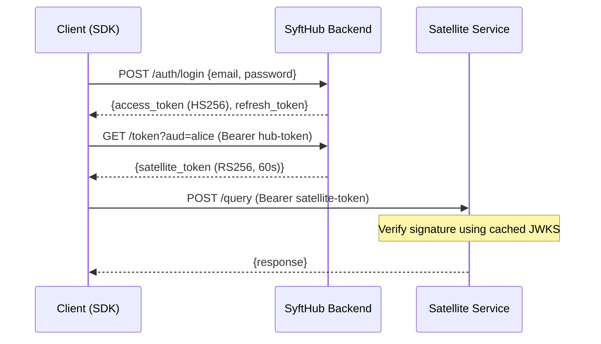

# Authentication — Understanding SyftHub's Token Architecture

> **Audience:** Backend developers, integration engineers, SDK maintainers
> **Prerequisites:** Basic JWT knowledge, familiarity with RS256 vs HS256

---

## Overview

SyftHub uses a **dual-token architecture** to solve a fundamental distributed auth problem: how do you let satellite services (SyftAI-Space instances, the aggregator) verify user identity without making them call the hub on every request?

The answer is two distinct token types serving two trust boundaries:
- **Hub tokens** (HS256) authenticate requests to the SyftHub backend
- **Satellite tokens** (RS256) authenticate requests to external satellite services

This separation means satellite services never need to share a secret with the hub, and the hub is never a bottleneck for satellite auth.

---

## How It Works

### Hub Authentication (HS256)

When a user logs in, the backend issues two hub tokens:

1. **Access token** — HS256 JWT, 30 min lifetime, signed with `JWT_SECRET`
2. **Refresh token** — opaque token stored in Redis, 7 day lifetime

The access token authenticates all requests to `/api/v1/*`. When it expires, the client exchanges the refresh token for a new access token without re-entering credentials.

On logout, both tokens are blacklisted in Redis to prevent reuse.

### Satellite Authentication (RS256 / IdP)

SyftHub acts as an **Identity Provider (IdP)**. When a client needs to talk to an external service:

1. Client requests `GET /api/v1/token?aud=<target_username>` with their hub token
2. Backend issues an RS256-signed satellite token (60 s lifetime)
3. Client sends the satellite token to the target service
4. Target service fetches the hub's JWKS (`GET /.well-known/jwks.json`), caches it, and verifies the token signature locally

### Additional Token Types

| Token | Use Case |
|---|---|
| **Guest Token** | RS256, 60 s — unauthenticated access to policy-free public endpoints |
| **PAT (Personal Access Token)** | Long-lived, prefix `syft_pat_` — programmatic API access without login flow |
| **Peer Token** | Opaque, Redis-stored, 120 s — NATS pub/sub tunnel authentication |
| **MCP Token** | RS256, 3600 s, kid `mcp-key-1` — MCP server client authentication |

---

## Design Decisions

### Why two token algorithms?

Hub tokens use **HS256** (symmetric) because only the backend needs to create and verify them — a single shared secret is sufficient and faster.

Satellite tokens use **RS256** (asymmetric) because external services need to verify them without knowing the signing secret. The backend signs with its private key; anyone can verify with the public key from JWKS.

### Why 60-second satellite tokens?

Short lifetimes limit the blast radius of a leaked satellite token. Since obtaining a fresh one is a single API call, the UX cost is negligible. The SDKs handle this transparently.

### Why dynamic audience validation?

The `aud` claim in satellite tokens must match an active username in the database — not a static allowlist. This means any user who registers becomes a valid audience for satellite tokens, enabling the peer-to-peer model where any SyftAI-Space instance can receive authenticated requests.

---

## Key Concepts

| Concept | Definition |
|---|---|
| **JWKS** | JSON Web Key Set at `/.well-known/jwks.json` — the public keys satellite services use to verify tokens locally |
| **Audience** | The `aud` claim in a satellite token — identifies which service the token is intended for |
| **Token blacklist** | Redis set of revoked token JTIs — checked on every hub token validation |
| **Argon2** | Password hashing algorithm used for user credentials (not bcrypt) |

---

## Common Misconceptions

1. **"Satellite tokens are just regular JWTs with a different expiry."**
   No — they use a completely different algorithm (RS256 vs HS256) and trust model. Hub tokens require shared-secret verification; satellite tokens use public-key verification.

2. **"The hub verifies satellite tokens for the satellite service."**
   The hub *can* verify via `POST /verify`, but the designed flow is JWKS-based local verification. The verify endpoint exists as a fallback, not the primary mechanism.

3. **"INTERNAL visibility means only org members can see it."**
   No — `INTERNAL` means *any authenticated user* can see and invoke the endpoint. This is a known overshare risk. Use `PRIVATE` for org-restricted access.

---

## Related

- [PKI Workflow](pki-workflow.md) — deeper dive into key management and the IdP flow
- [API Reference: Auth endpoints](../api/backend.md#auth-auth) — request/response details
- [API Reference: IdP endpoints](../api/backend.md#identity-provider-token-well-known) — satellite token issuance
- [Glossary](../glossary.md) — token type definitions
