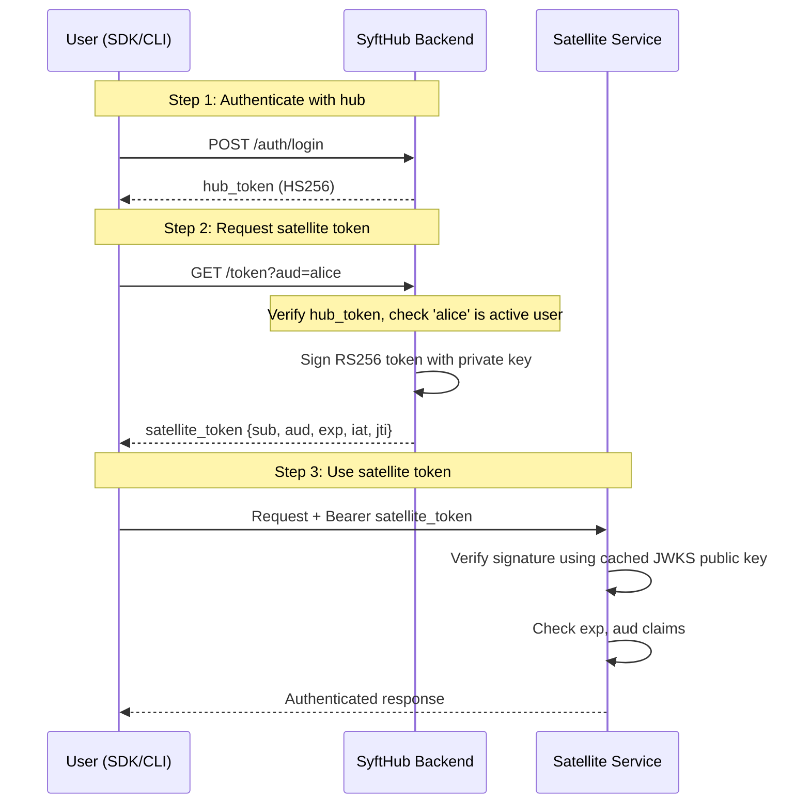
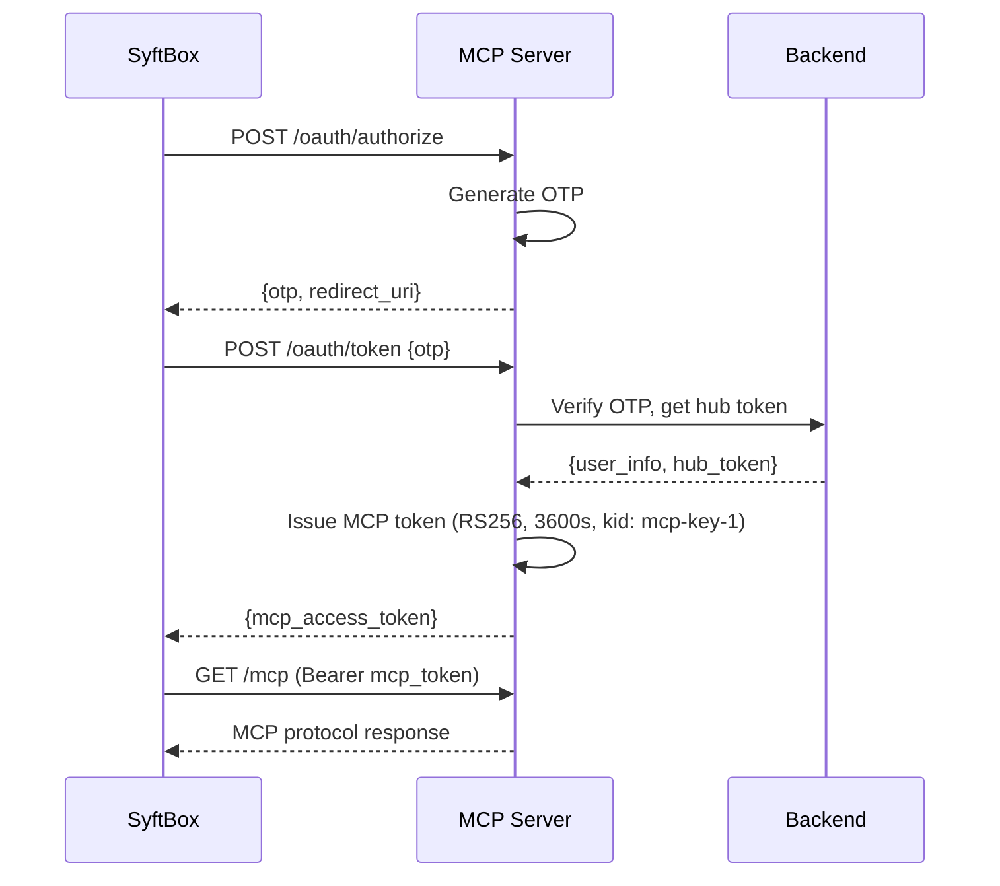

# PKI Workflow — Understanding SyftHub's Identity Provider

> **Audience:** Backend developers, security engineers, satellite service operators
> **Prerequisites:** [Authentication overview](authentication.md), basic RSA/PKI knowledge

---

## Overview

SyftHub functions as a **Public Key Infrastructure (PKI) identity provider** for a federated ecosystem. Instead of requiring every satellite service to call back to the hub on each request, SyftHub publishes its public keys via JWKS and issues short-lived RS256 tokens. Any service can verify user identity with zero network calls to the hub.

This is the same pattern used by major identity providers (Auth0, Okta, Google) — SyftHub brings it to the AI endpoint ecosystem.

---

## How It Works

### Key Management

SyftHub manages an RSA key pair:
- **Private key** (`JWT_PRIVATE_KEY`) — stored securely on the backend, used to sign satellite tokens
- **Public key** (`JWT_PUBLIC_KEY`) — exposed via JWKS endpoint, used by satellite services to verify tokens

In development, keys are auto-generated on startup when `AUTO_GENERATE_RSA_KEYS=true`.

### JWKS Endpoint

The public key is served at:
```
GET /.well-known/jwks.json
```

Response:
```json
{
  "keys": [
    {
      "kty": "RSA",
      "use": "sig",
      "kid": "key-id",
      "n": "<modulus>",
      "e": "AQAB"
    }
  ]
}
```

Satellite services fetch this once, cache it, and only refresh when verification fails (indicating key rotation).

### Token Issuance Flow



### Satellite Token Claims

| Claim | Value | Purpose |
|---|---|---|
| `sub` | User ID (UUID) | Identifies the authenticated user |
| `aud` | Target username | Scopes token to a specific service |
| `exp` | Issue time + 60 s | Short lifetime limits exposure |
| `iat` | Current timestamp | When the token was issued |
| `jti` | Unique ID | For token revocation tracking |

### User Encryption Keys

Users can register an X25519 public key (base64url-encoded) via `PUT /api/v1/nats/encryption-key`. This key, stored in the `encryption_public_key` column, is used for end-to-end encryption in NATS-tunneled communications. This is separate from the hub's RSA signing keys.

---

## Design Decisions

### Why RS256 over HS256 for satellite tokens?

HS256 requires both parties to share the same secret. In a federated system with many satellite services, sharing the hub's signing secret with each service creates an unacceptable security surface. RS256 (asymmetric) means only the hub holds the private key — satellites verify with the public key, which can be published openly.

### Why 60-second expiry?

A 60-second window is long enough for a single API call (or short streaming session) but short enough that a leaked token has minimal utility. The SDKs transparently request fresh tokens as needed.

### Why dynamic audience validation?

The satellite token audience (`aud`) is validated against active usernames in the database — not a static list. This enables the peer-to-peer model: any registered user running a SyftAI-Space instance is automatically a valid audience. New users don't require hub configuration changes.

---

## MCP OAuth Flow (OTP-Based)

The MCP server uses a separate OAuth 2.1 flow with OTP for SyftBox integration:



MCP tokens are distinct from satellite tokens — they use kid `mcp-key-1`, have a 1-hour lifetime, and are issued by the MCP server (not the backend).

---

## Key Concepts

| Concept | Definition |
|---|---|
| **JWKS rotation** | When keys change, satellites detect verification failure and re-fetch JWKS |
| **Audience scoping** | Each satellite token targets a specific service (user), preventing token reuse across services |
| **Token introspection** | `POST /verify` provides server-side verification as a fallback to local JWKS verification |

---

## Related

- [Authentication overview](authentication.md) — the full token architecture
- [Architecture overview](../architecture/overview.md) — where the IdP fits in the system
- [Glossary](../glossary.md) — JWKS, satellite token, IdP definitions
