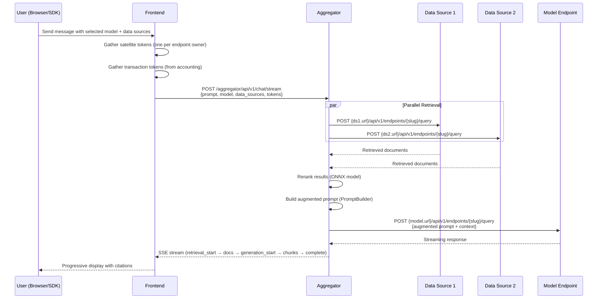

# RAG Architecture — Understanding SyftHub's Retrieval-Augmented Generation Pipeline

> **Audience:** Engineers working on the aggregator, SDK developers, ML engineers
> **Prerequisites:** Basic RAG concepts, [Authentication overview](authentication.md)

---

## Overview

SyftHub's aggregator implements a **stateless Retrieval-Augmented Generation (RAG)** pipeline. When a user sends a chat message, the aggregator queries registered data sources for relevant context, constructs an augmented prompt, and streams the model's response back.

The key design principle is **statelessness** — the aggregator holds no persistent state. All context (user identity, endpoint tokens, history) comes from the request. This makes it horizontally scalable and simple to reason about.

---

## How It Works

### End-to-End Flow

### Pipeline Stages

1. **Request validation** — verify satellite tokens, extract tenant context
2. **Parallel retrieval** — query all selected data sources simultaneously
3. **Reranking** — score retrieved documents for relevance using an ONNX model (~570 MB)
4. **Prompt construction** — PromptBuilder injects retrieved context into the prompt template
5. **Generation** — forward augmented prompt to the selected model endpoint
6. **Streaming response** — SSE events with retrieval info, response chunks, and citation metadata

### Transport: NATS vs HTTP

Data sources can be reached via two transport mechanisms:

- **HTTP direct** — aggregator calls the data source URL directly using satellite tokens
- **NATS tunneled** — for data sources behind NAT/firewalls, the aggregator publishes to a NATS subject and waits for the response via a correlation-ID pattern on the shared `peer_channel` subject

The transport is selected based on the endpoint's connection configuration.

---

## Design Decisions

### Why stateless?

The aggregator holds no conversation state, embeddings, or cached retrieval results. Every request re-queries fresh data. This means:
- **Horizontal scaling** — any aggregator instance can serve any request
- **Consistency** — data sources always return their latest data
- **Simplicity** — no session management, no state sync between instances

The trade-off is latency: repeated queries to the same data sources. This is acceptable because RAG queries are typically fast and data freshness is prioritized over speed.

### Why parallel retrieval?

Data sources are independent — querying them in parallel minimizes latency. The aggregator fires all retrieval requests concurrently and waits for all to complete before proceeding to prompt construction.

### Citation path vs XML path

The PromptBuilder has two modes for injecting context:
- **Citation path** — structured citation metadata for frontends that render source links
- **XML path** — raw XML-tagged context when `context_dict` is set by the orchestrator

The selection is implicit based on whether `context_dict` is populated, which depends on the orchestrator's configuration.

### Asymmetric error handling

Data source clients never raise on failure — they return an error status object. Model clients raise `NATSTransportError` on failure. This asymmetry exists because missing data sources degrade gracefully (fewer results), but a missing model is a hard failure (no response possible).

---

## SSE Event Types

The streaming endpoint (`POST /chat/stream`) emits Server-Sent Events in this sequence:

| Event | Payload | Meaning |
|---|---|---|
| `retrieval_start` | `{}` | Retrieval phase begins |
| `retrieval_result` | `{source, content, score}` | Individual retrieved document |
| `retrieval_complete` | `{count, sources}` | All retrieval finished |
| `reranking_start` | `{}` | Reranking phase begins |
| `reranking_complete` | `{count}` | Reranking finished |
| `generation_start` | `{}` | Model generation begins |
| `generation_heartbeat` | `{}` | Keep-alive during long generation |
| `content` | `{text}` | Streamed response chunk |
| `complete` | `{usage, metadata}` | Generation finished |
| `error` | `{message}` | Error occurred |

---

## Key Concepts

| Concept | Definition |
|---|---|
| **Orchestrator** | The central module (`orchestrator.py`) that coordinates the retrieval → rerank → prompt → generate pipeline |
| **PromptBuilder** | Constructs the final prompt by injecting retrieved context into a template |
| **Reranking** | An ONNX model (~570 MB) that re-scores retrieved documents for relevance before prompt construction |
| **Correlation ID** | A unique ID used in NATS transport to match requests to responses on the shared peer channel |
| **Transaction token** | An accounting service token included in requests for metered endpoint usage |

---

## Common Misconceptions

1. **"The aggregator stores conversation history."**
   No — history is passed in the request body and only sent to the LLM for context. The aggregator itself is stateless.

2. **"Meilisearch powers the RAG retrieval."**
   No — Meilisearch is used for *endpoint discovery* (searching endpoint metadata). RAG document retrieval happens at the SyftAI-Space data source instances.

3. **"The aggregator manages the ONNX model lifecycle."**
   The ONNX reranking model should be a singleton loaded at startup, but the current implementation may re-load per request (known P1 issue).

---

## Related

- [Component Architecture: Aggregator](../architecture/components/aggregator.md) — internal structure and modules
- [API Reference: Aggregator](../api/aggregator.md) — endpoint details
- [Authentication](authentication.md) — how satellite tokens work for data source access
- [Glossary](../glossary.md) — aggregator, endpoint, tenant definitions
