# SyftHub LLM Chat Workflow — Complete Architecture

> End-to-end trace of a chat request from the React frontend through the backend, aggregator, NATS tunnel, desktop/CLI node, and Go SDK endpoint handler.

---

## Table of Contents

1. [System Overview](#1-system-overview)
2. [Component Relationship Map](#2-component-relationship-map)
3. [Complete Chat Sequence (High Level)](#3-complete-chat-sequence-high-level)
4. [Phase 1: Frontend — User Input to API Call](#4-phase-1-frontend--user-input-to-api-call)
5. [Phase 2: Token Acquisition](#5-phase-2-token-acquisition)
6. [Phase 3: Aggregator — RAG Orchestration](#6-phase-3-aggregator--rag-orchestration)
7. [Phase 4: Transport Decision — HTTP vs NATS](#7-phase-4-transport-decision--http-vs-nats)
8. [Phase 5: NATS Tunnel Protocol](#8-phase-5-nats-tunnel-protocol)
9. [Phase 6: Desktop/CLI — Endpoint Execution](#9-phase-6-desktopcli--endpoint-execution)
10. [Phase 7: Response Assembly & Streaming](#10-phase-7-response-assembly--streaming)
11. [SSE Event Lifecycle](#11-sse-event-lifecycle)
12. [Authentication & Token Architecture](#12-authentication--token-architecture)
13. [NATS Encryption Protocol](#13-nats-encryption-protocol)
14. [Branch Logic: Streaming vs Non-Streaming](#14-branch-logic-streaming-vs-non-streaming)
15. [Branch Logic: Authenticated vs Guest](#15-branch-logic-authenticated-vs-guest)
16. [Citation & Attribution Pipeline](#16-citation--attribution-pipeline)
17. [Error Handling Across Layers](#17-error-handling-across-layers)
18. [Data Models Reference](#18-data-models-reference)

---

## 1. System Overview

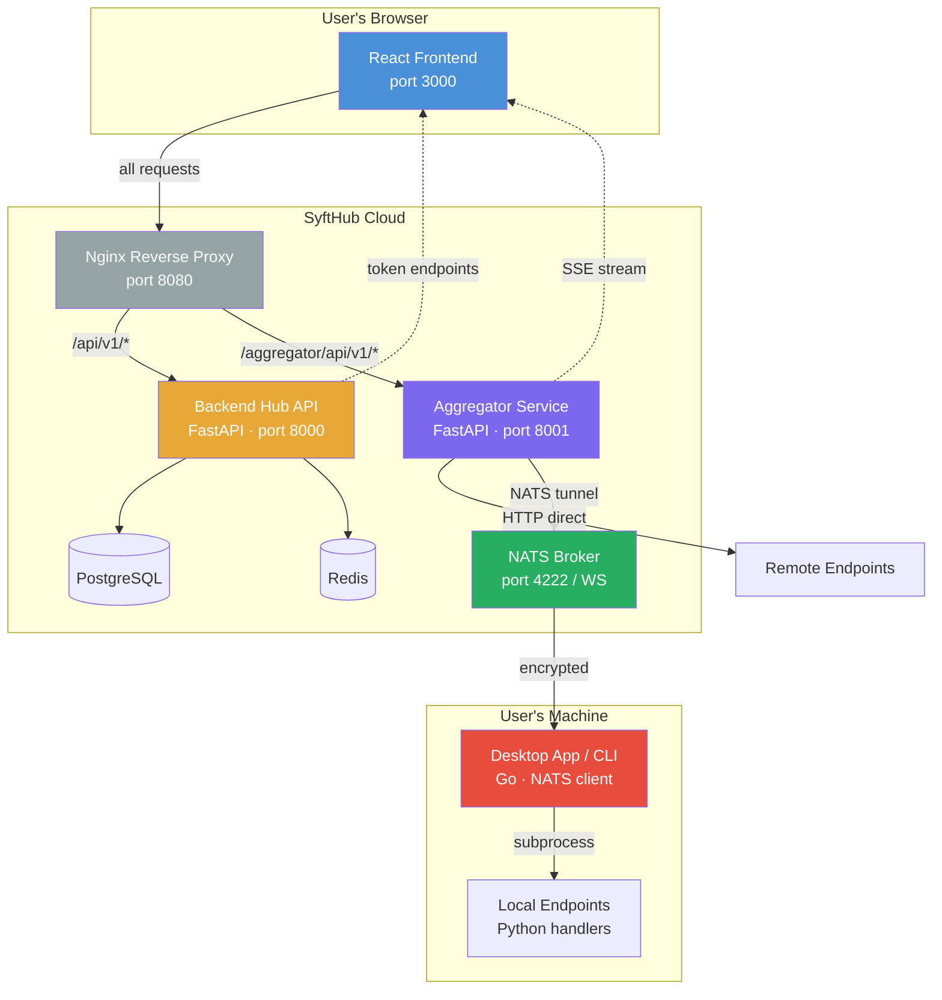

**Key insight**: The backend is NOT in the chat request path. Chat requests flow directly from frontend → aggregator. The backend only provides authentication tokens.

---

## 2. Component Relationship Map

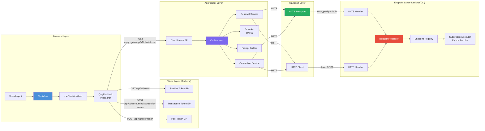

---

## 3. Complete Chat Sequence (High Level)

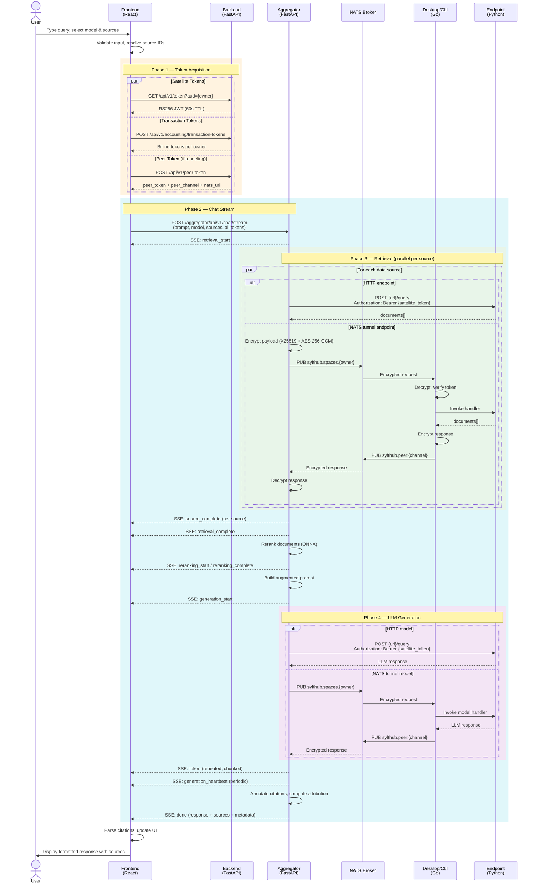

---

## 4. Phase 1: Frontend — User Input to API Call

### Component Hierarchy

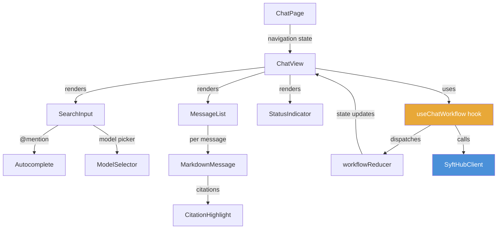

### useChatWorkflow State Machine

```mermaid
statediagram-v2
    [*] --> idle
    idle --> preparing: submitQuery()
    preparing --> streaming: executeWithSources()
    streaming --> streaming: SSE events
    streaming --> complete: done event
    streaming --> error: error event / abort
    preparing --> error: validation failure
    complete --> idle: new query
    error --> idle: new query
```

### Frontend Request Flow

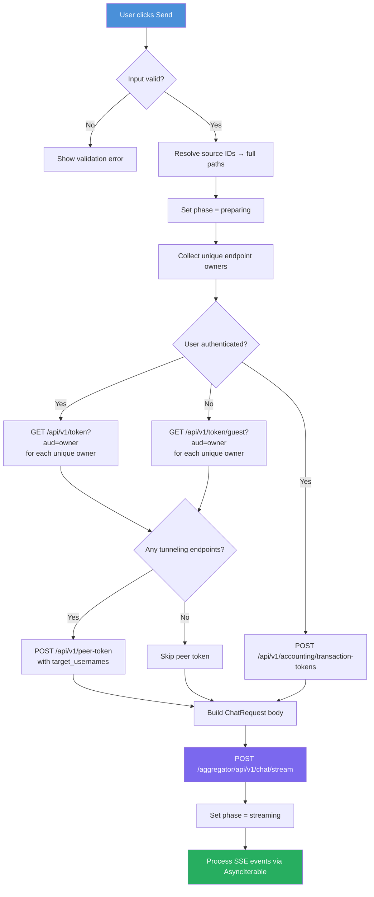

### ChatRequest Body (sent to aggregator)

```json
{
  "prompt": "What are the key features?",
  "model": {
    "url": "https://space.example.com",
    "slug": "gpt-model",
    "name": "GPT Model",
    "owner_username": "alice"
  },
  "data_sources": [
    {
      "url": "tunneling:bob",
      "slug": "docs-dataset",
      "name": "Docs",
      "owner_username": "bob"
    }
  ],
  "endpoint_tokens": {
    "alice": "eyJ...(satellite JWT)...",
    "bob": "eyJ...(satellite JWT)..."
  },
  "transaction_tokens": {
    "alice": "tx_token_alice",
    "bob": "tx_token_bob"
  },
  "peer_token": "peer_jwt_for_nats",
  "peer_channel": "a1b2c3d4-uuid",
  "top_k": 5,
  "max_tokens": 1024,
  "temperature": 0.7,
  "similarity_threshold": 0.5,
  "stream": true,
  "messages": [
    {"role": "user", "content": "Previous question"},
    {"role": "assistant", "content": "Previous answer"}
  ]
}
```

---

## 5. Phase 2: Token Acquisition

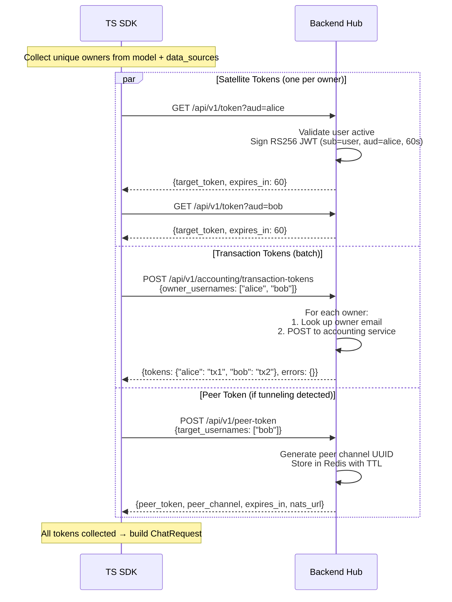

### Token Types Comparison

| Token | Endpoint | Signing | TTL | Purpose | Auth Required |
|-------|----------|---------|-----|---------|---------------|
| **Hub Access** | Login | HS256 | 30min | Authenticate with backend | N/A (login) |
| **Satellite** | `GET /api/v1/token` | RS256 | 60s | Authorize endpoint access | Yes (or guest variant) |
| **Transaction** | `POST /api/v1/accounting/transaction-tokens` | External | Varies | Billing authorization | Yes |
| **Peer** | `POST /api/v1/peer-token` | Internal | Short | NATS P2P communication | Yes (or guest variant) |

---

## 6. Phase 3: Aggregator — RAG Orchestration

### Orchestrator Pipeline

```mermaid
flowchart TD
    REQ[ChatRequest received] --> RESOLVE[Resolve EndpointRefs<br/>→ ResolvedEndpoints]
    RESOLVE --> CHECK_TUNNEL{Any tunneling<br/>endpoints?}

    CHECK_TUNNEL -->|Yes, no peer_token| GEN_PEER[Generate ephemeral<br/>peer_channel UUID]
    CHECK_TUNNEL -->|Yes, has peer_token| RETRIEVE
    CHECK_TUNNEL -->|No tunneling| RETRIEVE
    GEN_PEER --> RETRIEVE

    RETRIEVE[Parallel Retrieval<br/>asyncio.gather per source] --> |SSE: retrieval_start| R_START
    R_START --> R_EACH

    subgraph "Per Data Source (parallel)"
        R_EACH[Query data source] --> R_TYPE{Transport?}
        R_TYPE -->|HTTP| R_HTTP[POST url/query<br/>Bearer satellite_token]
        R_TYPE -->|NATS| R_NATS[Encrypt & publish<br/>to syfthub.spaces.owner]
        R_HTTP --> R_DONE[RetrievalResult]
        R_NATS --> R_DONE
    end

    R_DONE --> |SSE: source_complete| S_COMPLETE
    S_COMPLETE --> ALL_DONE{All sources<br/>complete?}
    ALL_DONE -->|No| R_EACH
    ALL_DONE -->|Yes| |SSE: retrieval_complete| RERANK_CHECK

    RERANK_CHECK{Documents > 0?}
    RERANK_CHECK -->|No| BUILD_PROMPT
    RERANK_CHECK -->|Yes| RERANK

    RERANK[Rerank via ONNX<br/>CENTRAL_REEMBEDDING] --> |SSE: reranking_start/complete| BUILD_PROMPT

    BUILD_PROMPT[PromptBuilder.build<br/>system + context + history + query] --> GEN

    GEN[Generation Service] --> |SSE: generation_start| GEN_TYPE{Transport?}
    GEN_TYPE -->|HTTP| GEN_HTTP[POST model_url/query<br/>Bearer satellite_token]
    GEN_TYPE -->|NATS| GEN_NATS[Encrypt & publish<br/>to syfthub.spaces.owner]

    GEN_HTTP --> STREAM_CHECK{Streaming enabled?}
    GEN_NATS --> STREAM_CHECK

    STREAM_CHECK -->|Yes| TOKENS[Yield token events<br/>SSE: token]
    STREAM_CHECK -->|No| HEARTBEAT[Periodic heartbeat<br/>SSE: generation_heartbeat]

    TOKENS --> ANNOTATE
    HEARTBEAT --> ANNOTATE

    ANNOTATE[Annotate citations<br/>cite:N → cite:N-start:end] --> ATTRIB[Compute profit_share<br/>per source]
    ATTRIB --> |SSE: done| DONE[Final response + metadata]

    style REQ fill:#7B68EE,color:#fff
    style RETRIEVE fill:#27AE60,color:#fff
    style RERANK fill:#E8A838,color:#fff
    style GEN fill:#E74C3C,color:#fff
    style DONE fill:#4A90D9,color:#fff
```

### Retrieval Service Detail

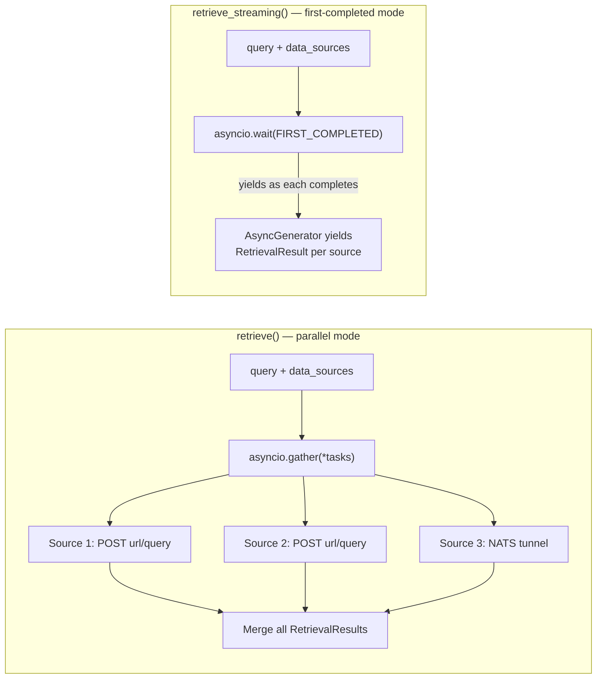

### Prompt Builder — Context Assembly

```mermaid
flowchart TD
    PB[PromptBuilder.build] --> HAS_CTX{Has retrieved<br/>documents?}

    HAS_CTX -->|No| NO_CTX[System prompt:<br/>"You are a helpful assistant"]
    HAS_CTX -->|Yes| HAS_DICT{context_dict<br/>provided?}

    HAS_DICT -->|Yes| CITE_PATH["Citation path:<br/>System prompt includes numbered docs<br/>[1] Title: content...<br/>Instruct model to use [cite:N]"]
    HAS_DICT -->|No| XML_PATH["XML path:<br/>System prompt wraps docs in XML<br/>&lt;context&gt;&lt;document&gt;...&lt;/document&gt;&lt;/context&gt;"]

    NO_CTX --> ADD_HIST
    CITE_PATH --> ADD_HIST
    XML_PATH --> ADD_HIST

    ADD_HIST{Chat history?}
    ADD_HIST -->|Yes| HIST[Prepend history messages<br/>user/assistant alternating]
    ADD_HIST -->|No| FINAL

    HIST --> FINAL[Final messages array:<br/>system + history + user query]
```

---

## 7. Phase 4: Transport Decision — HTTP vs NATS

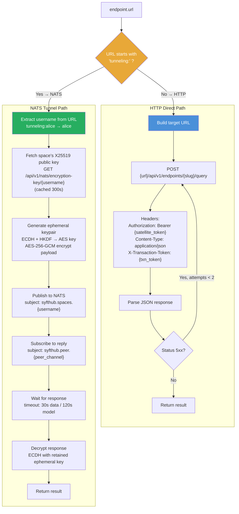

---

## 8. Phase 5: NATS Tunnel Protocol

### Message Flow

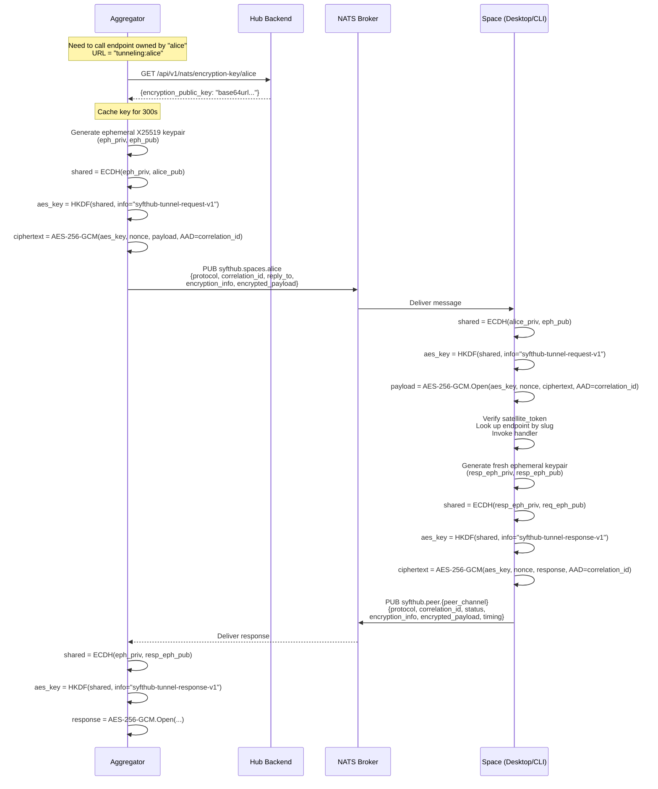

### NATS Subject Naming

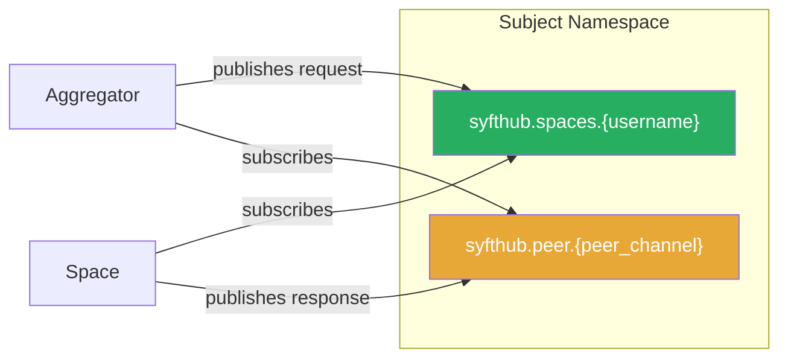

### Wire Message Format

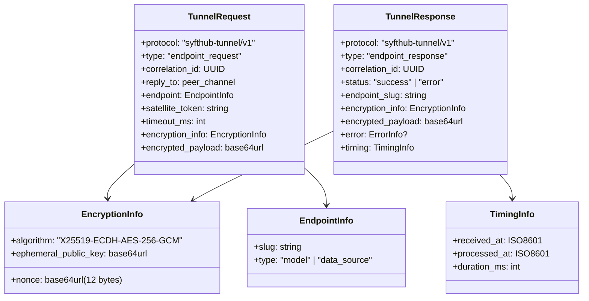

---

## 9. Phase 6: Desktop/CLI — Endpoint Execution

### Space Startup Flow

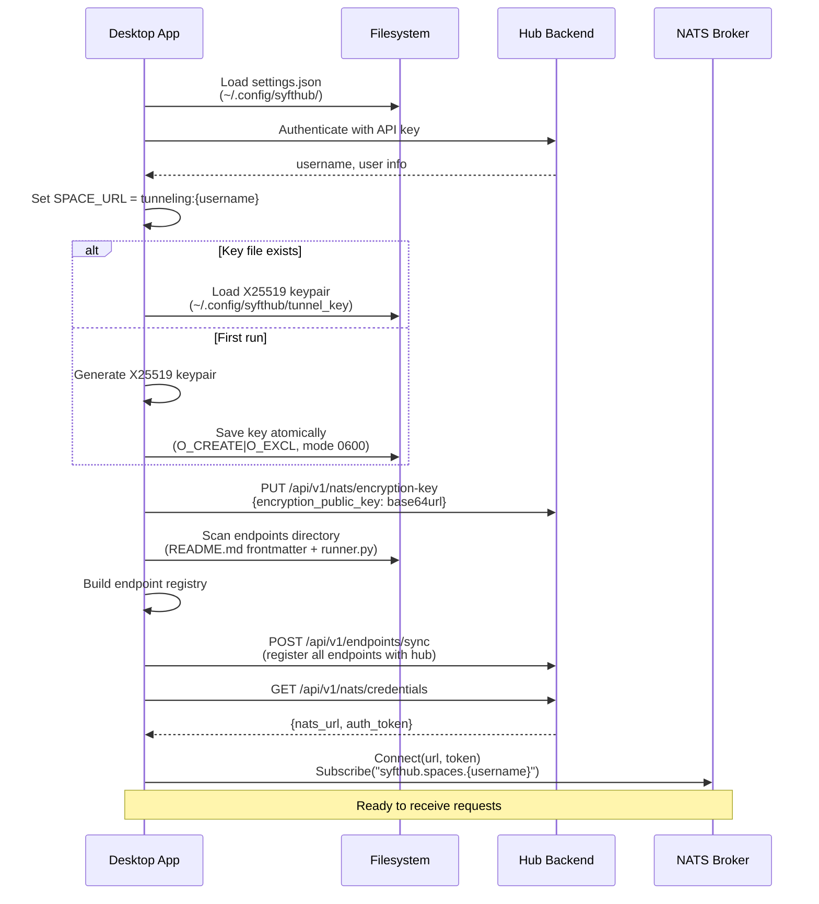

### Request Processing Pipeline

```mermaid
flowchart TD
    MSG[NATS Message Received] --> PARSE[Parse JSON → TunnelRequest]
    PARSE --> ENC_CHECK{encryption_info &<br/>encrypted_payload present?}

    ENC_CHECK -->|No| REJECT[Reject — no plaintext allowed]
    ENC_CHECK -->|Yes| DECRYPT[Decrypt payload<br/>X25519 ECDH + AES-256-GCM]

    DECRYPT --> VERIFY[Verify satellite_token<br/>POST /api/v1/verify]
    VERIFY --> LOOKUP[Registry.Get(slug)]
    LOOKUP --> ENABLED{Endpoint enabled?}

    ENABLED -->|No| ERR_DISABLED[Error: ENDPOINT_DISABLED]
    ENABLED -->|Yes| TYPE_CHECK{Endpoint type?}

    TYPE_CHECK -->|data_source| DS_PARSE[Parse DataSourceQueryRequest<br/>Extract query from messages]
    TYPE_CHECK -->|model| M_PARSE[Parse ModelQueryRequest<br/>Extract messages array]

    DS_PARSE --> INVOKE
    M_PARSE --> INVOKE

    INVOKE{File-based endpoint?}
    INVOKE -->|Yes| SUBPROCESS[SubprocessExecutor.Execute<br/>Python handler via stdin/stdout]
    INVOKE -->|No| IN_MEMORY[Call registered Go handler]

    SUBPROCESS --> RESPONSE[Build TunnelResponse]
    IN_MEMORY --> RESPONSE

    RESPONSE --> ENC_RESP[Encrypt response<br/>Fresh ephemeral keypair]
    ENC_RESP --> PUBLISH["Publish to NATS<br/>syfthub.peer.{peer_channel}"]

    style MSG fill:#27AE60,color:#fff
    style DECRYPT fill:#E8A838,color:#fff
    style VERIFY fill:#E74C3C,color:#fff
    style PUBLISH fill:#4A90D9,color:#fff
```

---

## 10. Phase 7: Response Assembly & Streaming

```mermaid
flowchart TD
    subgraph "Aggregator Response Assembly"
        GEN_RESULT[Generation result<br/>(raw text with cite:N tags)] --> ANNOTATE["Annotate citations<br/>[cite:N] → [cite:N-start:end]"]
        ANNOTATE --> ATTRIB[Compute profit_share<br/>per source using attribution lib]
        ATTRIB --> BUILD_RESP[Build final response<br/>+ sources + metadata + usage]
        BUILD_RESP --> SSE_DONE["Emit SSE: done"]
    end

    subgraph "Frontend Response Processing"
        SSE_DONE --> PARSE_EVT[Parse done event]
        PARSE_EVT --> UPDATE_STATE[Dispatch SET_COMPLETE<br/>phase = complete]
        UPDATE_STATE --> ON_COMPLETE[onComplete callback]
        ON_COMPLETE --> ADD_MSG[Add assistant message<br/>to message history]
        ADD_MSG --> PARSE_CIT[parseCitations<br/>extract cite:N-start:end markers]
        PARSE_CIT --> BUILD_MD[buildCitedMarkdown<br/>inject HTML mark + sup badges]
        BUILD_MD --> RENDER[Render MarkdownMessage<br/>with highlighted citations]
    end

    style GEN_RESULT fill:#7B68EE,color:#fff
    style RENDER fill:#4A90D9,color:#fff
```

---

## 11. SSE Event Lifecycle

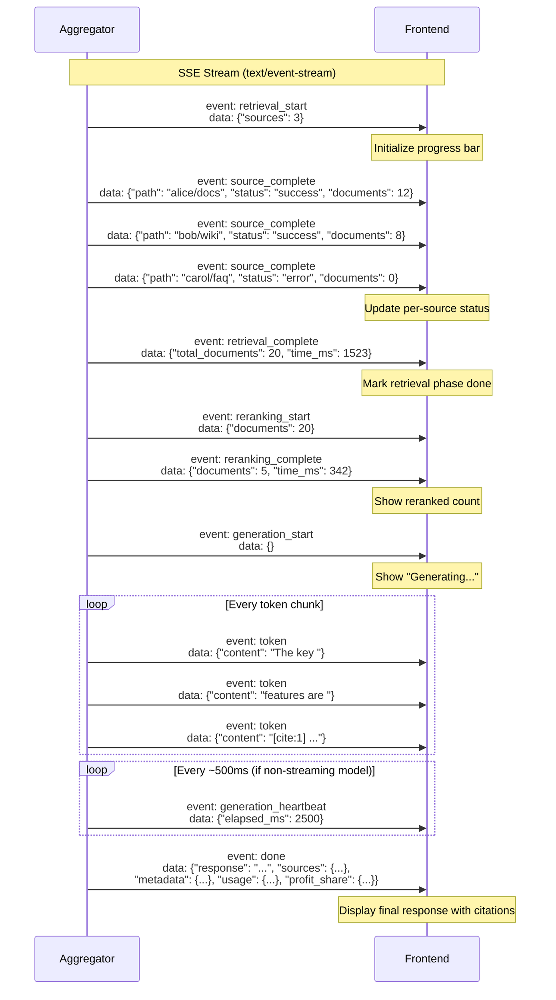

### SSE Event Types Reference

| Event | Payload | Phase | Purpose |
|-------|---------|-------|---------|
| `retrieval_start` | `{sources: N}` | Retrieval | N data sources will be queried |
| `source_complete` | `{path, status, documents}` | Retrieval | One source finished |
| `retrieval_complete` | `{total_documents, time_ms}` | Retrieval | All sources done |
| `reranking_start` | `{documents: N}` | Reranking | Starting to rerank N docs |
| `reranking_complete` | `{documents: N, time_ms}` | Reranking | Top N selected after rerank |
| `generation_start` | `{}` | Generation | LLM generation beginning |
| `generation_heartbeat` | `{elapsed_ms}` | Generation | Periodic liveness signal |
| `token` | `{content: "..."}` | Generation | Streamed response chunk |
| `done` | `{response, sources, metadata, usage, profit_share}` | Complete | Final result |
| `error` | `{message: "..."}` | Error | Pipeline failure |

---

## 12. Authentication & Token Architecture

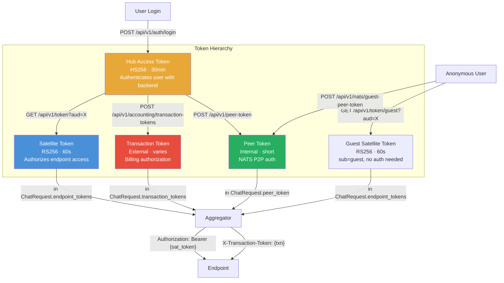

### Satellite Token Claims

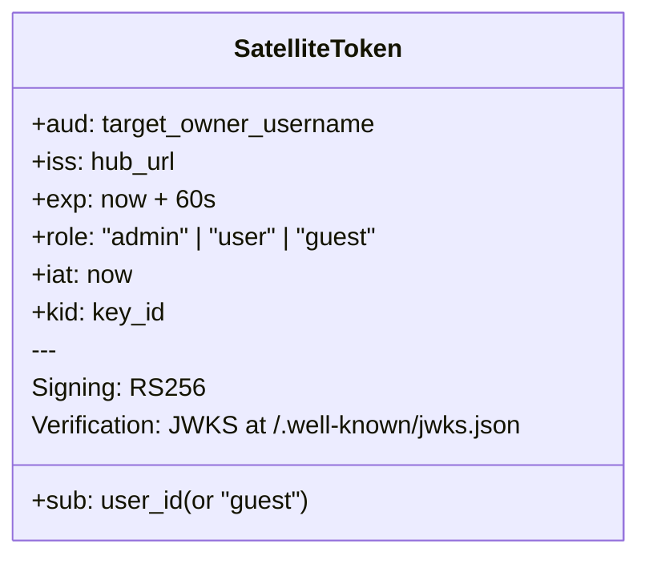

---

## 13. NATS Encryption Protocol

```mermaid
graph TB
    subgraph "Request Encryption (Aggregator → Space)"
        A1[Generate ephemeral keypair<br/>eph_priv, eph_pub] --> A2["ECDH(eph_priv, space_longterm_pub)<br/>→ shared_secret"]
        A2 --> A3["HKDF-SHA256(shared_secret)<br/>info='syfthub-tunnel-request-v1'<br/>→ 32-byte AES key"]
        A3 --> A4["AES-256-GCM.Seal(key, nonce, payload)<br/>AAD = correlation_id"]
        A4 --> A5["Send: eph_pub + nonce + ciphertext"]
    end

    subgraph "Request Decryption (Space)"
        B1["Receive: eph_pub + nonce + ciphertext"] --> B2["ECDH(space_longterm_priv, eph_pub)<br/>→ same shared_secret"]
        B2 --> B3["HKDF-SHA256(shared_secret)<br/>info='syfthub-tunnel-request-v1'<br/>→ same AES key"]
        B3 --> B4["AES-256-GCM.Open(key, nonce, ciphertext)<br/>AAD = correlation_id"]
    end

    subgraph "Response Encryption (Space → Aggregator)"
        C1["Generate fresh ephemeral keypair<br/>resp_eph_priv, resp_eph_pub"] --> C2["ECDH(resp_eph_priv, request_eph_pub)<br/>→ response_shared_secret"]
        C2 --> C3["HKDF-SHA256(response_shared_secret)<br/>info='syfthub-tunnel-response-v1'<br/>← different info!"]
        C3 --> C4["AES-256-GCM.Seal(key, nonce, response)<br/>AAD = correlation_id"]
        C4 --> C5["Send: resp_eph_pub + nonce + ciphertext"]
    end

    subgraph "Response Decryption (Aggregator)"
        D1["Receive: resp_eph_pub + nonce + ciphertext"] --> D2["ECDH(request_eph_priv, resp_eph_pub)<br/>→ same response_shared_secret"]
        D2 --> D3["HKDF-SHA256(response_shared_secret)<br/>info='syfthub-tunnel-response-v1'<br/>→ same AES key"]
        D3 --> D4["AES-256-GCM.Open(key, nonce, ciphertext)<br/>AAD = correlation_id"]
    end

    A5 -.->|"NATS"| B1
    C5 -.->|"NATS"| D1

    style A4 fill:#E74C3C,color:#fff
    style B4 fill:#27AE60,color:#fff
    style C4 fill:#E74C3C,color:#fff
    style D4 fill:#27AE60,color:#fff
```

### Key Properties

| Property | Value |
|----------|-------|
| **Key Agreement** | X25519 ECDH |
| **KDF** | HKDF-SHA256, no salt |
| **Symmetric Cipher** | AES-256-GCM (12-byte nonce) |
| **AAD** | correlation_id (UUID) |
| **Domain Separation** | Request: `syfthub-tunnel-request-v1`, Response: `syfthub-tunnel-response-v1` |
| **Forward Secrecy** | Yes — ephemeral keys per request and per response |
| **Key Persistence** | Space long-term key on disk (mode 0600), aggregator ephemeral per-request |

---

## 14. Branch Logic: Streaming vs Non-Streaming

```mermaid
flowchart TD
    REQ[Chat Request] --> STREAM{request.stream?}

    STREAM -->|true| STREAM_PATH
    STREAM -->|false| SYNC_PATH

    subgraph "Streaming Path (POST /chat/stream)"
        STREAM_PATH[StreamingResponse<br/>media_type=text/event-stream] --> S_RET[retrieve_streaming<br/>asyncio.wait FIRST_COMPLETED]
        S_RET --> S_YIELD[Yield source_complete<br/>as each source finishes]
        S_YIELD --> S_RERANK[Rerank if documents > 0]
        S_RERANK --> S_GEN_CHECK{model_streaming_enabled?}

        S_GEN_CHECK -->|true| S_GEN_STREAM["generate_stream()<br/>yield token events"]
        S_GEN_CHECK -->|false| S_GEN_SYNC["generate() as asyncio.Task<br/>yield heartbeat every 500ms<br/>until task completes"]

        S_GEN_STREAM --> S_DONE[Yield done event]
        S_GEN_SYNC --> S_DONE
    end

    subgraph "Non-Streaming Path (POST /chat)"
        SYNC_PATH[JSON Response] --> NS_RET["retrieve()<br/>asyncio.gather all sources"]
        NS_RET --> NS_RERANK[Rerank]
        NS_RERANK --> NS_GEN["generate()<br/>single call, await result"]
        NS_GEN --> NS_RESP[Return ChatResponse JSON]
    end

    style STREAM fill:#E8A838,color:#fff
    style S_GEN_STREAM fill:#27AE60,color:#fff
    style S_GEN_SYNC fill:#7B68EE,color:#fff
```

---

## 15. Branch Logic: Authenticated vs Guest

```mermaid
flowchart TD
    USER_CHECK{User authenticated?}

    USER_CHECK -->|Yes| AUTH_PATH
    USER_CHECK -->|No| GUEST_PATH

    subgraph "Authenticated Path"
        AUTH_PATH[Has hub access token] --> AUTH_SAT["GET /api/v1/token?aud={owner}<br/>per unique owner"]
        AUTH_SAT --> AUTH_TXN["POST /api/v1/accounting/transaction-tokens<br/>{owner_usernames: [...]}"]
        AUTH_TXN --> AUTH_PEER{Tunneling endpoints?}
        AUTH_PEER -->|Yes| AUTH_PEER_TOK["POST /api/v1/peer-token<br/>{target_usernames: [...]}"]
        AUTH_PEER -->|No| AUTH_BUILD[Build request]
        AUTH_PEER_TOK --> AUTH_BUILD
    end

    subgraph "Guest Path"
        GUEST_PATH[No authentication] --> GUEST_SAT["GET /api/v1/token/guest?aud={owner}<br/>(IP rate-limited)"]
        GUEST_SAT --> GUEST_TXN[No transaction tokens<br/>guests cannot be billed]
        GUEST_TXN --> GUEST_PEER{Tunneling endpoints?}
        GUEST_PEER -->|Yes| GUEST_PEER_TOK["POST /api/v1/nats/guest-peer-token<br/>(IP rate-limited)"]
        GUEST_PEER -->|No| GUEST_BUILD[Build request]
        GUEST_PEER_TOK --> GUEST_BUILD
    end

    AUTH_BUILD --> SEND[Send to Aggregator]
    GUEST_BUILD --> SEND

    subgraph "Endpoint-Side Verification"
        SEND --> EP_VERIFY{Space verifies token}
        EP_VERIFY --> ROLE_CHECK{token.role?}
        ROLE_CHECK -->|"user/admin"| FULL_ACCESS[Full access<br/>policies may apply]
        ROLE_CHECK -->|"guest"| GUEST_CHECK{Endpoint allows<br/>guest access?}
        GUEST_CHECK -->|Yes| LIMITED[Limited access<br/>no billing]
        GUEST_CHECK -->|No| DENIED[403 POLICY_DENIED]
    end

    style AUTH_PATH fill:#4A90D9,color:#fff
    style GUEST_PATH fill:#95A5A6,color:#fff
    style DENIED fill:#E74C3C,color:#fff
```

---

## 16. Citation & Attribution Pipeline

```mermaid
flowchart TD
    subgraph "1. Prompt Construction"
        DOCS[Retrieved documents] --> NUMBER["Number documents:<br/>[1] Title: content...<br/>[2] Title: content..."]
        NUMBER --> SYSTEM["System prompt instructs:<br/>'Use [cite:N] to reference sources'"]
        SYSTEM --> LLM[Send to LLM]
    end

    subgraph "2. LLM Generation"
        LLM --> RAW["Raw response:<br/>'The key feature [cite:1] is<br/>performance [cite:2]...'"]
    end

    subgraph "3. Aggregator Annotation"
        RAW --> ANNOTATE["_annotate_cite_positions():<br/>[cite:1] → [cite:1-0:15]<br/>[cite:2] → [cite:2-20:42]<br/>(adds character positions)"]
        ANNOTATE --> ATTRIB["_compute_attribution():<br/>Count cite references per source<br/>→ profit_share: {owner/slug: 0.6, ...}"]
    end

    subgraph "4. Frontend Rendering"
        ATTRIB --> FE_PARSE["parseCitations():<br/>Extract [cite:N-start:end] markers"]
        FE_PARSE --> FE_BUILD["buildCitedMarkdown():<br/>Inject HTML highlights<br/>&lt;mark&gt; + &lt;sup&gt; badges"]
        FE_BUILD --> RENDER["Render with click-to-source<br/>highlight + source panel"]
    end

    style LLM fill:#7B68EE,color:#fff
    style ANNOTATE fill:#E8A838,color:#fff
    style RENDER fill:#4A90D9,color:#fff
```

---

## 17. Error Handling Across Layers

```mermaid
flowchart TD
    subgraph "Frontend Errors"
        FE1[Validation Error] --> FE_SHOW[Show inline error]
        FE2[AuthenticationError] --> FE_REAUTH[Prompt re-login]
        FE3[AggregatorError] --> FE_MSG[Show error message]
        FE4[AbortError] --> FE_CANCEL[Silently cancel]
        FE5[Network Error] --> FE_RETRY[Show connection error]
    end

    subgraph "Aggregator Errors"
        AG1[Retrieval timeout] --> AG_PARTIAL["Per-source error<br/>SSE: source_complete status=timeout<br/>Continue with other sources"]
        AG2[Retrieval error] --> AG_PARTIAL
        AG3[Reranking failure] --> AG_FALLBACK["Silent fallback<br/>Use raw score sort"]
        AG4[Generation 5xx] --> AG_RETRY["Retry up to 2x"]
        AG5[Generation 403] --> AG_FAIL["SSE: error event<br/>{message: 'Access denied'}"]
        AG6[NATS timeout] --> AG_NATS_ERR["NATSTransportError<br/>→ SSE: error event"]
    end

    subgraph "Space Errors"
        SP1[Decryption failure] --> SP_ERR1["Error: DECRYPTION_FAILED<br/>HTTP 400"]
        SP2[Token invalid] --> SP_ERR2["Error: AUTH_FAILED<br/>HTTP 401"]
        SP3[Endpoint not found] --> SP_ERR3["Error: ENDPOINT_NOT_FOUND<br/>HTTP 404"]
        SP4[Policy denied] --> SP_ERR4["Error: POLICY_DENIED<br/>HTTP 403"]
        SP5[Handler crash] --> SP_ERR5["Error: EXECUTION_FAILED<br/>HTTP 500"]
        SP6[Timeout] --> SP_ERR6["Error: TIMEOUT<br/>HTTP 504"]
    end

    AG_PARTIAL -.-> FE3
    AG_FAIL -.-> FE3
    AG_NATS_ERR -.-> FE3
    SP_ERR1 -.-> AG6
    SP_ERR2 -.-> AG5
```

### Error Code Reference (Space → Aggregator)

| Code | HTTP Status | Meaning |
|------|------------|---------|
| `AUTH_FAILED` | 401 | Satellite token invalid/expired |
| `ENDPOINT_NOT_FOUND` | 404 | Slug not in registry |
| `POLICY_DENIED` | 403 | Endpoint policy rejected request |
| `EXECUTION_FAILED` | 500 | Handler threw an error |
| `TIMEOUT` | 504 | Handler exceeded timeout |
| `INVALID_REQUEST` | 400 | Malformed request payload |
| `ENDPOINT_DISABLED` | 503 | Endpoint exists but disabled |
| `RATE_LIMIT_EXCEEDED` | 429 | Too many requests |
| `DECRYPTION_FAILED` | 400 | NATS payload decrypt error |
| `INTERNAL_ERROR` | 500 | Unexpected server error |

---

## 18. Data Models Reference

### Request/Response Flow

```mermaid
classDiagram
    class ChatRequest {
        +prompt: string
        +model: EndpointRef
        +data_sources: EndpointRef[]
        +endpoint_tokens: map~string,string~
        +transaction_tokens: map~string,string~
        +peer_token: string?
        +peer_channel: string?
        +top_k: int = 5
        +max_tokens: int = 1024
        +temperature: float = 0.7
        +similarity_threshold: float = 0.5
        +stream: bool
        +messages: Message[]
        +custom_system_prompt: string?
        +retrieval_only: bool = false
    }

    class EndpointRef {
        +url: string
        +slug: string
        +name: string
        +tenant_name: string?
        +owner_username: string?
        +query_override: string?
    }

    class Message {
        +role: "system"|"user"|"assistant"
        +content: string
    }

    class ChatResponse {
        +response: string
        +sources: map~string,DocumentSource~
        +retrieval_info: SourceInfo[]
        +metadata: ResponseMetadata
        +usage: TokenUsage?
        +profit_share: map~string,float~?
    }

    class DocumentSource {
        +slug: string
        +content: string
    }

    class ResponseMetadata {
        +retrieval_time_ms: int
        +generation_time_ms: int
        +total_time_ms: int
    }

    class TokenUsage {
        +prompt_tokens: int
        +completion_tokens: int
        +total_tokens: int
    }

    ChatRequest --> EndpointRef
    ChatRequest --> Message
    ChatResponse --> DocumentSource
    ChatResponse --> ResponseMetadata
    ChatResponse --> TokenUsage
```

### Retrieval Data Flow

```mermaid
classDiagram
    class RetrievalResult {
        +source_path: string
        +documents: Document[]
        +status: "success"|"error"|"timeout"
        +error_message: string?
        +latency_ms: int
    }

    class Document {
        +content: string
        +metadata: map
        +score: float
        +title: string?
    }

    class GenerationResult {
        +response: string
        +latency_ms: int
        +usage: TokenUsage?
    }

    class ResolvedEndpoint {
        +path: string
        +url: string
        +slug: string
        +name: string
        +owner_username: string
        +endpoint_type: "model"|"data_source"
        +tenant_name: string?
    }

    RetrievalResult --> Document
```

---

## Appendix A: File Reference

| Layer | Key File | Purpose |
|-------|----------|---------|
| **Frontend** | `components/frontend/src/hooks/use-chat-workflow.ts` | Chat workflow state machine |
| | `components/frontend/src/components/chat/chat-view.tsx` | Chat UI container |
| | `components/frontend/src/components/chat/search-input.tsx` | Query input with model/source selection |
| | `components/frontend/src/lib/citation-utils.ts` | Citation parsing & rendering |
| **TS SDK** | `sdk/typescript/src/resources/chat.ts` | Chat API client, SSE parsing |
| | `sdk/typescript/src/resources/auth.ts` | Token acquisition (satellite, transaction, peer) |
| **Backend** | `components/backend/src/syfthub/api/endpoints/token.py` | Satellite token generation |
| | `components/backend/src/syfthub/api/endpoints/accounting.py` | Transaction token generation |
| | `components/backend/src/syfthub/api/endpoints/peer.py` | Peer token generation |
| **Aggregator** | `components/aggregator/src/aggregator/api/endpoints/chat.py` | Chat endpoint handlers |
| | `components/aggregator/src/aggregator/services/orchestrator.py` | RAG pipeline orchestration |
| | `components/aggregator/src/aggregator/services/retrieval.py` | Data source retrieval |
| | `components/aggregator/src/aggregator/services/model.py` | Model client (HTTP) |
| | `components/aggregator/src/aggregator/services/prompt_builder.py` | Prompt construction |
| | `components/aggregator/src/aggregator/clients/nats_transport.py` | NATS client (aggregator side) |
| **Go SDK** | `sdk/golang/syfthub/chat.go` | Hub client chat/stream |
| | `sdk/golang/syfthub/auth.go` | Token acquisition (Go client) |
| | `sdk/golang/syfthubapi/processor.go` | Request processing pipeline |
| | `sdk/golang/syfthubapi/transport/nats.go` | NATS transport (space side) |
| | `sdk/golang/syfthubapi/transport/crypto.go` | X25519 + AES-256-GCM encryption |
| | `sdk/golang/syfthubapi/transport/http.go` | HTTP transport (space side) |

## Appendix B: Environment Variables

| Component | Variable | Default | Purpose |
|-----------|----------|---------|---------|
| Backend | `SATELLITE_TOKEN_EXPIRE_SECONDS` | 60 | Satellite token TTL |
| Backend | `NATS_AUTH_TOKEN` | — | Required for peer token endpoints |
| Backend | `NATS_WS_PUBLIC_URL` | — | WebSocket URL in peer token response |
| Aggregator | `AGGREGATOR_MODEL_STREAMING_ENABLED` | false | Enable token-by-token streaming from model |
| Aggregator | `AGGREGATOR_SYFTHUB_URL` | — | Hub URL for endpoint resolution |
| Space | `SYFTHUB_URL` | — | Hub backend URL |
| Space | `SYFTHUB_API_KEY` | — | PAT for authentication |
| Space | `SPACE_URL` | — | Public URL or `tunneling:{username}` |
| Space | `SERVER_PORT` | 8000 | HTTP listen port |
| Space | `HEARTBEAT_TTL_SECONDS` | 300 | Health ping interval base |

## Appendix C: Timeout Reference

| Timeout | Value | Context |
|---------|-------|---------|
| Satellite token TTL | 60s | Must re-fetch frequently |
| Data source query | 30s | HTTP proxy timeout |
| Model query | 120s | HTTP proxy timeout |
| NATS request timeout | `timeout_ms` in request or 120s default | Per-request configurable |
| Hub API call | 30s | Default httpx timeout |
| Aggregator API call | 120s | Default for generation |
| Heartbeat interval | TTL × 0.8 (default 240s) | Periodic health ping |
| Encryption key cache | 300s | Aggregator caches space public keys |
