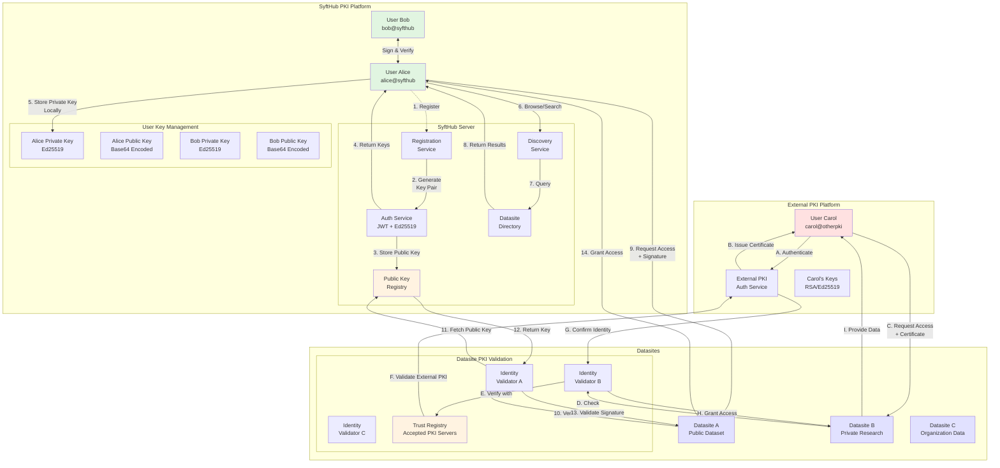
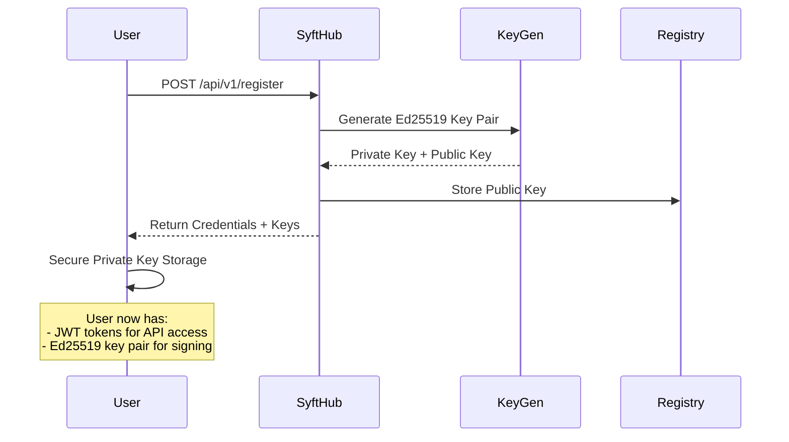
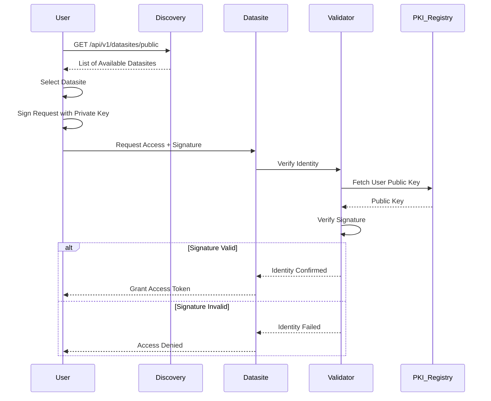
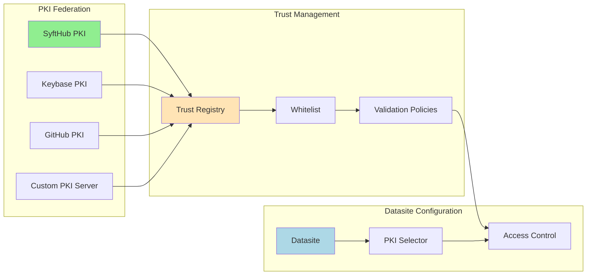
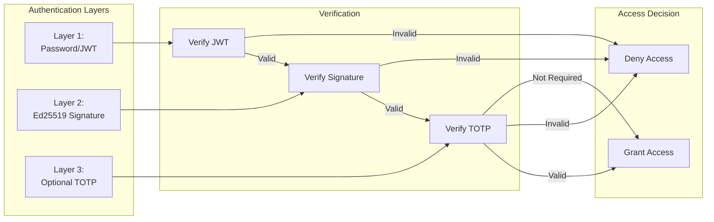
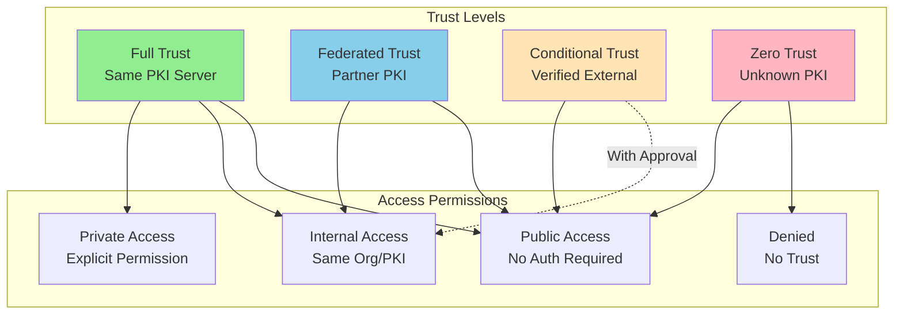

# SyftHub PKI Workflow Architecture

## Overview
This document visualizes the PKI (Public Key Infrastructure) workflow for SyftHub, demonstrating how users discover datasites, validate identities, and interact across different PKI platforms.

## Complete PKI Workflow Diagram

## Detailed Workflow Steps

### User Registration & Key Generation

### Datasite Discovery & Access

### Cross-Platform PKI Integration

## Security Features

### Multi-Factor Authentication Flow

## PKI Trust Model

### Trust Relationship Network

## Implementation Notes

1. **Key Generation**: Ed25519 keys are generated server-side during registration
2. **Key Storage**: Public keys stored in database, private keys returned to user
3. **Signature Verification**: `/api/v1/users/verify-signature` endpoint validates signatures
4. **Cross-PKI Support**: Datasites can configure trusted PKI servers
5. **Identity Federation**: Support for multiple PKI providers through trust registry
6. **Access Control**: Three-tier visibility (public, internal, private)
7. **Audit Trail**: All authentication attempts logged for security

## Benefits of This Architecture

- **Decentralized Trust**: Users can bring their own PKI identities
- **Flexible Authentication**: Support for multiple PKI providers
- **Strong Identity**: Cryptographic proof of identity
- **Privacy Preserving**: Users control their private keys
- **Interoperability**: Works across different PKI platforms
- **Scalability**: Federation reduces central authority burden
