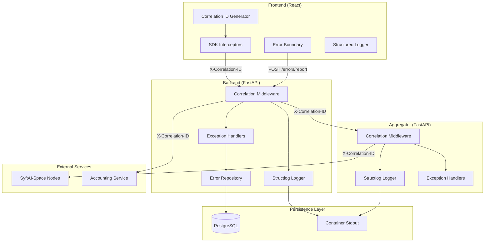
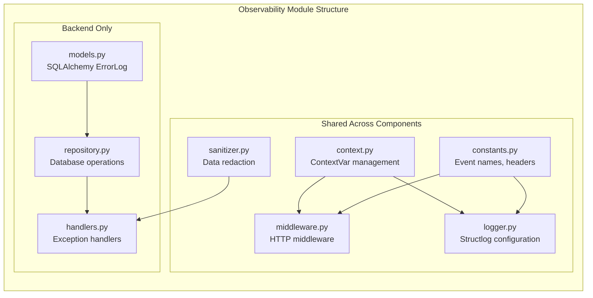
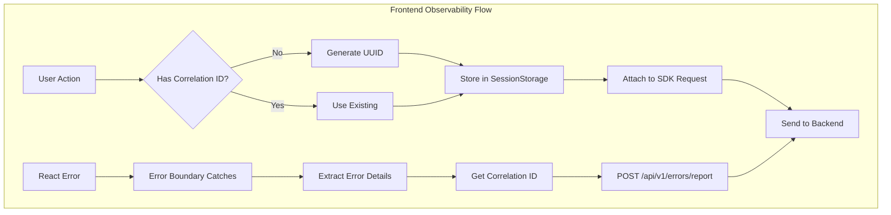
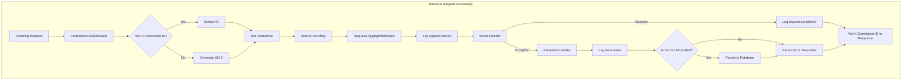
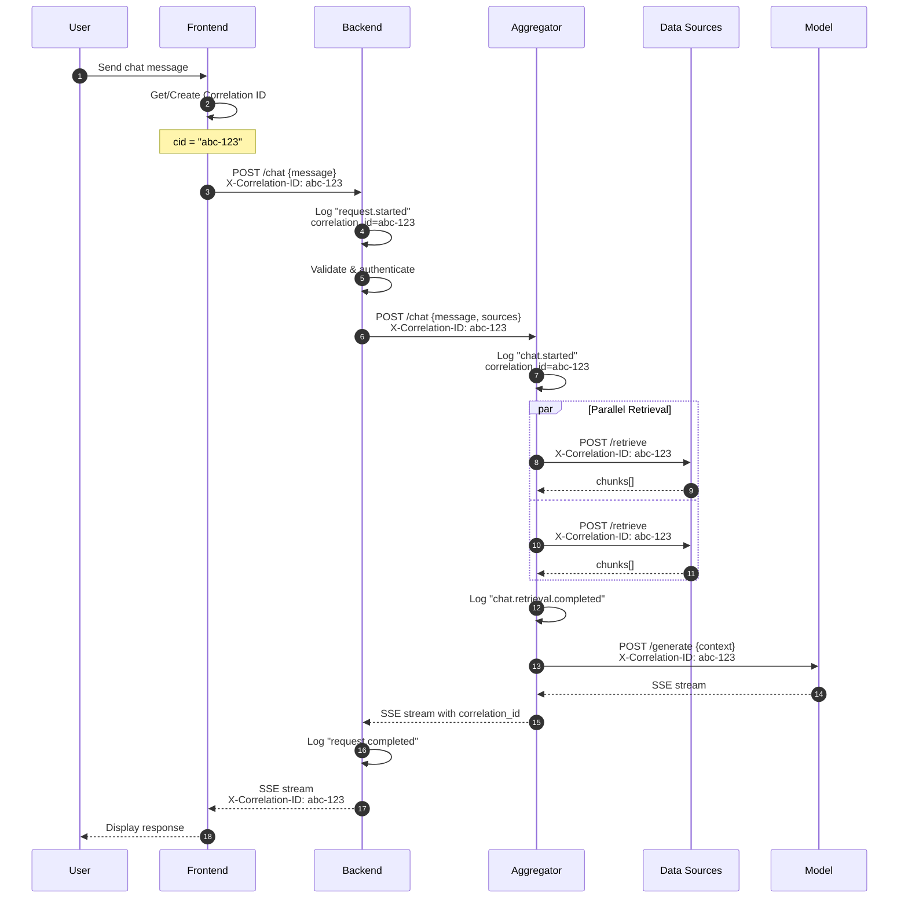
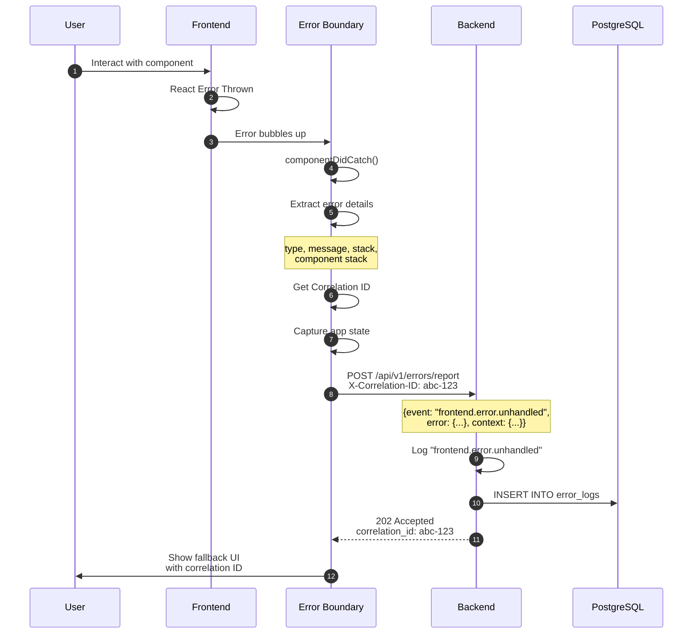
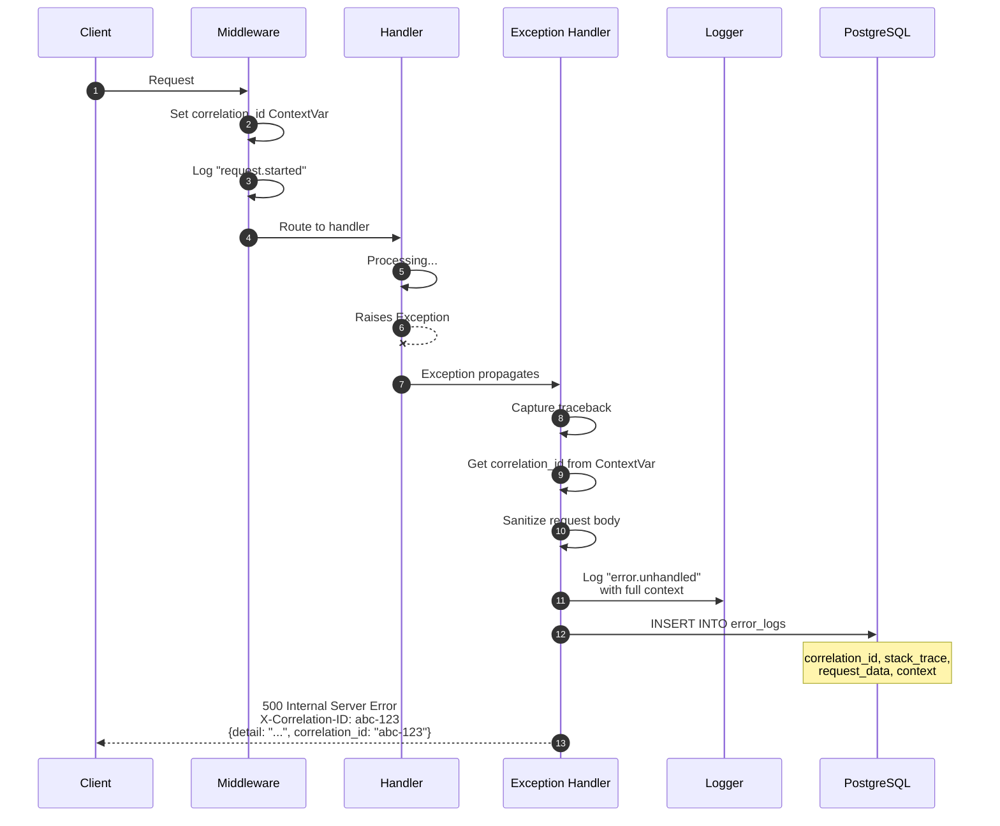
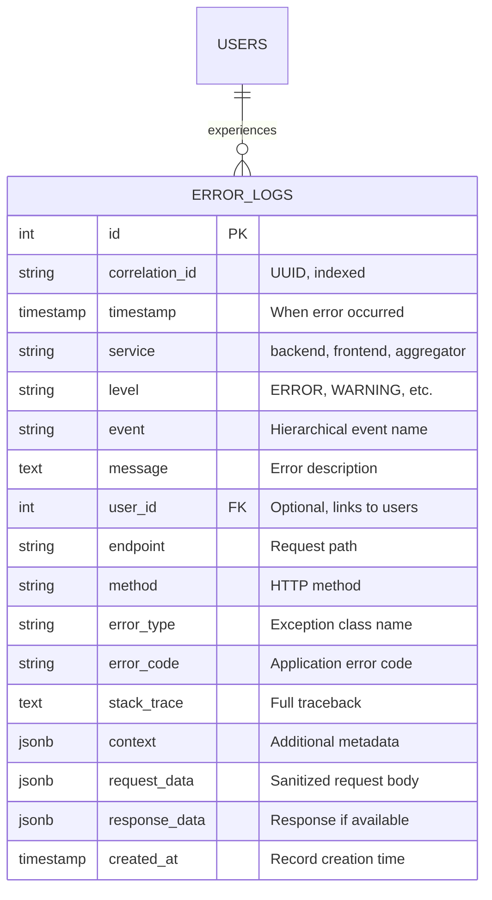

# Error Events Log Traceability System

This document provides a comprehensive overview of the observability and error traceability system implemented across all SyftHub components. The system enables end-to-end request tracing, structured logging, and centralized error capture for debugging and analysis.

## Table of Contents

1. [Overview](#overview)
2. [Key Concepts](#key-concepts)
3. [System Architecture](#system-architecture)
4. [Component Deep Dive](#component-deep-dive)
5. [Request Flow Sequences](#request-flow-sequences)
6. [Log Schema](#log-schema)
7. [Error Persistence](#error-persistence)
8. [Querying and Debugging](#querying-and-debugging)
9. [Configuration](#configuration)

---

## Overview

The traceability system solves a fundamental challenge in distributed systems: **correlating events across multiple services to understand what happened during a request lifecycle**.

When a user interacts with SyftHub, their request may traverse multiple components:

```
User → Frontend → Backend → Aggregator → SyftAI-Space Nodes
```

Without traceability, debugging issues requires manually correlating timestamps across different log files. With our system, a single **Correlation ID** threads through every component, making it trivial to trace the complete journey of any request.

### What This System Provides

| Capability | Description |
|------------|-------------|
| **Request Tracing** | Every request gets a unique Correlation ID that follows it across all services |
| **Structured Logging** | All logs are JSON-formatted with consistent schema for easy parsing |
| **Error Capture** | Unhandled exceptions are automatically captured with full context |
| **Error Persistence** | Critical errors are stored in PostgreSQL for analysis and alerting |
| **Sensitive Data Protection** | Passwords, tokens, and secrets are automatically redacted |

---

## Key Concepts

### Correlation ID

A **Correlation ID** is a UUID v4 that uniquely identifies a request chain. It's generated at the entry point (usually the frontend) and propagated through all downstream services.

```
Header: X-Correlation-ID
Format: 550e8400-e29b-41d4-a716-446655440000 (UUID v4)
```

**Propagation Rules:**
1. If a request arrives with `X-Correlation-ID`, use it
2. If no header is present, generate a new UUID
3. Always include the ID in the response headers
4. Forward the ID to all downstream HTTP calls

### Structured Logging

All components emit logs as JSON objects with a consistent schema. This enables:
- Machine parsing by log aggregators (ELK, Loki, CloudWatch)
- Consistent querying across services
- Automatic indexing of correlation IDs

### Event Naming Convention

Log events follow a hierarchical naming pattern:

```
{domain}.{action}.{result}
```

Examples:
- `auth.login.success` - User successfully logged in
- `chat.retrieval.timeout` - RAG retrieval timed out
- `endpoint.create.validation_error` - Endpoint creation failed validation
- `frontend.error.unhandled` - Unhandled JavaScript error

---

## System Architecture

### High-Level Architecture



### Component Relationships



---

## Component Deep Dive

### Frontend Observability

The frontend generates correlation IDs and captures client-side errors.



**Key Files:**
| File | Purpose |
|------|---------|
| `correlation.ts` | Generate and manage correlation IDs |
| `interceptors.ts` | Attach headers to outgoing requests |
| `ErrorBoundary.tsx` | Capture React component errors |
| `reporter.ts` | Send error reports to backend |
| `logger.ts` | Structured console logging |

**How Correlation IDs Work in Frontend:**

```typescript
// On page load or new user session
const correlationId = crypto.randomUUID();
sessionStorage.setItem('correlation_id', correlationId);

// Every SDK request automatically includes:
headers: {
  'X-Correlation-ID': correlationId
}

// When navigating or starting new flow
function startNewCorrelation() {
  const newId = crypto.randomUUID();
  sessionStorage.setItem('correlation_id', newId);
  return newId;
}
```

---

### Backend Observability

The backend extracts correlation IDs, logs all requests, and persists errors.



**Key Files:**
| File | Purpose |
|------|---------|
| `context.py` | Thread-safe ContextVar for correlation ID |
| `middleware.py` | Extract/generate correlation ID, log requests |
| `logger.py` | Configure structlog with processors |
| `handlers.py` | Global exception handlers |
| `repository.py` | Persist errors to PostgreSQL |
| `sanitizer.py` | Redact sensitive data |

**ContextVar Pattern:**

The correlation ID is stored in a Python `ContextVar`, which is async-safe and automatically propagates through async call chains:

```python
from contextvars import ContextVar

# Global context variable
correlation_id_var: ContextVar[str] = ContextVar("correlation_id", default="")

# In middleware - set the value
correlation_id_var.set(request_correlation_id)

# Anywhere in the request lifecycle - get the value
current_id = correlation_id_var.get()
```

---

### Aggregator Observability

The aggregator follows the same patterns as the backend but forwards correlation IDs to SyftAI-Space nodes.

```mermaid
flowchart TD
    subgraph Aggregator["Aggregator Request Flow"]
        A[Request from Backend] --> B[CorrelationIDMiddleware]
        B --> C[Extract X-Correlation-ID]
        C --> D[Set ContextVar + Structlog]

        D --> E[Chat Endpoint]
        E --> F[Parallel Data Source Calls]

        F --> G[DataSourceClient]
        G --> H[Add X-Correlation-ID Header]
        H --> I[SyftAI-Space Node 1]

        F --> J[DataSourceClient]
        J --> K[Add X-Correlation-ID Header]
        K --> L[SyftAI-Space Node 2]

        I --> M[Aggregate Results]
        L --> M

        M --> N[ModelClient]
        N --> O[Add X-Correlation-ID Header]
        O --> P[Model Endpoint]

        P --> Q[Stream Response with correlation_id]
    end
```



**Forwarding to External Services:**

```python
async def _make_request(self, endpoint: str, payload: dict) -> Response:
    headers = {"Content-Type": "application/json"}

    # Always forward correlation ID to downstream services
    correlation_id = get_correlation_id()
    if correlation_id:
        headers[CORRELATION_ID_HEADER] = correlation_id

    return await self.client.post(endpoint, json=payload, headers=headers)
```

---

## Request Flow Sequences

### Successful Chat Request



### Frontend Error Flow



### Backend Unhandled Exception Flow



---

## Log Schema

All log entries follow this JSON schema:

```json
{
  "timestamp": "2024-01-15T10:30:00.000Z",
  "level": "ERROR",
  "logger_name": "syfthub.api.endpoints.chat",
  "service": "backend",
  "correlation_id": "550e8400-e29b-41d4-a716-446655440000",
  "event": "chat.generation.failed",
  "message": "Model endpoint returned error",

  "context": {
    "endpoint_id": "ep_abc123",
    "model_id": "model_xyz",
    "duration_ms": 1523
  },

  "error": {
    "type": "ModelTimeoutError",
    "message": "Request timed out after 30s"
  }
}
```

### Field Descriptions

| Field | Type | Description |
|-------|------|-------------|
| `timestamp` | ISO8601 | When the event occurred |
| `level` | string | DEBUG, INFO, WARNING, ERROR, CRITICAL |
| `logger_name` | string | Python module path |
| `service` | string | Component name (backend, aggregator, frontend) |
| `correlation_id` | UUID | Request chain identifier |
| `event` | string | Hierarchical event name |
| `message` | string | Human-readable description |
| `context` | object | Event-specific metadata |
| `error` | object | Error details (when applicable) |

---

## Error Persistence

Critical errors are persisted to PostgreSQL for analysis, alerting, and debugging.

### Database Schema



### What Gets Persisted

| Condition | Persisted? | Reason |
|-----------|------------|--------|
| HTTP 5xx errors | Yes | Server-side issues need investigation |
| Unhandled exceptions | Yes | Bugs that need fixing |
| Frontend errors | Yes | Client-side issues affect UX |
| HTTP 4xx errors | No | Client errors (bad input, auth) |
| Validation errors | No | Expected application behavior |
| Successful requests | No | Only log to stdout |

### Sensitive Data Handling

Before persistence, all data is sanitized:

```python
SENSITIVE_FIELDS = {
    "password", "token", "secret", "authorization",
    "api_key", "apikey", "credit_card", "ssn",
    "refresh_token", "access_token", "private_key"
}

# Input
{"email": "user@example.com", "password": "secret123"}

# After sanitization
{"email": "user@example.com", "password": "[REDACTED]"}
```

---

## Querying and Debugging

### Finding All Events for a Request

```sql
-- Find all error logs for a specific correlation ID
SELECT
    timestamp,
    service,
    level,
    event,
    message,
    error_type,
    endpoint
FROM error_logs
WHERE correlation_id = '550e8400-e29b-41d4-a716-446655440000'
ORDER BY timestamp;
```

### Finding Errors by User

```sql
-- Find recent errors for a specific user
SELECT
    correlation_id,
    timestamp,
    event,
    message,
    endpoint
FROM error_logs
WHERE user_id = 123
  AND timestamp > NOW() - INTERVAL '24 hours'
ORDER BY timestamp DESC;
```

### Aggregating Errors by Type

```sql
-- Count errors by type in the last hour
SELECT
    event,
    error_type,
    COUNT(*) as count
FROM error_logs
WHERE timestamp > NOW() - INTERVAL '1 hour'
  AND level = 'ERROR'
GROUP BY event, error_type
ORDER BY count DESC;
```

### Searching Container Logs

```bash
# Find all logs for a correlation ID across services
docker logs syfthub-backend 2>&1 | jq 'select(.correlation_id == "abc-123")'

docker logs syfthub-aggregator 2>&1 | jq 'select(.correlation_id == "abc-123")'

# Find all errors in the last hour
docker logs --since 1h syfthub-backend 2>&1 | jq 'select(.level == "ERROR")'

# Pretty print with specific fields
docker logs syfthub-backend 2>&1 | jq '{time: .timestamp, event, message, cid: .correlation_id}'
```

### Using Correlation ID for Support

When users report issues, ask for their **Correlation ID** (shown in error messages):

```
Error: Something went wrong. Please try again.
Reference: abc-12345-def-67890
```

Then query:

```sql
SELECT * FROM error_logs
WHERE correlation_id = 'abc-12345-def-67890';
```

---

## Configuration

### Environment Variables

| Variable | Default | Description |
|----------|---------|-------------|
| `LOG_LEVEL` | `info` | Minimum log level (debug, info, warning, error) |
| `LOG_FORMAT` | `json` | Output format: `json` (production) or `console` (development) |
| `ERROR_RETENTION_DAYS` | `30` | How long to keep error logs in database |

### Development vs Production

**Development Mode** (`LOG_FORMAT=console`):
```
2024-01-15 10:30:00 [info     ] request.started    correlation_id=abc-123 method=POST path=/api/v1/chat
2024-01-15 10:30:01 [info     ] request.completed  correlation_id=abc-123 status=200 duration_ms=1234
```

**Production Mode** (`LOG_FORMAT=json`):
```json
{"timestamp":"2024-01-15T10:30:00.000Z","level":"info","event":"request.started","correlation_id":"abc-123","method":"POST","path":"/api/v1/chat","service":"backend"}
```

---

## Summary

The traceability system provides:

1. **Single Correlation ID** threads through frontend → backend → aggregator → external services
2. **Structured JSON logs** enable machine parsing and querying
3. **Automatic error capture** with full context for debugging
4. **Database persistence** for critical errors
5. **Sensitive data protection** via automatic redaction

When debugging issues:
1. Get the Correlation ID from the user or error message
2. Query `error_logs` table for persisted errors
3. Search container logs with `jq` for the full request timeline
4. All related events share the same `correlation_id`
